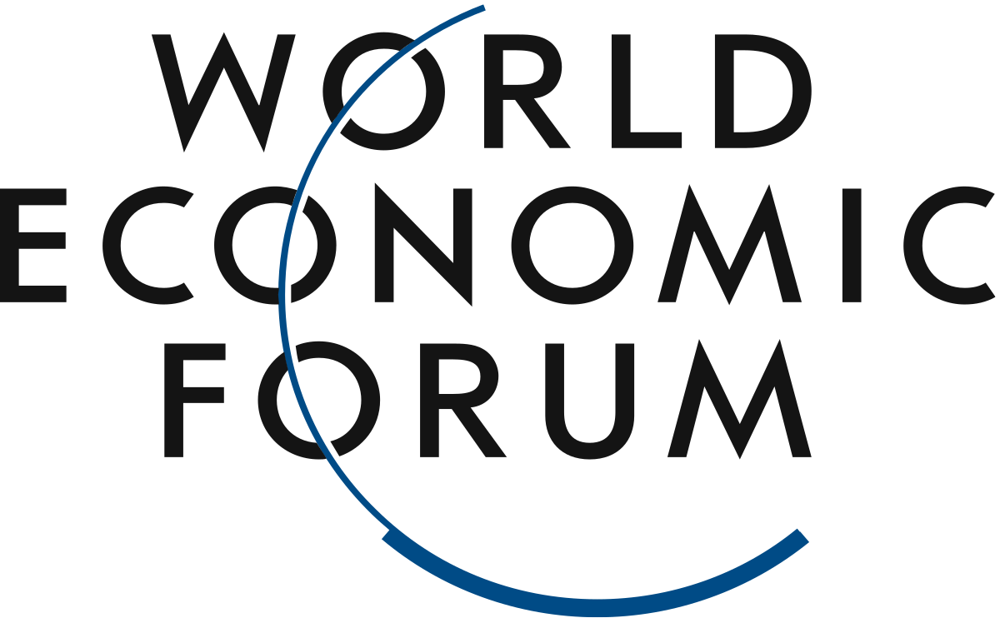

## Table of Contents

## What is the Davos World Economic Forum?

The Davos World Economic Forum is a big meeting that happens every year in Davos, Switzerland. Important people from around the world, like business leaders, politicians, and experts, come together to talk about important global issues. They discuss things like the economy, the environment, and new technology. The meeting started in 1971 and is organized by a group called the World Economic Forum.

At the Davos meeting, people try to find solutions to big problems and make plans for the future. They share ideas and sometimes make agreements to work together. The meeting is famous because it brings together leaders from many different countries and industries. It's a chance for them to learn from each other and work on making the world a better place.

## When and where is the Davos World Economic Forum held?

The Davos World Economic Forum is held every year in the town of Davos, which is in Switzerland. Davos is a small town in the mountains, and it's a nice place for people to meet and talk.

The meeting usually happens in January. It lasts for a few days, and during that time, lots of important people come to discuss big issues that affect the world. They talk about things like money, the environment, and new inventions.

## Who founded the World Economic Forum?

The World Economic Forum was founded by a man named Klaus Schwab. He started it in 1971. Klaus Schwab is from Switzerland and he wanted to create a place where leaders from different countries and businesses could meet and talk about important issues.

At first, the forum was called the "European Management Forum." It was just for people in Europe. But later, Klaus Schwab changed the name to the World Economic Forum and made it bigger so that people from all over the world could join. Now, it's a very important meeting that happens every year in Davos, Switzerland.

## What is the main purpose of the Davos meeting?

The main purpose of the Davos meeting is to bring together leaders from around the world to discuss and solve big global problems. These leaders include business people, politicians, and experts who all come to Davos, Switzerland, to share their ideas and work together. They talk about important issues like the economy, the environment, and new technology.

At the meeting, people try to find ways to make the world a better place. They discuss how to grow the economy in a fair way, protect the environment, and use new inventions to help people. By working together, they hope to make plans and agreements that will help solve these big problems.

## Who attends the Davos World Economic Forum?

The Davos World Economic Forum is attended by many important people from around the world. These include business leaders like CEOs of big companies, politicians such as presidents and prime ministers, and experts in fields like science, technology, and the environment. They all come to Davos, Switzerland, to meet and talk about big global issues.

These attendees come from many different countries and industries. They gather to share their ideas and work together to find solutions to problems like climate change, economic inequality, and new technology. By bringing together such a diverse group of people, the forum hopes to create plans and agreements that will help make the world a better place.

## What are the key themes discussed at the Davos Forum?

At the Davos Forum, people talk about many important topics that affect the whole world. One big theme is the economy. They discuss how to make the economy grow in a way that helps everyone, not just a few people. They also talk about jobs and how to make sure there are enough good jobs for everyone. Another key theme is the environment. People at the forum are very worried about climate change and how it is hurting the planet. They try to find ways to use less energy, reduce pollution, and protect nature.

Technology is another important topic at the Davos Forum. People discuss new inventions and how they can make life better. But they also talk about the problems that new technology can bring, like privacy and security. Finally, they talk about global cooperation. They believe that countries need to work together to solve big problems. By sharing ideas and making plans together, they hope to make the world a better place for everyone.

## How does the World Economic Forum influence global policy?

The World Economic Forum influences global policy by bringing together leaders from different countries and industries. When these leaders meet at the Davos Forum, they talk about big problems like the economy, the environment, and new technology. They share ideas and try to find solutions that can help everyone. By working together, they can make plans and agreements that guide what countries and businesses do around the world. For example, they might agree on ways to fight climate change or create new jobs.

These discussions and agreements at the Davos Forum can lead to changes in laws and policies. When leaders go back to their countries, they can use what they learned to make new rules or change old ones. This helps make sure that the policies in different countries work well together. The forum also helps spread good ideas and best practices, so more people can learn from what works well in other places. This way, the World Economic Forum helps shape how countries and businesses work to solve big global problems.

## What are the major criticisms of the Davos World Economic Forum?

Some people think the Davos World Economic Forum has problems. They say it's a place where only rich and powerful people meet, and regular people are left out. They worry that the forum focuses too much on making money for big businesses and not enough on helping everyone. Critics also say that the forum talks a lot about big ideas but doesn't do enough to make real changes happen. They think it's more about showing off than solving problems.

Another criticism is that the Davos Forum can seem a bit like a big party for the rich. People point out that it's expensive to go to Davos, and many leaders travel there on private jets, which is bad for the environment. Some also think that the forum can be too friendly with big companies and might not challenge them enough on important issues. Critics believe the forum should do more to include voices from all over the world, especially from poorer countries, to make sure everyone's needs are considered.

## How has the format and focus of the Davos meetings evolved over time?

When the Davos World Economic Forum started in 1971, it was called the European Management Forum. It was all about bringing business leaders from Europe together to talk about how to manage their companies better. Over the years, the forum grew bigger and changed its name to the World Economic Forum. It started to include leaders from all over the world, not just Europe. The focus also changed from just business management to bigger global issues like the economy, the environment, and new technology.

Today, the Davos meetings are much bigger and more diverse. They last for several days in January and include not only business leaders but also politicians, scientists, and activists. The forum now tries to tackle big problems like climate change, inequality, and global health. It also uses more interactive formats, like workshops and roundtable discussions, to help people share ideas and work together on solutions. While the meetings have grown and changed, the main goal stays the same: to bring people together to make the world a better place.

## What role do technology and innovation play at the Davos Forum?

Technology and innovation are really important at the Davos Forum. People come to talk about new inventions and how they can make life better for everyone. They discuss things like computers, the internet, and new ways to use energy. They also talk about how technology can help solve big problems like climate change and health care. By sharing ideas about new technology, the leaders at the forum hope to find ways to use it to make the world a better place.

But technology also brings challenges, and the forum talks about those too. People worry about things like privacy and security when using new technology. They discuss how to make sure that new inventions are safe and don't harm people. The forum also thinks about how to make sure everyone can use new technology, not just rich people. By talking about both the good and bad sides of technology, the Davos Forum helps leaders make smart choices about how to use it in the future.

## How does the World Economic Forum address global economic disparities?

The World Economic Forum tries to help with global economic disparities by bringing leaders together to talk about ways to make the world more equal. They discuss how to create more jobs and make sure that everyone, not just rich people, can have a good life. At the Davos meetings, they talk about things like fair wages, education, and health care. They want to make sure that everyone has a chance to do well, no matter where they come from.

One way the forum addresses economic disparities is by encouraging countries and businesses to work together. They share ideas about what works well in different places and try to spread those good ideas around the world. For example, they might talk about how to help poor countries grow their economies or how to make sure that new technology helps everyone. By working together, the leaders at the forum hope to create a world where everyone has a fair chance to succeed.

## What are some notable outcomes or agreements from past Davos meetings?

At past Davos meetings, leaders have made some important agreements. One big example is the Paris Agreement on climate change. In 2015, many countries talked about the agreement at Davos before they officially signed it later that year. The agreement is about working together to stop the earth from getting too hot. Another example is the Global Redesign Initiative. This started in 2010 to help countries and businesses work together better to solve big problems. It's about making plans that help everyone, not just a few people.

These agreements show how the Davos meetings can help make big changes happen. When leaders come together at Davos, they share ideas and make plans that can affect the whole world. For example, in 2020, many leaders at Davos talked about how to fight the spread of diseases like the coronavirus. This helped countries prepare for the big health problems that came later that year. By working together at the Davos Forum, leaders can make the world a better place for everyone.

## References & Further Reading

[1]: ["The World Economic Forum Annual Meeting - Davos-Klosters"](https://www.weforum.org/meetings/world-economic-forum-annual-meeting-2025/) - World Economic Forum

[2]: Jamal, E. (2020). ["High-Frequency Trading and Market Stability."](https://www.jstor.org/stable/pdf/45286297.pdf) Journal of Finance.

[3]: Aldridge, I. (2013). ["High-Frequency Trading: A Practical Guide to Algorithmic Strategies and Trading Systems"](https://onlinelibrary.wiley.com/doi/pdf/10.1002/9781119203803.fmatter) by Irene Aldridge.

[4]: Hasbrouck, J., & Saar, G. (2013). ["Low-latency Trading."](https://www.sciencedirect.com/science/article/abs/pii/S1386418113000165) The Review of Financial Studies, 26(9), 89-129.

[5]: Kirilenko, A. A., Kyle, A. S., Samadi, M., & Tuzun, T. (2017). ["The Flash Crash: High-Frequency Trading in an Electronic Market."](https://onlinelibrary.wiley.com/doi/abs/10.1111/jofi.12498) The Journal of Finance, 72(3).

[6]: ["Market Liquidity: Theory, Evidence, and Policy"](https://academic.oup.com/book/55158) by Thierry Foucault, Marco Pagano, and Ailsa Röell