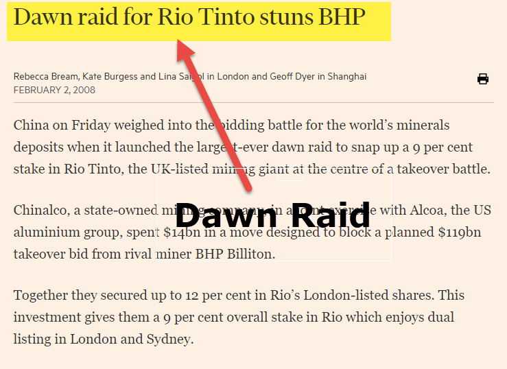

Dawn raids are an intriguing and strategic maneuver in corporate finance, commonly employed during business takeovers to gain a substantial shareholding in a target company swiftly and discreetly. This article will explore the concept of dawn raids, detailing their mechanics, strategic uses, implications, and associated challenges. Dawn raids typically involve the acquisition of significant volumes of a company’s shares at the moment the stock market opens, thereby capitalizing on market conditions while minimizing immediate market awareness that might lead to a reactive spike in the share price.

Algorithmic trading has become a significant factor in the dynamics of dawn raids, impacting how these strategies are executed and perceived in modern financial markets. With the advent of high-frequency trading and sophisticated algorithms, market participants can process vast amounts of financial data at unprecedented speeds, affecting both the execution and detection of such raids.



Understanding these elements offers valuable insights into corporate strategy and the dynamics of financial markets. Knowledge of dawn raids not only assists in recognizing potential takeover tactics but also in comprehending broader market behaviors influenced by these financial strategies. This foundation sets the stage for an in-depth examination of how dawn raids operate, their strategic advantages and risks, the role of algorithmic trading, and the regulatory considerations they entail.

## Table of Contents

## What is a Dawn Raid?

A dawn raid is a strategic move in corporate finance where an investor or entity purchases a substantial quantity of shares in a targeted company at the opening of the stock market. The primary aim of this tactic is to rapidly accumulate a significant stake in the company while minimizing the likelihood of arousing suspicion or prompting a price increase due to market speculation about a possible takeover. By initiating the purchase early in the trading day, the acquiring party seeks to capitalize on the relative lack of volume and activity, effectively avoiding drawing attention from other market participants. Typically, this maneuver serves as an initial step in pursuing a larger takeover bid, setting the stage for gaining influence or control over the target company.

## Mechanics of a Dawn Raid

Dawn raids are tactical moves initiated by acquiring parties at the onset of the trading day, utilizing the element of surprise and speed to execute large share purchases before the market can react to the sharp rise in demand that typically follows such actions. The primary aim is to accumulate a significant shareholding in a target company without triggering immediate speculation or price escalation that might alert other investors. 

The mechanics of a dawn raid revolve around the necessity of precise timing and discretion. As the stock exchange opens, the acquiring firm, often through a series of coordinated transactions executed by multiple brokers, rapidly buys stakes in the target company. This immediate execution is crucial to avoid signaling to the market participants about an impending takeover bid. The key here is to maintain anonymity and diffuse the transaction [volume](/wiki/volume-trading-strategy) among various brokers and trading platforms to prevent detection.

A successful dawn raid leverages market conditions at the opening of the trading day when the [liquidity](/wiki/liquidity-risk-premium) is typically high enough to absorb large orders without substantial impact on the price. This contrasts with later in the day when activities are more scrutinized, and any large movement could lead to speculation and drive up the stock price, thereby increasing acquisition costs.

In an era where [algorithmic trading](/wiki/algorithmic-trading) is prevalent, executing a dawn raid discreetly has become increasingly challenging. Algorithms and high-frequency trading systems can monitor unusual trading patterns and large volume purchases, potentially compromising the operation by alerting other market players. As a result, the acquiring firm must ensure that its trading algorithms are sophisticated enough to mask the transactions amidst regular trading activities effectively.

Moreover, acquiring firms must also be prepared for possible scenarios where the market reacts quicker than anticipated, potentially increasing the acquisition costs if prices surge due to detected buying activities. Therefore, the risk management aspect is critical, where predetermined maximum purchase prices are set to prevent overpaying for the shares in such cases. 

In summary, while the essence of dawn raids is grounded in acquiring positions with speed and secrecy as the market opens, the execution requires careful planning and robust coordination across multiple fronts to mitigate risks associated with sharp market movements and maintain the operation's clandestine nature.

## Implications of Dawn Raids

Dawn raids, when executed effectively, offer substantial advantages to the acquiring entity by allowing them to purchase a considerable number of shares at prevailing market prices before a potential premium arises due to takeover speculation. By securing a significant stake in the early hours of trading, acquirers can influence the corporate governance of the target company, potentially integrating strategic decisions that align with their objectives. This method can be particularly cost-effective since it circumvents the typical price escalation associated with more traditional acquisition approaches.

For the target company, however, the occurrence of a dawn raid often serves as an alarming indicator of existing vulnerabilities. It may highlight weaknesses perceived by the acquirer, such as undervaluation in the market, internal management issues, or unexploited strategic assets. The sudden change in shareholder composition can trigger a cascade of defensive mechanisms. These may include the adoption of poison pill strategies, restructuring of the board, or the acceleration of previously delayed strategic initiatives aimed at deterring the takeover or increasing the company's value.

Furthermore, dawn raids have the potential to significantly alter the ownership structure of a company. The abrupt shift in major shareholdings can redefine the power dynamics within the board of directors and impact overall governance. Influential decisions regarding the company's direction, including mergers, acquisitions, or shifts in operational strategies, may now tilt in favor of the new major shareholder’s preferences. This new governance landscape can lead to transformative changes in the company's operations and strategic focus, sometimes sparking substantial resistance from existing management and other shareholders.

The broader implications of dawn raids thus revolve around strategic control, financial implications, and the intrinsic response dynamics of corporate entities. The transaction not only reshapes the economic and managerial structure of the target company but also necessitates a reassessment of its market position and long-term strategic goals.

## Role of Algorithmic Trading

Algorithmic trading is a critical [factor](/wiki/factor-investing) in the dynamics of dawn raids, enhancing both the execution pace and detection capabilities. The utilization of algorithmic trading systems can significantly increase the speed with which transactions are executed, allowing acquirers to swiftly accumulate large blocs of shares. This speed is essential in a dawn raid, where the objective is to amass significant equity before the market becomes aware of the buyout intentions, which would naturally drive up share prices.

High-frequency trading ([HFT](/wiki/high-frequency-trading-strategies)), a subset of algorithmic trading, executes a large number of orders at extremely high speeds, often in fractions of a second. While this offers the advantage of stealth and rapid acquisition, it also presents challenges in maintaining anonymity. The presence of highly sophisticated algorithms capable of analyzing market data in real time means that even minimal transactions can be detected. These algorithms can identify patterns that suggest unusual trading activity typical of a dawn raid, such as sudden increases in trading volume or price shifts.

Python algorithms might be used to optimize trading strategies for dawn raids. Here is a basic example of a Python pseudocode snippet that demonstrates how an algorithm might be structured to execute trades discretely:

```python
import random

class DawnRaidAlgo:
    def __init__(self, target_shares, max_order_size):
        self.target_shares = target_shares
        self.max_order_size = max_order_size

    def execute_trade(self):
        shares_to_buy = 0
        while shares_to_buy < self.target_shares:
            order_size = random.randint(1, self.max_order_size)
            order_size = min(order_size, self.target_shares - shares_to_buy)
            shares_to_buy += order_size
            print(f"Executing buy order for {order_size} shares.")

raid = DawnRaidAlgo(target_shares=5000, max_order_size=100)
raid.execute_trade()
```

This is a simplified representation, and in practice, such algorithms would be far more complex, integrating real-time data analysis and decision-making processes to optimize the execution of trades without triggering alerts in trading systems.

The influence of HFT on the detection of dawn raids cannot be understated. As financial markets continually evolve, so do the technologies and strategies within them, requiring participants to maintain rigorous surveillance and adaptability. Maintaining anonymity in an environment populated by automated surveillance systems represents a significant challenge, but it is critical for the successful execution of a dawn raid. Thus, while algorithmic trading enhances execution efficiency, it also compels acquirers to devise ever-more sophisticated techniques to avoid detection and ensure strategic success.

## Regulatory Considerations

Dawn raids, as strategic maneuvers in corporate finance, must adhere to a labyrinth of regulations designed to maintain market integrity and protect investor interests. Central to these regulations are disclosure requirements, which mandate that individuals or entities disclose their holdings when they exceed specific ownership thresholds. These thresholds vary by jurisdiction, but commonly, once an entity surpasses the 5% ownership mark in a publicly traded company, it must publicly disclose its stake. This regulation aims to prevent market manipulation and ensure transparency, providing an equal playing field for all market participants.

Compliance with these disclosure regulations is critical during a dawn raid to avoid fines and reputational damage. Regulatory bodies, such as the U.S. Securities and Exchange Commission (SEC) and the Financial Conduct Authority (FCA) in the UK, enforce these regulations. Failure to disclose significant acquisitions in a timely manner can result in severe penalties, including fines and legal action. Furthermore, regulatory scrutiny can lead to increased examination of the acquirer's intentions, especially if the dawn raid is part of a larger strategy to take control of a company.

Moreover, dawn raids must consider antitrust laws, which are designed to prevent monopolistic behavior and promote competition. Acquiring a substantial stake in a company, particularly if it is a direct competitor, can trigger antitrust investigations. These laws require careful analysis of the competitive landscape and, in some cases, consultation with legal experts to ensure compliance.

Given the complexities involved, understanding the relevant legal framework is essential. Companies may employ compliance officers and legal advisors to navigate these requirements effectively. They employ various strategies to mitigate regulatory risks, such as conducting thorough due diligence before executing a dawn raid. This involves assessing the target company’s ownership structure, potential competitive issues, and existing shareholder agreements that might impact the success of the acquisition.

In conclusion, while dawn raids offer a strategic approach to gaining control over a company, they operate within a tightly regulated environment. Adhering to disclosure requirements, antitrust laws, and other relevant regulations is crucial not only to safeguard against legal repercussions but also to maintain a sustainable and ethical approach to corporate acquisitions.

## Strategic Uses and Risks

Dawn raids serve multiple strategic purposes beyond mere acquisitions. Companies often leverage them to accumulate influence in a target firm, thereby impacting its management decisions. By rapidly acquiring a significant equity stake, an acquiring entity can push for changes in the board or demand strategic shifts, aligning the target company’s objectives with its own. 

Despite their strategic utility, dawn raids pose various risks. Market [volatility](/wiki/volatility-trading-strategies) remains a central concern; fluctuating share prices can impede the execution of these raids, leading to potential financial losses. For instance, the market may react unpredictably to the sudden accumulation of shares, driving prices upwards and eroding the cost-effectiveness of the strategy.

Moreover, the risk of overpayment is tangible. When aggressively purchasing shares, especially under time constraints to maintain secrecy, acquirers might offer premiums above market value, diminishing expected returns. This risk is exacerbated during periods of high market volatility where stock prices can be artificially inflated.

Regulatory scrutiny adds another layer of complexity. Many jurisdictions impose stringent rules around the disclosure of share purchases once certain thresholds are reached. Non-compliance can incur significant penalties, including fines or nullification of transactions. For example, the European Union mandates that a shareholder disclose their stake once it exceeds a certain percentage of voting rights, subjecting dawn raids to legislative oversight that might compromise their stealth.

As a result, entities contemplating a dawn raid must carefully balance their strategic objectives against these inherent risks, ensuring compliance with applicable regulatory frameworks while maintaining agility in volatile market conditions.

## Conclusion

Dawn raids represent a sophisticated and effective strategy within corporate finance, particularly for business takeovers. This approach demands meticulous planning and swift execution. The essence of a dawn raid is to quickly acquire a significant stake in a target company before the broader market can react, thereby minimizing the premium often associated with takeovers. This swift accumulation of shares is essential for maintaining discretion and securing a strategic advantage over competitors.

Adherence to legal regulations is a critical aspect of conducting dawn raids, as these transactions must comply with strict disclosure requirements and various financial market regulations. These requirements are designed to ensure market transparency and prevent manipulative tactics that could disrupt the market's integrity. Failure to comply with these regulations can lead to severe penalties and undermine the acquirer's objectives.

Moreover, the advent of algorithmic trading introduces another layer of complexity to dawn raids. Algorithmic trading systems, known for their speed and efficiency, can influence both the strategy and execution of dawn raids. These systems can quickly detect unusual trading patterns, potentially unveiling a takeover before it is fully executed. As a result, companies looking to initiate dawn raids must consider the impact of high-frequency trading and employ tactics that mitigate detection risk, such as spreading trades across multiple brokers or varying transaction sizes.

In summary, dawn raids are a viable yet intricate strategy within corporate finance, requiring a blend of strategic foresight, rapid implementation, and legal compliance. The integration of algorithmic trading into financial markets adds complexity by increasing the risk of early detection, thus challenging acquirers to adapt their approaches to maintain efficacy and discretion.

## References & Further Reading

[1]: Bergstra, J., Bardenet, R., Bengio, Y., & Kégl, B. (2011). ["Algorithms for Hyper-Parameter Optimization."](https://dl.acm.org/doi/10.5555/2986459.2986743) Advances in Neural Information Processing Systems 24.

[2]: ["Advances in Financial Machine Learning"](https://www.amazon.com/Advances-Financial-Machine-Learning-Marcos/dp/1119482089) by Marcos Lopez de Prado

[3]: ["Evidence-Based Technical Analysis: Applying the Scientific Method and Statistical Inference to Trading Signals"](https://www.amazon.com/Evidence-Based-Technical-Analysis-Scientific-Statistical/dp/0470008741) by David Aronson

[4]: ["Machine Learning for Algorithmic Trading"](https://github.com/stefan-jansen/machine-learning-for-trading) by Stefan Jansen

[5]: ["Quantitative Trading: How to Build Your Own Algorithmic Trading Business"](https://www.amazon.com/Quantitative-Trading-Build-Algorithmic-Business/dp/1119800064) by Ernest P. Chan