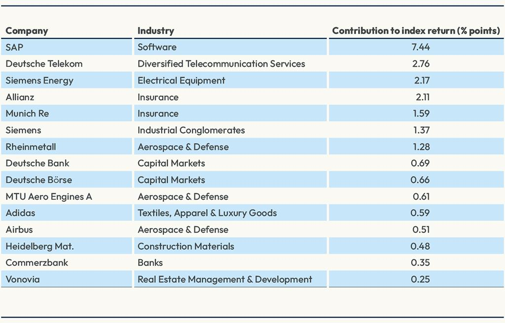

The DAX, formally known as the Deutscher Aktienindex, is a significant benchmark in the German stock market landscape, encapsulating 40 of the most formidable companies listed on the Frankfurt Stock Exchange. These companies are pivotal not only to Germany's economic vitality but also to broader European financial health, as they collectively represent key sectors such as technology, automotive, and pharmaceuticals. Therefore, the performance of the DAX serves as a critical barometer for investors globally, reflecting underlying trends and shifts in Germany's corporate and economic milieu.

The liquidity and complexity inherent to the DAX make it an attractive index for algorithmic trading. This modern method leverages sophisticated, pre-programmed algorithms to execute trades at speeds and efficiencies beyond human capabilities. Algorithmic trading on the DAX facilitates rapid decision-making, helping traders navigate the dynamic market conditions by capitalizing on fluctuations and opportunities within the index.



This article investigates the synergy between the DAX member companies and algorithmic trading strategies, offering valuable insights for traders aiming to refine their market interactions. With its potent mix of liquidity, volatility, and corporate representation, the DAX stands as a fertile ground for employing algorithmic trading strategies that can potentially enhance trading performance.

To thrive in such an environment, traders must grasp both the intricacies of the DAX's structure and the sophisticated techniques that algorithmic trading entails. This foundational understanding is essential for informed and strategic investing, enabling market participants to better harness the benefits of the DAX's dynamism and the technological advancements in trading mechanics.

## Table of Contents

## Understanding the DAX

The DAX, or Deutscher Aktienindex, serves as a fundamental benchmark for both German and European stock markets, encompassing 40 of the most significant and liquid companies listed on the Frankfurt Stock Exchange. Established in 1988, the index is frequently viewed as a gauge for the economic health of Germany, which is one of the largest economies in Europe. As such, the DAX holds a critical role in reflecting the performance of key sectors, including technology, automotive, and pharmaceuticals.

Approximately constituting 80% of the total market capitalization of the Frankfurt Stock Exchange, the DAX provides meaningful insights into the broader economic conditions within Germany. The index's composition is diverse, including global giants such as Siemens, Volkswagen, and Bayer, which not only influence the German market but also play substantial roles on the global stage. Hence, the index's performance can signal trends that may impact international markets.

The calculation of the DAX index employs a free-float methodology. This approach considers only the shares available for public trading, excluding those held by insiders such as company executives or governments. This method ensures that the index more accurately reflects the market dynamics by weighing companies based on their market capitalization while accounting for their [liquidity](/wiki/liquidity-risk-premium). The formula for calculating the index is illustrated as follows:

$$
\text{DAX Index} = \frac{\sum (P_i \times Q_i \times FF_i)}{\text{Base Divisor}}
$$

where $P_i$ is the current price of stock $i$, $Q_i$ is the quantity of shares of stock $i$, and $FF_i$ is the free-float factor of stock $i$. The base divisor is adjusted periodically to maintain continuity in the index's value over time.

Volatility and liquidity are key components in the calculation of the DAX, ensuring that the index remains a reliable indicator of market conditions and investor sentiment. Volatility, a measure of how much an asset's price varies, affects the weightings of companies within the index. Companies with highly volatile stocks may have their influence on the index moderated to prevent drastic swings in the overall index value.

In summary, an understanding of the DAX index extends beyond a mere list of companies. It involves recognizing the economic significance of its components and the methodological rigor underlying its calculation. Investors looking to engage with the DAX gain a comprehensive perspective on the German economic landscape, allowing them to make informed decisions aligned with both national and international market trends.

## Algorithmic Trading Strategies for the DAX

Algorithmic trading in the DAX utilizes computerized systems to execute trades at speeds beyond human capability. This practice involves leveraging various strategies, primarily focusing on [trend following](/wiki/trend-following), mean reversion, [momentum](/wiki/momentum) trading, and contrarian approaches to make data-driven decisions.

Trend following strategies take advantage of existing market movements. The principle is relatively straightforward: identify a trend and capitalize on its continuance. This can be mathematically expressed using moving averages, where a buy signal might occur when a short-term moving average crosses above a long-term moving average. Conversely, a sell signal might trigger when the short-term moving average crosses below the long-term average. Trend following strategies aim to profit by staying aligned with the market's general upward or downward trajectory until clear signs indicate a reversal.

Mean reversion strategies operate under the assumption that asset prices will eventually return to their historical averages. This approach involves identifying overbought or oversold conditions, where prices are likely to reverse back to their mean levels. A common indicator used in mean reversion is the Bollinger Bands, which signals potential buy or sell points based on the deviation from the average trading range. Traders using mean reversion may look for situations where the price is at an extreme relative to its historical average, signaling a potential reversal.

Momentum trading bets on the continuation of a trend's recent performance. Unlike trend following, which aligns directionally with long-term movements, momentum trading focuses on short-term price action and looks for acceleration in price movements. Traders might use the Relative Strength Index (RSI) or Moving Average Convergence Divergence (MACD) as indicators to confirm momentum. For instance, when RSI moves above a threshold, it might signify strong upward momentum, prompting a buying decision.

Contrarian strategies, on the other hand, focus on opposing market sentiment, predicting reversals in current trends. These strategies assume that markets often overreact and can thus present opportunities when reaching extreme levels of optimism or pessimism. For example, by employing contrarian strategies, traders may take short positions when the market sentiment is overwhelmingly bullish, anticipating a market correction.

Incorporating these [algorithmic trading](/wiki/algorithmic-trading) strategies in the DAX requires sophisticated systems to analyze large volumes of data quickly and efficiently. The use of algorithms ensures that traders can deploy these strategies with precision, leveraging the speed and computational power that human traders cannot match, thereby optimizing trading outcomes on this major German stock index.

## Backtesting and Optimization in Algorithmic Trading

Backtesting in algorithmic trading involves analyzing historical market data to assess the performance of a trading strategy. This process is vital for understanding how a strategy might have performed in the past under various market conditions. By simulating trades on historical data, traders can gain insights into the potential profitability and risks of a strategy before deploying it in live markets. In this context, [backtesting](/wiki/backtesting) also provides a platform for learning and refining trading strategies without the financial risk of real-world losses.

To conduct a thorough backtest, traders gather substantial historical datasets, ensuring the data reflects real market conditions and includes potential outliers and anomalies. The next step involves applying the trading strategy to this dataset and calculating relevant metrics. Two of the most common metrics used to evaluate strategy effectiveness are the total return and the Sharpe ratio. The total return measures the overall profitability, while the Sharpe ratio evaluates the risk-adjusted return:

$$
\text{Sharpe Ratio} = \frac{R_p - R_f}{\sigma_p}
$$

where $R_p$ is the expected portfolio return, $R_f$ is the risk-free rate, and $\sigma_p$ is the standard deviation of the portfolio's excess return. A higher Sharpe ratio indicates a more favorable risk-adjusted performance.

Optimization is the subsequent step, where traders fine-tune the parameters of the trading strategy to enhance performance outcomes. It involves systematically adjusting strategy parameters to identify the combination that offers the best results based on historical data. The challenge in optimization is to enhance performance without overfitting the strategy to past data, which would reduce its generalizability to future unseen data. Common techniques to mitigate overfitting include cross-validation and sensitivity analysis.

Cross-validation involves dividing the dataset into multiple parts and validating the strategy across these partitions to ensure its robustness across different market conditions. Sensitivity analysis, on the other hand, tests how changes in individual parameters affect strategy outcomes, ensuring that the strategy remains effective across a range of conditions.

By carefully backtesting and optimizing trading strategies, traders can achieve a balance between risk and reward while ensuring the strategy's applicability to real-world trading scenarios. These practices are fundamental for developing robust algorithmic trading systems that are resilient to market fluctuations and uncertainties.

## Risk Management in DAX Algo Trading

Effective risk management is a cornerstone of successful algorithmic trading in the DAX, particularly due to the index's inherent [volatility](/wiki/volatility-trading-strategies). Preserving capital while optimizing potential returns requires a methodical approach that incorporates various strategies and tools.

One fundamental technique is position sizing, which involves determining the amount of capital allocated to each trade. Proper position sizing can protect traders from significant losses that could occur due to adverse market movements. Traders often use risk-based formulas, such as the Kelly Criterion, to optimize position size relative to account size and risk tolerance. The formula is expressed as:

$$

f^* = \frac{bp - q}{b}
$$

where $f^*$ is the fraction of the bankroll to wager, $b$ represents the odds received on the wager, $p$ is the probability of winning, and $q$ is the probability of losing. Applying such formulas helps maintain a balanced exposure to risk and reward.

Stop-loss orders are another vital component of risk management, serving as automated triggers to sell a security when its price falls to a predetermined level. This strategy caps potential losses and safeguards against market downturns. Modern algorithmic systems can adjust stop-loss levels dynamically, taking into account market conditions and volatility indicators. For instance, a moving average could be used to determine the stop-loss level dynamically:

```python
def calculate_dynamic_stop_loss(current_price, prices):
    moving_average = sum(prices[-10:]) / 10
    stop_loss_level = current_price * (1 - (current_price - moving_average) / current_price)
    return stop_loss_level
```

Diversification further aids in mitigating risks by spreading investments across various sectors and instruments, thereby reducing the impact of a single underperforming asset on the overall portfolio. It is an essential hedge against market-specific risks inherent to DAX-listed entities, given their concentration in specific industries such as automotive and pharmaceuticals.

Automated systems underpin the flexibility of algorithmic trading, allowing real-time adjustments to risk management parameters. These systems utilize market data, [machine learning](/wiki/machine-learning) models, and predictive analytics to refine risk management strategies continuously, ensuring that traders remain responsive to market shifts. For instance, adjustments to stop-loss orders based on volatility indices can protect against significant swings while maximizing profit potential.

In conclusion, comprehensive risk management techniques such as position sizing, stop-loss orders, and diversification are integral to navigating the DAX's volatility effectively. With the support of advanced algorithms and adaptive technologies, traders can safeguard their investments while positioning for profitable outcomes.

## The Role of Technology in DAX Algorithmic Trading

Technology has significantly enhanced algorithmic trading strategies on the Deutscher Aktienindex (DAX), providing tools and techniques that enhance both the analysis and execution of trades. One of the most impactful advancements is the use of [artificial intelligence](/wiki/ai-artificial-intelligence) (AI) and machine learning. These technologies facilitate predictive analytics, allowing traders to decode large datasets, identify patterns, and predict future price movements with greater accuracy. Machine learning models, such as regression models, decision trees, and neural networks, can be trained to forecast trends by analyzing historical data and real-time information, leading to more informed trading decisions.

Cloud computing further amplifies the capabilities of algorithmic trading by offering scalable solutions for handling complex computations and extensive strategy testing. With cloud services, traders are no longer limited by the physical constraints of their hardware infrastructure. They can utilize virtually unlimited computational resources to backtest and refine their algorithms across a broader range of scenarios and datasets. This capability ensures that trading strategies are robust and adaptable to varying market conditions.

The following Python example demonstrates a simple way to implement a moving average crossover strategy using historical DAX data stored in the cloud. It highlights how cloud resources can be leveraged to compute and inform trading decisions:

```python
import pandas as pd

# Load historical DAX data from a cloud-based source
url = 'https://example-cloud-storage.com/dax_data.csv'
data = pd.read_csv(url)

# Calculate moving averages
data['MA50'] = data['Close'].rolling(window=50).mean()
data['MA200'] = data['Close'].rolling(window=200).mean()

# Identify crossover signals
data['Signal'] = 0
data['Signal'][50:] = np.where(data['MA50'][50:] > data['MA200'][50:], 1, 0)
data['Position'] = data['Signal'].diff()

# Output the latest trading signal
print(f"Current trading signal: {'Buy' if data['Signal'].iloc[-1] == 1 else 'Sell'}")
```

Technological innovations also address the need for rapid order execution, enabling traders to respond with minimal latency. High-frequency trading systems utilize optimized algorithms capable of executing orders within microseconds, affording a significant competitive edge. By integrating these technological advancements, traders can achieve real-time market responsiveness, a crucial [factor](/wiki/factor-investing) in dynamic and fast-paced environments like the DAX.

In summary, AI, machine learning, cloud computing, and technological innovations in order execution form the backbone of modern algorithmic trading on the DAX. These technologies refine the precision of analysis, expand computational capabilities, and accelerate transaction speeds, collectively enhancing the strategic and operational execution of trades.

## Conclusion

Algorithmic trading has significantly redefined how traders interact with the DAX, bringing notable improvements in decision-making and execution speed. This transformation stems from the ability of algorithmic systems to process vast amounts of data swiftly and accurately, thereby enabling traders to capitalize on market opportunities that might elude human analysis. By harnessing sophisticated strategies such as trend following, mean reversion, and momentum trading, traders can navigate the complexities of the DAX with greater precision.

Integrating diverse trading strategies with advanced technology, such as artificial intelligence (AI) and machine learning, enhances both performance and adaptability. These technologies facilitate predictive analytics, allowing traders to anticipate market movements and adjust strategies accordingly. Furthermore, cloud computing offers scalable solutions for executing complex algorithms without the need for substantial capital investment in physical infrastructure. This flexibility supports rapid response to market changes, giving traders a competitive edge through real-time market interaction.

As market dynamics continue to evolve, sustained success in algorithmic trading hinges on continuous learning and integration of emerging technologies. Traders must perpetually adapt to new market conditions and refine their strategies with insights gained from backtesting and optimization. Moreover, advancements in technology will likely foster new trading tools and strategies, necessitating an agile approach to strategy development and execution.

In conclusion, the continuous refinement of algorithmic trading strategies, coupled with strategic implementation of advanced technologies, holds the key to achieving long-term success and resilience in the dynamic DAX market environment.

## References & Further Reading

[1]: Bergstra, J., Bardenet, R., Bengio, Y., & Kégl, B. (2011). ["Algorithms for Hyper-Parameter Optimization."](https://papers.nips.cc/paper/4443-algorithms-for-hyper-parameter-optimization) Advances in Neural Information Processing Systems 24.

[2]: ["Advances in Financial Machine Learning"](https://www.amazon.com/Advances-Financial-Machine-Learning-Marcos/dp/1119482089) by Marcos Lopez de Prado

[3]: ["Evidence-Based Technical Analysis: Applying the Scientific Method and Statistical Inference to Trading Signals"](https://www.amazon.com/Evidence-Based-Technical-Analysis-Scientific-Statistical/dp/0470008741) by David Aronson

[4]: ["Machine Learning for Algorithmic Trading"](https://github.com/stefan-jansen/machine-learning-for-trading) by Stefan Jansen

[5]: ["Quantitative Trading: How to Build Your Own Algorithmic Trading Business"](https://www.amazon.com/Quantitative-Trading-Build-Algorithmic-Business/dp/1119800064) by Ernest P. Chan