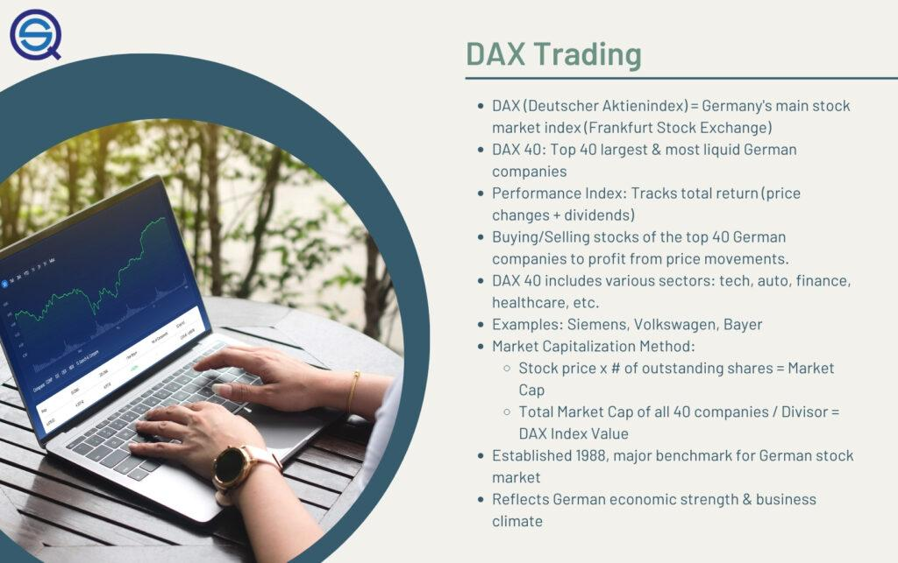

The DAX, formally known as the Deutscher Aktienindex, serves as a key indicator of the German economy, encapsulating the performance of 40 leading companies listed on the Frankfurt Stock Exchange. It stands as one of Europe's foremost stock market indices, reflecting economic health and business climate across Germany, and by extension, the European Union. Due to its liquidity and volatility, the DAX is an attractive target for algorithmic and quantitative traders, who use systematic approaches to exploit market patterns.

Algorithmic trading, which is trading executed based on pre-programmed instructions, leverages sophisticated algorithms to achieve trading decisions at speeds and frequencies beyond the capabilities of human traders. This approach not only improves efficiency but also opens opportunities for strategic trading decisions based on data analysis and statistical models.



Various strategies are employed in algorithmic trading to navigate the DAX's complexities. Trend following, for instance, aims to capitalize on the momentum of existing price trends. In contrast, mean reversion strategies are predicated on the assumption that prices will revert to their historical averages, potentially providing profitable entry and exit points. Contrarian trading takes a different angle, seeking profit from taking positions opposite to prevailing market sentiments, suggesting a belief in market overreactions. Each of these strategies demands thorough understanding and execution to harness their full potential within the DAX context.

This article aims to provide an in-depth examination of these strategies and more, equipping traders with the necessary knowledge and frameworks to approach DAX trading effectively. Understanding and implementing these strategies with precision can enhance trading performance in one of Europe's most dynamic markets.

## Table of Contents

## Understanding the DAX

The DAX, or Deutscher Aktienindex, is a pivotal benchmark for the German stock market and serves as a crucial indicator of market trends within Europe. Introduced in 1988 by the Frankfurt Stock Exchange, it tracks the performance of 40 of the largest and most liquid companies listed on the exchange. These companies span various sectors, including technology, finance, healthcare, and manufacturing, offering a comprehensive view of the German corporate landscape.

The index is weighted by market capitalization, which means companies with larger market values have a more significant impact on the DAX's movements. This capitalization-weighted index dynamically reflects the health and fluctuations of not just the German economy but also the broader European and global markets, given the international operations of many of its constituent companies.

**Liquidity and Volatility**: One of the defining characteristics of the DAX is its high liquidity. With substantial trading volumes, the index provides ample opportunities for both institutional and retail traders to execute trades efficiently. This liquidity correlates with the volatility of the index, driven by macroeconomic data, geopolitical developments, and corporate performance reports. For traders, this volatility can present both opportunities and risks, necessitating strategies that can adeptly handle rapid price movements.

**Historical Context and Components**: By analyzing the historical performance of the DAX, traders can gain insights into recurring patterns and cycles within the market. For example, sector-specific shifts often correlate with broader economic indicators, such as interest rate changes or shifts in global trade policies. Understanding these historical movements assists traders in anticipating potential future shifts and adjusting their strategies accordingly.

**Algorithmic Trading and the DAX**: Algorithmic trading on the DAX leverages data-driven approaches to exploit recurring market patterns and anomalies. Algorithmic strategies often use quantitative models to analyze high-frequency data and execute trades based on pre-defined criteria. With advancements in computational power, these strategies can process and respond to market data with speeds unattainable by manual trading methods, capitalizing on short-term inefficiencies and trends.

Python, a popular programming language in [algorithmic trading](/wiki/algorithmic-trading), can be used to analyze and model DAX trading strategies. For instance, traders often employ libraries such as NumPy and Pandas for data manipulation, and Matplotlib or Seaborn for data visualization. Models can be implemented using [machine learning](/wiki/machine-learning) frameworks like Scikit-learn or TensorFlow to predict price movements or classify trading signals. A sample code snippet for a simple moving average crossover strategy, a common algorithmic approach, may look like this:

```python
import numpy as np
import pandas as pd
import matplotlib.pyplot as plt

# Sample DataFrame 'df' with Date and Close price
df['SMA_20'] = df['Close'].rolling(window=20).mean()
df['SMA_50'] = df['Close'].rolling(window=50).mean()

df['Signal'] = 0
df['Signal'][df['SMA_20'] > df['SMA_50']] = 1
df['Position'] = df['Signal'].diff()

plt.figure(figsize=(14,7))
plt.plot(df['Close'], label='DAX Close Price')
plt.plot(df['SMA_20'], label='20-Day SMA', alpha=0.7)
plt.plot(df['SMA_50'], label='50-Day SMA', alpha=0.7)
plt.legend()
plt.show()
```

In summary, understanding the DAX involves recognizing its role as a key economic indicator, its [liquidity](/wiki/liquidity-risk-premium) and [volatility](/wiki/volatility-trading-strategies), and using historical performance as a guide. Algorithmic trading, with its reliance on quantitative analysis and high-speed execution, offers a potent method to engage with the opportunities presented by the DAX.

## Algorithmic Trading Strategies for the DAX

Algorithmic trading strategies for the DAX empower traders to automate trading decisions using quantitative models. These strategies enhance trading efficiency by executing trades at speeds and frequencies beyond human capability. The following outlines several key strategies utilized in trading the DAX algorithmically.

Trend following strategies capitalize on established market directions, leveraging historical price data to project future trends. The strategy involves algorithms identifying upward or downward trends in asset prices and executing buy or sell orders accordingly. Traders often use moving averages, a statistical calculation that smoothens price data to identify trends. For example, if the price of the DAX crosses above its 50-day moving average, an algorithm may trigger a buy order, expecting the upward trend to continue. Mathematically, the moving average $MA_t$ over a period $n$ for a time series of closing prices $P$ is given by:

$$
MA_t = \frac{1}{n} \sum_{i=0}^{n-1} P_{t-i}
$$

Mean reversion strategies are based on the assumption that asset prices will revert to their historical averages. In this approach, algorithms identify when the price of the DAX deviates significantly from its average, suggesting a possible reversion. The strategy exploits short-term anomalies in price movements, triggering trades when prices are considered overbought or oversold. A common tool for mean reversion is the Bollinger Bands, which define upper and lower bounds for price movements based on standard deviations from a moving average.

Contrarian trading involves taking positions against prevailing market sentiment, operating under the belief that popular market trends will reverse. This strategy typically requires algorithms to detect when investor sentiment has excessively influenced prices, leading to potential reversal opportunities. For instance, during widespread bullish trends, contrarian algorithms might short sell assets in anticipation of a price drop.

Momentum trading strategies focus on assets with significant recent performance trends, betting that the [momentum](/wiki/momentum) will continue for a short period. Algorithms in this strategy identify securities displaying strong gains or losses and establish positions in the direction of the momentum. Traders often utilize indicators such as the Relative Strength Index (RSI) to determine the strength and potential continuation of a trend.

Index [arbitrage](/wiki/arbitrage) exploits pricing inefficiencies between the DAX and its components or related markets. This strategy involves algorithms taking advantage of the temporary misalignment in the index and its underlying stocks' prices. For instance, if the DAX's calculated value diverges from the aggregate price of its constituents, arbitrage algorithms can perform synchronized buy and sell operations to profit from the discrepancy.

Statistical arbitrage, another advanced strategy, involves creating pairs or baskets of securities that demonstrate correlated price movements. Algorithms use statistical methods to identify price disparities between these pairs, assuming they will eventually converge. This strategy requires sophisticated models and real-time data analysis to detect and act upon trading opportunities.

In conclusion, algorithmic trading strategies for the DAX employ a variety of quantitative models to address different market conditions and objectives. By automating these processes, traders can enhance decision-making precision and efficiency in exploiting the opportunities available in the dynamic DAX market.

## Backtesting and Optimization in Algorithmic Trading

Backtesting is an essential component of algorithmic trading, where traders evaluate the potential effectiveness of a strategy by applying it to historical market data. This process allows traders to simulate trades based on past data, thus providing insights into how a strategy might perform under different market conditions. Backtesting offers a glimpse into the viability of a trading strategy, enabling refinement before actual capital is deployed.

The process of [backtesting](/wiki/backtesting) involves several key steps: 

1. **Data Collection and Preparation**: Accurate and comprehensive historical market data is crucial for reliable backtesting. This involves gathering data not only about prices but also about order book depth, trading volumes, and other relevant indicators. 

2. **Strategy Deployment**: The trading logic, typically defined by a set of rules or a mathematical model, is then applied to historical data. For example, a simple moving average crossover strategy would buy or sell based on the interaction of short-term and long-term moving averages.

3. **Performance Metrics Calculation**: After applying the strategy, various performance metrics are calculated, such as total return, Sharpe ratio, maximum drawdown, and win/loss ratio. These metrics help assess the robustness and efficiency of the strategy.

Optimization in algorithmic trading involves adjusting the strategy parameters to improve performance. The goal is to enhance profitability while minimizing risk across various market conditions. However, caution is necessary to avoid overfitting, where a model becomes too complex and performs well on historical data but poorly in live markets. 

To mitigate overfitting, several techniques can be employed:

- **Walk-Forward Optimization**: This involves repeatedly dividing historical data into in-sample (for training) and out-of-sample (for testing) periods, ensuring that the strategy generalizes well to unseen data.
- **Regularization**: Techniques like LASSO or Ridge regression can be used to penalize overly complex models within machine learning frameworks.
- **Robustness Testing**: Applying stress tests or Monte Carlo simulations can help visualize potential risks under extreme scenarios or variation in underlying market conditions.

Software tools for backtesting and optimization are indispensable for algorithmic traders. Python, with libraries such as Backtrader and Zipline, offers comprehensive environments for strategy testing and analysis. These platforms support integration with data feeds and broker APIs, facilitating a seamless transition from backtesting to actual trading.

For instance, a basic backtesting setup using Python and Backtrader might look like this:

```python
import backtrader as bt

class SmaCross(bt.SignalStrategy):
    def __init__(self):
        sma1, sma2 = bt.ind.SMA(period=10), bt.ind.SMA(period=30)
        self.signal_add(bt.SIGNAL_LONG, btind.CrossOver(sma1, sma2))

data = bt.feeds.YahooFinanceData(dataname='DAX', fromdate, todate)
cerebro = bt.Cerebro()
cerebro.addstrategy(SmaCross)
cerebro.adddata(data)
cerebro.run()
```

In this example, a simple moving average cross-over strategy is established using 10 and 30-period averages on DAX data, emphasizing the simplicity and power of such tools in constructing and testing trading ideas. By leveraging these tools and techniques, traders can develop algorithms tailored to exploit opportunities in the DAX market with better precision and confidence.

## Risk Management in DAX Algo Trading

Risk management is a critical [factor](/wiki/factor-investing) in executing successful trading strategies, particularly in volatile markets such as the DAX. The primary objective is to protect capital by mitigating the risks inherent in trading activities. Without effective risk management, traders may experience significant financial losses. In DAX algorithmic trading, several techniques are employed to ensure capital preservation and optimize trading outcomes.

**Position Sizing**: One fundamental technique is position sizing, which determines the amount of capital allocated to a specific trade. Effective position sizing takes into account the trader's risk tolerance and the potential volatility of the instrument. A common method is the fixed percentage risk model, where a trader risks a predetermined percentage of their account on each trade. For example, if a trader with a portfolio worth €100,000 has a risk tolerance of 2%, they would risk €2,000 per trade. This approach ensures that no single trade can significantly impact the overall portfolio.

**Stop-loss Orders**: Stop-loss orders are another essential tool for risk management. These orders automatically sell a security when its price falls below a specified level, limiting potential losses. For instance, if a trader buys a DAX component stock at €50 and sets a stop-loss order at €45, the stock will be sold if its price drops to €45, thereby capping the loss to €5 per share. Stop-loss orders help traders enforce discipline and prevent emotional decision-making.

**Diversification**: Diversification, spreading investments across various assets or asset classes, is a widely adopted strategy to minimize risk. In DAX trading, diversification can be achieved by investing in a range of sectors and companies within the index. This reduces the impact of a poor performance by any one stock or sector on the overall portfolio. The implementation of quantitative diversification algorithms can further optimize portfolio management.

Algorithmic trading enhances risk management through automated processes, providing the ability to monitor and execute trades with precision and speed—qualities that reduce human error. For example, algorithms can be programmed to dynamically adjust stop-loss levels based on volatility or other market conditions, offering a more adaptive approach to risk management.

Here's a simple Python example to illustrate dynamic stop-loss adjustment using historical volatility:

```python
import pandas as pd
import numpy as np

def calculate_stop_loss(price, historical_volatility, risk_factor=0.02):
    stop_loss_distance = price * historical_volatility * risk_factor
    stop_loss_price = price - stop_loss_distance
    return stop_loss_price

# Sample data
current_price = 150.0
historical_volatility = 0.03  # 3%

# Calculate dynamic stop-loss
stop_loss = calculate_stop_loss(current_price, historical_volatility)
print(f"Dynamic Stop-Loss Price: {stop_loss}")
```

In this example, the dynamic stop-loss is determined by the current price of the asset, historical volatility, and a predefined risk factor, allowing traders to adapt to changing market conditions.

Finally, comprehensive risk management processes, including regular performance reviews and stress testing, can enhance trading outcomes by identifying potential weaknesses in strategies. Adopting these robust processes ensures that traders are better equipped to navigate adverse market movements and maintain portfolio integrity over the long term.

## The Role of Technology in DAX Algorithmic Trading

Technology serves as a crucial component in the process of algorithmic trading, particularly in the context of trading the DAX. At its core, algorithmic trading relies on technology to achieve rapid order execution and provide access to real-time market data, both essential for successful trading outcomes. The speed and precision offered by technological tools enable traders to respond to market changes with minimal latency, thus ensuring they can capitalize on favorable trading conditions.

Advanced technologies such as machine learning (ML) and [artificial intelligence](/wiki/ai-artificial-intelligence) (AI) are playing an increasingly significant role in refining trading strategies. These technologies allow traders to analyze vast datasets, identify patterns, and enhance predictive models. For instance, machine learning algorithms can be employed to predict market trends by analyzing historical price data and identifying statistically significant patterns. This capability is vital in making informed trading decisions, particularly in the highly volatile market environment of the DAX.

Moreover, the integration of cloud computing has revolutionized the infrastructure of trading systems. Cloud platforms offer scalable and flexible solutions that enable traders to conduct complex computations and extensive strategy testing without substantial investments in physical hardware. This scalability ensures that traders can readily adapt to changing market conditions by promptly testing and deploying new strategies. Additionally, cloud computing facilitates enhanced collaboration among trading teams through shared data access and streamlined communication channels.

Keeping pace with technological advancements is paramount for traders seeking a competitive edge in the dynamic DAX market. Continuous innovation in technology influences the development of new trading tools and methodologies, fostering more efficient trading processes. For example, advancements in data processing speed and storage capacity allow for more sophisticated real-time analysis, resulting in more precise and timely trading signals.

In conclusion, technology is indispensable in DAX algorithmic trading. By leveraging cutting-edge technologies such as machine learning and cloud computing, traders can optimize their strategies, improve execution efficiency, and remain competitive in an ever-evolving market landscape. Staying updated with technological trends is not merely beneficial but essential for sustained success in algorithmic trading.

## Conclusion

Trading the DAX through algorithmic strategies offers numerous opportunities for traders willing to invest in the necessary knowledge and technology. Leveraging algorithmic methods allows traders to automate processes, utilize data-driven insights, and react swiftly to market movements, which is essential in the high-frequency environment of the DAX market. While no single strategy guarantees success, a diversified approach combining multiple methods—such as [trend following](/wiki/trend-following), mean reversion, and [statistical arbitrage](/wiki/statistical-arbitrage)—can enhance performance and adaptability. This diversified strategy exploits various market conditions, thus optimizing the potential for profit and mitigating risks associated with reliance on a single method.

Continuous learning and strategy refinement are crucial as market dynamics evolve. The volatility and liquidity of the DAX require traders to constantly update and validate their algorithms against new data, ensuring resilience to market changes. Traders should focus on backtesting with historical data and engage in regular strategy reassessment and optimization. This iterative process supports risk management and enhances the robustness of trading models.

By approaching DAX trading with thorough research and robust algorithms, traders can position themselves for success in this dynamic market. A commitment to integrating advanced technologies, such as machine learning and artificial intelligence, further empowers traders to adapt and refine their strategies efficiently. As the DAX and global financial markets continue to evolve, traders who invest in continuous education and technological advancements will likely achieve sustained success.

## References & Further Reading

[1]: Bergstra, J., Bardenet, R., Bengio, Y., & Kégl, B. (2011). ["Algorithms for Hyper-Parameter Optimization."](https://papers.nips.cc/paper/4443-algorithms-for-hyper-parameter-optimization) Advances in Neural Information Processing Systems 24.

[2]: ["Advances in Financial Machine Learning"](https://www.amazon.com/Advances-Financial-Machine-Learning-Marcos/dp/1119482089) by Marcos Lopez de Prado

[3]: ["Evidence-Based Technical Analysis: Applying the Scientific Method and Statistical Inference to Trading Signals"](https://www.amazon.com/Evidence-Based-Technical-Analysis-Scientific-Statistical/dp/0470008741) by David Aronson

[4]: ["Machine Learning for Algorithmic Trading"](https://github.com/PacktPublishing/Machine-Learning-for-Algorithmic-Trading-Second-Edition) by Stefan Jansen

[5]: ["Quantitative Trading: How to Build Your Own Algorithmic Trading Business"](https://books.google.com/books/about/Quantitative_Trading.html?id=j70yEAAAQBAJ) by Ernest P. Chan