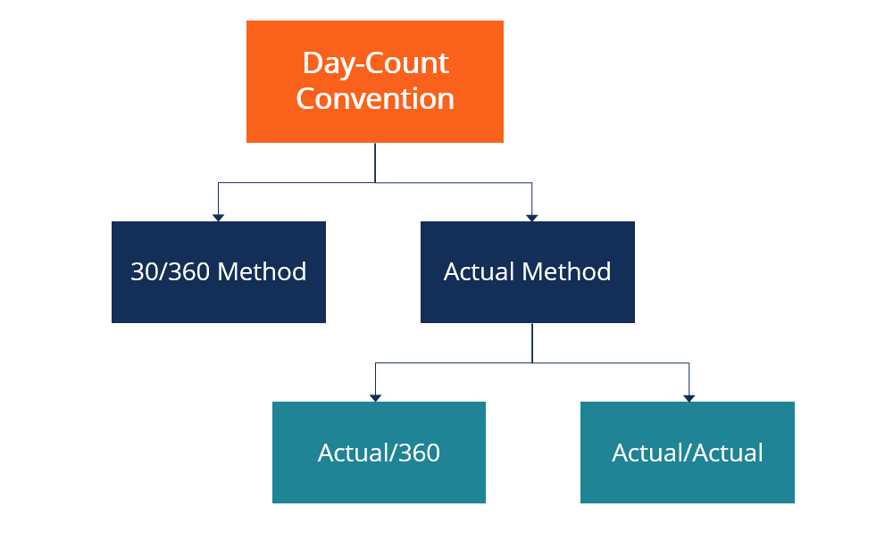

## Table of Contents

## What is a day-count convention?

A day-count convention is a way to figure out how much interest you earn or owe on money over a period of time. It's like a rule that tells us how to count the days between two dates when calculating interest. Different financial products might use different day-count conventions, so it's important to know which one is being used.

For example, some conventions might count every day in a month, while others might assume every month has 30 days. This can make a big difference in how much interest is calculated. Knowing the day-count convention helps you understand and predict the interest you will get or have to pay on loans, bonds, or savings accounts.

## Why are day-count conventions important in finance?

Day-count conventions are important in finance because they help everyone agree on how to calculate interest. Imagine you lend money to a friend and you both need to know how much interest they owe you at the end of the month. If you don't agree on how to count the days, you might end up with different numbers. That's why banks and financial institutions use day-count conventions to make sure everyone is on the same page.

These conventions also help in making financial products like bonds and loans more predictable. When you buy a bond, you want to know exactly how much interest you will earn over time. Different day-count conventions can lead to different interest amounts, so it's crucial to know which one is being used. This way, investors and borrowers can plan better and avoid surprises when it comes to their money.

## What are the most common day-count conventions?

Some of the most common day-count conventions are the 30/360, Actual/Actual, and Actual/360 methods. The 30/360 method assumes every month has 30 days and a year has 360 days. This makes it easier to calculate interest because the numbers are simpler. For example, if you need to calculate interest for 2 months, you just multiply by 60 days (2 months times 30 days each). The Actual/Actual method counts the exact number of days between two dates and uses the actual number of days in a year, which can be 365 or 366 if it's a leap year. This method is often used for government bonds because it's very precise. The Actual/360 method counts the exact number of days between two dates but assumes every year has 360 days. This is commonly used in money market calculations.

These conventions can make a big difference in how much interest you earn or pay. For instance, if you're calculating interest over a leap year using the Actual/Actual method, you'll get a slightly different amount than if you used the 30/360 method. It's important to know which convention is being used so you can understand and predict how much money you'll be dealing with. Each method has its own use in different financial products, so knowing them helps you make better financial decisions.

## How does the Actual/Actual day-count convention work?

The Actual/Actual day-count convention is a way to figure out interest that counts the exact number of days between two dates. It's like using a calendar to see how many days are between when you start and when you end. This method is very precise because it takes into account the real number of days in each month and year. If a year is a leap year, it counts 366 days; if not, it counts 365 days. This makes it great for things like government bonds where you want to be as accurate as possible.

Because it uses the real number of days, the Actual/Actual method can be a bit more complicated than other methods. For example, if you want to know the interest for a period from March 1 to June 30 in a non-leap year, you would count 91 days (31 days in March + 30 days in April + 31 days in May + 30 days in June minus 1 day because you start counting from March 1). Then, you would divide that by the actual number of days in the year, which is 365. This method makes sure everyone agrees on the exact amount of interest, which is important for big financial deals.

## What is the difference between Actual/360 and Actual/365 day-count conventions?

The Actual/360 and Actual/365 day-count conventions both count the exact number of days between two dates for calculating interest, but they differ in how they handle the number of days in a year. The Actual/360 method uses 360 days for a year, no matter if it's a leap year or not. This means if you have money for 30 days, you divide those 30 days by 360 to figure out the interest. The Actual/365 method, on the other hand, uses 365 days for a year, except during a leap year when it uses 366 days. So if you have money for 30 days in a non-leap year, you divide by 365.

These differences can affect how much interest you earn or pay. For example, if you borrow money for a short time, the Actual/360 method might make you pay more interest because you're dividing by a smaller number (360 instead of 365). This is why the Actual/360 method is often used in money market deals where short-term loans are common. The Actual/365 method is more common in other types of loans and savings accounts because it matches the actual number of days in most years, making it feel fairer to many people.

## How is the 30/360 day-count convention calculated?

The 30/360 day-count convention is a way to count days that makes it easier to calculate interest. It assumes every month has 30 days and a year has 360 days. So, if you want to find out how many days are between two dates, you can use this simple rule: If the start date is the 31st, change it to the 30th. If the end date is the 31st and the start date is in a shorter month (like February), change the end date to the 1st of the next month. Otherwise, change the end date to the 30th. After adjusting the dates, you just subtract the start day from the end day, add the difference in months times 30, and then add the difference in years times 360.

For example, if you want to find the number of days between January 15, 2023, and April 20, 2023, you would adjust the dates like this: January 15 stays the same, and April 20 becomes April 30. Now, you calculate: (30 - 15) + (4 - 1) * 30 + (2023 - 2023) * 360 = 15 + 90 + 0 = 105 days. Using this method makes the math simpler because you're always working with whole numbers, which is why it's often used for things like bonds and mortgages.

## In what scenarios is the 30E/360 day-count convention used?

The 30E/360 day-count convention is a way to count days that is often used in Europe. It's similar to the 30/360 method but has a small difference. In the 30E/360 method, if the start or end date is the 31st of any month, it is always changed to the 30th. This makes it even simpler because you don't have to think about whether the start date is in a shorter month or not.

This convention is used in financial products like bonds and mortgages, especially in Europe. It helps make the interest calculations easier and more predictable. Because it always uses 30 days for a month and 360 days for a year, it's easy to do the math and everyone knows what to expect when it comes to interest payments.

## What are the implications of choosing the wrong day-count convention in financial calculations?

Choosing the wrong day-count convention can lead to big mistakes in financial calculations. If you use the wrong method, you might end up paying more interest on a loan or receiving less interest on your savings than you should. For example, if you think you're using the Actual/365 method but you're actually using the Actual/360 method, you'll be dividing the number of days by 360 instead of 365. This can make a big difference, especially over long periods of time or with large amounts of money.

It's important to know which day-count convention is being used so everyone agrees on the numbers. If you're working with someone else, like a bank or an investor, using the wrong method can cause confusion and disagreements. It can also affect how you plan your finances. If you expect to earn a certain amount of interest and then find out you're using the wrong method, you might have to change your plans or budget. So, it's always a good idea to double-check which day-count convention is being used in your financial deals.

## How do day-count conventions affect the calculation of interest and bond yields?

Day-count conventions are important because they help decide how much interest you earn or pay on money. Different methods of counting days can change the amount of interest. For example, if you use the 30/360 method, you might end up with a different interest amount than if you use the Actual/Actual method. This is because the 30/360 method assumes every month has 30 days and every year has 360 days, while the Actual/Actual method counts the exact number of days. So, choosing the right day-count convention is important to make sure you get the correct interest amount.

When it comes to bonds, day-count conventions also affect the bond yields. Bond yields are like the interest you earn on a bond. If a bond uses the Actual/365 method, the yield might be different than if it used the Actual/360 method. This is because the way you count the days changes how you calculate the interest over time. So, if you're investing in bonds, it's important to know which day-count convention is being used to understand how much money you'll make from the bond.

## Can you explain how day-count conventions are applied in different financial instruments like bonds and swaps?

Day-count conventions are used in different financial instruments like bonds and swaps to figure out how much interest you earn or pay. For bonds, the day-count convention helps decide how much interest you get over time. For example, if you have a bond that pays interest every six months, the day-count convention tells you exactly how many days are counted in those six months. Some bonds use the Actual/Actual method, which counts the real number of days, while others use the 30/360 method, which assumes every month has 30 days and every year has 360 days. This can make a difference in how much interest you earn, so it's important to know which method the bond uses.

In swaps, which are agreements to exchange cash flows, day-count conventions also play a big role. Swaps often involve paying or receiving interest over time, and the day-count convention helps figure out how much that interest is. For example, if you have an interest rate swap where you pay a fixed rate and receive a floating rate, the day-count convention will be used to calculate the interest on both sides. Common methods in swaps include Actual/360 and Actual/365, depending on the agreement. Knowing the right day-count convention helps make sure you understand how much money you'll be dealing with in the swap.

## What are some regional differences in the use of day-count conventions?

Different parts of the world use different day-count conventions for their financial calculations. In the United States, the 30/360 method is common for things like corporate bonds and mortgages. This method makes the math easier because it assumes every month has 30 days and every year has 360 days. On the other hand, the Actual/Actual method is often used for government bonds in the U.S. because it counts the exact number of days, which is more precise.

In Europe, the 30E/360 method is popular, especially for bonds and mortgages. This method is similar to the 30/360 method but always changes the 31st of any month to the 30th, making it even simpler. Meanwhile, in the UK, the Actual/365 method is commonly used for many financial products, which counts the exact number of days but always uses 365 days for a year, except in a leap year when it uses 366 days. These regional differences can affect how much interest you earn or pay, so it's important to know which convention is used where you are.

## How have day-count conventions evolved over time, and what future changes might we anticipate?

Day-count conventions have changed over time to make financial calculations easier and more accurate. In the past, people used simple methods like the 30/360 convention because they were easy to calculate by hand. As computers became more common, more precise methods like Actual/Actual and Actual/365 started being used more often. These methods count the exact number of days, which is important for big financial deals where every day counts. The use of different conventions also spread to different parts of the world, with some regions sticking to simpler methods and others adopting more precise ones.

In the future, we might see even more changes in day-count conventions as technology keeps improving. Financial systems could become more automated and use real-time data to calculate interest more accurately. This might lead to new conventions that are even more precise than what we use now. Also, as global finance becomes more connected, there could be more efforts to standardize day-count conventions across different countries to make international deals easier. But for now, it's important to keep up with the conventions used in your region and for the specific financial products you're dealing with.

## How can one understand interest calculations?

Interest calculations are essential in evaluating fixed-income securities and diverse financial products. Their significance extends to determining the return on investment and the valuation of these instruments. The method used to calculate interest is crucial, as it can significantly impact accrued interest, thereby affecting investor returns and the overall valuation of financial instruments.

Different financial products employ various interest calculation methods. For instance, the most common include simple interest, compound interest, and amortized interest. 

1. **Simple Interest** is calculated using the formula: 
$$
   \text{Interest} = P \times r \times t

$$

   where $P$ is the principal amount, $r$ is the rate of interest per period, and $t$ is the time duration the money is borrowed or invested. Simple interest is straightforward and is typically used in short-term loans or investments where the interest does not compound.

2. **Compound Interest** takes into account the interest on both the initial principal and the accumulated interest from previous periods. The formula for compound interest is:
$$
   A = P \left(1 + \frac{r}{n}\right)^{nt}

$$

   where $A$ is the amount of money accumulated after n years, including interest, $P$ is the principal amount, $r$ is the annual interest rate, $n$ is the number of times that interest is compounded per year, and $t$ is the time the money is invested or borrowed.

3. **Amortized Interest** is used in loans where the borrower repays in regular installments. It accounts for both the principal and the interest throughout the loan term. Each payment covers an interest portion and reduces a portion of the principal. This method is often applied in mortgage or car loan calculations.

The choice of method impacts the accrued interest, which subsequently affects the value of financial instruments and the returns for investors. For example, the selection between simple and compound interest methods can lead to significant differences in the amount of interest accrued over time. Compound interest can substantially increase the amount paid to investors due to its compounding effect, favorable in investment contexts but more costly in borrowing situations.

Understanding these methods is critical for anyone involved in financial planning and portfolio management. Knowledge of how different interest calculations work aids in making informed decisions on investment strategy and financial products. Moreover, investors and financial planners can better assess the profitability and risk associated with different investments or loans.

For analytical purposes, software tools and programming languages such as Python can facilitate interest calculations by automating complex mathematical computations, further enhancing accuracy and efficiency. Here's an example of how Python can be used to calculate compound interest:

```python
def compound_interest(principal, rate, time, n):
    amount = principal * (1 + rate / n) ** (n * time)
    return amount

# Example usage
P = 1000  # Principal
r = 0.05  # Annual interest rate
t = 5     # Time in years
n = 12    # Compounded monthly

final_amount = compound_interest(P, r, t, n)
print(f"The amount after {t} years is: {final_amount}")
```

By using tools like this, investors and analysts can efficiently manage and monitor their investments and repayments, essential for successful financial outcomes.

## What are Day-Count Conventions Explained?

Day-count conventions are integral to interest calculations in financial instruments, offering a standardized approach to counting days in interest periods. The choice of convention influences the accuracy and outcome of interest accrual, which is crucial in determining the yield and valuation of financial products such as bonds, swaps, and loans.

### Common Types of Day-Count Conventions

1. **30/360 Convention**:
   The 30/360 or "Bond Basis" convention assumes each month has 30 days and a year has 360 days. This simplification is widely used in the bond markets. The formula for calculating interest using this convention is:
$$
   \text{Interest} = \text{Principal} \times \text{Rate} \times \frac{\text{Days Count}}{360}

$$

   This convention is suitable for corporate bonds and municipal bonds.

2. **Actual/360 Convention**:
   This method calculates the actual number of days in the interest period over a 360-day year. It is often used in money markets and [interest rate](/wiki/interest-rate-trading-strategies) derivatives. The formula is similar:
$$
   \text{Interest} = \text{Principal} \times \text{Rate} \times \frac{\text{Actual Days}}{360}

$$

   This tends to slightly overestimate the daily interest rate, affecting instruments like commercial loans.

3. **Actual/365 Convention**:
   Actual/365 calculates the actual number of days in the period over a 365-day year, more accurately reflecting the calendar year. The formula is:
$$
   \text{Interest} = \text{Principal} \times \text{Rate} \times \frac{\text{Actual Days}}{365}

$$

   It is typically used for UK government bonds and T-bills.

4. **Actual/Actual Convention**:
   Also known as Actual/Actual ISDA or Actual/Actual ICMA, this convention computes interest using the actual number of days in the period relative to the actual number of days in the year, accounting for leap years when necessary. This provides the most accuracy and is common in treasury bonds and other high-precision instruments.

### Application and Implications

Day-count conventions significantly impact accrued interest calculations. Variations in conventions can alter the yield of a financial product, affecting decision-making for traders and investors. For instance, a bond priced with a 30/360 convention might exhibit different yields if recalculated on an Actual/Actual basis, due to inconsistencies in the day count.

Moreover, these conventions influence the pricing and settlement of swaps, loans, and other derivatives. Recognizing which convention is applicable is key to accurate financial analysis and risk management.

Understanding these conventions is essential for anyone participating in the financial markets to make informed decisions and optimize investment strategies. Each financial product may require a specific convention, impacting its valuation and yield calculations, thus necessitating a comprehensive grasp of these standards.

## What are the applications in algorithmic trading?

Algorithmic trading is characterized by its reliance on complex mathematical models that prioritize both precision and speed for executing trades. In this context, day-count conventions play a pivotal role by influencing the calculations of interest rates and the pricing of financial instruments. These conventions provide a standardized method for counting days, thereby ensuring consistency across financial calculations, which is essential for any [algorithmic trading](/wiki/algorithmic-trading) strategy.

Day-count conventions are integral to algorithms used for pricing bonds, calculating yields, and determining accrued interests. The choice of convention, such as 30/360 or Actual/365, directly affects these calculations, potentially altering the output of trading models. As algorithms compute interest payments and future cash flows, they must accurately account for the number of days between two dates—an operation governed by the chosen day-count convention. This is particularly critical in high-frequency trading where minute discrepancies can significantly impact profitability.

Incorporating accurate day-count conventions into trading algorithms is necessary to optimize trading strategies. For instance, an algorithm might calculate the present value of future cash flows using the formula:

$$
PV = \sum \frac{C}{(1 + r)^d}
$$

where $PV$ is the present value, $C$ is the cash flow, $r$ is the interest rate, and $d$ is the fraction of the year as determined by the day-count convention. In a practical setting, Python can be used to define the appropriate convention within an algorithm. Here's a simple Python example to calculate the day count fraction between two dates using the Actual/365 convention:

```python
from datetime import datetime

def actual_365(start_date, end_date):
    delta = end_date - start_date
    return delta.days / 365.0

# Example usage
start_date = datetime(2023, 1, 1)
end_date = datetime(2023, 12, 31)
day_count_fraction = actual_365(start_date, end_date)
print(day_count_fraction)
```

In high-frequency trading environments, the integration of these conventions facilitates the automation and accuracy of trading decisions. Algorithms that precisely compute interest rates and cash flow scenarios can better navigate the rapid and volatile changes typical of these markets. This accuracy not only ensures adherence to financial models but also maximizes potential returns by minimizing discrepancies in interest calculations.

For traders and firms engaged in algorithmic trading, embracing these conventions as part of their algorithmic design is crucial. It enhances the precision of calculations and ultimately contributes to the development of effective and competitive trading strategies. Understanding and applying the correct day-count convention can thus be the difference between achieving profitability and encountering losses in automated trading systems.

## References & Further Reading

[1]: Fabozzi, F. J. (2007). ["Fixed Income Analysis."](https://books.google.com/books/about/Fixed_Income_Analysis.html?id=lujLawVLS3YC) John Wiley & Sons. 

[2]: ["Algorithmic Trading and DMA: An introduction to direct access trading strategies"](https://www.amazon.com/Algorithmic-Trading-DMA-introduction-strategies/dp/0956399207) by Barry Johnson

[3]: López de Prado, M. (2018). ["Advances in Financial Machine Learning."](https://www.amazon.com/Advances-Financial-Machine-Learning-Marcos/dp/1119482089) Wiley.

[4]: Jansen, S. (2020). ["Machine Learning for Algorithmic Trading."](https://github.com/stefan-jansen/machine-learning-for-trading) Packt Publishing.

[5]: ["Investopedia - Day Count Convention"](https://www.investopedia.com/terms/d/daycount.asp) 

[6]: ["Coursera - Algorithmic Trading and Finance Models with Python, R, and Stata Essential Training"](https://masterscareers.brown.edu/classes/algorithmic-trading-and-finance-models-with-python-r-and-stata-essential-training/)

[7]: ["edX - Introduction to Computational Finance and Financial Econometrics"](https://github.com/compfinezbook/ECON424)