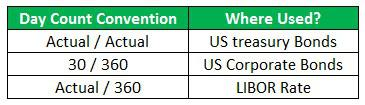

In the world of financial markets, accurate calculations are paramount. Among the essential components are interest calculations and day-count conventions, which play pivotal roles in determining the value and returns of financial instruments. Day-count conventions are systems used to calculate interest on bonds and other financial instruments. They define the number of days used in the calculation of interest for a specific period, ultimately influencing the precision of financial agreements and returns.

Interest calculations form the backbone of investing in fixed-income instruments, such as bonds and loans, where returns are heavily dependent on the accuracy of these calculations. The choice of day-count conventions can significantly impact these calculations, making it essential for financial professionals to thoroughly understand these standards. Common day-count conventions include 30/360, Actual/360, Actual/365, and Actual/Actual, each applicable to different financial contexts, impacting yields, valuations, and ultimately investor decisions.



In parallel, algorithmic trading, which employs mathematical models and computer algorithms to automate trading activities, is increasingly defining the landscape of financial markets. Precision in financial calculations is vital in algorithmic trading, where speed and accuracy are critical to developing effective trading strategies. Algorithmic trading systems must incorporate the correct day-count conventions to accurately price securities and calculate interest, affecting the execution and profitability of trades.

This article explores the interplay between financial calculations, interest calculations, day-count conventions, and their application in algorithmic trading. The goal is to provide readers with insights into how these elements impact financial decisions and trading strategies within the complex financial markets. Through understanding the nuances of interest calculations and day-count conventions, market participants can enhance their financial outcomes and remain competitive.

## Table of Contents

## Understanding Interest Calculations

Interest calculations are essential in evaluating fixed-income securities and diverse financial products. Their significance extends to determining the return on investment and the valuation of these instruments. The method used to calculate interest is crucial, as it can significantly impact accrued interest, thereby affecting investor returns and the overall valuation of financial instruments.

Different financial products employ various interest calculation methods. For instance, the most common include simple interest, compound interest, and amortized interest. 

1. **Simple Interest** is calculated using the formula: 
$$
   \text{Interest} = P \times r \times t

$$

   where $P$ is the principal amount, $r$ is the rate of interest per period, and $t$ is the time duration the money is borrowed or invested. Simple interest is straightforward and is typically used in short-term loans or investments where the interest does not compound.

2. **Compound Interest** takes into account the interest on both the initial principal and the accumulated interest from previous periods. The formula for compound interest is:
$$
   A = P \left(1 + \frac{r}{n}\right)^{nt}

$$

   where $A$ is the amount of money accumulated after n years, including interest, $P$ is the principal amount, $r$ is the annual interest rate, $n$ is the number of times that interest is compounded per year, and $t$ is the time the money is invested or borrowed.

3. **Amortized Interest** is used in loans where the borrower repays in regular installments. It accounts for both the principal and the interest throughout the loan term. Each payment covers an interest portion and reduces a portion of the principal. This method is often applied in mortgage or car loan calculations.

The choice of method impacts the accrued interest, which subsequently affects the value of financial instruments and the returns for investors. For example, the selection between simple and compound interest methods can lead to significant differences in the amount of interest accrued over time. Compound interest can substantially increase the amount paid to investors due to its compounding effect, favorable in investment contexts but more costly in borrowing situations.

Understanding these methods is critical for anyone involved in financial planning and portfolio management. Knowledge of how different interest calculations work aids in making informed decisions on investment strategy and financial products. Moreover, investors and financial planners can better assess the profitability and risk associated with different investments or loans.

For analytical purposes, software tools and programming languages such as Python can facilitate interest calculations by automating complex mathematical computations, further enhancing accuracy and efficiency. Here's an example of how Python can be used to calculate compound interest:

```python
def compound_interest(principal, rate, time, n):
    amount = principal * (1 + rate / n) ** (n * time)
    return amount

# Example usage
P = 1000  # Principal
r = 0.05  # Annual interest rate
t = 5     # Time in years
n = 12    # Compounded monthly

final_amount = compound_interest(P, r, t, n)
print(f"The amount after {t} years is: {final_amount}")
```

By using tools like this, investors and analysts can efficiently manage and monitor their investments and repayments, essential for successful financial outcomes.

## Day-Count Conventions Explained

Day-count conventions are integral to interest calculations in financial instruments, offering a standardized approach to counting days in interest periods. The choice of convention influences the accuracy and outcome of interest accrual, which is crucial in determining the yield and valuation of financial products such as bonds, swaps, and loans.

### Common Types of Day-Count Conventions

1. **30/360 Convention**:
   The 30/360 or "Bond Basis" convention assumes each month has 30 days and a year has 360 days. This simplification is widely used in the bond markets. The formula for calculating interest using this convention is:
$$
   \text{Interest} = \text{Principal} \times \text{Rate} \times \frac{\text{Days Count}}{360}

$$

   This convention is suitable for corporate bonds and municipal bonds.

2. **Actual/360 Convention**:
   This method calculates the actual number of days in the interest period over a 360-day year. It is often used in money markets and [interest rate](/wiki/interest-rate-trading-strategies) derivatives. The formula is similar:
$$
   \text{Interest} = \text{Principal} \times \text{Rate} \times \frac{\text{Actual Days}}{360}

$$

   This tends to slightly overestimate the daily interest rate, affecting instruments like commercial loans.

3. **Actual/365 Convention**:
   Actual/365 calculates the actual number of days in the period over a 365-day year, more accurately reflecting the calendar year. The formula is:
$$
   \text{Interest} = \text{Principal} \times \text{Rate} \times \frac{\text{Actual Days}}{365}

$$

   It is typically used for UK government bonds and T-bills.

4. **Actual/Actual Convention**:
   Also known as Actual/Actual ISDA or Actual/Actual ICMA, this convention computes interest using the actual number of days in the period relative to the actual number of days in the year, accounting for leap years when necessary. This provides the most accuracy and is common in treasury bonds and other high-precision instruments.

### Application and Implications

Day-count conventions significantly impact accrued interest calculations. Variations in conventions can alter the yield of a financial product, affecting decision-making for traders and investors. For instance, a bond priced with a 30/360 convention might exhibit different yields if recalculated on an Actual/Actual basis, due to inconsistencies in the day count.

Moreover, these conventions influence the pricing and settlement of swaps, loans, and other derivatives. Recognizing which convention is applicable is key to accurate financial analysis and risk management.

Understanding these conventions is essential for anyone participating in the financial markets to make informed decisions and optimize investment strategies. Each financial product may require a specific convention, impacting its valuation and yield calculations, thus necessitating a comprehensive grasp of these standards.

## Application in Algorithmic Trading

Algorithmic trading is characterized by its reliance on complex mathematical models that prioritize both precision and speed for executing trades. In this context, day-count conventions play a pivotal role by influencing the calculations of interest rates and the pricing of financial instruments. These conventions provide a standardized method for counting days, thereby ensuring consistency across financial calculations, which is essential for any [algorithmic trading](/wiki/algorithmic-trading) strategy.

Day-count conventions are integral to algorithms used for pricing bonds, calculating yields, and determining accrued interests. The choice of convention, such as 30/360 or Actual/365, directly affects these calculations, potentially altering the output of trading models. As algorithms compute interest payments and future cash flows, they must accurately account for the number of days between two dates—an operation governed by the chosen day-count convention. This is particularly critical in high-frequency trading where minute discrepancies can significantly impact profitability.

Incorporating accurate day-count conventions into trading algorithms is necessary to optimize trading strategies. For instance, an algorithm might calculate the present value of future cash flows using the formula:

$$
PV = \sum \frac{C}{(1 + r)^d}
$$

where $PV$ is the present value, $C$ is the cash flow, $r$ is the interest rate, and $d$ is the fraction of the year as determined by the day-count convention. In a practical setting, Python can be used to define the appropriate convention within an algorithm. Here's a simple Python example to calculate the day count fraction between two dates using the Actual/365 convention:

```python
from datetime import datetime

def actual_365(start_date, end_date):
    delta = end_date - start_date
    return delta.days / 365.0

# Example usage
start_date = datetime(2023, 1, 1)
end_date = datetime(2023, 12, 31)
day_count_fraction = actual_365(start_date, end_date)
print(day_count_fraction)
```

In high-frequency trading environments, the integration of these conventions facilitates the automation and accuracy of trading decisions. Algorithms that precisely compute interest rates and cash flow scenarios can better navigate the rapid and volatile changes typical of these markets. This accuracy not only ensures adherence to financial models but also maximizes potential returns by minimizing discrepancies in interest calculations.

For traders and firms engaged in algorithmic trading, embracing these conventions as part of their algorithmic design is crucial. It enhances the precision of calculations and ultimately contributes to the development of effective and competitive trading strategies. Understanding and applying the correct day-count convention can thus be the difference between achieving profitability and encountering losses in automated trading systems.

## Impact on Bond Markets

Bond markets exhibit a substantial sensitivity to day-count conventions due to their direct effect on interest calculations and bond pricing. The selection of an appropriate day-count convention can significantly alter the yield and perceived value of a bond, making it a critical [factor](/wiki/factor-investing) in bond valuation and trading.

Day-count conventions define how interest accrues over time and differ in terms of the number of days considered in a year. Some common conventions used in bond markets include 30/360, Actual/360, Actual/365, and Actual/Actual. Each convention comes with distinct rules that can lead to variations in the calculation of interest. For example, in the 30/360 convention, every month is assumed to have 30 days, and a standard year is considered to have 360 days, which simplifies the calculation process. In contrast, the Actual/Actual convention considers the actual number of days in the period and the actual number of days in the year, which can result in more precise interest computations.

The choice of day-count convention impacts the yield, defined as the return on investment received from the bond. This is because the amount of accrued interest—and hence the cash flows expected from the bond—varies according to the convention used. For instance, if a bond uses the Actual/365 convention, it will accumulate interest at a different rate than one using the 30/360 convention, affecting the bond's cash flows and the yield calculations undertaken by investors.

Understanding these conventions is crucial for traders and investors in making informed decisions regarding risk assessment and return expectations. Different financial products and markets might adhere to specific conventions based on regulatory standards or market practices. For instance, the U.S. corporate bond market often uses the 30/360 convention, while U.S. Treasury bonds typically employ the Actual/Actual convention. Consequently, misapplying the day-count convention in valuations can result in inaccurate assessments of bond prices and yields, thereby affecting the perceived risk and investment returns.

Accurate application of day-count conventions is essential for effective portfolio management. Investors must be able to compare bonds accurately to make informed decisions, taking into account not just the differences in nominal yields but also the underlying day-count methodologies that affect cash flow calculations. This comprehensive understanding assists traders and portfolio managers in aligning their strategies with market conditions and regulatory frameworks, thereby optimizing their investment decisions and achieving effective risk management.

## Conclusion

Day-count conventions, interest calculations, and algorithmic trading constitute fundamental elements in the fabric of financial markets. Each of these components is crucial in shaping the strategies and operations that market participants employ. The importance of precision in these areas cannot be overstated, as it is essential for the proper functioning of financial markets and the success of their participants.

Interest calculations and day-count conventions provide the foundation for valuing financial instruments. The choice of day-count convention, for example, can significantly influence the calculation of accrued interest and consequently, the pricing and yield of bonds. Such accuracy is indispensable, as even minor errors in interest calculation can lead to substantial financial discrepancies when scaled up across large portfolios.

Moreover, the ascent of automation in financial markets underscores the increasing importance of precise financial calculations within algorithmic trading. Algorithmic trading, characterized by its reliance on speed and accuracy, demands that financial models incorporate exact interest and day-count calculations to ensure the effective execution of trading strategies. As algorithms become more pervasive, the financial community must integrate these precise calculations into their trading systems to remain competitive.

For traders and investors, understanding the intricacies of these financial calculations and conventions is crucial. A comprehensive grasp enables market participants to accurately assess risks, forecast returns, and optimize their portfolios. This understanding is not merely an advantage but a necessity for maintaining competitiveness and achieving optimal financial outcomes in today's complex market landscapes.

## Further Reading and Resources

For those interested in expanding their knowledge of financial markets, a variety of resources offer insights and expertise. A foundational text worth exploring is "Fixed Income Analysis" by Frank J. Fabozzi, which provides a comprehensive overview of the analysis and valuation of fixed-income securities, emphasizing concepts relevant to interest calculations and day-count conventions.

For learners seeking interactive engagement, online courses available through platforms like Coursera and edX are valuable. These courses cover topics from algorithmic trading to complex financial modeling, allowing learners to develop skills necessary to understand and implement day-count conventions effectively within trading frameworks. Some courses to consider include "Algorithmic Trading" by the University of Oxford and "Introduction to Financial Engineering and Risk Management" by Columbia University, both offering in-depth explorations of relevant techniques and tools.

Regularly staying informed with financial publications such as The Wall Street Journal ensures that readers have access to the latest trends, news, and developments that influence financial markets. These publications frequently feature analyses and discussions on the implementation and impact of day-count conventions in various financial sectors.

Resources like Investopedia provide easily accessible information and tutorials on the technical aspects of finance. Topics range from the basics of interest rate calculations to advanced algorithmic trading strategies, making it a useful tool for all skill levels.

To deepen understanding and application, participating in forums and financial market communities can also be beneficial. Websites like QuantConnect and quant forums allow practitioners to share insights, ask questions, and collaborate on projects related to financial calculations and algorithmic trading.

Engaging with these resources enables anyone involved in financial markets to maintain competitiveness and refine their strategies for optimal financial outcomes.

## References & Further Reading

[1]: Fabozzi, F. J. (2007). ["Fixed Income Analysis."](https://books.google.com/books/about/Fixed_Income_Analysis.html?id=lujLawVLS3YC) John Wiley & Sons. 

[2]: ["Algorithmic Trading and DMA: An introduction to direct access trading strategies"](https://www.amazon.com/Algorithmic-Trading-DMA-introduction-strategies/dp/0956399207) by Barry Johnson

[3]: López de Prado, M. (2018). ["Advances in Financial Machine Learning."](https://www.amazon.com/Advances-Financial-Machine-Learning-Marcos/dp/1119482089) Wiley.

[4]: Jansen, S. (2020). ["Machine Learning for Algorithmic Trading."](https://github.com/stefan-jansen/machine-learning-for-trading) Packt Publishing.

[5]: ["Investopedia - Day Count Convention"](https://www.investopedia.com/terms/d/daycount.asp) 

[6]: ["Coursera - Algorithmic Trading and Finance Models with Python, R, and Stata Essential Training"](https://masterscareers.brown.edu/classes/algorithmic-trading-and-finance-models-with-python-r-and-stata-essential-training/)

[7]: ["edX - Introduction to Computational Finance and Financial Econometrics"](https://github.com/compfinezbook/ECON424)