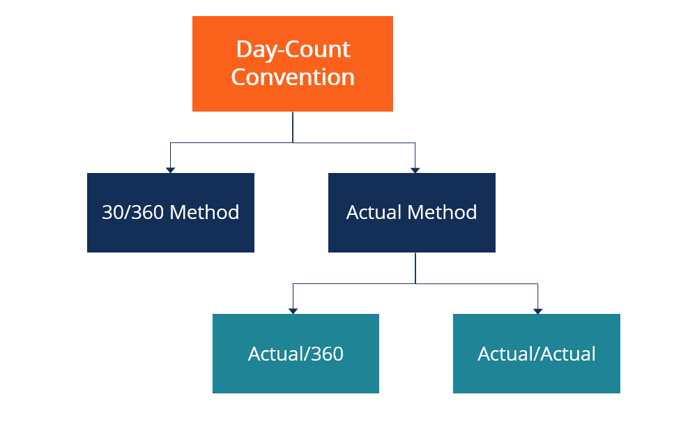

## Table of Contents

## What are day-count conventions in bond markets?

Day-count conventions in bond markets are rules that help figure out how much interest a bond earns over time. They tell us how to count the days between two dates, like from when you buy a bond to when you get paid interest. Different bonds can use different day-count methods, and this can affect how much money you make from the bond. For example, some bonds might count every day in a month, while others might always count a month as having 30 days.

There are a few common day-count conventions. One popular method is the "30/360" convention, where every month is treated as having 30 days and a year is seen as having 360 days. Another method is the "actual/actual" convention, which counts the actual number of days in each month and year. This can be more accurate but also more complicated. Knowing which convention a bond uses is important because it can change the interest you earn, especially if you're holding the bond for a short time or if you're buying or selling it between interest payment dates.

## Why are day-count conventions important in bond valuation?

Day-count conventions are important in bond valuation because they help figure out how much interest a bond earns over time. When you buy a bond, you want to know how much money you'll get back, including the interest. The day-count convention tells you how to count the days between when you buy the bond and when you get paid interest. This can change how much interest you earn, especially if you're holding the bond for a short time or if you buy or sell it between interest payment dates.

Different bonds use different day-count conventions, and this can affect their value. For example, if two bonds have the same [interest rate](/wiki/interest-rate-trading-strategies) but use different day-count methods, one might earn you more interest than the other over the same period. This means that understanding the day-count convention used by a bond is crucial for accurately valuing it and comparing it with other bonds. It's like knowing the rules of the game before you start playing, so you can make better decisions about which bonds to buy or sell.

## What is the difference between actual/actual and 30/360 day-count conventions?

The actual/actual day-count convention counts the exact number of days between two dates. For example, if you buy a bond on January 15 and get paid interest on July 15, you would count all the days in between, including February's varying number of days. This method is more accurate because it reflects the real number of days in each month and year. It's often used for government bonds and some corporate bonds because it's fair and precise.

On the other hand, the 30/360 day-count convention simplifies things by treating every month as having 30 days and every year as having 360 days. So, if you buy a bond on January 15 and get paid interest on July 15, you would count it as 6 months, or 180 days (6 x 30). This method is easier to calculate but can be less accurate because it doesn't account for the actual number of days in each month. It's commonly used for corporate bonds and some mortgage-backed securities because it makes calculations simpler and more predictable.

## How does the actual/360 day-count convention work?

The actual/360 day-count convention is a way to figure out how much interest a bond earns. It counts the exact number of days between two dates, like from when you buy the bond to when you get paid interest. But instead of using the actual number of days in a year, it always uses 360 days for a year. So, if you buy a bond on January 15 and get paid interest on July 15, you would count all the days from January 15 to July 15, but then you would divide that number by 360 to find out the interest.

This method can be a bit tricky because it mixes real days with a made-up year length. It's often used in money market instruments and some commercial loans because it makes the math easier while still being pretty accurate. But it can lead to a bit more interest being paid than if you used the actual number of days in a year, which is 365 or 366 for a leap year.

## Can you explain the actual/365 (fixed) day-count convention?

The actual/365 (fixed) day-count convention is a way to figure out how much interest a bond earns. It counts the exact number of days between two dates, like from when you buy the bond to when you get paid interest. But instead of using the actual number of days in a year, which could be 365 or 366 for a leap year, it always uses 365 days for a year. So, if you buy a bond on January 15 and get paid interest on July 15, you would count all the days from January 15 to July 15, but then you would divide that number by 365 to find out the interest.

This method is often used in some financial markets because it makes calculations easier and more consistent. It's simpler than using the actual/actual method, which changes depending on whether it's a leap year or not. But it can lead to a bit less interest being paid than if you used the actual number of days in a year during a leap year. It's a good middle ground between accuracy and simplicity.

## What impact do day-count conventions have on bond yields and interest calculations?

Day-count conventions affect how much interest a bond earns and what its yield looks like. They tell us how to count the days between when you buy a bond and when you get paid interest. Different conventions can make the interest calculation different, even if the bond's interest rate stays the same. For example, if a bond uses the 30/360 method, it might count fewer days than the actual/actual method, which could mean you get less interest over the same time. This can change how much money you make from the bond, so it's important to know which convention is used.

The choice of day-count convention can also affect how you compare bonds. If you're looking at two bonds with the same interest rate but different day-count methods, one might seem to offer a better yield than the other. This is because the way days are counted changes how much interest is earned over a given period. So, understanding these conventions helps you see the real value of a bond and make smarter choices about which ones to buy or sell.

## How do different day-count conventions affect the pricing of bonds across different markets?

Different day-count conventions can change how much a bond costs in different markets because they affect how much interest the bond earns. If two bonds have the same interest rate but use different day-count methods, one might seem cheaper or more expensive than the other. For example, if a bond uses the 30/360 method, it might count fewer days than a bond using the actual/actual method. This means the bond using the 30/360 method could earn less interest over the same time, making it seem cheaper when you look at the price.

These differences can be important when you're comparing bonds from different markets. A bond from one market might use the actual/365 (fixed) method, while another from a different market might use the actual/360 method. Even if they have the same interest rate, the bond using the actual/360 method could end up [earning](/wiki/earning-announcement) a bit more interest because it divides the days by 360 instead of 365. Knowing which day-count convention a bond uses helps you understand its real value and make better choices about which bonds to buy or sell.

## What are the common day-count conventions used in the U.S. Treasury market?

In the U.S. Treasury market, the most common day-count convention used is the actual/actual method. This means they count the real number of days between two dates, like from when you buy the bond to when you get paid interest. This method is fair and accurate because it takes into account the actual number of days in each month and year. It's used for Treasury bonds, notes, and TIPS (Treasury Inflation-Protected Securities) because it makes sure everyone gets the right amount of interest.

For Treasury bills, which are short-term securities, the U.S. Treasury uses a different method called the actual/360 day-count convention. This method counts the real number of days between the dates, but it always uses 360 days for a year. This can make the interest calculation a bit different, but it's still used for these short-term securities because it's simpler and helps with quick calculations. Knowing these conventions helps investors understand how much interest they'll earn from U.S. Treasury securities.

## How do day-count conventions influence the calculation of accrued interest on bonds?

Day-count conventions affect how much interest a bond earns between when you buy it and when you get paid. This interest is called accrued interest. Different day-count methods count the days between these dates in different ways. For example, the 30/360 method treats every month as having 30 days and a year as having 360 days. So, if you buy a bond on January 15 and get paid on July 15, you would count it as 6 months or 180 days. This might mean less interest than if you used a method that counts the actual days, like the actual/actual method.

The actual/actual method counts the real number of days between the dates, which can be more accurate but also more complicated. If you use this method and buy a bond on January 15 and get paid on July 15, you would count all the days in between, including the actual number of days in February. This could lead to more interest than the 30/360 method because it counts more days. Knowing which day-count convention a bond uses is important because it changes how much accrued interest you earn, especially if you're holding the bond for a short time or if you buy or sell it between interest payment dates.

## What challenges do investors face when dealing with multiple day-count conventions in a global portfolio?

Investors with a global portfolio often face challenges because different bonds use different day-count conventions. These conventions decide how to count the days between when you buy a bond and when you get paid interest. For example, a bond from the U.S. might use the actual/actual method, while a bond from another country might use the 30/360 method. This means the same bond could earn different amounts of interest depending on which convention is used. It can be hard for investors to keep track of all these different methods and make sure they're calculating the right amount of interest for each bond.

This can make it tricky to compare bonds from different markets. If an investor is trying to decide which bond to buy, they need to know how the day-count convention affects the interest earned. A bond that seems to offer a good interest rate might actually give less money if it uses a convention that counts fewer days. This can lead to mistakes in figuring out the total return on a portfolio. Investors need to be careful and maybe use tools or calculators that can handle different day-count conventions to make sure they're making the best choices for their money.

## How have day-count conventions evolved historically, and what drives changes in these conventions?

Day-count conventions have changed over time because people wanted to make calculating interest easier and more accurate. A long time ago, many places used the 30/360 method because it made math simpler. Every month was treated as having 30 days, and a year was seen as having 360 days. This was good for quick calculations, but it wasn't always fair because it didn't count the real number of days in each month. As finance got more complicated and computers came along, people started using the actual/actual method more often. This method counts the real number of days between dates, which is more accurate but also more work to figure out.

Changes in day-count conventions are often driven by the need for fairness and better technology. As markets grew and more people started trading bonds around the world, it became important to have a way to count days that was fair for everyone. The actual/actual method became more popular because it treats every day the same, no matter which month it's in. Also, with computers, it's easier to do the more complicated math that comes with counting the real number of days. But some markets still use the simpler 30/360 method because it's easier for certain types of bonds and loans. So, the choice of day-count convention can depend on what's most important for the people using it - simplicity or accuracy.

## What are the implications of day-count conventions for bond market risk management and financial modeling?

Day-count conventions are really important for managing risks and making financial models in the bond market. They tell us how to count the days between when we buy a bond and when we get paid interest. This can change how much interest a bond earns, which is a big deal for figuring out how much risk there is in holding a bond. If a bond uses a method that counts fewer days, like the 30/360 method, it might seem less risky because it earns less interest. But if it uses a method that counts more days, like the actual/actual method, it could seem riskier because it earns more interest. Knowing which method a bond uses helps people in the bond market understand and manage these risks better.

In financial modeling, day-count conventions are key because they affect how much money a bond is expected to make over time. If a model uses the wrong day-count method, it might give the wrong numbers for how much interest a bond will earn. This can mess up plans for investing or trading bonds. So, people who make financial models need to be careful about which day-count method they use for each bond. They might need to use different methods for different bonds in their models to make sure everything is as accurate as possible. This helps them make better decisions about buying, selling, and managing bonds in their portfolios.

## What are Day-Count Conventions and How Do We Understand Them?

Day-count conventions are mathematical frameworks integral to the calculation of accrued interest and the determination of coupon payment periods for bonds. These conventions help define how interest accrues over time, an essential [factor](/wiki/factor-investing) in accurate bond pricing within financial markets.

The primary day-count conventions include Actual/Actual, 30/360, Actual/360, and Actual/365:

1. **Actual/Actual (ISDA/ICMA):** This convention measures actual days between dates and the actual number of days in a year. The Actual/Actual (ISDA) variant is often used for government bonds in the U.S., while the Actual/Actual (ICMA) is typical in European financial markets.

2. **30/360:** Common in the U.S. corporate bond market, this convention assumes each month has 30 days, resulting in a 360-day year. It simplifies calculations but may introduce small inaccuracies in interest accruals. The 30/360 convention is defined by the formula:
$$
   \text{Accrued Interest} = \frac{\text{Days Counted}}{360} \times \text{Annual Coupon Rate} \times \text{Face Value}

$$

3. **Actual/360:** This is frequently used in money markets, particularly for short-term instruments. It calculates interest based on actual days elapsed against a 360-day year, providing more precision than the 30/360 method for specific instruments.

4. **Actual/365:** Used in some European markets, this convention accrues interest based on actual days with a denominator of 365, offering a closer approximation of daily interest accrual for certain instruments.

Each convention dynamically impacts the calculation of interest accrual periods and thereby affects market valuation and yield computation. For instance, the choice between 30/360 and Actual/Actual can lead to differential pricing, influencing trading decisions, and reflecting market preferences.

Understanding these conventions enables investors to make well-informed decisions, ensuring accurate assessment of potential investments and effective portfolio management. Calculating interest accruals accurately is paramount in reflecting true bond value, aligning investment strategies, and optimizing resource allocation. 

Accurate application of these conventions requires thorough knowledge, often facilitated by financial tools and software. The integration of these conventions into financial modeling enhances the precision of calculations and projections, allowing for superior investment analysis and management.

## References & Further Reading

[1]: Fabozzi, F. J. (2007). ["Fixed Income Analysis, 2nd Edition."](https://books.google.com/books/about/Fixed_Income_Analysis.html?id=lujLawVLS3YC) Wiley.

[2]: Fabozzi, F. J. (2013). ["Bond Markets, Analysis, and Strategies, 8th Edition."](https://books.google.com/books/about/Bond_Markets_Analysis_and_Strategies_ten.html?id=bQpNEAAAQBAJ) Pearson.

[3]: Jones, E., Oliphant, T., & Peterson, P. (2001). ["SciPy: Open source scientific tools for Python."](https://www.researchgate.net/publication/213877848_SciPy_Open_Source_Scientific_Tools_for_Python) [Python library for numerical computations]

[4]: Hull, J. C. (2018). ["Options, Futures, and Other Derivatives, 10th Edition."](https://www.pearson.com/nl/en_NL/higher-education/subject-catalogue/finance/Options-Futures-and-Other-Derivatives-Hull.html) Pearson.

[5]: Burington, R. S., & May, F. W. (1977). ["Handbook of Probability and Statistics with Tables, Second Edition."](https://archive.org/details/handbookofprobab00buri) Dover Publications.