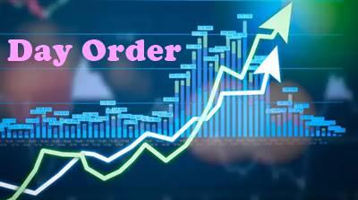

## Table of Contents

## What is a day order in stock trading?

A day order in stock trading is a type of order that you place to buy or sell a stock, but it only lasts for the trading day. If the order doesn't get filled by the end of the day, it automatically expires. This means that if you want to buy or sell the stock again, you'll need to place a new order the next trading day.

Day orders are useful because they help you manage your trades more closely. For example, if you see a good opportunity during the day and want to take advantage of it, you can place a day order. If the price doesn't reach your target by the end of the day, the order will cancel itself, and you won't have to worry about it anymore. This can help you avoid leaving orders open for too long, which can be risky.

## How does a day order differ from other types of orders?

A day order is different from other types of orders mainly because it only lasts until the end of the trading day. If you place a day order and it doesn't get filled by the time the market closes, it will automatically expire. You would need to place a new order the next trading day if you still want to buy or sell the stock. This is useful if you want to make a trade based on what's happening in the market that day and don't want the order to carry over to the next day.

In contrast, other types of orders like a Good 'Til Canceled (GTC) order stay active until they are filled or you cancel them. A GTC order can last for days, weeks, or even months, which can be helpful if you're not in a hurry and want to wait for the right price. Another type is an Immediate or Cancel (IOC) order, which must be filled right away or it gets canceled. Day orders give you more control over your trades for just one day, while GTC and IOC orders offer different ways to manage your trading strategy over longer periods or instantly.

## What are the benefits of using a day order for beginners?

Using a day order can be really helpful for beginners because it's simple and safe. When you place a day order, it only lasts for the trading day. If you don't buy or sell the stock by the end of the day, the order just goes away. This means you don't have to worry about it anymore. It's like setting a reminder for yourself that only lasts until bedtime. This can help beginners feel more comfortable because they know their order won't stay open and possibly cause problems later.

Another benefit is that day orders help beginners focus on what's happening in the market right now. If you see a good chance to buy or sell a stock during the day, you can use a day order to take that chance. If the price doesn't reach what you want by the end of the day, the order cancels itself. This way, beginners can practice making quick decisions without the stress of long-term commitments. It's a good way to learn and get better at trading without taking big risks.

## Can you explain the process of placing a day order?

Placing a day order is pretty easy. First, you need to log into your trading account on your computer or phone. Once you're in, find the stock you want to buy or sell. Type in the stock's symbol or name to find it. After you find the stock, decide if you want to buy or sell it. Then, type in how many shares you want to trade. Next, set the price you're willing to pay or the price you want to sell at. This is called the limit price. Make sure to choose "Day Order" as the order type so it only lasts for today.

After you've filled in all the details, double-check everything to make sure it's right. When you're sure, hit the button to send the order. Your trading platform will show you that your day order has been placed. Now, you just need to keep an eye on the stock price during the day. If the price reaches your limit price, your order will get filled, and you'll have bought or sold the stock. If the price doesn't reach your limit by the end of the day, the order will cancel itself, and you won't have to do anything else.

## What happens to a day order if it is not executed by the end of the trading day?

If your day order doesn't get filled by the end of the trading day, it will automatically expire. This means that if you wanted to buy or sell a stock at a certain price but the stock never reached that price during the day, your order will simply disappear at the end of the day.

You won't have to do anything else with the order because it's gone. If you still want to buy or sell the stock, you'll need to place a new order the next trading day. This helps keep things simple and lets you focus on what's happening in the market right now without worrying about old orders.

## How can day orders be used as part of a trading strategy?

Day orders can be a big part of a trading strategy because they help you make quick decisions based on what's happening in the market right now. If you see a stock price moving in a way that you think is a good chance to buy or sell, you can use a day order to take that chance. For example, if you think a stock is going to go up during the day, you can place a day order to buy it at a certain price. If the price reaches your target, your order gets filled, and you've made your trade. If not, the order expires at the end of the day, and you can try again the next day.

Using day orders can also help you manage risk better. Because day orders only last for one trading day, you don't have to worry about them staying open and possibly causing problems later. This can be really helpful if you're trying to avoid big losses. For example, if you see a stock that's been going down all day and you think it might go back up, you can place a day order to buy it at a lower price. If the stock doesn't go up by the end of the day, your order expires, and you don't lose any money. This way, you can try different trading ideas without taking big risks.

## What are the risks associated with day orders?

One risk with day orders is that they might not get filled. If you place a day order to buy or sell a stock at a certain price, but the stock never reaches that price during the day, your order will expire. This means you might miss out on a chance to make a trade that could have been good for you. It can be frustrating if you see the stock price moving in the right direction after your order expires.

Another risk is that you might make quick decisions without thinking them through. Day orders are good for taking advantage of what's happening in the market right now, but this can lead to impulsive trading. If you're not careful, you might buy or sell a stock without fully understanding why you're doing it, which can lead to losses. It's important to use day orders as part of a well-thought-out trading plan to avoid these risks.

## How do market conditions affect the execution of day orders?

Market conditions can have a big impact on whether your day order gets filled or not. If the market is really busy and lots of people are trading, your day order might get filled quickly. This is because there are more buyers and sellers, so it's easier to find someone who wants to trade at your price. But if the market is quiet and not many people are trading, it can be harder for your order to get filled. The stock might not move to your price during the day, so your order could expire without being filled.

Sometimes, big news or events can make the market move a lot. If there's good news about a company, the stock price might go up fast, and your day order to buy could get filled right away. But if there's bad news, the price might drop, and your order to sell could get filled quickly too. These sudden changes can help or hurt your day order, depending on what you're trying to do. It's important to keep an eye on the market and any news that might affect your trades.

## Can day orders be modified or canceled after they are placed?

Yes, you can change or cancel a day order after you place it, but you need to do it before the end of the trading day. If you want to change the price or the number of shares, you can go back into your trading account and make the changes. Just find the order, click on it, and adjust what you need. If you decide you don't want to make the trade anymore, you can cancel the order completely. This is helpful if the market changes and you want to do something different.

Remember, once the trading day is over, you can't change or cancel a day order because it will already have expired. So, if you're thinking about making changes, make sure to do it while the market is still open. This way, you can keep control of your trades and make the best decisions based on what's happening in the market at that time.

## What advanced techniques can traders use with day orders to optimize their trading?

Traders can use day orders to take advantage of small price movements during the day. One technique is called "[scalping](/wiki/gamma-scalping)," where traders place many day orders to buy and sell stocks quickly, making small profits each time. They might set their day orders at prices just a little bit above or below the current price, hoping to catch small price swings. This can be a good way to make money if the market is moving a lot, but it takes a lot of focus and quick thinking.

Another technique is using day orders to manage risk. Traders can place day orders to buy or sell stocks at certain prices to set limits on how much they might lose. For example, if a trader owns a stock and it starts to go down, they can place a day order to sell it at a lower price to limit their loss. This way, if the stock keeps going down, the day order will help them get out before losing too much money. It's all about setting up day orders to help control what happens during the trading day.

## How do day orders interact with other order types like stop-loss and limit orders?

Day orders can work together with other types of orders like stop-loss and limit orders to help traders manage their trades better. A stop-loss order is used to limit losses by automatically selling a stock if its price drops to a certain level. If a trader places a stop-loss order, they can also use a day order to buy back the stock at a lower price if they think it might go up again. This way, the day order can help them take advantage of a price drop without leaving the order open for too long.

Limit orders, on the other hand, let traders buy or sell a stock at a specific price or better. A trader might use a limit order to buy a stock at a lower price and a day order to sell it at a higher price during the same day. If the stock reaches the limit price, the buy order gets filled, and then the day order to sell can be used to try to make a profit before the end of the day. Using day orders with stop-loss and limit orders helps traders make quick decisions and manage their risks better during the trading day.

## What are some real-world examples where using a day order would be advantageous for an expert trader?

An expert trader might use a day order to take advantage of a company's earnings announcement. If a company is about to release its quarterly earnings, the stock price can move a lot. The trader might place a day order to buy the stock at a certain price if they think the earnings will be good and the stock will go up. If the earnings are better than expected and the stock jumps, the day order could get filled, letting the trader buy the stock at a good price. If the earnings are bad and the stock drops, the day order will expire, and the trader won't lose any money.

Another example is when an expert trader uses day orders to scalp small price movements. If a stock is known to have a lot of small price swings during the day, the trader can place many day orders to buy and sell the stock quickly. For instance, if the stock is trading at $50, the trader might place a day order to buy at $49.95 and another to sell at $50.05. If these orders get filled, the trader makes a small profit. This strategy requires quick thinking and close monitoring of the market, but day orders help the trader take advantage of these small moves without leaving the orders open overnight.

## References & Further Reading

[1]: Kissell, R. (2014). ["The Science of Algorithmic Trading and Portfolio Management."](https://www.sciencedirect.com/book/9780124016897/the-science-of-algorithmic-trading-and-portfolio-management) Academic Press.

[2]: Aldridge, I. (2013). ["High-Frequency Trading: A Practical Guide to Algorithmic Strategies and Trading Systems,"](https://www.amazon.com/High-Frequency-Trading-Practical-Algorithmic-Strategies/dp/1118343506) 2nd Edition. Wiley.

[3]: Narang, R. K. (2009). ["Inside the Black Box: The Simple Truth About Quantitative Trading."](https://onlinelibrary.wiley.com/doi/book/10.1002/9781118267738) Wiley.

[4]: Schumaker, R. P., & Chen, H. (2009). ["Textual Analysis of Stock Market Prediction Using Breaking Financial News: The AZFin Text System."](https://dl.acm.org/doi/10.1145/1462198.1462204) ACM Transactions on Information Systems (TOIS), 27(2), 1-19.

[5]: Hasbrouck, J., & Saar, G. (2013). ["Low-latency trading."](https://www.sciencedirect.com/science/article/abs/pii/S1386418113000165) The Review of Financial Studies, 26(9), 2323-2356.