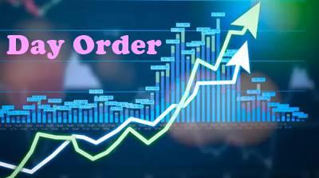

## Table of Contents

## What is a day order in stock trading?

A day order in stock trading is a type of order that is only good for the trading day on which it is placed. This means that if the order is not filled by the end of the trading day, it will expire and be canceled automatically. Traders use day orders when they want to buy or sell a stock at a specific price, but only if that price is reached within the same trading day.

Day orders are useful for traders who want to take advantage of short-term market movements without committing to a longer-term trade. For example, if a trader believes that a stock's price will rise during the day, they might place a day order to buy the stock at a certain price. If the stock reaches that price, the order will be filled. If it doesn't, the order will expire at the end of the day, and the trader won't have to worry about the stock's price movements after the market closes.

## How does a day order differ from other types of orders?

A day order is different from other types of orders because it only lasts for one trading day. If you place a day order and it doesn't get filled by the end of the day, it goes away. This is good if you want to make a quick trade and don't want the order to stay open if the price doesn't move the way you want it to that day.

Other types of orders, like good-till-canceled (GTC) orders, can stay open for a lot longer. A GTC order will keep trying to fill until you say to stop it or until it gets filled. This is useful if you are okay with waiting longer for the right price. There are also immediate-or-cancel (IOC) orders, which try to fill right away, and any part of the order that can't be filled right away gets canceled. Each type of order helps traders in different ways, depending on what they want to do with their trades.

## What are the advantages of using a day order?

Day orders are helpful because they let traders make quick decisions without worrying about the order staying open for too long. If you place a day order and the price you want doesn't happen by the end of the trading day, the order goes away automatically. This can be good if you only want to buy or sell a stock if the price moves in a certain way during that day.

Another advantage is that day orders can help traders avoid big surprises. Since the order only lasts for one day, you don't have to keep checking on it after the market closes. This can make trading less stressful and help you focus on other things without worrying about what might happen to your order overnight or over the weekend.

## Can you explain how to place a day order?

To place a day order, you first need to open your trading account on your computer or phone. Once you're logged in, find the stock you want to buy or sell. Then, go to the section where you can place an order. You'll see different options for the type of order, and you should choose "day order." After that, enter the number of shares you want to trade and the price at which you want to buy or sell them. Double-check all the details, and then hit the button to submit your order.

Once you've placed your day order, it will be active until the end of the trading day. If the stock reaches the price you set during the day, your order will be filled, and you'll get a notification. If the stock doesn't reach your price by the end of the day, the order will expire and won't be filled. This means you won't have to worry about the order after the market closes, and you can decide if you want to place a new order the next day.

## What happens if a day order is not executed by the end of the trading day?

If a day order is not executed by the end of the trading day, it simply expires and is canceled automatically. This means that if the stock price didn't reach the level you set for buying or selling, your order won't go through, and you won't own the stock or have sold it.

After the order expires, you have the choice to place a new order the next trading day if you still want to buy or sell the stock. You can set a new day order with the same or different price, or you might decide to use a different type of order, like a good-till-canceled order, if you're willing to wait longer for the right price.

## Are there any fees associated with day orders?

Day orders usually don't have extra fees just because they are day orders. The fees you might pay depend on your broker and the type of account you have. Most brokers charge a commission for buying or selling stocks, and this fee is the same whether you use a day order or another type of order.

Sometimes, if you trade a lot in one day, you might have to pay extra fees. These are called "trading activity fees" and can happen if you make many trades quickly. But these fees are not because of the day order itself, but because of how often you're trading. So, it's good to check with your broker to know all the fees you might have to pay.

## How can day orders be used as part of a trading strategy?

Day orders can be a useful part of a trading strategy for people who want to take advantage of short-term price movements. If you think a stock's price will go up or down during the day, you can place a day order to buy or sell at a specific price. This lets you try to make a quick profit without committing to holding the stock for a long time. If the price moves the way you expect during the day, your order will be filled, and you can make your trade. If it doesn't, the order will expire at the end of the day, and you won't have to worry about it anymore.

Another way day orders can fit into a trading strategy is by helping you manage risk. Since day orders only last for one trading day, you can use them to limit your exposure to price changes that happen overnight or over the weekend. For example, if you're worried about bad news coming out after the market closes, you can use a day order to sell a stock at a certain price during the day. If the price doesn't reach your target, the order will expire, and you can decide what to do next without being stuck with an open order. This can help you keep control over your trades and make decisions based on the latest information each day.

## What are the risks involved with using day orders?

Using day orders can be risky because they might not get filled. If you put in a day order to buy or sell a stock at a certain price, and the stock doesn't reach that price by the end of the day, your order will expire. This means you won't get to buy or sell the stock at the price you wanted. If the stock price moves a lot after the market closes, you might miss out on a good opportunity or have to wait until the next day to try again.

Another risk is that day orders can make you focus too much on short-term price changes. If you're always trying to make quick trades with day orders, you might miss seeing the bigger picture of how a stock is doing over time. This can lead to making quick decisions that aren't based on a good understanding of the stock's value. Also, if you place a lot of day orders in one day, you might have to pay extra fees, which can add up and affect how much money you make or lose from your trades.

## Can day orders be modified or canceled after they are placed?

Yes, you can change or cancel a day order after you place it, but you have to do it before the end of the trading day. If you want to change the price or the number of shares, you can go back into your trading account and update the order. Just make sure you do this before the market closes, or else the order will expire and you won't be able to change it.

If you decide you don't want to go through with the trade anymore, you can cancel the day order anytime before the trading day ends. This is good if the market changes and you don't want to buy or sell the stock at the price you set anymore. Once you cancel the order, it's gone, and you can start fresh the next trading day if you want to.

## How do market conditions affect the execution of day orders?

Market conditions can really change how a day order works out. If the market is moving a lot and the price of a stock goes up and down quickly, your day order might get filled faster. But if the market is calm and the stock price isn't changing much, your order might not get filled at all because it won't reach the price you set. So, if you want your day order to work, you need to think about what the market is doing that day.

Also, if there's big news or something important happening that affects the stock market, it can make a big difference. Good news might make stock prices go up fast, which could help your day order get filled if you're trying to buy. Bad news could make prices drop quickly, which might help if you're trying to sell. But if the news comes out after the market closes, your day order won't be affected because it will have already expired. So, knowing what's going on in the market and keeping an eye on the news can help you decide when to use a day order.

## What are some common mistakes traders make with day orders?

One common mistake traders make with day orders is setting unrealistic price targets. If you want to buy or sell a stock at a price that's too far from where it's trading, your order might not get filled. It's important to look at how the stock is moving and set a price that's likely to happen during the day. If you set your price too high or too low, you could miss out on a good trade.

Another mistake is not paying attention to market conditions. The stock market can change a lot from one day to the next, and what works one day might not work the next. If you place a day order without thinking about what's going on in the market, you might be surprised when your order doesn't get filled. It's good to check the news and see how the market is doing before you place your order.

Lastly, some traders forget to check their orders before the end of the trading day. If you place a day order and then don't look at it again, you might miss a chance to change or cancel it if the market changes. It's a good idea to keep an eye on your orders and be ready to make changes if you need to.

## How can advanced traders optimize the use of day orders in volatile markets?

Advanced traders can optimize the use of day orders in volatile markets by closely monitoring market trends and using technical analysis to set more precise price targets. In a volatile market, stock prices can move quickly, so it's important to set day order prices that are likely to be hit during the trading day. Traders can use tools like moving averages, support and resistance levels, and [volume](/wiki/volume-trading-strategy) indicators to predict where the price might go. By setting day orders at these key levels, traders can increase the chances of their orders being filled and take advantage of short-term price movements.

Another way advanced traders can optimize day orders is by being ready to adjust their orders throughout the day. In a volatile market, things can change fast, so it's smart to keep an eye on your orders and be ready to change the price or cancel the order if needed. This flexibility can help traders avoid missing out on trades or getting stuck with an order that's no longer a good idea. By staying active and responsive, advanced traders can use day orders to make quick, smart trades even when the market is moving a lot.

## References & Further Reading

[1]: Bergstra, J., Bardenet, R., Bengio, Y., & Kégl, B. (2011). ["Algorithms for Hyper-Parameter Optimization."](https://papers.nips.cc/paper/4443-algorithms-for-hyper-parameter-optimization) Advances in Neural Information Processing Systems 24.

[2]: ["Advances in Financial Machine Learning"](https://www.amazon.com/Advances-Financial-Machine-Learning-Marcos/dp/1119482089) by Marcos Lopez de Prado

[3]: ["Evidence-Based Technical Analysis: Applying the Scientific Method and Statistical Inference to Trading Signals"](https://www.amazon.com/Evidence-Based-Technical-Analysis-Scientific-Statistical/dp/0470008741) by David Aronson

[4]: ["Machine Learning for Algorithmic Trading"](https://github.com/PacktPublishing/Machine-Learning-for-Algorithmic-Trading-Second-Edition) by Stefan Jansen

[5]: ["Quantitative Trading: How to Build Your Own Algorithmic Trading Business"](https://books.google.com/books/about/Quantitative_Trading.html?id=j70yEAAAQBAJ) by Ernest P. Chan