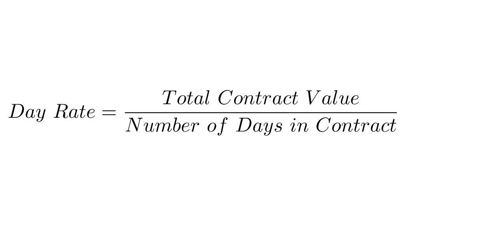

Day rate drilling contracts are pivotal in the oil and gas industry, significantly impacting the financial dynamics of drilling projects. These contracts establish a predetermined daily financial commitment that an oil company makes to a drilling contractor for the utilization of drilling rigs. This model provides a level of cost predictability which is essential for effective budget planning and resource allocation in drilling projects.

Understanding day rate contracts is crucial as they offer a lens through which the complexities of the oil market can be apprehended, particularly in relation to algorithmic trading. Algorithmic trading, which utilizes computer programs to conduct trades based on predefined criteria, has become a significant force in commodities markets, including oil. By examining day rate contracts alongside algorithmic trading, stakeholders can uncover valuable insights into oil investment opportunities. These insights stem from the ability of algorithmic trading systems to analyze vast datasets and market signals, thereby informing traders’ decisions about potential future trends in oil prices and demand.



The objective of this article is to uncover the interconnections between day rate contracts and market fluctuations, as well as their influence on algorithmic investment strategies. By doing so, we aim to elucidate the relevance and strategic importance of day rate contracts for both investors and oil drilling companies. The predictability associated with these contracts, coupled with the technological prowess of algorithmic trading, provides a fertile ground for crafting sophisticated investment strategies designed to maximize returns in the volatile oil market. 

Moreover, technological advancements play a fundamental role in shaping the operational landscape of the oil sector. Algorithmic trading is not only a tool for efficiency but also offers strategic foresight by interpreting market data, thereby shaping investment decisions. This introduction sets the stage for a deeper analysis of how technological integration can enhance both drilling operations and trading strategies, adapting to the ever-evolving conditions of the market. In conclusion, it becomes clear that as the oil industry navigates technological and market changes, staying informed and adaptable is vital for success.

## Table of Contents

## Understanding Day Rate Drilling Contracts

Day rate drilling contracts are a fundamental component of the oil and gas industry, dictating the terms under which an oil company pays a contractor for the use of drilling rigs. These contracts detail a fixed daily rate, offering financial predictability for the budgeting of drilling projects. This predictability is advantageous for oil companies as it aids in stable financial planning and risk management. However, day rate contracts can potentially lead to inefficiencies, particularly if a project exceeds its scheduled timeline, as the costs can accumulate without a corresponding increase in productivity.

Understanding the structure of day rate drilling contracts is essential for effectively managing and financing drilling projects. The contract's structure defines the financial obligations and risk distribution between the oil company and the contractor. It is critical for stakeholders to comprehend these elements to ensure effective project execution and financial outcomes.

Several key factors influence the negotiations of day rate contracts. The type of rig required is a primary consideration. Rig types vary significantly in cost and capability, influencing the daily rate. The location of the drilling operation is another critical [factor](/wiki/factor-investing), as remote or challenging environments may necessitate higher rates due to increased logistical and operational demands. The planned duration of the contract also impacts negotiations, with longer contracts often enticing more favorable day rates as contractors seek long-term engagements.

These contracts also play a pivotal role in risk allocation between the contracting parties. Contractors often bear the operational risks, such as equipment failure or adverse weather conditions, while the oil company assumes the financial risks associated with market price [volatility](/wiki/volatility-trading-strategies). Effective risk management within these contracts can significantly influence project success, underscoring the importance of well-structured agreements.

In conclusion, day rate drilling contracts offer a framework for financial predictability and risk allocation in the oil and gas sector. Mastery of the intricacies involved in these contracts is crucial for both oil companies and contractors to optimize the execution and profitability of drilling ventures.

## Advantages and Disadvantages of Day Rate Contracts

Day rate contracts are a popular choice in the oil and gas industry due to their ability to provide cost predictability. By locking in a fixed daily expense for the use of drilling rigs, oil companies can more accurately forecast their financial commitments, streamlining budgeting processes and facilitating effective resource allocation. This predictability is particularly useful in an industry characterized by volatile market conditions.

However, the fixed nature of day rate contracts can also present certain challenges. Since the contractor is paid a daily rate regardless of the project's progress, there might be less incentive to complete drilling operations quickly. This can potentially lead to extended project durations if the operations are not managed diligently. The risk of delays is compounded if unforeseen technical difficulties arise, creating inefficiencies that can affect overall project profitability.

For contractors, day rate contracts offer the advantage of steady, predictable income over the duration of a project. This financial stability can be beneficial for managing operational costs and investments in additional equipment or technology. However, this same steady income structure could, in some cases, reduce the motivation for expedient work, potentially affecting project timelines when combined with the absence of performance-based incentives.

On the oil company side, one of the significant advantages is access to the contractor's expertise and technology without needing to invest heavily in owning and maintaining expensive drilling rigs. This not only reduces capital expenditure but also allows companies to focus financial resources on core operational activities. By leveraging external expertise, companies can potentially enhance their operational efficiency and effectiveness.

Yet, a notable disadvantage of these contracts is the heightened pressure to maintain rigorous operational safety standards. Drilling activities involve various risks, and even minor lapses in safety protocols can result in significant financial and reputational damage. Thus, it is crucial to implement stringent safety measures and regular audits to mitigate such risks, particularly as contractors might prioritize income stability over speed.

In summary, while day rate contracts provide valuable financial predictability and operational expertise, they also come with potential drawbacks, such as extended project durations and challenges in maintaining high safety standards. Balancing these aspects requires careful contract management and oversight to ensure that both oil companies and contractors meet their objectives efficiently and safely.

## Factors Influencing Day Rates

Day rates for drilling contracts are significantly influenced by various factors, each impacting the overall cost and feasibility of oil and gas projects. A primary determinant of day rates is global oil demand. When demand is high, oil companies are willing to pay a premium for drilling services, resulting in increased day rates. Conversely, during periods of low demand, day rates tend to decrease as contractors compete for limited work opportunities.

Rig availability is another critical factor. A limited supply of drilling rigs can drive up day rates, as oil companies face competition to secure necessary resources. Conversely, an oversupply of rigs may lead to lower day rates, as contractors strive to fill their schedules and maintain utilization rates.

Technological advancements play a pivotal role in shaping day rate trends. Innovations, such as automated drilling systems and enhanced rig capabilities, can lead to cost reductions, allowing contractors to offer more competitive day rates. These technologies not only improve efficiency but also reduce the time required to complete projects, influencing the overall cost structure.

Market volatility and geopolitical tensions present additional layers of complexity. Fluctuations in oil prices, driven by geopolitical events or market uncertainties, can lead to significant changes in day rate contracts. For instance, political instability in major oil-producing regions might restrict supply and boost oil prices, encouraging increased drilling activity and higher day rates.

The availability of skilled labor influences day rates as well. Regions facing labor shortages may experience increased costs, as contractors need to incentivize workers with higher wages. Conversely, areas with an abundant skilled workforce can maintain more stable day rates, reflecting lower labor costs.

Regional operational challenges also contribute to day rate variability. Factors such as harsh weather conditions, remote locations, and local infrastructure limitations can increase operational costs and, consequently, day rates. These challenges necessitate additional resources and planning, impacting the negotiation of drilling contracts.

Environmental regulations and sustainability initiatives are becoming increasingly significant influencers of day rates. Stricter environmental standards can result in higher compliance costs for contractors, which may be reflected in elevated day rates. Additionally, the push towards sustainable practices can impact the types of rigs and technologies employed, further influencing cost structures.

In summary, the factors influencing day rates are multifaceted, encompassing economic, technological, labor, and regulatory dimensions. Understanding these dynamics is crucial for stakeholders in the oil and gas industry to navigate the complexities of drilling contracts and optimize their strategic planning.

## Algorithmic Trading in the Oil Industry

Algorithmic trading in the oil industry uses advanced computational algorithms to execute trades efficiently, leveraging pre-defined criteria and allowing for rapid market engagement. This technological approach is proving increasingly vital in handling the complex and volatile nature of global oil markets.

In the oil sector, [algorithmic trading](/wiki/algorithmic-trading) programs can process vast datasets, analyzing historical and real-time market information to identify patterns and predict trends. This capability enables traders to execute optimized investment strategies, capitalizing on market opportunities that may be imperceptible through manual trading methods. Algorithmic trading in oil markets can incorporate variables such as [crude oil](/wiki/crude-oil) prices, production levels, geopolitical events, and macroeconomic indicators, rendering a comprehensive analysis that supports informed decision-making.

The integration of [machine learning](/wiki/machine-learning) and [artificial intelligence](/wiki/ai-artificial-intelligence) (AI) technologies further enhances the efficacy of algorithmic trading systems in the oil industry. Machine learning algorithms can adapt to new data inputs, continuously refining their predictive models to improve accuracy. For instance, these systems can identify non-linear relationships between variables that human traders might overlook, facilitating more sophisticated trading strategies.

Understanding the volatility of day rates is essential when developing trading algorithms for the oil sector. Day rate fluctuations—reflecting changes in demand for drilling rigs and other operational factors—influence oil production costs and market pricing. Incorporating day rate data into trading algorithms can provide key insights, allowing models to predict market shifts and adjust strategies proactively.

The dynamic integration of algorithmic trading with day rate analysis creates novel investment opportunities for sophisticated traders. By aligning trading strategies with real-time market data, these algorithms enhance the precision and speed of transactions, giving traders a competitive edge in the rapidly changing oil markets.

Python, one of the most popular languages for algorithmic trading, provides a robust framework for implementing such models. Using libraries like pandas for data manipulation, NumPy for numerical computations, and scikit-learn for machine learning, traders can build and test models that incorporate a variety of market indicators, including day rates. Here is an example of a simple Python snippet to demonstrate how one might start building an algorithmic trading model focused on oil market data:

```python
import pandas as pd
from sklearn.model_selection import train_test_split
from sklearn.linear_model import LinearRegression

# Load dataset
data = pd.read_csv('oil_market_data.csv')

# Feature selection
features = data[['crude_price', 'day_rate', 'production_levels']]

# Target variable
target = data['market_trend']

# Train-test split
X_train, X_test, y_train, y_test = train_test_split(features, target, test_size=0.2, random_state=42)

# Create and train model
model = LinearRegression()
model.fit(X_train, y_train)

# Model prediction
predictions = model.predict(X_test)
```

Such models can be further enhanced with continuous learning capabilities and real-time data integration, providing traders the tools necessary to navigate and exploit the complexities of the oil market effectively.

## Integrating Day Rate Insights into Trading Strategies

Investors can leverage insights from day rates to inform oil futures and options trading strategies by understanding the fluctuations and patterns inherent in these contracts. Day rates, which reflect the cost of renting drilling rigs, are influenced by various factors such as market demand, technological advancements, and geopolitical dynamics. These factors provide crucial data points for traders.

Monitoring fluctuations in day rates is essential for anticipating changes in oil prices. By analyzing historical and current day rate data, traders can identify trends that might signal upcoming shifts in the oil market. This analysis helps in adjusting portfolios to either hedge against potential losses or to capitalize on predicted price movements.

Algorithmic models play a significant role in incorporating day rate data to optimize trading decisions. Such models can analyze vast datasets to detect patterns and trends that may not be visible to human traders. Python, with its data analysis libraries like pandas and NumPy, is often used to handle this data. For example, a simple model could calculate moving averages of day rates and correlate these with oil price movements using:

```python
import pandas as pd

# Assume df is a DataFrame with columns 'Date', 'DayRate', and 'OilPrice'
df['DayRate_MA30'] = df['DayRate'].rolling(window=30).mean()
correlation = df['DayRate_MA30'].corr(df['OilPrice'])
```

This calculation helps in predicting oil price movements based on the moving averages of day rates. Such insights can be integrated into more sophisticated algorithmic trading strategies, enhancing decision-making for both short and long-term investments.

Traders should incorporate macroeconomic and industry-specific factors into their analyses. Macroeconomic indicators such as GDP growth, inflation rates, and central bank policies impact oil demand and, consequently, day rates. Industry-specific elements, including regional conflicts or changes in drilling technology, also play a significant role.

Integrating day rate insights with algorithmic trading models creates more resilient trading strategies that are better equipped to manage market volatility. By aligning trading strategies with real-time data-driven insights, traders enhance their ability to weather unpredictabilities in the oil market, leading to potentially greater returns and reduced risk in their investment portfolios.

## Challenges and Future Trends

Adapting to the fluctuating correlation between day rates and oil prices is a significant challenge for stakeholders in the oil industry. The relationship between these variables can be influenced by a multitude of factors, making predictive modeling complex. In periods of high volatility, the link between day rates and oil prices can weaken, leading to uncertainties in financial forecasting and investment decisions. Therefore, understanding and mitigating the impact of this variability is critical for both oil companies and investors.

Regulatory changes, particularly those aimed at environmental protection, are increasingly affecting day rate contracting. Governments worldwide are implementing stricter regulations to mitigate environmental impact, which can alter operational costs and contract terms. For instance, regulations may necessitate the use of certain technologies or procedures that can drive up costs, affecting day rate negotiations. Furthermore, adherence to these regulations can lead to operational delays, thereby influencing project timelines and financial outcomes.

The demand for data transparency and predictive analytics is reshaping investor strategies regarding day rates. As the availability and granularity of data improve, investors can better assess risks and opportunities associated with drilling contracts. Enhanced data analytics provide deeper insights into market trends and operational efficiencies, allowing for more informed decision-making. Predictive analytics, leveraging historical data and advanced modeling techniques, can forecast future market movements, aiding investors in optimizing their portfolios in response to day rate fluctuations.

Advancements in AI and machine learning are poised to further refine algorithmic trading strategies in the oil market. These technologies enable the processing of large volumes of data at unprecedented speeds and precision, which is crucial for timely and accurate trading decisions. Machine learning algorithms can uncover hidden patterns in day rate data, offering a competitive edge in rapidly changing markets. As AI technology continues to evolve, its integration with trading platforms will enhance the ability to predict market dynamics and execute strategic trades efficiently.

Future trends in day rate contracts are likely to align more closely with sustainability goals and technological integration. As the oil industry faces mounting pressure to reduce its carbon footprint, there is a growing emphasis on sustainable practices within drilling operations. This shift may lead to the adoption of innovative technologies designed to minimize environmental impact, which could, in turn, affect the cost structure of day rate contracts. Additionally, the integration of digital technologies and smart systems is expected to streamline operational processes, reduce costs, and promote sustainability, ultimately influencing the contract landscape. 

The convergence of these factors underscores the need for stakeholders to remain agile and forward-thinking, to navigate the evolving complexities of the oil market effectively.

## Conclusion

Day rate drilling contracts and algorithmic trading are deeply interconnected, influencing investment decisions in the oil industry by providing a framework for both operational and trading efficiencies. Understanding day rate dynamics is crucial for optimizing drilling operations, as these contracts offer predictability in costs and allow companies to make informed financial forecasts. However, the complexity and volatility inherent in oil markets mean that these contracts must be constantly analyzed to ensure they align with changing market dynamics.

Technological advancements, particularly in algorithmic trading and data analytics, present new opportunities for investors and drilling companies. As algorithms become more sophisticated, they can incorporate vast amounts of data, including day rate fluctuations, to better predict market movements and enhance investment strategies. With machine learning and artificial intelligence, trading strategies can adapt more swiftly to new information, potentially leading to increased profitability.

Continuous analysis and adaptation are essential, given the ongoing evolution of market conditions and technological capacities. This involves not only staying updated on market trends but also integrating new technologies into existing frameworks to improve operational efficiency and trading outcomes. The oil industry's future will likely see greater alignment with sustainability goals, which may also shape day rate contract structures and investment strategies.

In conclusion, staying informed and agile in adjusting strategies is key to navigating the complexities of the oil market. By effectively integrating day rate insights with technological innovations, industry players can enhance their decision-making processes, reinforcing resilience against market unpredictability and unlocking new investment opportunities.

## References & Further Reading

[1]: ["Oil and Gas Industry: A Nontechnical Guide"](https://www.amazon.com/Oil-Gas-Industry-Nontechnical-Guide/dp/B009SLN7UC) by Joseph Hilyard

[2]: ["The Prize: The Epic Quest for Oil, Money, and Power"](https://www.amazon.com/Prize-Epic-Quest-Money-Power/dp/1439110123) by Daniel Yergin

[3]: ["Algorithmic Trading Strategies"](https://www.investopedia.com/articles/active-trading/101014/basics-algorithmic-trading-concepts-and-examples.asp) by David S. Elder in Advances in Financial Machine Learning

[4]: ["Energy Trading and Investing: Trading, Risk Management and Structuring Deals in the Energy Market"](https://www.amazon.com/Energy-Trading-Investing-Management-Structuring/dp/1259835383) by Davis Edwards

[5]: ["Traders, Guns & Money: Knowns and Unknowns in the Dazzling World of Derivatives"](https://www.amazon.com/Traders-Guns-Money-unknowns-derivatives/dp/0273704745) by Satyajit Das

[6]: ["Day Rate Contracts in the Oil and Gas Industry"](https://fastercapital.com/content/The-Economics-of-Day-Rate-Contracts-in-Oil-Drilling.html) by P.H. Morris, presented at the SPE Annual Technical Conference and Exhibition, 1982.