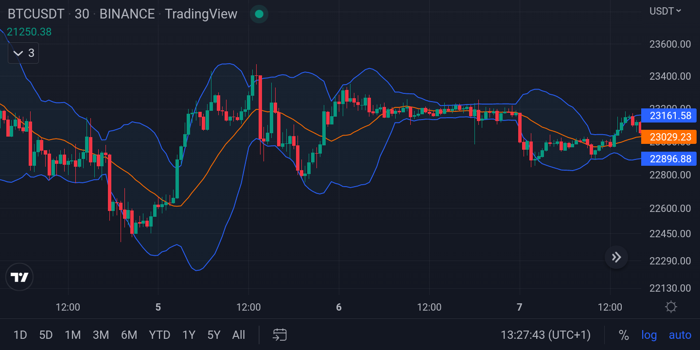

Crypto day trading represents a dynamic landscape where opportunities for profit abound due to the inherent volatility of cryptocurrency markets. Unlike traditional stock markets, the crypto market operates 24/7, offering continuous opportunities for traders to capitalize on price fluctuations. These rapid shifts present both risks and rewards, making the need for strategic planning and swift decision-making crucial.

This article aims to navigate readers through the intricate world of crypto day trading strategies, emphasizing the significance of algorithmic trading. Readers can expect to learn about key tactics such as momentum and breakout trading, scalping, and arbitrage. It will also touch upon essential aspects of risk management, such as position sizing and the importance of mitigating overtrading—a common pitfall in high-stakes environments.



Algorithmic trading plays a pivotal role in enhancing the efficacy of day trading strategies. By leveraging technology, traders can execute trades at high speeds and volumes that surpass human capabilities. Algorithmic systems allow for the automation of trading strategies, applying complex mathematical models and computations to market data to identify profitable opportunities. The benefits extend beyond increased trading speed; they include reduced emotional involvement and consistent strategy application, which are critical for managing the psychological demands of day trading.

Additionally, this article will offer insights into the process of strategy backtesting. Backtesting is essential for traders, allowing them to evaluate the potential effectiveness of a trading strategy using historical data before risking actual capital. This practice helps in refining strategies and enhancing their robustness against market fluctuations.

Readers are encouraged to explore the strategies and concepts presented in this article to improve their trading performance. With a keen focus on the combination of manual trading acumen and algorithmic efficiency, readers will gain valuable knowledge intended to enhance their trading outcomes. Through well-researched strategies and continuous adaptation to market conditions, traders can better position themselves to navigate the complexities of the crypto market.

## Table of Contents

## Understanding Crypto Day Trading

Cryptocurrency day trading involves buying and selling digital assets within the same trading day to capitalize on short-term price movements. This strategy is characterized by rapid trades and aims to leverage the inherent volatility in the cryptocurrency market. Unlike long-term investing, where assets are held for extended periods, day trading focuses on exploiting market inefficiencies over shorter durations.

Day trading differs significantly from other trading strategies like swing trading or long-term investing. While swing traders may hold positions for several days to weeks, and long-term investors may maintain their holdings for years, day traders close all their positions by the end of the trading day. This approach minimizes overnight risks and is ideal for traders who prefer not to be exposed to market shifts during non-trading hours.

Selecting suitable cryptocurrencies is crucial for successful [day trading](/wiki/day-trading-spy). Factors such as [liquidity](/wiki/liquidity-risk-premium) and [volatility](/wiki/volatility-trading-strategies) play a significant role in this selection process. High liquidity ensures that traders can enter and [exit](/wiki/exit-strategy) positions with ease, without causing significant price fluctuations. Volatility is equally important, as it provides the price movements needed to generate profits. Cryptocurrencies like Bitcoin and Ethereum are often preferred due to their high trading volumes and volatility.

Effective day trading relies heavily on technical analysis and thorough market research. Traders typically use charts, indicators, and historical data to make informed decisions. Technical analysis involves identifying patterns and trends that indicate potential price movements, allowing traders to predict future market behavior. A comprehensive understanding of market conditions, fueled by continuous research, is essential for reacting swiftly to emerging opportunities.

Quick decision-making and strategic planning are fundamental aspects of [cryptocurrency](/wiki/cryptocurrency) day trading. The fast-paced nature of the market demands that traders can rapidly evaluate and act on information. Developing a strategic plan, which includes setting entry and exit points, defining risk management protocols, and maintaining trading discipline, is vital. A well-devised plan helps mitigate risks associated with impulsive trading decisions and ensures a more structured approach to navigating the volatile crypto markets.

## Key Crypto Day Trading Strategies

Cryptocurrency day trading has gained attention due to the market's high volatility, providing numerous opportunities to employ diverse trading strategies. Among the most popular strategies in crypto day trading are scalp trading and [arbitrage](/wiki/arbitrage), each with distinct approaches and objectives.

Scalp trading focuses on making numerous small profits by exploiting minor price movements. Traders engaging in scalp trading typically hold their positions for short durations, aiming to consistently generate returns on small price increments. The success of scalp trading hinges on market liquidity, allowing traders to enter and exit positions swiftly. For example, a scalp trader might make dozens of trades in a single day, each time [earning](/wiki/earning-announcement) a small profit.

Arbitrage involves exploiting price discrepancies of a cryptocurrency across different exchanges. Traders purchase a cryptocurrency on one exchange where the price is lower and sell it on another where the price is higher, thus profiting from the difference. This strategy requires quick execution and sophisticated tools to identify and act on these opportunities before they vanish, given the rapid pace at which arbitrage opportunities close.

Momentum trading is another strategy where traders align their actions with market trends, purchasing cryptocurrencies that exhibit an upward price trajectory and selling those showing a downward trend. This strategy relies heavily on technical analysis and market indicators to predict future price movements. Traders look for signals such as moving averages, Relative Strength Index (RSI), or [volume](/wiki/volume-trading-strategy) changes to make informed decisions.

In contrast, high-frequency trading ([HFT](/wiki/high-frequency-trading-strategies)) employs automated systems and algorithms to execute a large number of orders rapidly. This strategy involves complex algorithms that analyze multiple markets and execute orders based on pre-defined criteria. Python libraries such as `pandas`, `numpy`, and `scikit-learn` can be used to develop these algorithmic strategies. A basic high-frequency trading system might use the following Python snippet to quickly analyze and act on market data:

```python
import numpy as np
import pandas as pd

# Simulated data
price_data = np.random.randn(100)  # Replace with actual market data

# Example moving average calculation
window_size = 5
moving_average = pd.Series(price_data).rolling(window=window_size).mean()

# Simple buy/sell signal generation
for i in range(window_size, len(price_data)):
    if price_data[i] > moving_average[i]:
        print("Buy Signal")
    elif price_data[i] < moving_average[i]:
        print("Sell Signal")
```

Reversal and [breakout](/wiki/breakout-trading) trading strategies focus on identifying market signals that indicate potential changes in price direction. Reversal trading attempts to capture profits by predicting the points where a cryptocurrency's price will change direction, while breakout trading seeks to exploit price movements that breach established support or resistance levels.

Incorporating mixed strategies can be advantageous for minimizing risks. By diversifying trading tactics, traders can better adapt to varying market conditions and reduce exposure to any single strategy's shortcomings. For instance, combining scalp trading with [momentum](/wiki/momentum) trading allows traders to capitalize on short-term price fluctuations while remaining aligned with broader market trends.

In summary, crypto day traders can employ a range of strategies, from scalp and arbitrage trading to momentum, high-frequency, reversal, and breakout trading. Using a combination of strategies can enhance trading performance and mitigate risks, making informed and strategic decisions essential for success in the dynamic cryptocurrency market.

## Implementing Algorithmic Strategies

Algorithmic trading plays an essential role in enhancing crypto day trading strategies by automating trading processes and allowing traders to capitalize on market opportunities with speed and precision. Algorithmic trading uses computer programs to analyze market data in real time and execute trades based on pre-defined criteria, ensuring that decisions are free from emotional biases and are instead driven by data.

### Guidelines for Selecting Trading Platforms that Support Algorithmic Trading

Choosing the right trading platform is crucial for implementing [algorithmic trading](/wiki/algorithmic-trading) strategies effectively. Key factors to consider when selecting a platform include:

1. **API Accessibility**: Platforms should offer robust APIs that allow traders to develop and integrate their own trading algorithms with ease. Look for platforms that support RESTful APIs and have thorough documentation for developers.

2. **Execution Speed**: The selected platform should facilitate high-speed trade execution to take advantage of price inefficiencies and market opportunities promptly.

3. **Reliability and Security**: Ensure that the platform is reliable with minimal downtime and adheres to high-security standards to protect user data and funds.

4. **Customizability**: The platform should allow the customization of trading algorithms, offering flexibility in strategy design and testing.

5. **Market Data**: Access to real-time market data is essential. Platforms should provide streaming market data with the ability to backtest using historical data.

6. **Simulator/Backtesting Environment**: Platforms with a built-in simulator or sandbox environment allow traders to test their algorithms in a risk-free setting.

# to Backtesting Strategies for Evaluating Potential Profitability

Backtesting is the process of testing a trading strategy using historical data to evaluate its potential performance. It offers a predictive measure of how a strategy might perform in live trading. The key steps in [backtesting](/wiki/backtesting) include:

1. **Define the Strategy**: Clearly outline the entry and exit signals, stop-loss levels, position sizing, and other parameters.

2. **Select Relevant Data**: Choose historical data that represents the market conditions you expect to trade in.

3. **Implement the Strategy in Code**: Using a programming language like Python, write the code that will execute the strategy logic over the historical data. Popular libraries like `pandas` and `ta-lib` assist in this process.

   ```python
   import pandas as pd
   import talib

   # Example of a moving average crossover strategy
   data = pd.read_csv("crypto_data.csv")
   data['SMA_20'] = talib.SMA(data['close'], timeperiod=20)
   data['SMA_50'] = talib.SMA(data['close'], timeperiod=50)

   data['Signal'] = 0
   data['Signal'][20:] = np.where(data['SMA_20'][20:] > data['SMA_50'][20:], 1, -1)

   # Backtest
   data['Position'] = data['Signal'].shift()
   returns = data['close'].pct_change()
   strategy_returns = returns * data['Position']
   cumulative_returns = (1 + strategy_returns).cumprod()
   ```

4. **Analyze the Results**: Evaluate the performance based on metrics such as total return, drawdown, Sharpe ratio, and win/loss ratio.

### Significance of Risk Management and Position Sizing in Algorithmic Trading

Risk management is a cornerstone of successful algorithmic trading. The systematic use of risk management techniques can substantially improve the robustness of trading strategies. Key components include:

1. **Stop-Loss Orders**: Automatically close positions at predetermined loss levels to cap potential losses.

2. **Position Sizing**: Determine the amount of capital to allocate per trade. Techniques such as the Kelly Criterion and fixed fractional position sizing can be employed to optimize returns while managing risk.
$$
   \text{Kelly Criterion} = \frac{bp - q}{b}, 

$$

   where $b$ is the odds received on the wager (e.g., risk-reward ratio), $p$ is the probability of winning, and $q = 1 - p$.

3. **Diversification**: Spread investments across different crypto assets to mitigate unfavorable price movements in individual assets.

4. **Risk-Reward Ratio**: Maintain an optimal risk-reward ratio for trades to ensure that the potential rewards justify the risks taken.

The effective implementation of these algorithmic strategies allows crypto day traders to leverage automation for exploiting market volatility while systematically managing risks and enhancing overall trading performance.

## Tools and Resources

Cryptocurrency day trading requires a set of specialized tools and resources to navigate the market's complexity efficiently. Among the most crucial tools are trading bots and Application Programming Interfaces (APIs), which facilitate automated trading strategies and offer traders enhanced market access.

### Trading Bots and APIs

Trading bots are automated software programs designed to execute buy and sell orders on behalf of traders. They operate based on predetermined rules and strategies, which can range from simple moving averages to complex market signals. These bots enable traders to take advantage of price fluctuations in the market without the need for constant monitoring. Notable benefits include 24/7 operation, minimizing emotional trading, and the ability to execute rapid trades that would be difficult for humans to achieve.

APIs play a pivotal role in the functionality of trading bots. They allow secure, programmatic access to market data and trading platforms. This integration is crucial for implementing algorithmic trading strategies. APIs can be used to gather real-time data, execute trades, and manage accounts. Popular trading platforms like Binance, Kraken, and Coinbase provide robust APIs that support the development and operation of sophisticated trading algorithms.

### Benefits of Automation

Automation in day trading offers several advantages that significantly enhance trading performance. Automated systems eliminate the influence of human emotions such as fear and greed, which often lead to poor trading decisions. Moreover, they can perform complex calculations and execute strategies at speeds far surpassing human capability, thereby capitalizing on short-lived market opportunities.

### Algorithmic Trading APIs

To maximize market access and trading efficiency, traders should consider utilizing algorithmic trading APIs. These interfaces allow for customized trading solutions tailored to specific market conditions and strategies. They facilitate rapid execution of trades, integration with real-time data feeds, and support for various order types. By leveraging these APIs, traders can improve their ability to react swiftly to market changes, maintain competitiveness, and potentially increase profitability.

### Backtesting Platforms and Software

Backtesting is a critical process wherein traders evaluate the efficacy of a trading strategy using historical data. This step is essential for ensuring the viability of a strategy before employing it in live markets. Several platforms and software tools are available for backtesting and strategy development.

Python libraries such as `Backtrader` and `Zipline` offer versatile frameworks for backtesting trading ideas and strategies. These tools provide comprehensive testing environments, allowing users to simulate trades, analyze results, and refine strategies. Additionally, platforms like TradingView offer online backtesting capabilities with a range of built-in indicators and scripting languages for custom strategy creation.

In conclusion, effective crypto day trading necessitates the use of advanced tools and resources such as trading bots, APIs, and backtesting platforms. These tools not only enhance operational efficiency but also provide the capability to develop and test sophisticated trading strategies tailored to the dynamic cryptocurrency market.

## Risk Management and Mistakes to Avoid

Risk management is a crucial component of cryptocurrency day trading, as it safeguards traders against significant losses and enhances the potential for long-term profitability. Key practices in risk management include setting stop-loss orders, determining appropriate position sizes, and diversifying trading strategies.

**Stop-Loss Orders**: Implementing stop-loss orders helps limit potential losses by automatically selling a cryptocurrency when it reaches a predetermined price. This tool is essential in preventing emotional reactions to market volatility. For instance, a trader may set a stop-loss order at 5% below the purchase price to mitigate risk in case the market moves unfavorably.

**Position Sizing**: Calculating the correct position size is fundamental to managing risk. A common method is the fixed percentage risk per trade strategy, which suggests risking only a small percentage of the trader's total capital per trade. For example, if a trader has $10,000 and decides to risk 1% per trade, they would not risk more than $100 on any single position.

**Common Mistakes to Avoid**:
1. **Overtrading**: Overtrading occurs when traders execute too many trades in a short period, often leading to increased transaction costs and diminished returns due to emotional decisions rather than strategic thinking.

2. **Emotion-Driven Decisions**: Making trading decisions based on emotions such as fear or greed rather than data and analysis can lead to significant losses. Automated trading systems can help reduce emotion-driven trading by adhering strictly to pre-defined strategies.

**Importance of Staying Informed**: Conducting thorough market research is vital for making informed trading decisions. This involves staying updated on news/events that can affect market conditions and using technical analysis to understand market trends. For instance, charting tools can help identify support and resistance levels, aiding in decision-making.

**Avoiding Market Manipulation and FOMO**: 
- **Market Manipulation**: Cryptocurrencies are often susceptible to manipulation due to their relatively low market capitalization compared to traditional assets. Being vigilant about trading volumes and unusual price movements can help traders avoid falling victim to "pump and dump" schemes.

- **Fear of Missing Out (FOMO)**: FOMO can compel traders to enter trades impulsively during rapid price increases, driven by the fear of losing out on potential gains. Adhering to a well-researched strategy and maintaining discipline are critical in mitigating the influence of FOMO.

Incorporating these risk management practices and avoiding common pitfalls allows traders to navigate the volatile cryptocurrency market more effectively, maximizing profit potential while minimizing exposure to risk.

## Advanced Techniques and Tips

Advanced algorithmic techniques such as [machine learning](/wiki/machine-learning) and high-frequency trading (HFT) have become integral components of sophisticated crypto day trading strategies. Machine learning models can analyze vast datasets to recognize patterns and predict future market movements, offering traders insights that are not readily apparent through traditional analysis. These models can be trained using historical data to predict price trends, optimize entry and exit points, and minimize risks associated with trading. 

A simple example of using machine learning for predicting cryptocurrency prices is implementing a regression model. Here's a Python snippet using a basic linear regression model with the popular machine learning library, `scikit-learn`:

```python
from sklearn.model_selection import train_test_split
from sklearn.linear_model import LinearRegression
import numpy as np

# Simulated data: historical prices and technical indicators
X = np.array([[1, 2], [2, 4], [3, 6], [4, 8], [5, 10]]) # Features (e.g., historical prices, indicators)
y = np.array([2, 4, 6, 8, 10]) # Target (e.g., future prices)

# Splitting data into training and testing sets
X_train, X_test, y_train, y_test = train_test_split(X, y, test_size=0.2, random_state=42)

# Creating and training the model
model = LinearRegression()
model.fit(X_train, y_train)

# Predicting future prices
predictions = model.predict(X_test)
```

High-frequency trading, on the other hand, relies on powerful computer systems to execute trades at exceptionally high speeds. It involves numerous trades executed in fractions of a second, capitalizing on minute price differentials and liquidity inefficiencies in the market. The use of HFT algorithms can be particularly beneficial in volatile crypto markets, as they can analyze and react to market conditions more swiftly than manual trading approaches.

Arbitrage remains a viable strategy in the crypto market, particularly given its fragmented nature. Arbitrage involves exploiting price differences of the same asset across different exchanges. Advanced traders frequently employ automated arbitrage bots that can simultaneously buy and sell on different platforms to lock in profits. An effective arbitrage strategy might involve monitoring multiple exchanges and executing trades when the price discrepancies surpass transaction costs.

Improving day trading skills is essential for consistent success. Setting clear, realistic goals is integral, helping traders remain focused and disciplined. Additionally, concentrating on a select number of cryptocurrencies allows for deeper market understanding and better strategic decisions, as spreading focus too thin can lead to oversight and errors.

Maintaining discipline, particularly in the fast-paced crypto environment, requires a combination of psychological fortitude and technological assistance. Utilizing stop-loss orders can help mitigate potential losses, while automation tools can reduce emotion-driven decisions. By leveraging APIs and trading platforms' advanced features, traders can streamline their operations and maximize their efficiency.

Trading success in the crypto market hinges on the ability to continuously integrate advanced techniques, maintain discipline, and harness cutting-edge technology. As the industry evolves, traders who innovate and adapt are well-positioned to capitalize on the opportunities presented by this dynamic trading landscape.

## Conclusion

Crypto day trading offers various strategies and techniques that have been explored throughout this article, each with the potential to generate profits in the highly volatile market of cryptocurrencies. From [scalping](/wiki/gamma-scalping) to arbitrage, momentum trading to algorithmic approaches, these strategies require careful consideration and execution. As highlighted, the importance of selecting suitable cryptocurrencies based on liquidity and volatility, alongside employing tools such as trading bots and APIs, amplifies the potential for success.

However, the path to profit isn't devoid of challenges. The volatile nature of the cryptocurrency market, coupled with the speed at which trades are executed, poses significant risks. Mistakes such as overtrading and succumbing to emotion-driven decisions can be detrimental. It's crucial to apply robust risk management practices to navigate the complexities of the market effectively.

Continuous learning and adaptation stand as pillars for those aiming to thrive in crypto day trading. Market conditions evolve rapidly, and staying informed about the latest trends and technologies is essential. Employing well-researched strategies is critical, and backtesting these strategies using platforms and software can reveal potential profitability and areas for refinement.

In conclusion, the potential for profit in crypto day trading is significant, but so are the challenges. A disciplined approach focusing on research, strategy, and ongoing education will position traders to adapt to market changes and capitalize on opportunities. By embracing these practices, traders can enhance their performance and increase their chances of success in the dynamic world of cryptocurrency trading.

## References & Further Reading

[1]: Bergstra, J., Bardenet, R., Bengio, Y., & Kégl, B. (2011). ["Algorithms for Hyper-Parameter Optimization."](https://papers.nips.cc/paper/4443-algorithms-for-hyper-parameter-optimization) Advances in Neural Information Processing Systems 24.

[2]: ["Advances in Financial Machine Learning"](https://www.amazon.com/Advances-Financial-Machine-Learning-Marcos/dp/1119482089) by Marcos Lopez de Prado

[3]: ["Evidence-Based Technical Analysis: Applying the Scientific Method and Statistical Inference to Trading Signals"](https://www.amazon.com/Evidence-Based-Technical-Analysis-Scientific-Statistical/dp/0470008741) by David Aronson

[4]: ["Machine Learning for Algorithmic Trading"](https://github.com/stefan-jansen/machine-learning-for-trading) by Stefan Jansen

[5]: ["Quantitative Trading: How to Build Your Own Algorithmic Trading Business"](https://books.google.com/books/about/Quantitative_Trading.html?id=j70yEAAAQBAJ) by Ernest P. Chan