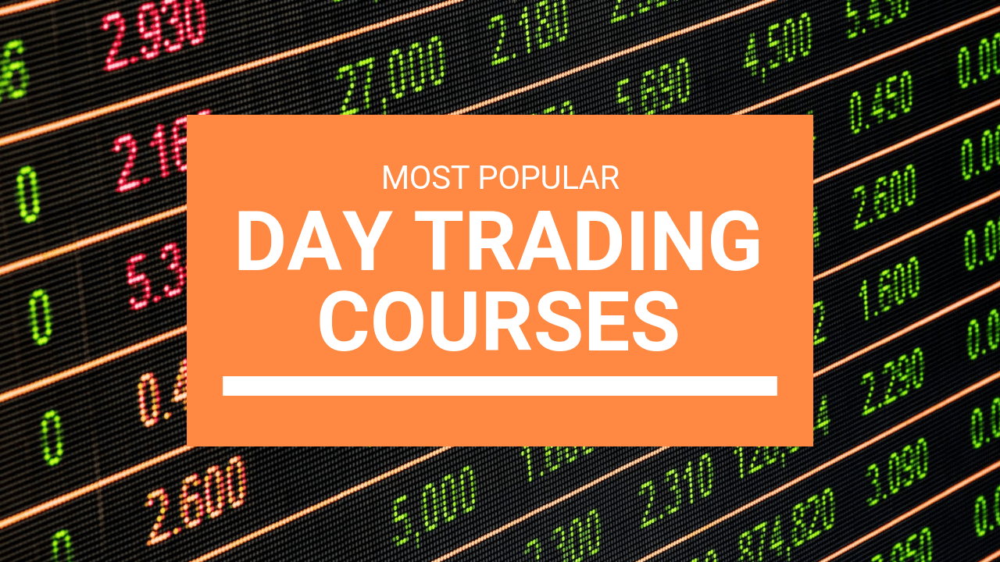

## Table of Contents

## What is day trading and why is it important to get educated about it?

Day trading is when people buy and sell stocks or other financial things within the same day. They do this to try to make money from small changes in the prices. It's different from long-term investing, where people hold onto their stocks for a long time. Day traders need to watch the market closely and make quick decisions.

It's important to get educated about day trading because it can be risky. Without knowing what you're doing, you could lose a lot of money. Learning about day trading helps you understand how the market works, how to use different tools, and how to manage your money wisely. This knowledge can help you make better decisions and increase your chances of making money instead of losing it.

## What are the basic concepts a beginner should know before starting a day trading education program?

Before starting a day trading education program, a beginner should understand a few basic concepts. First, it's important to know what the stock market is and how it works. The stock market is where people buy and sell shares of companies. Prices go up and down based on what people think about the company and the economy. Day traders try to make money by guessing which way the prices will move in a short time.

Second, beginners need to learn about different types of orders. There are market orders, which buy or sell a stock at the current price, and limit orders, which buy or sell at a specific price you choose. Understanding these can help you control when and how you trade. Also, it's good to know about technical analysis, which is looking at charts and patterns to guess where prices might go next. This can be a big part of [day trading](/wiki/day-trading-spy).

Lastly, risk management is crucial. Day trading can be risky because prices can change quickly. Beginners should learn how to set stop-loss orders, which automatically sell a stock if it drops to a certain price, to limit losses. It's also important to only trade with money you can afford to lose and to understand that not every trade will be a winner. Learning these basics will help you start your day trading education on the right foot.

## How can someone identify a reputable day trading education program?

To identify a reputable day trading education program, it's important to look at who is teaching the program. A good program will have instructors who have real experience in day trading and can show that they've been successful. You can check their backgrounds and see if they have any certifications or if they're well-known in the trading community. Also, see if the program offers a way to contact the instructors or get help if you have questions. This shows that they care about your learning and want to help you succeed.

Another thing to look for is what other people say about the program. Look for reviews and testimonials from past students. If a lot of people say good things about the program and how it helped them, that's a good sign. Be careful of programs that promise you'll make a lot of money quickly, because that's not realistic. A reputable program will be honest about the risks and will focus on teaching you the skills you need to trade well over time. Also, see if the program offers a trial or a money-back guarantee, which shows they believe in what they're teaching.

## What are the key components of a comprehensive day trading education program?

A comprehensive day trading education program should cover the basics of the stock market and how it works. This includes understanding what stocks are, how they're traded, and the different types of orders like market and limit orders. The program should also teach you about technical analysis, which is looking at charts and patterns to guess where prices might go next. This is important because day traders need to make quick decisions based on what they see in the market. The program should also explain how to use trading platforms and tools, so you know how to place trades and keep track of your investments.

Another key part of a good day trading education program is learning about risk management. This means understanding how to set stop-loss orders to limit your losses and only trading with money you can afford to lose. The program should teach you how to create a trading plan and stick to it, even when the market gets exciting. It's also important for the program to cover the psychology of trading, like how to handle your emotions and stay disciplined. Finally, a comprehensive program should offer ongoing support, like access to instructors or a community of traders, so you can keep learning and get help when you need it.

## How do different learning styles affect the choice of a day trading education program?

Different learning styles can really change which day trading education program is best for someone. If you learn best by seeing things, you might like a program with lots of videos and charts. These can show you how the market moves and how to read patterns. But if you learn better by doing things, you might want a program that lets you practice with fake money first. This way, you can try out trading without losing real money. And if you like to read and study on your own, a program with good [books](/wiki/algo-trading-books) and articles might be the best fit for you.

No matter your learning style, it's important that the program matches how you learn best. Some people need to hear things explained to them, so they might do well with a program that has lots of audio lessons or live webinars. Others might need to talk about what they're learning, so a program with a community or discussion group could help them. The key is to find a program that teaches day trading in a way that feels right for you, so you can learn the most and feel confident when you start trading for real.

## What are the common pitfalls to avoid when choosing a day trading education program?

When choosing a day trading education program, one common pitfall to avoid is falling for programs that promise quick and easy profits. These programs often use flashy ads and big promises to attract people, but they usually don't deliver on what they claim. Day trading is hard work and takes a lot of learning and practice, so be wary of any program that says you can get rich fast. Another mistake is choosing a program that doesn't match your learning style. If you learn better by seeing things, a program without videos or charts might not help you as much. Make sure the program teaches in a way that works for you, whether that's through reading, watching, or doing.

Also, be careful of programs that don't have experienced instructors or don't offer ongoing support. A good program should have teachers who have been successful day traders themselves and can show you how to do it right. It's also important that the program gives you a way to ask questions and get help as you learn. Without this, you might feel lost and struggle more than you need to. So, always check the background of the instructors and see if the program offers a community or way to get in touch with them.

## How can intermediate traders enhance their skills through advanced education programs?

Intermediate traders can enhance their skills through advanced education programs by focusing on more complex strategies and tools. These programs often dive deeper into technical analysis, teaching traders how to use advanced charting techniques and indicators to better predict market movements. They also cover more sophisticated trading strategies like [scalping](/wiki/gamma-scalping), where traders make many small trades to profit from tiny price changes, and swing trading, which involves holding positions for a few days to take advantage of larger market swings. By learning these advanced techniques, intermediate traders can become more precise and confident in their trading decisions.

Another way intermediate traders can improve is by learning about risk management and psychology at a deeper level. Advanced programs often include lessons on how to manage larger portfolios and how to use different types of orders to protect their investments better. They also focus on the mental side of trading, teaching traders how to stay disciplined and handle the stress that comes with more complex trading. By mastering these aspects, intermediate traders can not only increase their potential profits but also reduce their chances of making costly mistakes.

## What role does mentorship play in day trading education programs?

Mentorship is a big help in day trading education programs. A mentor is someone who has a lot of experience and can guide you as you learn to trade. They can show you what they do and help you avoid common mistakes. When you have a mentor, you can ask them questions and get advice that's just right for your situation. This makes learning a lot easier and can help you become a better trader faster.

Having a mentor also keeps you motivated and on track. Day trading can be tough, and it's easy to get discouraged. A good mentor will cheer you on and keep you going when things get hard. They can also give you feedback on what you're doing, so you know what to work on next. This kind of support can make a big difference in how well you do as a day trader.

## How do day trading education programs adapt to different market conditions?

Day trading education programs help traders learn to adapt to different market conditions by teaching them how to read and understand market trends. They show traders how to use tools and strategies that work well in different situations, like when the market is going up, going down, or staying the same. For example, a program might teach you how to use technical indicators to spot when the market is about to change direction, so you can adjust your trades accordingly.

These programs also focus on teaching traders how to be flexible and ready for anything. They explain how to change your trading plan based on what's happening in the market. This might mean using different strategies or adjusting your risk management rules. By learning these skills, traders can feel more confident and ready to handle whatever the market throws at them.

## What advanced strategies and tools are typically covered in expert-level day trading education programs?

Expert-level day trading education programs often cover advanced strategies like [algorithmic trading](/wiki/algorithmic-trading), where computers use math formulas to make trading decisions. They teach traders how to create and use these algorithms to spot patterns and make trades faster than they could by hand. Another strategy they might cover is high-frequency trading, which is making lots of trades in a very short time to take advantage of small price changes. These programs also go deep into options trading, showing traders how to use options to make money in different market conditions, not just when prices go up.

These programs also introduce traders to more complex tools. For example, they might teach about advanced charting software that can show more detailed market data and help traders see trends that are hard to spot with simpler charts. They also cover risk management tools like advanced stop-loss orders and position sizing, which help traders manage their money better and protect their investments. By learning these strategies and tools, expert traders can make more informed decisions and handle the ups and downs of the market better.

## How can traders measure the effectiveness of their day trading education?

Traders can measure the effectiveness of their day trading education by looking at how well they do in the market. If they start making more money and losing less after taking a program, that's a good sign the education helped. They can also keep track of how often they make good trades compared to bad ones. If their success rate goes up, it means they're learning and using what they've been taught.

Another way to see if the education is working is by checking if they feel more confident and understand the market better. If traders feel less scared and more sure about their decisions, it means the program is helping them learn. They should also see if they're using new strategies and tools they learned in the program. If they are, and these are helping them trade better, then the education is effective.

## What are the future trends in day trading education and how can programs stay relevant?

Future trends in day trading education are likely to include more use of technology, like [artificial intelligence](/wiki/ai-artificial-intelligence) and virtual reality. AI can help traders by analyzing lots of data quickly and finding patterns that are hard for people to see. Virtual reality can make learning more fun and interactive, letting traders practice in a fake market that feels real. Programs will also focus more on teaching traders how to use new tools and strategies, like trading with cryptocurrencies and other new types of investments. Staying up-to-date with these trends will be important for day trading education programs.

To stay relevant, day trading education programs need to keep changing and adding new things. They should update their courses to include the latest market trends and technology. Programs that listen to what traders need and want, and that keep their teaching methods fresh and exciting, will do well. It's also important for these programs to keep teaching the basics well, while also showing traders how to use new tools and strategies. By doing this, they can help traders be ready for whatever the future of trading brings.

## References & Further Reading

[1]: ["Advances in Financial Machine Learning"](https://www.amazon.com/Advances-Financial-Machine-Learning-Marcos/dp/1119482089) by Marcos Lopez de Prado

[2]: ["Evidence-Based Technical Analysis: Applying the Scientific Method and Statistical Inference to Trading Signals"](https://www.amazon.com/Evidence-Based-Technical-Analysis-Scientific-Statistical/dp/0470008741) by David Aronson

[3]: ["Machine Learning for Algorithmic Trading"](https://github.com/stefan-jansen/machine-learning-for-trading) by Stefan Jansen

[4]: ["Quantitative Trading: How to Build Your Own Algorithmic Trading Business"](https://www.amazon.com/Quantitative-Trading-Build-Algorithmic-Business/dp/1119800064) by Ernest P. Chan

[5]: ["Algorithmic Trading: Winning Strategies and Their Rationale"](https://www.wiley.com/en-us/Algorithmic+Trading%3A+Winning+Strategies+and+Their+Rationale-p-9781118460146) by Ernie Chan

[6]: ["High-Frequency Trading: A Practical Guide to Algorithmic Strategies and Trading Systems"](https://www.ahmetbeyefendi.com/wp-content/uploads/2020/07/High-Frequency-Trading-Irene-Aldridge.pdf) by Irene Aldridge

[7]: ["Automated Trading with R: Quantitative Research and Platform Development"](https://github.com/chrisconlan/automated_trading_with_R) by Chris Conlan