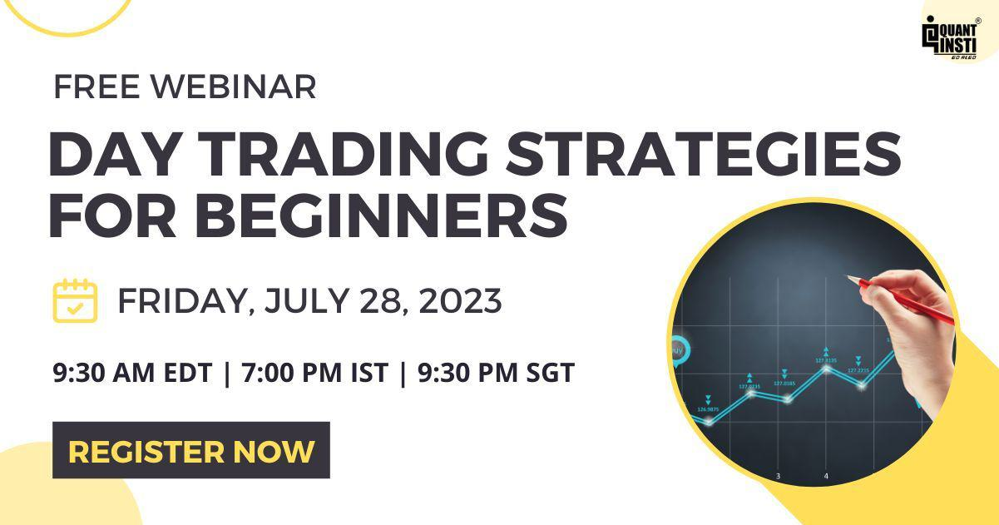

Trading education has become increasingly important in today's dynamic financial landscape. As financial markets continue to evolve and expand, understanding the complexities of trading is crucial for anyone wishing to participate effectively. The purpose of this article is to provide aspiring traders with essential insights into the different educational pathways available to enhance their trading skills and knowledge. Specifically, we will focus on trading schools, day trading courses, and algorithmic trading—three key areas that can significantly impact one's trading success.

Quality education in trading is paramount for several reasons. It equips traders with the necessary skills to make informed decisions, which is essential given the complexities and risks associated with trading. Proper knowledge not only aids in risk management but also improves overall decision-making processes, increasing the potential for profitability. Moreover, traders who invest in quality education are better prepared to navigate the unpredictable nature of financial markets.



The interest in financial markets has been steadily growing, driven by factors such as increased access to technology and information, as well as the appeal of potential financial gains. Online platforms have democratized access to trading education, making it more accessible to a broader audience. This surge in interest underscores the need for structured and comprehensive educational resources that cater to both novice and experienced traders alike.

By exploring trading schools, day trading courses, and algorithmic trading, this article aims to guide readers in choosing the educational path that best suits their personal goals and learning preferences. Through a thorough understanding of these topics, traders can position themselves for long-term success in an ever-changing financial environment.

## Table of Contents

## The Importance of Trading Education

Trading education plays a vital role in equipping both novice and seasoned traders with the necessary tools and knowledge to navigate the complexities of financial markets. For beginners, understanding the foundational concepts of trading is critical to avoiding significant losses and making informed decisions. Education provides insights into market dynamics, technical analysis, and fundamental analysis, all of which are essential for developing a comprehensive trading strategy. For experienced traders, ongoing education aids in refining strategies, staying updated with market trends, and managing psychological challenges.

The risks of trading without adequate knowledge are substantial. Novice traders often fall prey to emotional decision-making, lack of risk management, and an overreliance on speculation. Without an understanding of market indicators or trends, traders are more susceptible to making impulsive decisions that can lead to severe financial loss. Moreover, experienced traders can also face significant risks if they do not keep their skills and knowledge up-to-date, as markets are continuously evolving with new instruments, technologies, and regulations.

A solid educational foundation significantly enhances decision-making and risk management. Educated traders are equipped to conduct thorough market analysis and understand the importance of setting stop-loss orders, using leverage wisely, and diversifying their portfolios. This knowledge fosters a disciplined approach to trading, where decisions are based on data-driven insights rather than emotions. Risk management strategies become second nature to educated traders, allowing them to protect their capital and maximize returns.

The accessibility of trading education has dramatically increased with the proliferation of online platforms. These platforms provide a variety of resources, including webinars, interactive courses, and virtual trading simulations that cater to different learning styles and paces. Online communities and forums also offer a platform for traders to share insights, strategies, and experiences, further enhancing the learning experience. As a result, trading education has become more democratized, enabling individuals from diverse backgrounds and geographical locations to access high-quality educational content and support.

In conclusion, educational resources play an indispensable role in shaping successful traders by mitigating risks, enhancing decision-making, and providing access to a wealth of knowledge and strategies. As the trading environment continues to evolve, having a strong educational background remains a pivotal [factor](/wiki/factor-investing) in achieving long-term success in the financial markets.

## Exploring Trading Schools

Trading schools serve as specialized institutions or programs dedicated to educating individuals about various aspects of trading in financial markets. They offer comprehensive courses and resources tailored to equip both novice and seasoned traders with the essential knowledge and skills required for effective market participation. Trading schools typically come in different forms, including online platforms, in-person workshops, and hybrid models that combine both methods.

Several well-known trading schools have emerged, each offering specific niches or areas of specialization. For instance, the Online Trading Academy is renowned for its structured programs in stock trading, options, [forex](/wiki/forex-system), and futures, with an emphasis on practical experience and live trading sessions. The Institute of Trading and Portfolio Management focuses on portfolio management and investment strategies, catering to traders interested in career-level education. For those pursuing algorithmic and [quantitative trading](/wiki/quantitative-trading), the CQF (Certificate in Quantitative Finance) is a popular choice, providing courses that blend finance theory with computational techniques.

Attending a trading school offers numerous benefits. Firstly, these institutions provide a structured learning environment, allowing students to systematically build their skills through a well-planned curriculum. This framework often includes a mix of theoretical knowledge and hands-on practice, which is crucial for mastering trading strategies. Additionally, trading schools provide networking opportunities, connecting students with experienced traders, mentors, and industry professionals. This network can be instrumental in gaining insights, receiving feedback, and finding career opportunities in trading.

When choosing the right trading school, personal goals and learning preferences play a critical role. Prospective students should consider factors such as the cost of the program, the credibility and accreditation of the institution, and the specific curriculum offered. It is important to match one's learning goals with the school's strengths; for instance, a trader interested in [day trading](/wiki/day-trading-spy) should look for programs that emphasize short-term trading strategies and market analysis. Reviewing testimonials and feedback from current or past students can provide valuable insights into the quality and effectiveness of the trading school's education. Combining different educational offerings can also be beneficial, as diverse learning experiences can lead to a comprehensive skill set tailored to individual trading aspirations.

## The Essentials of Day Trading Courses

Day trading is a type of trading strategy that involves the buying and selling of financial instruments within the same trading day, with all positions being closed before the market closes. This approach capitalizes on small price movements, generally utilizing leverage to amplify these changes. Day traders seek to benefit from market [volatility](/wiki/volatility-trading-strategies), often executing multiple trades in a single day.

Day trading courses are designed to equip aspiring traders with the knowledge and skills necessary to effectively engage in short-term market transactions. These courses typically cover essential topics such as technical analysis, trading strategies, and the use of trading platforms. Technical analysis is a critical component, as it involves interpreting charts and price patterns to predict future market movements. Courses often teach various charting techniques, indicators, and oscillators, such as moving averages, the Relative Strength Index (RSI), and Bollinger Bands.

The use of sophisticated trading platforms is another key aspect of day trading education. These platforms provide tools and features that support rapid execution of trades, real-time data analysis, and order placement. Understanding the nuances of different trading platforms, such as MetaTrader, TradingView, or NinjaTrader, is crucial for day traders.

Strategies are at the heart of any day trading [course](/wiki/best-algorithmic-trading-courses). Common strategies include [scalping](/wiki/gamma-scalping), [momentum](/wiki/momentum) trading, and mean reversion. Scalping focuses on making numerous small trades to profit from small price moves, while momentum traders exploit volatility by buying securities showing upward trends and selling those in decline. Mean reversion strategies are based on the assumption that prices will eventually return to their average level.

Enrolling in day trading courses offers several benefits, including enhanced skills and increased confidence. These courses provide structured learning environments where participants can develop a comprehensive understanding of trading principles and techniques. Additionally, they offer opportunities to practice trading in simulated markets, allowing students to refine their skills without the risk of financial loss.

Examples of reputable day trading courses include:

1. **Warrior Trading** - Known for its emphasis on stock trading, Warrior Trading offers courses ranging from beginner to advanced levels, focusing on practical strategies and live trading sessions.

2. **Investopedia Academy's Become a Day Trader Course** - This course provides a comprehensive introduction to day trading, covering key principles, risk management strategies, and execution of trades, along with interactive resources and real-world exercises.

3. **Online Trading Academy's Professional Trader Course** - This course focuses on core trading concepts and techniques used by professional traders, offering both in-person and online learning options.

These courses distinguish themselves through their instructional methodologies, access to experienced traders, and supportive trading communities, making them valuable resources for individuals seeking to succeed in day trading.

## Understanding Algorithmic Trading

Algorithmic trading, also known as algo trading, refers to the use of computer algorithms to automate trading strategies and execute trades in financial markets. In modern finance, [algorithmic trading](/wiki/algorithmic-trading) has become increasingly significant due to its ability to process vast amounts of data at high speeds, thereby enabling traders to capitalize on fleeting market opportunities. According to a report by MarketsandMarkets, the global algorithmic trading market is projected to reach USD 21.25 billion by 2026, highlighting its growing importance.

The basic components of an algorithmic trading system include data collection, strategy formulation, [backtesting](/wiki/backtesting), execution, and monitoring. Data collection involves gathering historical and real-time market data that serve as the basis for decision-making. Strategy formulation requires traders to develop trading rules and algorithms that evaluate this data. Python, a popular programming language, can be used to implement such strategies using libraries like pandas for data analysis and NumPy for numerical computations. Backtesting assesses the performance of these strategies on historical data to ensure viability. Execution involves the automatic placement of trades via trading platforms such as MetaTrader or proprietary systems, while monitoring ensures the strategies perform as expected and adapt to changing market conditions.

```python
import pandas as pd
import numpy as np

# Example: Simple moving average crossover strategy
def moving_average_crossover(data):
    short_window = data['Close'].rolling(window=40).mean()
    long_window = data['Close'].rolling(window=100).mean()

    signals = pd.DataFrame(index=data.index)
    signals['signal'] = 0.0
    signals['short_mavg'] = short_window
    signals['long_mavg'] = long_window

    # Generate buy/sell signals
    signals['signal'][40:] = np.where(signals['short_mavg'][40:] > signals['long_mavg'][40:], 1.0, 0.0)
    signals['positions'] = signals['signal'].diff()

    return signals
```

Education for algorithmic trading is varied, accommodating different levels of expertise. Beginners often start with learning how to code in languages like Python and understanding basic algorithm design. Platforms such as Coursera and edX offer courses on these foundational skills. For those looking to advance, institutions like QuantInsti provide specialized courses focused on quantitative finance, [machine learning](/wiki/machine-learning), and high-frequency trading. Understanding statistical modeling, data science, and computational techniques is integral to mastering algorithmic trading.

Mastering algorithmic trading offers several advantages. From a career perspective, it can open doors to roles in hedge funds, investment banks, and proprietary trading firms. The skill to design and implement automated systems is highly valued as firms seek to optimize trading operations. Furthermore, algorithmic trading enhances trading efficiency by reducing human error, ensuring faster order execution, and allowing traders to handle complex datasets effectively. Thus, gaining proficiency in algo trading can profoundly impact both career trajectories and trading success.

## Choosing the Right Course or School for You

When selecting a trading school or course, several key factors can significantly influence your decision-making process. A critical starting point is evaluating the cost of the program. Trading education can range from free resources to premium courses that require a substantial financial investment. Assessing your budget and determining how much you are willing to invest in your education will help narrow down your options. It is crucial to weigh the potential return on investment from the course, considering factors such as the quality of content offered and the credibility of the institution.

Accreditation is another important consideration. Accredited programs often have gone through rigorous evaluation processes to ensure they meet industry standards, which can add a layer of credibility to the certificate or degree acquired. Additionally, reviewing the course curriculum is essential in determining if it aligns with your learning objectives and personal goals. A comprehensive curriculum should cover fundamental aspects of trading, such as market analysis, risk management, and practical application of trading strategies.

Setting personal goals is vital in refining your choice. Identify what you aim to achieve through the trading education, whether it is acquiring foundational knowledge, developing specific trading skills, or advancing to algorithmic trading techniques. Clear objectives will guide you in choosing programs that best fit your aspirations and skill levels.

Seeking reviews and testimonials from current or former students can provide valuable insights into the effectiveness and quality of the course. Feedback from individuals who have firsthand experience with the program can help identify the strengths and potential weaknesses of the education offered. Platforms such as educational forums, alumni networks, and social media groups can be excellent resources for gathering such information.

Moreover, consider the potential benefits of combining different educational offerings to build a comprehensive skill set. For example, enrolling in an online algorithmic trading course could complement a traditional trading school program, providing a more well-rounded understanding. By integrating various educational resources, you can tailor your learning experience to cover all necessary bases, from technical analysis to advanced trading algorithms.

Approaching the selection process methodically by considering these factors will ultimately lead to a more informed and strategic decision, facilitating a rewarding educational journey in the financial markets.

## Conclusion

In summarizing the key points discussed, it becomes evident that trading education plays a critical role in achieving success in financial markets. Quality education equips traders with essential skills, promotes informed decision-making, and fosters effective risk management—essential components for both new entrants and seasoned investors. Without a solid educational foundation, traders expose themselves to unnecessary risks that could be mitigated through structured learning and practical application of trading principles.

Investing in comprehensive trading education is an investment in one's financial future. As markets evolve and become more complex, continuous learning and skill enhancement are necessary for sustained success. Aspiring traders should prioritize researching reputable trading schools and courses, scrutinizing the curriculum, and evaluating the expertise of instructors. Speaking with industry professionals and seeking reviews from current or former students can provide valuable insights into the educational experience, helping individuals make informed choices that align with their career goals.

For those embarking on this journey, the pursuit of trading knowledge should not be seen as a one-time endeavor but as a rewarding continuous learning process. Just as financial markets are dynamic, so too should be a trader's commitment to education. Each new lesson learned and skill acquired contributes to building a robust trading portfolio. Embrace the journey of lifelong learning, staying curious and adaptable, as these qualities will open doors to growth and success in the ever-evolving world of trading.

## References & Further Reading

[1]: ["Advances in Financial Machine Learning"](https://www.amazon.com/Advances-Financial-Machine-Learning-Marcos/dp/1119482089) by Marcos Lopez de Prado

[2]: ["Evidence-Based Technical Analysis: Applying the Scientific Method and Statistical Inference to Trading Signals"](https://www.amazon.com/Evidence-Based-Technical-Analysis-Scientific-Statistical/dp/0470008741) by David Aronson

[3]: ["Machine Learning for Algorithmic Trading"](https://github.com/stefan-jansen/machine-learning-for-trading) by Stefan Jansen

[4]: ["Quantitative Trading: How to Build Your Own Algorithmic Trading Business"](https://www.amazon.com/Quantitative-Trading-Build-Algorithmic-Business/dp/1119800064) by Ernest P. Chan

[5]: ["Algorithmic Trading: Winning Strategies and Their Rationale"](https://www.wiley.com/en-us/Algorithmic+Trading%3A+Winning+Strategies+and+Their+Rationale-p-9781118460146) by Ernie Chan

[6]: ["High-Frequency Trading: A Practical Guide to Algorithmic Strategies and Trading Systems"](https://www.ahmetbeyefendi.com/wp-content/uploads/2020/07/High-Frequency-Trading-Irene-Aldridge.pdf) by Irene Aldridge

[7]: ["Automated Trading with R: Quantitative Research and Platform Development"](https://github.com/chrisconlan/automated_trading_with_R) by Chris Conlan