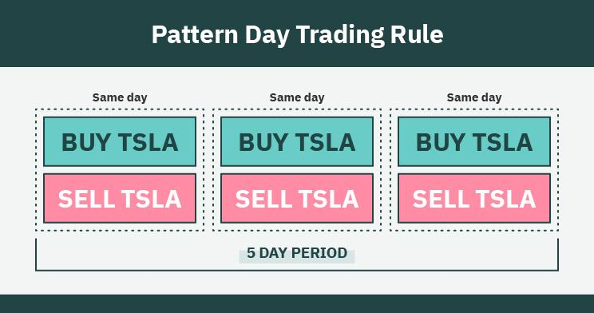

## Table of Contents

## What is day trading and why might someone want to start?

Day trading is when people buy and sell stocks or other things like cryptocurrencies or commodities within the same day. They try to make money from small changes in price. Day traders usually use a lot of computer screens and special software to watch the markets closely and make quick decisions.

Someone might want to start day trading because they think they can make a lot of money quickly. It can be exciting and feel like a game. But it's also very risky, and most people lose money. It takes a lot of time to learn and practice, and it's not a good idea to start without understanding the risks and having enough money to lose.

## What are the basic requirements to begin day trading?

To start day trading, you need a few basic things. First, you need enough money to trade with. Many brokers require you to have at least $25,000 in your account to day trade stocks because of a rule called the Pattern Day Trader rule. You can start with less if you want to trade other things like cryptocurrencies or forex, but it's still important to have enough money so you don't lose everything quickly. Second, you need a computer with a good internet connection. You'll be using trading software and watching the markets, so you want to make sure your technology is reliable.

Next, you need to choose a broker. A broker is a company that lets you buy and sell things like stocks or cryptocurrencies. Some brokers have special tools and lower fees that can help you as a day trader. It's a good idea to do some research and pick one that fits your needs. Finally, you need to learn about the markets and practice. There are many free resources online, and you can use a demo account to practice trading without risking real money. Day trading is hard and risky, so taking the time to learn and practice is really important.

## How much capital is needed to start day trading effectively?

To start [day trading](/wiki/day-trading-spy) effectively, you need a good amount of money. If you want to trade stocks, you usually need at least $25,000 in your account because of a rule called the Pattern Day Trader rule. This rule is there to make sure you have enough money to keep trading even if you lose some. If you don't have that much, you can still day trade other things like cryptocurrencies or [forex](/wiki/forex-system), but you should still start with enough money so you can handle losses.

The amount of money you start with is important because day trading can be risky. If you start with too little money, even small losses can wipe out your account quickly. It's a good idea to have enough money to cover at least a few bad trades. That way, you can keep learning and trying without going broke right away. Remember, it's not just about how much money you start with, but also about how much you're willing to lose.

## What are the common strategies used by day traders?

Day traders use different strategies to make money. One common strategy is called [scalping](/wiki/gamma-scalping). Scalping means buying and selling things very quickly, sometimes in just a few seconds or minutes. The goal is to make a little bit of money on each trade, but to do it many times during the day. Another strategy is called [momentum](/wiki/momentum) trading. This is when traders look for stocks or other things that are going up or down quickly. They buy when the price is going up and try to sell before it goes down, or they might sell short when the price is going down and try to buy back later at a lower price.

Another popular strategy is called range trading. In range trading, traders look for stocks or other things that seem to stay within a certain price range. They buy when the price is low and sell when it gets to the high end of the range. This can be a bit safer than other strategies because it's based on predictable patterns. Finally, there's news-based trading. This is when traders watch the news closely and try to buy or sell based on what's happening in the world. For example, if a company announces good news, traders might buy its stock quickly, hoping the price will go up.

Each of these strategies has its own risks and rewards. It's important for day traders to learn about different strategies and practice them to see what works best for them. No matter which strategy they choose, day traders need to be quick and pay close attention to the markets all the time.

## How can a beginner select the right stocks or assets for day trading?

For a beginner, selecting the right stocks or assets for day trading starts with understanding the market and the assets you're interested in. It's important to focus on assets that have good [liquidity](/wiki/liquidity-risk-premium), meaning they are traded a lot and it's easy to buy and sell them. Stocks of big companies, popular cryptocurrencies like Bitcoin, and major currency pairs in forex are usually good choices because they have high liquidity. You should also look at the [volatility](/wiki/volatility-trading-strategies) of the asset, which is how much its price changes. Assets with higher volatility can offer more chances to make money, but they are also riskier.

Another thing to consider is the amount of information available about the asset. Stocks of well-known companies often have a lot of news and analysis, which can help you make better trading decisions. You can use tools like stock screeners to find stocks that fit your criteria, like price range or trading [volume](/wiki/volume-trading-strategy). It's also a good idea to start with assets you understand well. If you know a lot about tech companies, for example, you might want to focus on tech stocks. Remember, it's important to do your research and not rush into trading without understanding the assets you're dealing with.

## What are the key technical analysis tools every day trader should know?

Technical analysis is a big part of day trading, and there are some key tools that every day trader should know. One important tool is the moving average, which helps you see the average price of a stock or asset over a certain time. There are different types of moving averages, like the simple moving average and the exponential moving average. Traders use them to spot trends and figure out if a stock is going up or down. Another tool is the Relative Strength Index (RSI), which shows if a stock is overbought or oversold. If the RSI is over 70, it might be a good time to sell, and if it's under 30, it might be a good time to buy.

Another useful tool is the Bollinger Bands, which are lines drawn above and below the moving average of a stock's price. They help traders see how much the price is moving and if it's likely to keep moving in the same direction or start moving the other way. Candlestick charts are also really important. They show the open, high, low, and close prices of a stock in a way that's easy to read. Traders look for patterns in these charts, like doji or hammer patterns, to help them decide when to buy or sell. Learning to use these tools well can take time, but they can really help you make better trading decisions.

## How important is a trading plan and what should it include?

A trading plan is very important for day trading. It's like a roadmap that helps you know what to do and when to do it. Without a plan, you might make quick decisions based on feelings, which can lead to big losses. A good trading plan keeps you focused and helps you stick to your strategy, even when things get stressful. It also helps you learn from your trades, so you can get better over time.

Your trading plan should include a few key things. First, it should have clear goals, like how much money you want to make and how much risk you're willing to take. Second, it should list the strategies you'll use, like scalping or momentum trading, and the specific stocks or assets you'll trade. It should also include rules for when to enter and [exit](/wiki/exit-strategy) trades, and how much money you'll risk on each trade. Finally, your plan should have a way to keep track of your trades and review them, so you can see what's working and what's not.

## What are the risks associated with day trading and how can they be managed?

Day trading can be risky because the stock market can be unpredictable. You might lose a lot of money quickly if the prices go against you. It's easy to make emotional decisions when you see your money going up and down, which can lead to more losses. Also, day trading takes a lot of time and can be stressful. You have to watch the market all day and make quick choices. If you don't have enough money to start with, even small losses can wipe out your account.

To manage these risks, it's important to have a good trading plan and stick to it. A trading plan helps you set clear goals and rules for when to buy and sell. It also helps you manage how much money you risk on each trade. Another way to manage risk is by using stop-loss orders, which automatically sell your stock if the price drops too much. This can help limit your losses. It's also a good idea to start with a practice account, where you can trade without real money. This lets you learn and make mistakes without losing anything. Remember, it's important to only trade with money you can afford to lose.

## How can one practice day trading without risking real money?

One way to practice day trading without risking real money is by using a demo account. Many brokers offer these accounts for free. A demo account works just like a real trading account, but you use pretend money. This lets you buy and sell stocks or other things without losing any real money. It's a great way to learn how the markets work and to try out different trading strategies. You can make mistakes and see what happens without it costing you anything.

Another way to practice is by using trading simulators. These are special programs that let you trade in a pretend market. They can be more advanced than demo accounts and might include more features to help you learn. Trading simulators often come with lessons and tutorials to teach you about the markets and trading strategies. They're a good way to get a feel for what real day trading is like, without the risk of losing your money. Both demo accounts and trading simulators are useful tools for beginners to practice and get better at day trading.

## What are the psychological challenges faced by day traders and how to overcome them?

Day trading can be really hard on your mind. It's easy to get stressed out because you're always watching the market and making quick decisions. If you lose money, you might feel sad or scared. It can also be hard to stick to your plan when you see your money going up and down. Sometimes, you might want to make a trade just because you feel excited or nervous, not because it's a good idea. This can lead to bad choices and more losses.

To deal with these challenges, it's important to stay calm and stick to your trading plan. One way to do this is by taking breaks and not looking at the market all the time. It can also help to talk to other traders or a mentor who can give you advice and support. Remember, it's okay to lose some money as long as you learn from it. Don't let your feelings control your trading. Keep a journal of your trades and how you felt during them. This can help you see when your feelings are affecting your decisions, and you can work on getting better at managing them.

## How can one evaluate the performance of their day trading activities?

To evaluate how well you're doing with day trading, you need to keep track of your trades. Look at how much money you made or lost on each trade. You can use a trading journal to write down the details of every trade, like when you bought and sold, the price, and how much you made or lost. It's also important to see if you're sticking to your trading plan. Are you following the rules you set for yourself, or are you making trades based on feelings? By looking at this information, you can see what's working and what's not.

Another way to check your performance is by looking at your overall profit and loss over time. Are you making more money than you're losing? It's also good to see how often you're making money compared to losing it. This is called your win rate. If your win rate is high but you're still losing money, it might mean you're risking too much on each trade. By looking at these things, you can figure out if you need to change your strategy or if you're on the right track. Remember, it's important to keep learning and getting better, so always review your trades and see how you can improve.

## What advanced techniques can experienced day traders use to enhance their trading?

Experienced day traders can use something called [algorithmic trading](/wiki/algorithmic-trading) to make their trading better. This means using computer programs to buy and sell things automatically based on rules they set. These programs can watch the market all the time and make trades faster than a person can. Traders can use these algorithms to find small chances to make money that they might miss if they were trading by hand. It takes time to learn how to make these programs, but they can help traders make more money and spend less time watching the market.

Another advanced technique is using options trading. Options are special contracts that give you the right to buy or sell a stock at a certain price. Experienced traders use options to make more money with less risk, or to protect their other trades from losing too much money. Options can be hard to understand at first, but once you learn how they work, they can be a powerful tool. Traders can use options to make money in different ways, like betting on whether a stock will go up or down, or staying safe if the market moves against them.

## References & Further Reading

[1]: Bergstra, J., Bardenet, R., Bengio, Y., & Kégl, B. (2011). ["Algorithms for Hyper-Parameter Optimization."](https://papers.nips.cc/paper/4443-algorithms-for-hyper-parameter-optimization) Advances in Neural Information Processing Systems 24.

[2]: ["Advances in Financial Machine Learning"](https://www.amazon.com/Advances-Financial-Machine-Learning-Marcos/dp/1119482089) by Marcos Lopez de Prado

[3]: ["Evidence-Based Technical Analysis: Applying the Scientific Method and Statistical Inference to Trading Signals"](https://www.amazon.com/Evidence-Based-Technical-Analysis-Scientific-Statistical/dp/0470008741) by David Aronson

[4]: ["Machine Learning for Algorithmic Trading"](https://github.com/stefan-jansen/machine-learning-for-trading) by Stefan Jansen

[5]: ["Quantitative Trading: How to Build Your Own Algorithmic Trading Business"](https://www.amazon.com/Quantitative-Trading-Build-Algorithmic-Business/dp/1119800064) by Ernest P. Chan