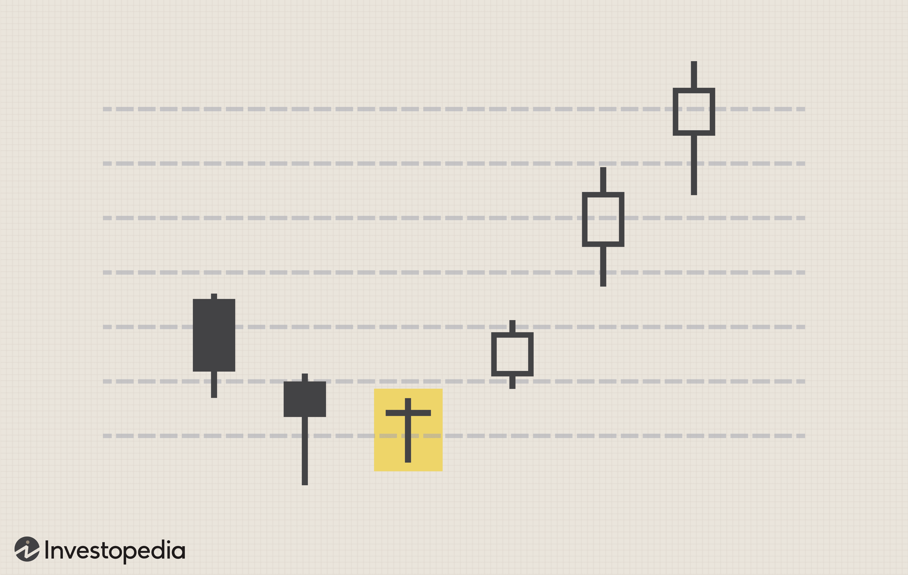

Day trading is an increasingly popular and dynamic method for individuals to engage with the financial markets. It involves buying and selling various financial instruments, such as stocks, forex, commodities, or cryptocurrencies, all within the same trading day. The primary objective of day trading is to take advantage of short-term price fluctuations in these markets, which can offer potentially lucrative opportunities for profit.

This article serves as a beginner's guide to the essential rules and guidelines of day trading, focusing on aspects that newcomers should consider as they start. An important component of modern day trading is algorithmic trading, which utilizes computer programs to execute trades based on specific strategic parameters. This approach can enhance trading efficiency and reduce the emotional influences that can affect decision-making.



Readers will gain insights into essential terminologies and foundational strategies, offering a solid framework to understand the intricacies of day trading. Additionally, the article will explore the crucial role technology plays in facilitating trading activities, detailing how traders can leverage various tools to improve their performance. Whether you are entirely new to the concept or looking to refine your approach, this comprehensive guide aims to equip you with the knowledge and instruments necessary to embark on or enhance your day trading journey.

## Table of Contents

## Understanding Day Trading

Day trading involves executing multiple buy and sell orders within a single day, capitalizing on the natural price fluctuations that occur in financial markets on an intraday basis. The primary objective is to seize incremental gains from these short-term price movements, rather than holding positions overnight which could introduce additional risks due to potential after-hours market events or news.

Success in day trading demands a comprehensive understanding of market trends and an analytical approach to price movements. Key to this process is the application of predefined strategies that guide traders in making time-sensitive decisions. Traders often rely on technical analysis to interpret market indicators and chart patterns, which allows them to identify potential entry and exit points.

In day trading, the ability to act swiftly is crucial. This is necessitated by the volatile nature of intraday markets, where prices can change dramatically in response to economic reports, financial announcements, or geopolitical developments. Consequently, traders must engage in active monitoring of relevant news and technical trends. Utilizing various analytical tools and staying alert to breaking news can provide traders with the necessary insights to navigate these rapid shifts effectively.

To illustrate with a simple strategy, consider a moving average crossover system. A trader might use short-term (e.g., 10-period) and long-term (e.g., 50-period) moving averages to identify trends. When the short-term moving average crosses above the long-term moving average, it might signal a buying opportunity, while the reverse could suggest a selling opportunity. This type of strategy helps traders react quickly by offering a systematic approach to decision-making.

In summary, [day trading](/wiki/day-trading-spy) hinges on the trader's proficiency in interpreting market conditions swiftly and executing trades based on solid, well-researched strategies. Staying informed and maintaining the agility to respond to volatile market environments are both essential skills for achieving success in this dynamic form of trading.

## Key Day Trading Rules

Day trading requires adherence to certain fundamental rules and principles to enhance the likelihood of success and profitability. One of the primary pillars of successful day trading is staying informed. Having a thorough understanding of the stocks and sectors you trade in is crucial. This involves keeping up-to-date with related news and market events that may have an impact on stock prices. Economic releases, policy changes, earnings reports, and industry news can all influence market dynamics, and being aware of these factors helps traders anticipate and react to price movements effectively.

Realistic expectations concerning profits are equally important. Day trading is not a shortcut to wealth but rather a method to achieve steady returns over time. Traders should aim to secure small, consistent profits that accumulate and compound. This disciplined approach helps in managing risk and avoiding the pitfalls of greed, which can lead to taking unnecessary risks and potentially incurring significant losses.

Moreover, controlling emotions is essential in day trading. Emotional decision-making can introduce bias and lead to impulsive trades that deviate from a well-thought-out strategy. Maintaining discipline involves sticking to predefined plans and rules without succumbing to momentary emotional impulses like fear or euphoria. This can be particularly challenging given the fast-paced nature of day trading, but it is crucial for long-term success. Developing a mindset that treats trading as a business, and not as gambling, fosters the discipline necessary to stay objective and make rational trading decisions.

## Importance of Algorithmic Trading

Algorithmic trading is a transformative innovation in the financial markets that utilizes computer programs to execute trades more efficiently and systematically than traditional methods. By leveraging algorithms, traders can quickly identify and capitalize on market opportunities without the delay or emotional biases that can hinder human decision-making.

At its core, [algorithmic trading](/wiki/algorithmic-trading) involves developing strategic inputs that dictate the buying and selling of financial instruments. These inputs are often based on mathematical models, statistical analysis, and historical data patterns. Algorithms can automatically execute trades when specific conditions are met, enabling precise and swift trading decisions.

A significant advantage of algorithmic trading is its ability to eliminate the emotional aspects of trading. Traders often fall prey to cognitive biases and emotional reactions, such as fear and greed, which can lead to irrational decision-making. Algorithms, however, operate on pre-set rules and logic, enabling more consistent and disciplined execution of trades.

Furthermore, algorithmic trading significantly enhances the speed and efficiency of trade execution. In highly competitive markets, being able to execute orders in milliseconds can result in a substantial advantage. Algorithms can quickly process vast amounts of data to determine optimal entry and [exit](/wiki/exit-strategy) points, acting faster than any human trader could.

For beginners, understanding the basic algorithms is crucial for making informed trading decisions. Simple algorithms might involve moving average crossovers, where trades are triggered when a short-term moving average crosses over a long-term moving average. More complex algorithms incorporate elements of [machine learning](/wiki/machine-learning) to adapt strategies based on real-time data.

Below is a simple example of a moving average crossover algorithm written in Python using the NumPy and Pandas libraries:

```python
import pandas as pd

# Fake data for demonstration purposes
data = {'Price': [110, 120, 115, 125, 130, 128, 140, 135, 145, 150]}
df = pd.DataFrame(data)

# Calculate short and long-term moving averages
short_window = 3
long_window = 5

df['Short_MA'] = df['Price'].rolling(window=short_window, min_periods=1).mean()
df['Long_MA'] = df['Price'].rolling(window=long_window, min_periods=1).mean()

# Signal flag: 1 for buy, -1 for sell
df['Signal'] = 0
df.loc[df['Short_MA'] > df['Long_MA'], 'Signal'] = 1
df.loc[df['Short_MA'] < df['Long_MA'], 'Signal'] = -1

print(df)
```

This code calculates the short-term and long-term moving averages and generates buy or sell signals based on their crossover. While simple, this strategy serves as a foundation upon which more sophisticated models can be built.

In conclusion, algorithmic trading offers a powerful means to streamline the trading process, providing speed, reduced emotional bias, and access to complex data analysis. For beginners in day trading, gaining a foundational understanding of algorithmic strategies presents the potential for better-informed and more successful trading practices.

## Financial Markets for Day Trading

Day trading is a strategy that can be applied across multiple financial markets, each offering unique characteristics and opportunities. The primary markets for day trading include stocks, foreign exchange ([forex](/wiki/forex-system)), commodities, and cryptocurrencies. Understanding the [liquidity](/wiki/liquidity-risk-premium) and [volatility](/wiki/volatility-trading-strategies) of these markets is crucial for traders to make informed decisions about where to focus their efforts.

### Stocks
The stock market is one of the most popular venues for day trading. It encompasses exchanges like the New York Stock Exchange (NYSE) and the Nasdaq. Stocks offer high liquidity, especially in large-cap companies, allowing traders to enter and exit positions quickly. The volatility of stocks can vary significantly; tech stocks, for example, may experience large price swings, providing potential trading opportunities. Successful stock day trading often relies on understanding company-specific news, market trends, and overall economic conditions.

### Forex
The foreign exchange market (forex) is the world's largest and most liquid market, with trillions of dollars exchanged daily. Major currency pairs like EUR/USD, GBP/USD, and USD/JPY are popular among day traders due to their liquidity and tighter spreads. Forex trading is influenced by geopolitical events, economic indicators, and central bank policies. Traders often use leverage to increase potential returns, which also amplifies risk.

### Commodities
Day trading commodities involves trading raw materials like gold, oil, and agricultural products. Commodities can be volatile, driven by supply and demand dynamics, geopolitical tensions, and weather conditions. Markets such as the Chicago Mercantile Exchange (CME) facilitate commodity trading. Commodity day traders must stay informed about global economic indicators, production reports, and inventory data to capitalize on short-term price movements.

### Cryptocurrencies
Cryptocurrencies represent a relatively new and highly volatile market for day trading. Assets like Bitcoin, Ethereum, and other altcoins can experience significant price fluctuations within short periods. The [cryptocurrency](/wiki/cryptocurrency) market operates 24/7, providing continuous trading opportunities. However, the lack of regulation and susceptibility to sudden market shifts pose additional risks. Traders in this market often rely on technical analysis and digital asset news to guide their strategies.

### Liquidity and Volatility
Liquidity refers to how quickly an asset can be bought or sold without causing a significant price change. High liquidity ensures that traders can execute large trades with minimal impact on the asset’s price. Volatility, on the other hand, measures how much the price of an asset fluctuates over a given period and is a critical [factor](/wiki/factor-investing) for day traders looking to profit from rapid price changes. 

Each market presents unique challenges and opportunities shaped by its liquidity and volatility profiles. Successful day trading often requires a strategic focus on markets that match a trader’s risk appetite, expertise, and access to reliable information sources.

## Technical and Fundamental Analysis

Technical analysis and [fundamental analysis](/wiki/fundamental-analysis) are two essential methodologies employed by day traders to assess potential investment opportunities and forecast market movements. 

Technical analysis focuses on evaluating securities by analyzing statistical trends gathered from trading activity, such as price movement and [volume](/wiki/volume-trading-strategy). This approach involves the use of charts and technical indicators, which help traders identify patterns and potential signals for buying or selling. Common technical indicators include moving averages, relative strength index (RSI), and Bollinger Bands. For instance, moving averages can smooth out price data, creating a single flowing line that makes it easier to identify the direction of a trend. A simple python example to calculate a 10-period moving average for closing prices might look like this:

```python
import pandas as pd

# Example list of closing prices
closing_prices = [22.15, 23.25, 24.00, 24.75, 25.63, 25.20, 24.70, 25.10, 25.90, 26.20]

# Convert list to pandas Series
prices_series = pd.Series(closing_prices)

# Calculate the 10-period moving average
moving_average = prices_series.rolling(window=10).mean()

print(moving_average)
```

Fundamental analysis, by contrast, investigates the intrinsic value of a security, examining economic indicators, earnings reports, revenue growth, profit margins, and industry-specific developments. It endeavors to determine whether a stock is undervalued or overvalued by the market. A fundamental analyst might examine a company's balance sheets, income statements, and cash flow statements to make investment decisions.

Both forms of analysis are indispensable in constructing a well-rounded trading strategy. While technical analysis helps traders understand the market psychology and forecast future price movements based on past data, fundamental analysis provides insights into the economic forces that affect a stock's value. By integrating both strategies, traders can develop comprehensive frameworks that consider both the technical tendencies of the market and the fundamental factors affecting individual securities.

Day traders often employ both technical and fundamental analysis to minimize risks and maximize potential gains. The synthesis of these analyses can aid in the formulation of more robust strategies, which take into account not only historical price data but also broader economic variables. As such, mastering both technical and fundamental analysis plays a crucial role in the repertoire of effective day trading practices.

## Risk Management Strategies

Managing risk effectively is essential for successful day trading. Traders can minimize potential losses and ensure consistent profitability by employing strategic approaches. One fundamental technique is using stop-loss levels, which involves setting predetermined exit points for trades that are not performing as expected. This strategy helps in curbing losses by automatically closing a position when the price reaches a certain level, thereby preventing emotional decision-making during volatile market conditions.

Leverage is another crucial aspect of risk management that traders must handle with care. Leverage allows traders to control a large position size with a relatively small amount of capital. While it amplifies potential gains, it also increases the risk of significant losses. Therefore, understanding the leverage ratio and its implications is vital. Traders should use leverage judiciously, aligning it with their risk tolerance and ensuring they have adequate capital to cover potential losses.

A gradual approach to capital investment can further enhance risk management for beginners in day trading. Starting with a smaller capital base allows traders to learn and adapt to market dynamics without risking substantial amounts of money. As traders gain experience and confidence in their trading strategies, they can incrementally increase their capital allocation.

For illustrative purposes, here is a simple Python code that demonstrates how to set a stop-loss level in a trading strategy:

```python
def calculate_stop_loss(entry_price, stop_loss_percent):
    """Calculate the stop-loss price based on entry price and stop-loss percentage."""
    stop_loss_price = entry_price * (1 - stop_loss_percent / 100)
    return stop_loss_price

# Example usage
entry_price = 100  # Price at which the trade is entered
stop_loss_percent = 3  # Maximum acceptable loss percentage
stop_loss_price = calculate_stop_loss(entry_price, stop_loss_percent)

print(f"Stop-loss price: ${stop_loss_price:.2f}")
```

This illustrative example calculates a stop-loss price to limit losses to a specific percentage of the initial investment. Such practical tools can help traders effectively manage risk and foster disciplined trading behavior.

In summary, thorough risk management in day trading encompasses setting stop-loss levels, carefully managing leverage, and incrementally increasing capital investment. These strategies collectively contribute to minimizing potential losses while maximizing opportunities for gains in the increasingly volatile financial markets.

## Tools and Resources for Beginners

A variety of trading platforms offer essential tools for executing trades efficiently. These platforms typically provide features such as market orders, limit orders, and access to live market data, which are crucial for making informed decisions swiftly. Beginners should familiarize themselves with these tools and understand the difference between market orders, which are executed immediately at current prices, and limit orders, which are set to execute at predetermined price points.

Educational resources play a pivotal role in equipping beginners with the necessary skills and knowledge for successful day trading. Online courses and webinars often cover fundamental and technical analysis, trading strategies, and real-time market dynamics. Simulators are particularly beneficial as they allow users to practice trading without risking actual capital, providing a risk-free environment to hone their skills and test strategies.

Being part of trading communities can be equally beneficial. These communities, often found in forums, social media groups, or dedicated trading networks, offer invaluable opportunities for knowledge sharing and collaboration. Beginners can learn from the experiences of seasoned traders, discuss market trends, and get feedback on trading strategies. Engaging with these communities fosters a collaborative environment, which can significantly enhance learning and provide moral support throughout the trading journey.

## Conclusion

Day trading offers the possibility of profitable outcomes but requires dedication to thoroughly learn the rules and strategies involved. It is not merely about making quick profits; it demands a serious commitment to understanding the financial markets and the dynamics of trading. Continuous learning forms the backbone of a successful trading career. The markets are ever-changing, and keeping up with new trends, technological advancements, and regulatory changes is crucial. 

Disciplined execution of trading strategies is equally important. This includes following predefined trading plans, setting appropriate stop-loss levels, and avoiding impulsive decisions driven by short-term market fluctuations. Adhering to these principles can significantly enhance the likelihood of achieving consistent profits.

Effective risk management is vital in day trading. It involves the careful allocation of capital and the implementation of strategies to protect against substantial losses. Beginners should start with a small capital investment, gradually increasing their stake as they gain confidence and competence in their trading abilities. Employing financial tools, such as stop-loss and take-profit orders, is essential for mitigating risk.

As you begin your day trading journey, remember that knowledge, practice, and adaptability are your keys to success. Knowledge empowers you to make informed decisions, practice hones your skills, and adaptability helps you navigate through different market conditions. Integrating these elements into your trading routine will help transform your trading ambitions into successful outcomes.

## References & Further Reading

[1]: Bergstra, J., Bardenet, R., Bengio, Y., & Kégl, B. (2011). ["Algorithms for Hyper-Parameter Optimization."](https://papers.nips.cc/paper/4443-algorithms-for-hyper-parameter-optimization) Advances in Neural Information Processing Systems 24.

[2]: ["Advances in Financial Machine Learning"](https://www.amazon.com/Advances-Financial-Machine-Learning-Marcos/dp/1119482089) by Marcos Lopez de Prado

[3]: ["Evidence-Based Technical Analysis: Applying the Scientific Method and Statistical Inference to Trading Signals"](https://www.amazon.com/Evidence-Based-Technical-Analysis-Scientific-Statistical/dp/0470008741) by David Aronson

[4]: ["Machine Learning for Algorithmic Trading"](https://github.com/stefan-jansen/machine-learning-for-trading) by Stefan Jansen

[5]: ["Quantitative Trading: How to Build Your Own Algorithmic Trading Business"](https://www.amazon.com/Quantitative-Trading-Build-Algorithmic-Business/dp/1119800064) by Ernest P. Chan