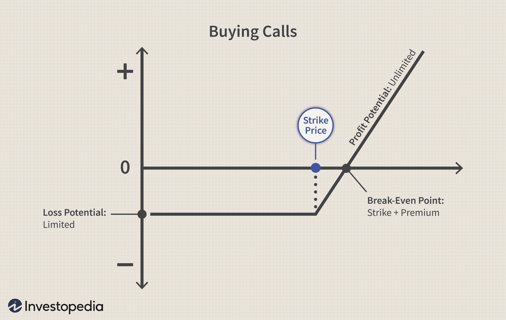

Day trading options strategies in algorithmic trading represent a sophisticated approach that combines the dynamic nature of options trading with the precision afforded by algorithmic systems. This integration facilitates an approach that can potentially maximize day trading results through rapid execution and data-driven decisions.

In this article, we will explore foundational principles of algorithmic trading paired with specific strategies tailored for day trading. The use of automation provides traders with enhanced capabilities, including speed and accuracy, which are pivotal in the ever-competitive financial markets. As these markets evolve, they demand efficiency and a level of precision that manual trading can seldom achieve. Algorithmic trading inherently possesses these traits, and when merged with options trading, provides a viable, robust framework for making timely, informed decisions.



Options trading is notably volatile and dynamic, which complements the implementation of algorithms. By integrating algorithms, traders significantly bolster their ability to manage these trades without the influence of emotion. This incorporation allows for the scanning of potential market conditions, execution of trades, and effective risk management, ultimately minimizing manual errors and improving overall performance.

The scope of this article covers the key strategies, the myriad benefits, and the necessary tools for successfully implementing day trading strategies within an algorithmic framework. Emphasis is placed on momentum trading, mean reversion, scalping, and arbitrage opportunities—a comprehensive toolkit designed to maximize potential profits while minimizing risk exposure.

Whether you are a seasoned trader or venturing into trading, understanding these strategies will equip you with essential knowledge to navigate the challenges and opportunities present in today's complex financial markets. The insights provided aim to refine your trading approach or serve as a guide if you are entering the algorithmic day trading space for the first time.

## Table of Contents

## Understanding Day Trading Options in Algo Trading

Day trading involves executing options transactions within a single trading day, capitalizing on short-lived market movements. This requires traders to act with remarkable speed and precision. Algorithmic trading, known as algo trading, employs computer algorithms to automate trading strategies, facilitating rapid trade execution—a critical component in day trading.

Using algorithms, traders can manage numerous trades simultaneously, which is essential for exploiting market inefficiencies that occur too quickly for manual trades. These algorithms detect fluctuations and execute trades rapidly based on predefined criteria. This approach allows for more consistent and objective trading decisions by eliminating emotional biases that can plague manual trading.

Options trading is particularly advantageous when combined with algorithmic methods due to its inherent leverage and complex risk management aspects. The leverage provided by options—a feature allowing control over a larger position with a relatively small capital investment—can amplify both gains and losses, which underscores the importance of precise execution and advanced risk management strategies. Algorithms are capable of processing vast quantities of data swiftly, making choices based on statistical probabilities and predefined rulesets.

Traders can tailor these algorithms to identify specific market conditions or patterns. For example, a trader can program an algorithm to buy a call option when the market price of the underlying asset crosses above its moving average, and sell when it falls below. This kind of rule-based trading can minimize emotional decisions, which are often detrimental in fast-paced environments.

Moreover, algorithms can manage risk by implementing stop-loss orders and dynamically adjusting the trading strategy as market conditions change. They can scan multiple markets and asset classes concurrently, executing trades in fractions of a second, a feat impossible for human traders.

In conclusion, the integration of [algorithmic trading](/wiki/algorithmic-trading) into [day trading](/wiki/day-trading-spy) strategies enhances a trader’s ability to effectively handle the complexities and speed required for options trading. By leveraging algorithms, traders can systematically exploit short-lived market inefficiencies, optimize risk management, and avoid emotional decision-making, thus potentially maximizing their day trading results.

## Core Strategies for Day Trading Options in Algorithmic Trading

Day trading options using algorithmic trading systems employs several sophisticated strategies designed to optimize profits by leveraging the computational power of algorithms. Here are some of the core strategies involved:

1. **Momentum Trading**: In options trading, momentum strategies aim to capitalize on the continuation of existing trends. Algorithms can systematically process large datasets to identify momentum shifts in option prices. This allows traders to execute trades, such as buying call options in an upward trending market or purchasing put options during a downward trend. The advantage lies in the ability of algorithms to perform real-time analysis and execution, fostering timely decision-making that manual observation might miss.

2. **Mean Reversion**: This strategy is based on the concept that asset prices tend to revert to their historical mean over time. In the context of options, traders utilize algorithms to detect options that are currently mispriced relative to their historical averages. The strategy involves entering into trades expecting the prices to return to the mean. Algorithms can enhance the accuracy of this strategy by crunching historical data and identifying price deviations from the mean.

3. **Scalping**: Scalping focuses on executing a high volume of trades, aiming for small profit margins per trade. This strategy demands precise timing and swift execution, as traders exploit tiny price discrepancies in the market. Utilizing algorithms for scalping allows for faster execution than manual trading, enabling traders to take advantage of fleeting opportunities. High-frequency trading algorithms, typically coded in languages like Python, are crucial in implementing effective scalping strategies.

   ```python
   # Example of a simple scalping strategy algorithm in Python
   def scalp_strategy(data):
       threshold = 0.01  # Price movement threshold
       for i in range(1, len(data)):
           if abs(data[i] - data[i-1]) > threshold:
               execute_trade()

   def execute_trade():
       # Logic for executing trades
       print("Trade Executed")

   price_data = [100, 100.02, 100.03, 99.99, 100.05]
   scalp_strategy(price_data)
   ```

4. **Arbitrage Opportunities**: Arbitrage strategies exploit pricing inefficiencies between correlated markets. When different options markets or the options and their underlying assets have price inconsistencies, algorithms can identify and act on these opportunities quicker than manual traders. This typically involves simultaneously buying and selling related assets to lock in a risk-free profit.

Each of these strategies utilizes algorithmic systems to enhance the speed and accuracy of trading operations. By processing vast amounts of data in milliseconds, these algorithms can detect patterns and opportunities that are often invisible to human traders, optimizing the trading process to potentially maximize profits while minimizing risk. Through these strategic implementations, algorithmic trading systems provide a significant edge in the fast-paced environment of [day trading options](/wiki/day-trading-options).

## Backtesting and Optimization in Algorithmic Trading

A critical component of developing effective day trading options strategies is [backtesting](/wiki/backtesting). This process involves applying the trading algorithm to historical data to evaluate its performance and refine the strategy prior to implementing it in real markets. By backtesting, traders can assess the viability of their strategies, gaining insights into how these strategies might have performed in the past under similar market conditions.

The backtesting process involves comparing the simulated results against historical data to determine the reliability and effectiveness of the strategy. It provides valuable feedback on potential profits and losses, helping traders make informed decisions and avoid strategies that work only in theory but fail in practice. A well-structured backtesting procedure includes the selection of appropriate data sets, cleaning the data to ensure accuracy, and running simulations over a significant time span to ensure that results are not biased by short-term anomalies.

Optimization plays a complementary role in algorithmic trading. It ensures that an algorithm functions effectively across various market conditions. Optimization involves fine-tuning the parameters within the trading strategy to maximize performance metrics such as profitability, drawdown levels, and win-loss ratios. For example, traders might adjust parameters like moving average periods or [volatility](/wiki/volatility-trading-strategies) thresholds. However, it is crucial to balance optimization with caution. Over-optimization, or "curve fitting," can cause a strategy to perform exceptionally well on historical data but fail in live market environments.

To avoid overfitting, traders can employ techniques like out-of-sample testing and walk-forward analysis. Out-of-sample testing uses a portion of historical data not included in the initial backtest to verify the strategy's robustness. Walk-forward analysis, on the other hand, involves dividing historical data into multiple sub-periods and sequentially optimizing and testing the strategy on each period. By doing so, traders ensure the strategy's adaptability and resilience to changing market dynamics.

Pseudo code for a simple backtesting framework in Python might look like this:

```python
import pandas as pd

# Load historical data
data = pd.read_csv('historical_data.csv')
data['Signal'] = 0

# Define the trading strategy (e.g., simple moving average crossover)
short_window = 40
long_window = 100

data['Short_MA'] = data['Close'].rolling(window=short_window, min_periods=1).mean()
data['Long_MA'] = data['Close'].rolling(window=long_window, min_periods=1).mean()

# Generate trading signals
data['Signal'][short_window:] = \
    np.where(data['Short_MA'][short_window:] > data['Long_MA'][short_window:], 1, 0)

# Calculate daily returns
data['Daily_Returns'] = data['Close'].pct_change()

# Apply strategy to daily returns
data['Strategy_Returns'] = data['Signal'].shift(1) * data['Daily_Returns']

# Calculate cumulative returns
cumulative_strategy_returns = (1 + data['Strategy_Returns']).cumprod()

print(cumulative_strategy_returns)
```

This foundational framework can serve as a basis for more complex strategies that involve multifaceted indicators and advanced [machine learning](/wiki/machine-learning) models. Ensuring thorough backtesting and prudent optimization is essential to the development of robust algorithmic trading strategies, aiding traders in navigating the complex and fast-moving financial markets successfully.

## Tools and Platforms for Algorithmic Day Trading of Options

Selecting the right tools and platforms is crucial for the successful implementation of day trading strategies in an algorithmic framework. The choice of platform can significantly influence the efficiency and success of a trader's algorithmic operations by providing essential features such as algorithm development capabilities, data access, and live trading support.

TradeStation is a well-regarded platform known for its comprehensive suite of tools that include advanced charting, strategy testing, and direct market access. It supports EasyLanguage, a proprietary scripting language that allows traders to create custom algorithms tailored to their specific trading strategies. Although feature-rich, TradeStation can be relatively expensive, and while it offers extensive data access, users may encounter additional costs for historical data.

[Interactive Brokers](/wiki/interactive-brokers-api) (IB) offers a robust platform with a competitive commission structure that is attractive to high-volume traders. It provides an extensive array of tools for algorithmic trading, including its Trader Workstation, API access, and integration with third-party software. Interactive Brokers supports multiple programming languages, including Python, which facilitates algorithm customization and development. The platform is favored for its extensive market coverage and cost-effective data services, but it can present a steep learning curve for new traders.

NinjaTrader is another popular choice that emphasizes flexibility and comprehensive market analysis tools. With its built-in C# based scripting environment, NinjaScript, traders can develop custom trading strategies and indicators. NinjaTrader is particularly appealing due to its lifetime license option, reducing long-term costs for traders who plan on using the platform extensively. Though the platform includes a free version, some features require a paid license, which may deter some users.

Integrating coding languages like Python and R with these platforms allows traders to develop intricate algorithms and backtesting procedures tailored to their trading needs. Python, in particular, is widely used due to its simplicity and the vast ecosystem of financial libraries like Pandas and NumPy, which facilitate data manipulation and analysis. For example, a basic algorithm to calculate the moving average of a stock's price in Python may look like:

```python
import pandas as pd

# Assume 'data' is a DataFrame with a 'Close' column representing the stock's close prices.
def moving_average(data, window_size):
    return data['Close'].rolling(window=window_size).mean()

# Usage example
stock_data = pd.read_csv('stock_data.csv')
ma_20 = moving_average(stock_data, 20)
```

APIs are also indispensable in the context of algorithmic day trading. They enable real-time data access and streamline the execution process, allowing algorithms to react to market conditions promptly. By accessing current market information through APIs, traders can ensure their strategies are based on the latest price movements, thus optimizing their trading decisions.

In conclusion, choosing the right tools and platforms for algorithmic day trading of options involves balancing functionality, cost, and ease of use, with considerations for the programming languages supported and the availability of APIs. Each platform has unique offerings tailored to different types of traders, making the decision highly dependent on individual trading goals and preferences.

## Risk Management in Algorithmic Day Trading

Risk management is a critical aspect of algorithmic day trading, particularly in options trading, where rapid market fluctuations can lead to considerable losses. Effective risk management involves deploying sophisticated strategies using algorithmic systems that are designed to mitigate these risks while maximizing return consistency.

To begin with, algorithmic systems facilitate the implementation of automatic stop-loss orders. A stop-loss order automatically sells an option when its price falls to a predetermined level, thus preventing further losses. For instance, let's consider a Python snippet that illustrates setting an automatic stop-loss in a trading algorithm:

```python
def check_stop_loss(current_price, purchase_price, stop_loss_percentage):
    stop_loss_price = purchase_price * (1 - stop_loss_percentage / 100)
    if current_price <= stop_loss_price:
        return True  # Trigger stop-loss
    return False
```

Moreover, these systems allow traders to diversify their exposure. Diversification can be achieved by spreading investments across a variety of options or strategies, reducing the impact of adverse market events on the overall portfolio. For example, one could employ a multi-strategy approach combining [momentum](/wiki/momentum) trading, mean reversion, and [arbitrage](/wiki/arbitrage) to balance out risks.

Dynamic position sizing is another advanced strategy facilitated by algorithmic trading. By calculating position sizes based on current market volatility and trader risk tolerance, algorithms can adjust the scale of trades dynamically to optimize risk exposure. A formula such as Kelly Criterion can help determine the optimal position size:

$$
\text{Optimal\_fraction} = \frac{bp - q}{b}
$$

Where:
- $b$ is the odds received (in this case, winnings received per unit bet)
- $p$ is the probability of winning
- $q = 1 - p$

Maintaining strict discipline and continuous monitoring of trading algorithms is crucial. This ensures that the trading strategy adapts to the changing market conditions. Constant monitoring is accomplished through real-time data analysis, which helps to make quick adjustments when necessary. 

The ultimate goal of careful risk management is to safeguard capital while enhancing the consistency of returns. By incorporating these strategies, traders can make their algorithmic day trading systems more robust against market volatility. Enhanced risk management not only protects against downside risks but also provides a solid foundation to seize profitable opportunities as they arise.

Thus, integrating these sophisticated risk management techniques within an algorithmic framework affords traders the agility and precision needed to thrive in the volatile environment of options trading.

## Conclusion

Integrating options trading strategies with algorithmic trading presents an advanced approach suitable for navigating today's volatile and competitive markets. Algorithms, by their intrinsic design, execute trades with speed and precision, mitigating the emotional factors that can hinder manual trading. This capability allows traders to capitalize on fleeting opportunities that are often missed by traditional methods.

The strategic use of momentum, mean reversion, [scalping](/wiki/gamma-scalping), and arbitrage within an algorithmic framework highlights the potential for generating substantial profits. These strategies utilize the computational power of algorithms to efficiently identify market patterns and discrepancies, thereby optimizing trade execution. However, successful deployment of these strategies necessitates thorough planning and rigorous risk management practices. Without these, the swift market conditions can lead to undesired losses.

As financial markets continue to evolve, staying informed and adaptable is crucial. Algorithmic trading offers immense potential for those committed to mastering its intricacies, providing a competitive edge in trading operations. By investing time and resources into understanding and applying these strategies, traders can harness the full capabilities of algorithmic systems.

Ultimately, the success of incorporating day trading strategies within an algorithmic context relies on harmonizing robust algorithms with sound trading principles. This synergy creates a resilient trading approach capable of effectively navigating the complexities and nuances of modern financial markets, ensuring sustainable profitability and strategic growth.

## References & Further Reading

[1]: Bergstra, J., Bardenet, R., Bengio, Y., & Kégl, B. (2011). ["Algorithms for Hyper-Parameter Optimization."](https://papers.nips.cc/paper/4443-algorithms-for-hyper-parameter-optimization) Advances in Neural Information Processing Systems 24.

[2]: ["Advances in Financial Machine Learning"](https://www.amazon.com/Advances-Financial-Machine-Learning-Marcos/dp/1119482089) by Marcos Lopez de Prado

[3]: ["Evidence-Based Technical Analysis: Applying the Scientific Method and Statistical Inference to Trading Signals"](https://www.amazon.com/Evidence-Based-Technical-Analysis-Scientific-Statistical/dp/0470008741) by David Aronson

[4]: ["Machine Learning for Algorithmic Trading"](https://github.com/stefan-jansen/machine-learning-for-trading) by Stefan Jansen

[5]: ["Quantitative Trading: How to Build Your Own Algorithmic Trading Business"](https://books.google.com/books/about/Quantitative_Trading.html?id=j70yEAAAQBAJ) by Ernest P. Chan