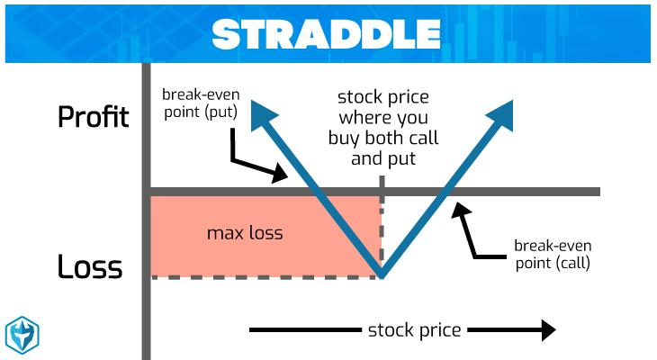

## Table of Contents

## What is day trading and how does it differ from other trading styles?

Day trading is when people buy and sell stocks or other financial things within the same day. They do this to try to make money from small changes in prices. Day traders usually don't keep their investments overnight because they want to avoid risks that can happen when markets are closed.

Day trading is different from other styles like swing trading and long-term investing. Swing trading is when people hold onto their investments for a few days or weeks, trying to make money from bigger price changes. Long-term investing is when people buy stocks and keep them for months or years, hoping the value will grow over time. Day trading can be more exciting and risky because it happens so quickly, while swing trading and long-term investing are usually less stressful and might need less watching every day.

## What are options and how do they work in the context of day trading?

Options are financial tools that give you the right, but not the obligation, to buy or sell an asset at a certain price before a specific date. In the context of day trading, options are popular because they can help traders make money from small price movements in stocks or other assets. When you buy an option, you're betting on whether the price of the asset will go up or down. If you think the price will go up, you buy a "call" option. If you think it will go down, you buy a "put" option.

In day trading, options can be very useful because they let traders use less money to control a bigger position in the market. This is called leverage. For example, instead of buying 100 shares of a stock, a trader can buy an option that controls those 100 shares for a much lower cost. However, options also come with risks. If the price of the asset doesn't move the way the trader expected, they could lose all the money they spent on the option. Because day trading with options happens so quickly, traders need to be very careful and watch the market closely to make the right decisions.

## What are the basic strategies for day trading options that beginners should know?

One basic strategy for day trading options that beginners should know is the "long call" strategy. This means you buy a call option because you think the price of the stock will go up quickly. If you're right and the stock price does go up, you can sell the option for more money than you paid for it, making a profit. But if the stock price doesn't go up, you could lose the money you spent on the option. It's important to pick stocks that move a lot during the day and to set a clear plan for when to sell the option, whether you're making money or losing it.

Another strategy is the "long put" strategy. This is when you buy a put option because you think the price of the stock will go down fast. If the stock price drops, you can sell the put option for a higher price than what you paid, making a profit. If the stock price stays the same or goes up, you could lose the money you spent on the option. Like with the long call strategy, it's helpful to choose stocks that have big price swings and to have a clear plan for when to sell the option.

A third strategy is the "credit spread." This is a bit more advanced but still useful for beginners to understand. With a credit spread, you sell one option and buy another option at a different price, both with the same expiration date. This creates a situation where you get money upfront, but your profit is limited, and you could lose money if the stock price moves against you too much. It's important to understand how much risk you're taking and to manage it carefully.

## How can a beginner assess the risks associated with day trading options?

Assessing the risks of day trading options can be tricky, but it's really important for beginners. One big risk is that options can lose all their value if the stock price doesn't move the way you expect. This means you could lose all the money you spent on the option. Another risk is that options use leverage, which means you can control a big position with a small amount of money. While this can help you make more money, it can also make your losses bigger if things go wrong. It's important to understand how much you could lose and to only trade with money you can afford to lose.

To manage these risks, beginners should start by learning as much as they can about options and how they work. It's a good idea to practice with a demo account before using real money. This way, you can get a feel for how options move without risking your money. Also, setting clear rules for when to buy and sell options can help you manage risk. For example, deciding ahead of time how much you're willing to lose on a trade can stop you from making big mistakes. By understanding these risks and taking steps to manage them, beginners can have a better chance of success in day trading options.

## What are the key technical indicators used in day trading options?

When day trading options, traders often use technical indicators to help them make decisions. One common indicator is the Moving Average, which helps traders see the average price of a stock over a certain time. This can show if the stock is trending up or down. Another useful indicator is the Relative Strength Index (RSI), which measures how fast a stock's price is moving and if it might be overbought or oversold. If the RSI is above 70, it might mean the stock is overbought and could go down soon. If it's below 30, it might be oversold and could go up.

Another important indicator is the Bollinger Bands, which show the high and low prices of a stock over time. These bands can help traders see if a stock's price is moving a lot or staying steady. When the price touches the upper band, it might be a good time to sell, and when it touches the lower band, it might be a good time to buy. The MACD (Moving Average Convergence Divergence) is also popular because it shows the relationship between two moving averages of a stock's price. If the MACD line crosses above the signal line, it might be a good time to buy, and if it crosses below, it might be a good time to sell. By using these indicators, day traders can make better decisions about when to buy and sell options.

## How do market conditions affect day trading options strategies?

Market conditions play a big role in how day traders choose their options strategies. When the market is going up a lot, traders might use more "long call" strategies because they think the prices will keep going up. This means they buy options that let them buy a stock at a set price if it goes up. But if the market is going down, traders might switch to "long put" strategies, betting that the prices will keep falling. They buy options that let them sell a stock at a set price if it goes down. The key is to match the strategy to what the market is doing, so traders need to watch the market closely and be ready to change their plans.

Sometimes, the market can be really jumpy, with prices moving a lot in a short time. During these times, traders might use strategies like "credit spreads" to make money from these big moves. A credit spread means selling one option and buying another at a different price, which can help limit how much a trader could lose. But if the market is calm and not moving much, traders might find it harder to make money with options because the prices aren't changing enough. In these cases, they might need to be patient or look for other ways to trade. Understanding how the market is acting helps traders pick the right strategy and adjust to make the best of their trades.

## What advanced options strategies can be used by intermediate traders?

Intermediate traders can use a strategy called "straddles" to make money when they think a stock will move a lot, but they're not sure which way. A straddle means buying both a call option and a put option at the same strike price and expiration date. If the stock price moves a lot in either direction, one of the options will become valuable, and the trader can make money. But if the stock price doesn't move much, the trader could lose the money they spent on both options. This strategy is good for times when big news or events might affect the stock price.

Another strategy is the "iron condor," which is good for when traders think the stock price will stay in a certain range. An iron condor means selling a call option and a put option at different strike prices, and then buying a call option at a higher strike price and a put option at a lower strike price. This creates a range where the trader can make money if the stock price stays within it. If the stock price moves outside this range, the trader could lose money, but the risk is limited because of the options they bought. This strategy can be a bit tricky, but it's a good way for intermediate traders to make money in a calm market.

Lastly, "butterfly spreads" can be used when traders think the stock price will stay close to a certain price. A butterfly spread means buying one call option at a low strike price, selling two call options at a middle strike price, and buying one call option at a high strike price, all with the same expiration date. If the stock price stays near the middle strike price, the trader can make money. But if the stock price moves too far away from this price, the trader could lose money. This strategy can help intermediate traders make money from small price moves while keeping their risk under control.

## How can traders manage their emotions and psychology while day trading options?

Managing emotions and psychology is really important when day trading options. It can be exciting and stressful, and feelings like fear and greed can make traders do things they might regret. One way to handle this is by making a trading plan and sticking to it. This means deciding ahead of time when to buy and sell options, how much money to risk, and what to do if things go wrong. Having a plan can help traders stay calm and make better decisions, even when the market is moving a lot.

Another way to manage emotions is by taking breaks and not letting trading take over your life. It's easy to get caught up in the ups and downs of the market, but stepping away from the screen can help clear your mind. Talking to other traders or joining a trading community can also be helpful. Sharing experiences and learning from others can make you feel less alone and give you new ideas on how to handle tough situations. By keeping a balanced mindset and not letting emotions control your trades, you can become a better day trader.

## What are the tax implications of profits from day trading options?

When you make money from day trading options, you have to pay taxes on those profits. In the United States, the money you make from trading options is usually considered capital gains. If you hold an option for less than a year before selling it, the profit is a short-term capital gain. Short-term capital gains are taxed at the same rate as your regular income, which can be anywhere from 10% to 37% depending on how much money you make overall. So, if you're making a lot of quick trades, you could end up paying a higher tax rate on your profits.

On the other hand, if you hold an option for more than a year before selling it, the profit is a long-term capital gain. Long-term capital gains are taxed at a lower rate, which can be 0%, 15%, or 20%, depending on your income. But since day trading options usually means holding them for less than a year, most of your profits will be short-term gains. It's important to keep good records of all your trades so you can report your gains and losses correctly when you file your taxes. Talking to a tax professional can also help you understand how to handle your taxes and maybe find ways to lower what you owe.

## How can expert traders use options Greeks to refine their trading strategies?

Expert traders can use options Greeks to make their trading strategies better. Options Greeks are tools that help traders understand how an option's price might change. The most important Greeks are Delta, Gamma, Theta, and Vega. Delta tells traders how much an option's price will change if the stock price changes by $1. If a call option has a Delta of 0.5, it means the option's price will go up by $0.50 if the stock price goes up by $1. Gamma shows how Delta changes when the stock price moves. Theta tells traders how much an option's price will drop as time goes by, which is important because options lose value over time. Vega shows how much an option's price will change if the stock's volatility changes. By understanding these Greeks, expert traders can make smarter decisions about which options to buy or sell.

Using options Greeks, expert traders can fine-tune their strategies to match their goals and the market conditions. For example, if a trader wants to make money from a stock that's not moving much, they might look for options with a high Theta, betting that the option will lose value over time. If they think a stock will move a lot, they might choose options with a high Vega to make money from the increased volatility. Traders can also use Delta to hedge their positions, which means they can protect themselves from big losses if the market moves against them. By keeping an eye on all the Greeks, expert traders can adjust their strategies to take advantage of different market situations and manage their risks better.

## What are some common pitfalls and how can they be avoided in day trading options?

One common pitfall in day trading options is not having a clear plan. Without a plan, traders can make decisions based on emotions like fear or greed, which often leads to bad choices. To avoid this, traders should make a trading plan before they start. This plan should include when to buy and sell options, how much money to risk on each trade, and what to do if things go wrong. Sticking to the plan helps traders stay calm and make better decisions, even when the market is moving a lot.

Another big mistake is not understanding the risks of options trading. Options can lose all their value if the stock price doesn't move the way you expect, and using leverage can make losses bigger. To avoid this, traders should learn as much as they can about options and how they work. They should also start with a small amount of money and practice with a demo account before using real money. This way, they can get a feel for how options move without risking too much. By understanding the risks and taking steps to manage them, traders can have a better chance of success in day trading options.

## How can algorithmic trading be integrated into day trading options strategies for experts?

Algorithmic trading can be a big help for experts who day trade options. It means using computer programs to make trades automatically based on rules set by the trader. These rules can be about things like price, time, or technical indicators. For example, an expert trader might use an algorithm to buy a call option when a stock's price goes above its 50-day moving average and sell it when the price goes below the average. This can help the trader make quick decisions without letting emotions get in the way. Plus, algorithms can watch the market all the time and trade even when the trader is not around, which can be a big advantage in the fast-moving world of options trading.

To integrate algorithmic trading into their options strategies, expert traders need to spend time creating and testing their algorithms. They should start by figuring out what they want the algorithm to do, like making money from small price changes or protecting against big losses. Then, they can write the code or use software that lets them set up their trading rules. It's really important to test the algorithm with past data to see how it would have worked before using it with real money. By using algorithmic trading, expert traders can make their strategies better and maybe make more money while managing risks.

## How can risk be managed in algorithmic day trading?

Risk management is a critical aspect of algorithmic day trading, particularly in options trading, where rapid market fluctuations can lead to considerable losses. Effective risk management involves deploying sophisticated strategies using algorithmic systems that are designed to mitigate these risks while maximizing return consistency.

To begin with, algorithmic systems facilitate the implementation of automatic stop-loss orders. A stop-loss order automatically sells an option when its price falls to a predetermined level, thus preventing further losses. For instance, let's consider a Python snippet that illustrates setting an automatic stop-loss in a trading algorithm:

```python
def check_stop_loss(current_price, purchase_price, stop_loss_percentage):
    stop_loss_price = purchase_price * (1 - stop_loss_percentage / 100)
    if current_price <= stop_loss_price:
        return True  # Trigger stop-loss
    return False
```

Moreover, these systems allow traders to diversify their exposure. Diversification can be achieved by spreading investments across a variety of options or strategies, reducing the impact of adverse market events on the overall portfolio. For example, one could employ a multi-strategy approach combining [momentum](/wiki/momentum) trading, mean reversion, and [arbitrage](/wiki/arbitrage) to balance out risks.

Dynamic position sizing is another advanced strategy facilitated by algorithmic trading. By calculating position sizes based on current market volatility and trader risk tolerance, algorithms can adjust the scale of trades dynamically to optimize risk exposure. A formula such as Kelly Criterion can help determine the optimal position size:

$$
\text{Optimal\_fraction} = \frac{bp - q}{b}
$$

Where:
- $b$ is the odds received (in this case, winnings received per unit bet)
- $p$ is the probability of winning
- $q = 1 - p$

Maintaining strict discipline and continuous monitoring of trading algorithms is crucial. This ensures that the trading strategy adapts to the changing market conditions. Constant monitoring is accomplished through real-time data analysis, which helps to make quick adjustments when necessary. 

The ultimate goal of careful risk management is to safeguard capital while enhancing the consistency of returns. By incorporating these strategies, traders can make their algorithmic day trading systems more robust against market volatility. Enhanced risk management not only protects against downside risks but also provides a solid foundation to seize profitable opportunities as they arise.

Thus, integrating these sophisticated risk management techniques within an algorithmic framework affords traders the agility and precision needed to thrive in the volatile environment of options trading.

## References & Further Reading

[1]: Bergstra, J., Bardenet, R., Bengio, Y., & Kégl, B. (2011). ["Algorithms for Hyper-Parameter Optimization."](https://papers.nips.cc/paper/4443-algorithms-for-hyper-parameter-optimization) Advances in Neural Information Processing Systems 24.

[2]: ["Advances in Financial Machine Learning"](https://www.amazon.com/Advances-Financial-Machine-Learning-Marcos/dp/1119482089) by Marcos Lopez de Prado

[3]: ["Evidence-Based Technical Analysis: Applying the Scientific Method and Statistical Inference to Trading Signals"](https://www.amazon.com/Evidence-Based-Technical-Analysis-Scientific-Statistical/dp/0470008741) by David Aronson

[4]: ["Machine Learning for Algorithmic Trading"](https://github.com/stefan-jansen/machine-learning-for-trading) by Stefan Jansen

[5]: ["Quantitative Trading: How to Build Your Own Algorithmic Trading Business"](https://books.google.com/books/about/Quantitative_Trading.html?id=j70yEAAAQBAJ) by Ernest P. Chan