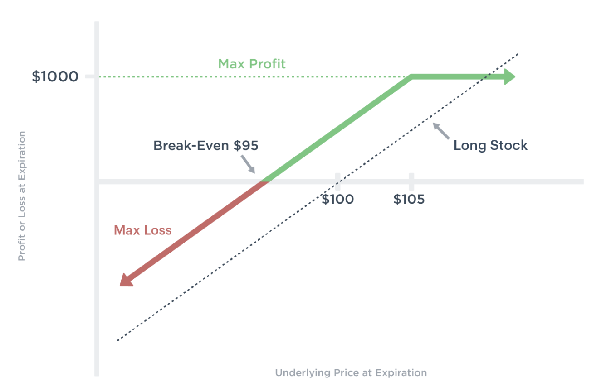
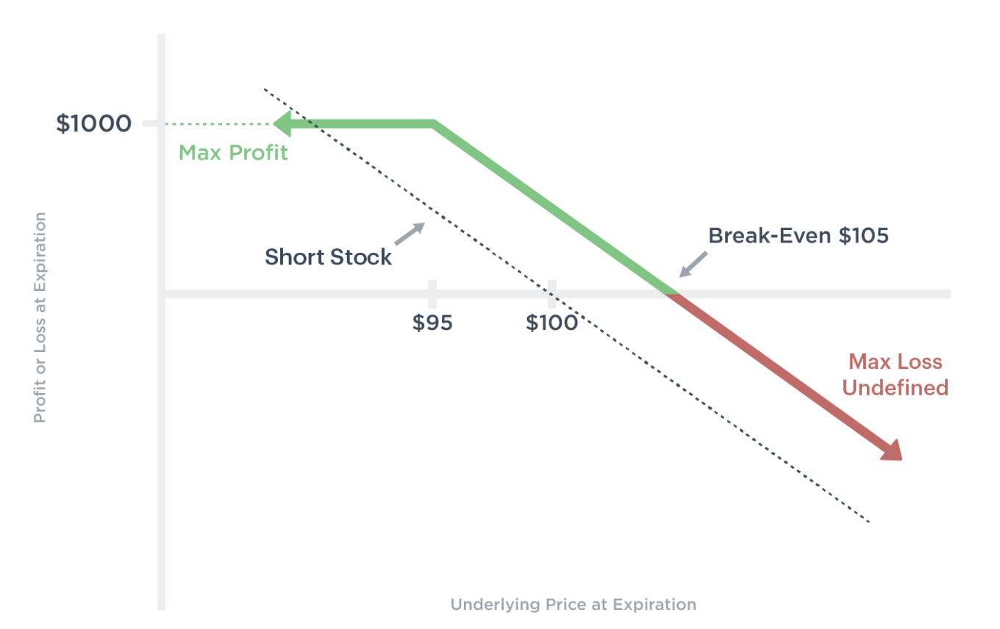
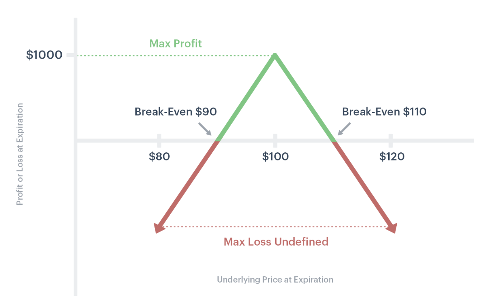
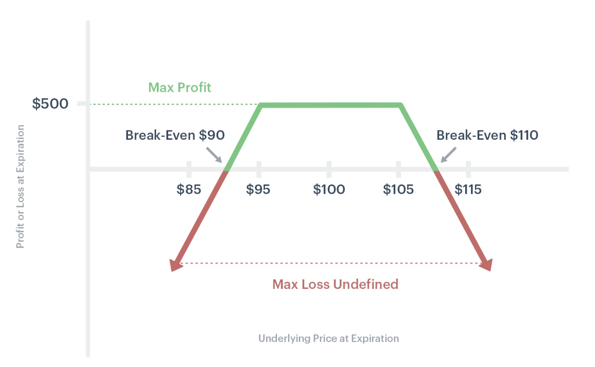
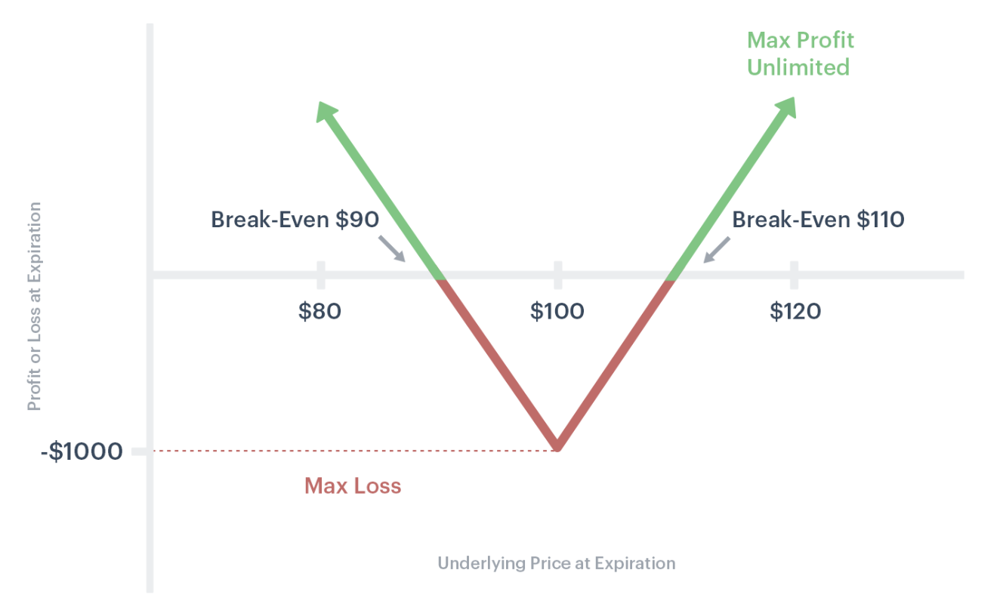
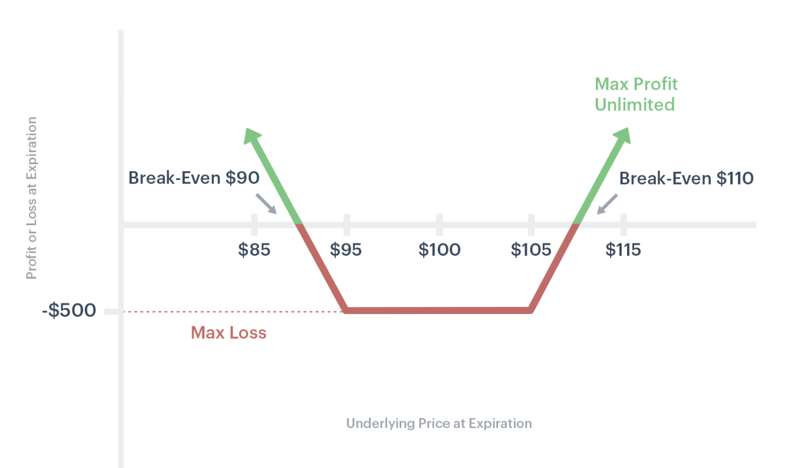
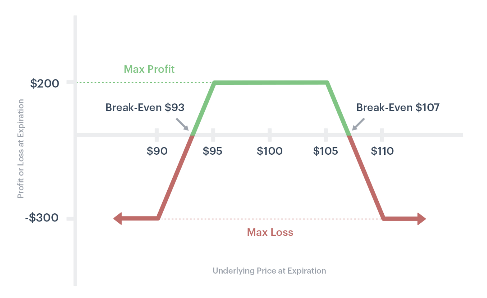
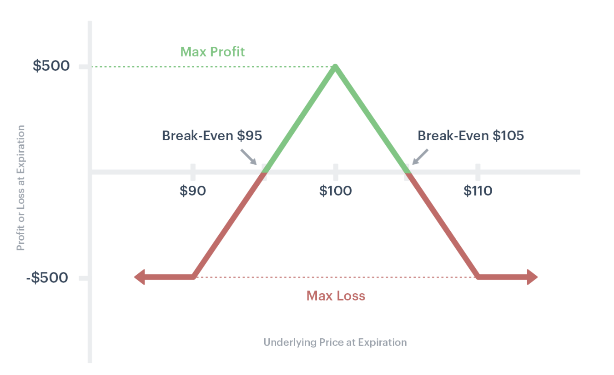
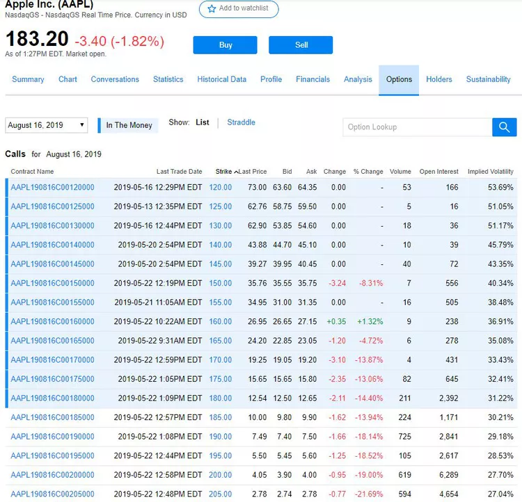

Day trading involves executing trades within a single trading day, ensuring positions are closed before the market shuts. Within this realm, the options market offers unique opportunities. Unlike traditional stocks or bonds, options are financial derivatives, granting traders the right, but not the obligation, to buy or sell an underlying asset at a predetermined price before a specific date. The allure of options stems from their ability to harness significant returns through leverage, even with minimal price movements in the underlying asset.

However, the fast-paced nature of day trading, coupled with the complexities of options, makes it a double-edged sword. While the potential for significant gains exists, so does the risk of substantial losses. This inherent risk underscores the paramount importance of having a robust trading strategy. A well-crafted strategy serves as a trader's roadmap, guiding decision-making, managing risks, and increasing the probability of consistent profitability.

## Table of Contents

## Understanding Options and Day Trading

Options are unique financial instruments that give traders the right, but not the obligation, to buy or sell an underlying asset, typically stocks, at a predetermined price, known as the strike price, within a specific timeframe. There are two main types of options: **calls** (which give the right to buy) and **puts** (which give the right to sell). It's essential to note that while the holder of an option has a right, the seller (or writer) of the option has an obligation. If the option holder exercises their right, the option seller must fulfill their end of the contract[1].

Day trading, in contrast, refers to the practice of buying and selling securities within the same trading day. The goal is to capitalize on small intraday price movements. Day traders, therefore, don't leave positions open overnight to avoid potential price gaps that can occur between one day's close and the next day's open.

Now, when options are combined with day trading, leverage becomes a significant player. Leverage allows traders to control a larger position with a relatively small amount of capital. In the options world, this is evident as the price of an option (premium) is typically much less than the price of the underlying asset. For instance, instead of buying 100 shares of a stock that's priced at $50 per share (costing $5,000), a trader could buy a call option controlling those same 100 shares for a premium of, say, $5 per option (costing $500). This ability to control the same number of shares for a fraction of the direct investment is the power of leverage in options.

However, with this potential for increased return on investment comes amplified risks. The premium paid for an option can be entirely lost if the price of the underlying asset doesn't move in the anticipated direction within the given timeframe. Furthermore, options are subject to time decay, meaning the value of the option decreases as it gets closer to its expiration date, all else being equal. This decay is even more pronounced in [day trading](/wiki/day-trading-spy) due to the short duration of trades.

While [day trading options](/wiki/day-trading-options) can present lucrative opportunities due to leverage, it also poses substantial risks. Traders can experience rapid losses, especially if they don't have a clear understanding of the intricacies of options and the dynamics of day trading. A careful balance of knowledge, strategy, and risk management is crucial for success in this domain.

## The Cornerstones of Options Day Trading

### Option Greeks

Option Greeks play a pivotal role in understanding the pricing and behavior of options. They are mathematical representations that describe various facets of risk associated with option pricing.

**Delta**

Delta represents the rate of change of the option's price concerning a one-unit change in the underlying asset's price. In simpler terms, if the delta of an option is 0.5, the option's price will move approximately $0.5 for every $1 move in the underlying asset. For call options, delta values range from 0 to 1, while for put options, they range from -1 to 0.

Example: If a call option has a delta of 0.6, and the underlying stock increases by $2, the option's price might increase approximately by $1.20 (0.6 x $2).

**Theta**

Theta denotes the rate at which an option's price will decrease over time, holding all else constant. Time decay is inherent in all options, and Theta gives us an estimate of that decay. A theta of -0.05 means the option will lose about 5 cents per day.

Mathematically, for a call option:
$\Theta = -\frac{SN(d_1) \sigma}{2 \sqrt{T}} - rKe^{-rT}N(d_2)$
Where:
$S$ = Current stock (or other underlying) price.
$K$ = Option strike price.
$T$ = Time until expiration.
$\sigma$ = Volatility.
$r$ = Risk-free rate.
$N(d_1)$ and $N(d_2)$ are values derived from the normal distribution.

**Vega**

Vega measures sensitivity to [volatility](/wiki/volatility-trading-strategies). It indicates the change in an option's price for a 1% change in the implied volatility of the underlying asset. If the vega of an option is 0.10, and the implied volatility increases by 1%, the option's price might increase by $0.10.

**Gamma**

Gamma is related to delta. It represents the rate of change of an option's delta concerning a one-unit change in the underlying asset's price. This means if the underlying asset moves, the delta will adjust according to the gamma.

Example: Let's say an option has a delta of 0.50 and a gamma of 0.10. If the underlying stock rises by $1, the new delta might be 0.60 (0.50 + 0.10).

In the real-world scenario of trading options, these Greeks play a substantial role. A trader bullish on a stock might select a call option with a high delta, meaning the option's price will move closely with the stock's price. Similarly, an options seller would be keenly aware of theta, as they benefit from the time decay of the option.

Moreover, traders anticipating significant news announcements might look at vega. If they expect the news to cause the stock's price to fluctuate, a high vega would mean the option's price would also see larger swings.

Understanding and leveraging these Greeks can significantly aid in decision-making processes in options day trading, enabling traders to align their trades with their market expectations more precisely[2].

### Importance of Volatility

Volatility is a measure of the amount by which an underlying asset is expected to fluctuate in a given period. It's a critical component in the pricing and behavior of options, as it provides traders with an insight into potential future price movement.

There are two primary types of volatility to consider: implied and historical.

**Implied Volatility (IV)** gauges future expectations and is derived from an option's current price. Essentially, IV indicates the market's forecast of a likely move in the underlying asset over a specific period. A rise in IV typically means that the market expects the underlying asset to move significantly, either up or down. It's crucial to note that IV doesn't provide direction; it only provides magnitude. This characteristic makes IV invaluable for options traders, especially when trying to determine the premium's richness or cheapness. A high IV suggests that option premiums are high, while a low IV indicates they are relatively cheap[3].

**Historical Volatility (HV)**, on the other hand, measures past price movement. It calculates the standard deviation of the asset's returns over a specified period, giving traders a sense of how much an asset moved in the past. Though it's based on historical data, HV is valuable in gauging whether current or future volatility might be high or low relative to past behavior.

Now, why does volatility matter so much in options trading? Volatility directly influences option premiums. An increase in IV generally leads to a rise in the prices of options, benefiting option sellers but potentially being costly for option buyers. Conversely, a decrease in IV can hurt option sellers and benefit buyers.

A real-world example of this could be a pharmaceutical company awaiting FDA approval for a drug. If the decision is forthcoming, IV for that company's stock options might soar because of the uncertainty around the FDA's decision. The stock could either jump significantly upon approval or plummet upon rejection. Traders anticipating this event could purchase options when IV is relatively low and then potentially benefit from an increase in option prices as IV rises leading up to the announcement.

It's crucial to remember that volatility can make or break your trade. Buying options in high IV environments can be risky if the IV drops suddenly, leading to a phenomenon known as "volatility crush." This could result in significant losses, even if the underlying asset moves in your anticipated direction. On the flip side, selling options in high IV environments might be beneficial, but it also exposes the trader to potentially large losses if the underlying asset makes a substantial unexpected move.

### Selecting the Right Strike Price and Expiry

Choosing the optimal strike price and expiry date for an options contract is a pivotal decision in trading. It can profoundly influence the profitability of your trade and determine your exposure to risk.

The **strike price** of an option is the predetermined price at which the underlying asset can be bought or sold. Your choice of strike price is directly tied to your outlook on the asset. For example, if you believe the price of a stock will rise significantly in the near term, you might buy a call option with a strike price slightly above the current market price. On the other hand, if you're expecting the stock's price to decline, you might buy a put option with a strike price slightly below the market price.

Several [factor](/wiki/factor-investing)s play into selecting a strike price:

1. **Market Expectation:** This is rooted in your analysis, whether technical, fundamental, or a mix of both. If you anticipate a significant move, you might select a strike further out-of-the-money to maximize potential returns.
2. **Risk Appetite:** A risk-averse trader might choose options closer to the money, reducing potential losses but also potential gains.
3. **Cost:** Options further out-of-the-money are generally cheaper but come with higher risk as the underlying asset needs to make a larger move to realize a profit.
4. **Probability:** ITM options have a higher probability of staying profitable, while OTM options might offer higher potential returns but at a higher risk.

The **expiry date** of an option is equally crucial. Options are wasting assets; their value erodes over time, especially as they approach their expiry date. Short-term options, while cheaper, can be more sensitive to price fluctuations in the underlying asset, making them riskier. Conversely, longer-term options, while more expensive, provide more time for your thesis to play out but might offer lower returns due to higher initial costs.

Now, let's understand the role of **In-the-Money (ITM)**, **At-the-Money (ATM)**, and **Out-of-the-Money (OTM)** options in day trading:

1. **In-the-Money (ITM) Options:** These are options with intrinsic value. For call options, it means the strike price is below the current market price of the asset. For put options, the strike price is above the market price. Day traders might use ITM options for their higher delta, meaning they move more closely with the underlying asset. However, they're more expensive than ATM or OTM options.
2. **At-the-Money (ATM) Options:** The strike price is equal or very close to the current market price of the underlying asset. These options have no intrinsic value, but their value comprises entirely of time value. They are a balanced choice for traders looking for a combination of risk and reward.
3. **Out-of-the-Money (OTM) Options:** These options currently have no intrinsic value. For call options, the strike price is above the asset's market price, and for put options, it's below. OTM options are cheaper, making them attractive for day traders aiming for high returns. But they come with a higher risk as the underlying asset needs to move significantly for the option to become profitable.

In the dynamic environment of day trading, balancing your understanding of the underlying asset with the intricacies of options mechanics is paramount. Always align your choice of strike price and expiry with your trading strategy, market outlook, and risk tolerance.

## Core Day Trading Options Strategies

Day trading in the options market requires a solid understanding of various strategies tailored to capture opportunities in the constantly evolving market environment. Strategies can be classified based on their objectives, such as generating income, betting on price direction, or capitalizing on volatility changes. Here, we'll deep dive into income generation strategies, which aim to provide traders with consistent returns while navigating the options market's intricacies.

### Income Generation Strategies

**Covered Call**:

This strategy involves holding a long position in an underlying asset, like a stock, and selling a call option on that same asset. The primary goal here is to generate additional income from the premiums received from selling the call option. If the stock's price remains below the strike price of the sold call option by its expiration, the trader retains the premium and still owns the stock. However, if the stock's price surpasses the strike price, the trader might have to sell the stock at that strike price, potentially missing out on some upside.

**Covered Put**:

This is the opposite of the covered call. A trader holds a short position in an underlying asset and sells a put option on that asset. This strategy is used when a trader has a bearish outlook on the market but wishes to generate income through option premiums. If the stock's price remains above the strike price of the sold put option at expiration, the trader retains the premium. However, if it drops below the strike price, the trader might have to buy the stock at that price, potentially incurring a loss.

**Short Straddle**:

A short straddle involves selling both a call and a put option on the same underlying asset with the same strike price and expiration date. This strategy is best deployed when a trader expects minimal price movement in the underlying asset. The profit is maximized if the asset closes right at the strike price at expiration, allowing the trader to keep all the premium. However, significant price moves in either direction could result in substantial losses.

**Short Strangle**:

Similar to the short straddle, a short strangle involves selling a call and a put option on the same asset. The difference is that the strike prices are different, typically equidistant from the current price. This strategy offers a wider margin for profit since the asset can move more before reaching either strike price, but the potential profit is generally lower as the premiums received are less. This strategy is best suited when a trader expects the asset to trade within a specific range.

When employing income-generating strategies, it's vital to keep a close watch on the market dynamics and adjust if necessary. Always be prepared for unforeseen price moves and have a clear plan for managing risks. And remember, while the primary goal of these strategies is to produce consistent income, no strategy is without risk.

### Directional Trading Strategies

Directional trading strategies are built on the belief that the price of an underlying asset will move in a specific direction. Options traders use these strategies to profit from the anticipated upward or downward movement in the asset's price.

**Bullish Strategies**:

1. **Long Call**: A simple bullish strategy where a trader buys a call option, betting that the price of the underlying asset will rise above the strike price before the option's expiration. If the prediction is correct, the option can be exercised to buy the asset at a discount or sold for a profit. However, if the asset's price doesn't exceed the strike price, the trader risks losing the premium paid for the option.
2. **Bull Call Spread**: This involves buying a call option at a certain strike price while simultaneously selling another call option at a higher strike price on the same underlying asset. The strategy limits both potential profit and loss, as the sold call caps the profit while reducing the overall cost of the trade.
3. **Bull Put Spread**: A trader sells a put option at a higher strike price and buys another put option at a lower strike price on the same asset. This strategy generates a net credit from the outset, and the trader aims to keep this credit as profit if the asset's price remains above the higher strike price at expiration.

**Bearish Strategies**:

1. **Long Put**: Analogous to the long call, but for bearish sentiments. A trader buys a put option, expecting the price of the underlying asset to fall below the strike price before expiration. If correct, the option can be exercised to sell the asset at a premium or can be sold for a profit. If the asset's price remains above the strike price, the trader loses the premium paid.
2. **Bear Call Spread**: In anticipation of a price decline, a trader sells a call option at a lower strike price and buys another call option at a higher strike price on the same asset. The net credit received from this spread is the trader's maximum potential profit if the asset's price stays below the lower strike price.
3. **Bear Put Spread**: Here, a trader buys a put option at a higher strike price and sells another put option at a lower strike price on the same asset, expecting a decline in the asset's price. The difference between the strike prices, minus the net cost of the options, represents the potential profit.

When employing directional strategies, a thorough analysis of market conditions, underlying asset trends, and external factors is essential. It's also crucial to maintain a disciplined approach, setting clear entry and [exit](/wiki/exit-strategy) points, and managing risks effectively.

### Volatility Trading Strategies

Volatility is a measure of the rate and magnitude of price changes in an asset. For options traders, volatility is a crucial component since it affects option prices. When traders anticipate significant price swings, either up or down, they can employ strategies to capitalize on these movements. Conversely, if a trader expects low volatility and limited price movement, there are strategies to profit from this scenario as well.

**Long Straddle**:

This strategy involves simultaneously buying a call and a put option with the same strike price and expiration date. By doing so, the trader is betting on a substantial move in the underlying asset, either up or down, before the options expire. If the price moves significantly in either direction, one of the options will become profitable, potentially offsetting the loss of the other option and then some. However, if the asset price remains relatively stable, both options could expire worthless, resulting in a loss of the combined premiums paid.

**Long Strangle**:

Similar to the long straddle, a long strangle involves buying a call and a put option. However, these options have different strike prices but the same expiration. The call strike is higher than the current asset price, and the put strike is lower. The trader profits if the asset price makes a large move beyond either of the strike prices. The potential loss is limited to the total premium paid for the options. This strategy requires a more significant price move to profit compared to the long straddle, but it usually comes at a lower upfront cost.

**Iron Condor**:

This is a neutral strategy ideal for markets expected to have limited volatility. An iron condor is set up by selling an out-of-the-money call and put option (creating a short strangle) while simultaneously buying a further out-of-the-money call and put (creating a long strangle). The goal is to profit from the options' time decay while the underlying asset price remains between the two middle strike prices. If the asset remains between the short call and short put strike prices at expiration, the trader keeps the net credit received from establishing the position.

**Iron Butterfly**:

Another neutral strategy, an iron butterfly, is constructed by selling an at-the-money call and put option (creating a short straddle) while buying an out-of-the-money call and put option. The aim is to capture premium as the options expire worthless if the underlying asset's price stays close to the middle strike prices. The potential profit is the net credit received, and the risk is limited to the difference between the strike prices minus the credit.

When using volatility trading strategies, monitoring the market and managing risks becomes paramount. Factors like major news events, [earning](/wiki/earning-announcement)s reports, or geopolitical situations can significantly impact volatility and, consequently, option prices.

### Advanced Strategies

While basic options strategies offer traders an array of possibilities to hedge or profit from market moves, advanced strategies can further refine these approaches to better fit specific market conditions or cater to more sophisticated objectives. Two such strategies worth exploring are Dividend Capture using Covered Calls and employing Calendar and Diagonal Spreads.

**Dividend Capture with Covered Calls**: Traditional dividend capture strategies involve buying a dividend-paying stock just before the ex-dividend date and then selling it right after the dividend is paid. By adding covered calls into the mix, traders can enhance this technique. Here's how it works: After purchasing the stock, sell an out-of-the-money call option on it. This allows you to potentially earn the option premium and the dividend. If the stock price doesn't rise above the strike price of the call, you keep the dividend and the premium from the sold call. If the stock does rise above the strike, you'll be obligated to sell the stock, but often at a profit.

**Calendar Spreads**: A calendar spread, also known as a time spread or horizontal spread, involves buying and selling two options of the same type (calls or puts) and strike price, but with different expiration dates. The rationale is to capitalize on the time decay differential between the short-term and long-term options. Traders typically sell a near-term option and buy a longer-term option, aiming to profit as the near-term option decays faster than the longer-term one.

**Diagonal Spreads**: This strategy is a variation of the calendar spread. Instead of using options with the same strike prices, diagonal spreads use options with different expiration dates and strike prices. Typically, a trader might sell a near-term, lower strike price option and buy a longer-term, higher strike price option (or vice versa). This creates a position that can benefit from both time decay and a favorable move in the underlying asset's price.

Both calendar and diagonal spreads are particularly versatile, allowing traders to adjust to various market conditions and risk profiles. They can be tailored to be neutral, bullish, or bearish, offering flexibility in a dynamic market environment.

## Tools and Resources for the Day Trading Options Trader

Options trading, especially in a fast-paced day trading environment, requires the right tools and resources to make informed decisions swiftly. Here's a rundown of some essential tools and the role they play:

**Options Chain**: The options chain is a visual representation of all available option contracts for a given underlying asset, listed by strike price and expiration date. It provides essential data points such as bid and ask prices, volume, and implied volatility. The chain allows traders to quickly assess the liquidity of specific options, find suitable strike prices, and gauge market sentiment.

**Technical Indicators**:

- **Moving Average Crossover**: One of the most common tools for tracking momentum, it signals potential entry or exit points when a short-term moving average crosses above or below a long-term moving average.
- **Resistance Levels**: These are price levels where a stock or asset has historically had difficulty moving above. Recognizing these levels can provide insights into potential price ceilings.
- **Average True Range (ATR)**: This metric calculates the average volatility of an asset over a specified time frame, helping traders set stop-loss levels or gauge the potential for significant price movement.

**Fundamental Research in Options Trading**: While day traders often lean heavily on technical analysis, understanding the fundamentals remains crucial. Earnings reports, macroeconomic data, and industry trends can significantly impact the underlying asset's price, and consequently, the options' prices. Staying updated with these can provide traders with an edge.

**Arbitrage Opportunities and Put-Call Parity**: Put-call parity is a principle that defines the relationship between the price of European call options and European put options of the same class with the same strike prices and expiration dates. When this relationship is off-balance, arbitrage opportunities arise. Sophisticated traders can exploit these discrepancies for risk-free profits. However, with modern technology and algorithmic trading, these opportunities can be fleeting and require advanced trading systems to capitalize on.

To be successful in day trading options, traders must use these tools in conjunction, ensuring that they're making the most informed decisions possible. As the market evolves and technology advances, staying updated on the latest tools and resources will be pivotal for continued success.

## Managing Risks in Day Trading Options

Risk management is the backbone of a successful options day trading operation. Without a proper system in place, traders expose themselves to unnecessary vulnerabilities that can erase gains and drain portfolios. Here's how to manage those risks:

**Significance of Setting Goals and Stop Losses**: Before entering any trade, it's paramount to have clear goals and defined exit strategies. Stop losses are orders placed with a broker to buy or sell once the stock reaches a certain price, ensuring that a trade is automatically closed at a pre-determined level to limit potential losses. By setting clear goals, traders can ensure they lock in profits at desired levels without letting emotions cloud their judgment.

**Role of Diversification**: It's a fundamental principle of investing: don't put all your eggs in one basket. Diversification, or spreading investments across various assets or strategies, can mitigate the impact of a poor-performing investment on the overall portfolio[4]. Even within options, traders can diversify by underlying assets, expiration dates, or strategies.

**Importance of Backtesting Strategies**: Backtesting involves applying trading strategies to historical data to ascertain their viability before risking any actual capital[5]. It offers a glimpse into potential profitability, drawdown, and other performance metrics, ensuring that traders are equipped with strategies that have proven successful in past market conditions.

**Handling Market Opens and Potential Market Gaps**: The market open can be a tumultuous time with prices moving rapidly, influenced by overnight news or events. Market gaps, where assets open at significantly different prices from the previous close, can be especially challenging for options traders due to the potential for swift and substantial losses. Being aware of scheduled announcements, such as earnings or macroeconomic data releases, and setting appropriate risk controls can help navigate these rough waters[6].

By integrating these risk management practices into daily trading routines, options traders can shield their portfolios from avoidable losses and enhance the likelihood of consistent returns.

## Pros and Cons of Options Day Trading

Options day trading is a double-edged sword, offering lucrative opportunities for profit while presenting unique challenges. Here's a balanced look at its advantages and pitfalls:

**Advantages**:

- **Leverage**: One of the most compelling aspects of options is the power of leverage. With a relatively small capital outlay, traders can control a larger position in the underlying asset. This can amplify returns, making options trading highly profitable if executed correctly.
- **Diversification**: Options allow traders to diversify their portfolios not just through various assets, but also through different strategies. From protective puts to bull call spreads, there's a strategy for every market outlook, offering traders numerous avenues to potential profit.
- **Hedging**: Options are not just instruments for speculative gains. They originated as risk management tools. By purchasing options, traders can hedge against potential adverse price movements in their portfolio, thus providing a layer of protection against market uncertainties.

**Pitfalls**:

- **Rapid Time Decay**: Time is not always on the trader's side, especially with options. As the expiration date approaches, the value of an option can decrease rapidly, a phenomenon known as theta or time decay. Traders need to be vigilant, ensuring they're not holding onto losing positions for too long.
- **Volatility Spikes**: While a certain degree of volatility can be profitable for traders, unexpected volatility spikes can lead to significant losses. Events like earnings announcements or geopolitical tensions can lead to large price swings, affecting the options market profoundly.
- **Margin Calls**: Leveraging positions means borrowing money, which comes with its set of challenges. If a trade goes south, brokers might issue a margin call, requiring traders to deposit additional funds or sell assets to cover potential losses. Not meeting a margin call promptly can lead to the forced liquidation of positions, often at unfavorable prices.

In options day trading, understanding these pros and cons can guide traders to make informed decisions, striking a balance between risk and reward.

## Getting Started with Day Trading Options

Entering options day trading demands a blend of preparation, understanding of market dynamics, and the right resources. Here's a roadmap to set you on the right [course](/wiki/best-algorithmic-trading-courses):

**Minimum Capital Requirements**:

Unlike trading stocks, options trading doesn't have a universal minimum capital requirement. However, to trade on margin or to short sell, brokers typically require an account minimum. As of my last update, the U.S. requires a balance of $25,000 for pattern day traders, which is someone who makes four or more day trades (open and close within the same trading session) in a five-day period[7]. But remember, while it's tempting to start with the minimum, having additional capital can act as a buffer against losses.

**Recommended Tools and Platforms**:

- **Options Trading Platform**: Choose a platform that offers a robust suite of tools tailored for options traders. Thinkorswim by TD Ameritrade and E*TRADE's Power E*TRADE are popular choices among seasoned traders.
- **Options Chain Access**: This displays real-time options prices and is vital for decision-making.
- **Technical Analysis Tools**: Charting software with the ability to overlay technical indicators is essential. TradingView and StockCharts are widely recognized for their comprehensive suite of technical analysis tools.
- **Simulated Trading**: Before diving in with real money, consider platforms that offer paper trading or simulated trading features, allowing you to hone strategies without financial risk.

**Regulatory Considerations**:

**SEC's Pattern Day Trading Rule**: Established by the U.S. Securities and Exchange Commission, this rule mandates that any trader who executes four or more day trades within five business days, in a margin account, must maintain at least $25,000 in their trading account. Falling below this equity threshold can lead to restrictions on trading activities. While some view this rule as a constraint, it's designed to safeguard novice traders from the amplified risks of rapid trading. Ensure you're familiar with the nuances of this rule and maintain the necessary capital balance.

Stepping into the options day trading arena equipped with knowledge and the right resources can position you well in a game where every percentage point counts.

## Conclusion

Day trading options presents traders with vast potential, from capitalizing on short-term market movements to leveraging assets and diversifying portfolios. The allure of substantial profits can be captivating, but it's equally critical to recognize the inherent risks. Rapid time decay, sudden volatility shifts, and margin calls are just some of the challenges traders may encounter.

The world of options is intricate and ever-evolving. To stay ahead, continuous learning is paramount. Whether it's a new strategy, a fresh perspective on risk management, or a technological tool that optimizes trades, embracing change and adapting to the market's demands can make the difference between a successful trade and a missed opportunity.

Ultimately, the journey into options day trading is as rewarding as it is demanding. Armed with knowledge, strategy, and a commitment to growth, traders can navigate this dynamic landscape with confidence and resilience. Happy trading!

## Frequently Asked Questions

**What are the capital requirements for options day trading?**

For most brokerage firms, the minimum capital requirement for day trading options is consistent with the SEC's rule for equity day traders, which is set at $25,000. However, this can vary based on the broker and specific account types.

**Which platforms are best suited for options day trading?**

While many platforms offer robust options trading tools, Thinkorswim (by TD Ameritrade), Tastyworks, and E*TRADE's Power E*TRADE platform are among the most popular for their comprehensive research tools, user-friendly interfaces, and in-depth analytics.

**Are there any specific strategies recommended for beginners?**

Beginners often start with basic income generation strategies like covered calls and covered puts. As they gain experience, they can explore more complex strategies. However, it's crucial to fully understand any strategy before employing it in live trading.

**How does the SEC's Pattern Day Trading Rule affect options traders?**

The SEC's Pattern Day Trading Rule requires traders who execute four or more “day trades” within five business days in a margin account to maintain a minimum equity of $25,000. This rule applies to stocks and options, meaning options day traders need to be aware of this requirement.

**Can I day trade options in an IRA (Individual Retirement Account)?**

Yes, you can day trade options in an IRA. However, due to the nature of these accounts, certain strategies that require margin (like selling naked calls) might be restricted.

**How does time decay impact options day trading?**

Time decay, represented by the Theta Greek, accelerates as an option nears its expiration date. For day traders, this can be particularly impactful as they deal with options with shorter durations. Being aware of time decay is essential to avoid substantial losses, especially when holding positions overnight.

**Is volatility more of a friend or foe in options day trading?**

Volatility can be both. A sudden surge in volatility can provide significant profit opportunities, especially with strategies like long straddles. However, unexpected volatility spikes can also lead to significant losses. Understanding and monitoring volatility is vital for all options day traders.

**Do all brokers offer the same options trading capabilities?**

No, brokers differ in their platform capabilities, fee structures, and range of available research tools. It's essential to research and select a broker that aligns with your trading needs and strategies.

## References & Further Reading

[1]: Hull, J. C. (2017). [Options, futures, and other derivatives](https://www.amazon.com/Options-Futures-Other-Derivatives-9th/dp/0133456315). Upper Saddle River: Prentice Hall.

[2]: Natenberg, S. (1994). [Option Volatility & Pricing: Advanced Trading Strategies and Techniques](https://www.amazon.com/Option-Volatility-Pricing-Strategies-Techniques/dp/0071818774). McGraw-Hill.

[3]: McMillan, L. G. (2002). [Options as a Strategic Investment](https://www.goodreads.com/book/show/893157.Options_as_a_Strategic_Investment). New York: Prentice Hall Press.

[4]: Tversky, A., & Kahneman, D. (1974). [Judgment under Uncertainty: Heuristics and Biases](https://www.science.org/doi/10.1126/science.185.4157.1124). Science, 185(4157), 1124-1131.

[5]: Pardo, R. (2008). [The Evaluation and Optimization of Trading Strategies](https://www.amazon.com/Evaluation-Optimization-Trading-Strategies/dp/0470128011). Wiley.

[6]: Schwager, J. D. (1988). [Market Wizards: Interviews with Top Traders](https://www.amazon.com/Market-Wizards-Interviews-Top-Traders-ebook/dp/B006X50OPW). HarperCollins.

[7]: U.S. Securities and Exchange Commission. (2001). [Amendments to Rule 2520](https://www.sec.gov/rule-release/34-44568).