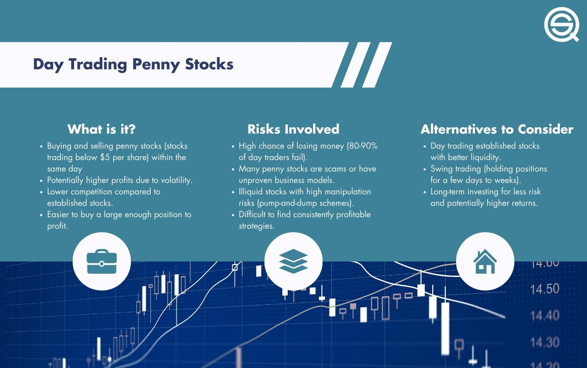

Penny stock day trading, when combined with algorithmic trading strategies, creates a compelling blend of high-risk and high-reward investment opportunities within the financial markets. This article seeks to provide an in-depth analysis of penny stocks, emphasizing the role of algorithmic approaches in day trading these securities. Readers will gain a comprehensive understanding of penny stocks, exploring their attributes, the foundational principles and guidelines of day trading, and the distinctive challenges and possibilities they offer within the algorithmic trading landscape. By examining these aspects, the article aims to equip readers with the knowledge needed to determine if penny stock day trading with algorithmic strategies aligns with their investment objectives and risk tolerance.

## Table of Contents



## Understanding Penny Stocks

Penny stocks are defined as stocks that trade for less than $5 per share, although historically, they were classified as trading below $1. These stocks are generally associated with smaller, less established companies. The trading of penny stocks often occurs on over-the-counter (OTC) markets rather than larger, more regulated exchanges like the New York Stock Exchange (NYSE) or NASDAQ. This is largely due to the smaller market capitalization and lack of rigorous financial reporting required for such listings.

Penny stocks are known for their volatility. The low share price and limited liquidity contribute to significant price swings, often influenced by minimal trading volumes or specific news events. This volatility can present both substantial opportunities and dangers for investors. The potential for high returns exists because even a small rise in stock price can represent a considerable percentage gain. However, the risks are equally high; the same price sensitivity can lead to substantial losses if the stock experiences a downturn.

The limited liquidity of penny stocks often stems from the small number of shares available for trading, which can lead to large spreads between the bid and ask price. This illiquidity can make it difficult for investors to execute trades at desired prices, particularly in high-[volume](/wiki/volume-trading-strategy) market scenarios. Additionally, the low price and variable trading activity make penny stocks vulnerable to manipulation, such as pump-and-dump schemes. In these schemes, a stock's price is artificially inflated through misleading information, allowing manipulators to make profits by selling shares at a higher price before the market corrects itself.

Despite the inherent risks, some penny stocks have transitioned into successful companies. This transformation usually involves the company scaling operations, improving financial health, and potentially listing on a prominent stock exchange. These success stories, while relatively rare compared to the number of penny stocks that fail, highlight the significant potential within this market segment.

Thus, penny stocks embody a dual nature of risk and opportunity, requiring investors to exercise caution and due diligence when engaging with this type of security. Understanding the characteristics and risks of penny stocks is essential for anyone considering them as a part of their investment strategy.

## Basics of Day Trading Penny Stocks

Day trading involves buying and selling financial instruments within the same trading day to capitalize on short-term price movements. This approach seeks to profit from intra-day market price fluctuations, a practice particularly highlighted in high-[volatility](/wiki/volatility-trading-strategies) markets such as penny stocks. Penny stocks, generally defined as shares trading for less than $5, are known for their significant price volatility, making them attractive to day traders who aim to exploit quick, dramatic changes in price.

In the context of penny stocks, [day trading](/wiki/day-trading-spy) strategy is often preferred over long-term investment strategies due to the nature of these low-value equities. The frequent and substantial price swings provide numerous opportunities to realize gains in a short time frame. However, this high volatility also increases risk, as prices can fall as rapidly as they rise. Liquidity, another critical [factor](/wiki/factor-investing), can be both an advantage and disadvantage in penny stock trading. While higher [liquidity](/wiki/liquidity-risk-premium) can facilitate entry and [exit](/wiki/exit-strategy) from positions at desirable prices, the generally lower liquidity of penny stocks can sometimes lead to widened spreads, making trades more expensive.

Novice traders entering the world of penny stock day trading must be cognizant of the pattern day trading (PDT) rules established by the Financial Industry Regulatory Authority (FINRA). These regulations specify that a trader who executes four or more day trades within five business days is considered a pattern day trader, provided that those trades constitute more than 6% of their total trading activity during that period. To engage in pattern day trading, traders must maintain a minimum account balance of $25,000. Failure to meet this requirement makes one subject to a potential trading restriction, inhibiting the ability to capitalize on market opportunities.

There are several strategies that traders can employ when day trading penny stocks. Scalping is a popular method, requiring the rapid execution of trades to garner small profits on minor price movements. Conversely, [momentum](/wiki/momentum) trading involves taking advantage of news releases or trends driving a stock’s price in a single direction, while range trading focuses on identifying and capitalizing on stocks oscillating within a specific price channel. Each strategy demands understanding market conditions, technical indicators, and the inherent risks of penny stocks.

In conclusion, successful day trading of penny stocks requires not only a comprehensive understanding of market dynamics and volatility but also adherence to trading rules and strategies. By balancing risk with the potential for reward and maintaining disciplined trading practices, traders can navigate the challenging yet potentially lucrative penny stock market.

## Algorithmic Trading Strategies in Penny Stocks

Algorithmic trading in penny stocks involves using computer algorithms to automate trading decisions and executions based on predefined criteria. This approach leverages technological advancements to enhance trading efficiency and capitalize on the high volatility characteristic of penny stocks. By analyzing vast amounts of market data, algorithms can identify patterns and execute trades at precise moments, often quicker than human capabilities allow.

One prevalent strategy in [algorithmic trading](/wiki/algorithmic-trading) is momentum trading. This strategy exploits market trends by buying stocks that are rising and selling those that are falling. The basic premise is that stocks currently trending will continue to do so in the short term. Algorithms can identify these trends using statistical measures such as moving averages or more advanced predictive models. For instance, if the moving average of a stock's price in the last five days exceeds its average price over the past 20 days, the algorithm might trigger a buy order.

Breakout trading is another common strategy, focusing on stocks that break through significant resistance or support levels. By identifying these levels and monitoring for breakouts, algorithms can position trades to capture potential price surges or declines. This strategy is well-suited to the volatile nature of penny stocks, where significant price movements can occur rapidly. Breakout strategies often employ indicators such as the Relative Strength Index (RSI) or Bollinger Bands to confirm potential breakouts and minimize false signals.

Arbitrage trading takes advantage of price discrepancies in the markets. In the context of penny stocks, this might involve exploiting differences in stock prices across different exchanges or deriving profit from statistical [arbitrage](/wiki/arbitrage) strategies, where the algorithm identifies pairs of stocks that historically show strong statistical correlations. When one stock in the pair is mispriced relative to the other, the algorithm executes trades to profit from this imbalance as the prices revert to their mean relationship.

The effectiveness of these algorithms relies on robust data processing capabilities and precise execution. The key is to minimize latency, as delays can result in missed opportunities or unfavorable trade executions. Algorithm developers often employ programming languages such as Python due to its extensive libraries for data analysis and [machine learning](/wiki/machine-learning), as well as its simplicity for testing new strategies. A simple momentum strategy implementation in Python might look like this:

```python
import pandas as pd

def moving_average(data, window):
    return data.rolling(window=window).mean()

def momentum_strategy(stock_data, short_window, long_window):
    signals = pd.DataFrame(index=stock_data.index)
    signals['Price'] = stock_data['Close']
    signals['Short_MA'] = moving_average(signals['Price'], short_window)
    signals['Long_MA'] = moving_average(signals['Price'], long_window)
    signals['Signal'] = 0.0  
    signals['Signal'][short_window:] = np.where(signals['Short_MA'][short_window:] > signals['Long_MA'][short_window:], 1.0, 0.0)   
    signals['Position'] = signals['Signal'].diff()

    return signals

# Example usage
# stock_data = pd.read_csv('penny_stock_data.csv')
# signals = momentum_strategy(stock_data, short_window=5, long_window=20)
```

This snippet outlines a basic momentum strategy using moving averages to generate signals for buying or selling a penny stock. In practice, however, developing effective algorithmic strategies for penny stocks involves complex [backtesting](/wiki/backtesting), risk management, and constant refinement to adapt to ever-changing market conditions.

## Challenges and Risks

Penny stocks, due to their inherently low liquidity, are highly susceptible to manipulation schemes, most notably pump-and-dump schemes. These schemes involve artificially inflating the price of a stock through misleading positive statements to sell the cheaply purchased stock at a higher price. Once the orchestrators sell their shares, the price typically collapses, leaving uninformed investors with significant losses. The limited liquidity means even small trades can dramatically sway prices, making them ideal for such manipulative tactics.

Algorithmic trading, while offering speed and precision, also faces significant challenges in penny stocks. Sudden market changes can drastically impact trading strategies, and technology glitches may trigger unintended trades. These glitches can result from errors in code, connectivity issues, or system failures, leading to potential financial losses. For instance, if an algorithm is programmed to execute trades based on specific price thresholds, volatile swings in penny stocks can activate these algorithms unexpectedly, resulting in adverse outcomes.

Moreover, emotional bias remains a concern for traders. The emotional ups and downs of watching rapid price changes can tempt traders to deviate from their pre-defined algorithmic strategies. Rigorous adherence to algorithmic models is crucial in mitigating this risk. By sticking to the predetermined criteria and rules set in the algorithms, traders can reduce the influence of emotional decisions that often lead to irrational trading behavior.

To illustrate handling these challenges, consider implementing risk management strategies like setting stop-loss limits, regular backtesting of algorithms, and diversifying across different assets to mitigate risks. Employing robust monitoring systems to promptly detect and correct technical glitches can further aid in safeguarding against uncontrolled trading scenarios.

## Conclusion

Penny stock day trading, when approached with algorithmic strategies, offers both lucrative and perilous prospects. The allure of high returns is intrinsically linked to the volatility and speculative aspects of these low-priced stocks, often trading under unpredictable and rapidly changing market conditions. 

The key to navigating these waters successfully lies in employing robust algorithmic strategies that can effectively harness market volatility. Algorithms can swiftly analyze large datasets, execute trades at optimal times, and minimize the influence of emotional bias, which is critical in maintaining discipline and objectivity in trading decisions. Moreover, these automated systems can adapt to market changes and improve over time through backtesting and continuous refinement.

However, the risks cannot be overlooked. The susceptibility of penny stocks to manipulative practices, such as pump-and-dump schemes, combined with the possibility of technological failures, presents considerable challenges. Traders must therefore be vigilant in evaluating the integrity and performance of their algorithms, and agile in adapting their strategies to market fluctuations.

In conclusion, while the algorithmic approach to penny stock day trading can potentially yield substantial returns, it demands a thorough understanding of the inherent risks and a commitment to strategy evaluation and adaptation. Successful traders are those who not only leverage advanced algorithms but are also adept at navigating the unpredictable nature of penny stocks.

## Frequently Asked Questions (FAQ)

### Frequently Asked Questions (FAQ)

**What are penny stocks and why are they considered risky?**

Penny stocks are shares of companies that typically trade at a low price, often under $5 per share. Historically, these stocks were considered as trading below $1. They are mostly associated with small companies and are frequently traded over-the-counter (OTC) rather than on major stock exchanges. The primary risks associated with penny stocks include their high volatility, limited liquidity, and a higher susceptibility to market manipulation. Due to these factors, investments in penny stocks can lead to significant losses, although they also offer the potential for substantial gains.

**How does algorithmic trading improve penny stock day trading?**

Algorithmic trading leverages computer software to execute trades based on predetermined instructions. In the context of penny stocks, algorithmic trading can offer several advantages. It provides increased speed and efficiency by processing large volumes of data rapidly, which can identify opportunities for profitable trades that may not be visible through manual analysis. Furthermore, algorithmic strategies can minimize human error and emotional bias, enabling more consistent trading performance. Algorithms can also continuously monitor markets to execute trades at optimal moments, maximizing gains from the volatility typical in penny stocks.

**What are some common strategies used in penny stock algorithmic trading?**

Several strategies are employed in algorithmic trading of penny stocks, each aiming to capitalize on short-term price movements and volatility:

1. **Momentum Trading**: This strategy involves algorithms identifying stocks that show an upward or downward trend, attempting to capture gains from continued movement in the same direction.

2. **Breakout Trading**: Algorithms detect and trade on a stock's price breaking through a particular level, such as a resistance or support line, expecting the price to continue in that direction.

3. **Arbitrage Trading**: This strategy exploits price discrepancies between different markets or forms of a security, using algorithms to simultaneously buy and sell to profit from the temporary difference.

**What are the challenges associated with penny stock trading using algorithms?**

Trading penny stocks with algorithms is not without its challenges. The low liquidity of penny stocks can lead to difficulties in executing trades at desired prices, potentially affecting the profitability of strategy execution. Penny stocks are also prone to manipulation, including pump-and-dump schemes, which can cause algorithms to react unpredictably to artificial market signals. Sudden and unexpected market changes can disrupt algorithmic strategies, necessitating continuous monitoring and adjustment. Lastly, while algorithms aim to reduce emotional bias, the reliance on technology introduces the risk of glitches and system failures, which can lead to losses if not properly managed.

## References & Further Reading

[1]: Bergstra, J., Bardenet, R., Bengio, Y., & Kégl, B. (2011). ["Algorithms for Hyper-Parameter Optimization."](https://papers.nips.cc/paper/4443-algorithms-for-hyper-parameter-optimization) Advances in Neural Information Processing Systems 24.

[2]: ["Advances in Financial Machine Learning"](https://www.amazon.com/Advances-Financial-Machine-Learning-Marcos/dp/1119482089) by Marcos Lopez de Prado

[3]: ["Evidence-Based Technical Analysis: Applying the Scientific Method and Statistical Inference to Trading Signals"](https://www.amazon.com/Evidence-Based-Technical-Analysis-Scientific-Statistical/dp/0470008741) by David Aronson

[4]: ["Machine Learning for Algorithmic Trading"](https://github.com/stefan-jansen/machine-learning-for-trading) by Stefan Jansen

[5]: ["Quantitative Trading: How to Build Your Own Algorithmic Trading Business"](https://www.amazon.com/Quantitative-Trading-Build-Algorithmic-Business/dp/1119800064) by Ernest P. Chan