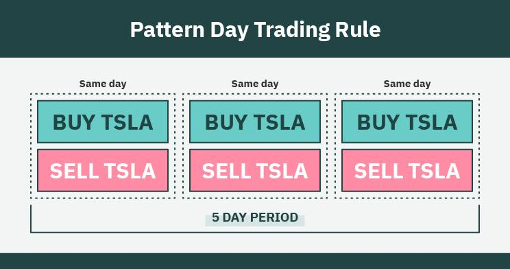

## Table of Contents

## What is day trading and how does it differ from other types of trading?

Day trading is when someone buys and sells stocks or other financial products within the same day. They try to make money from small changes in the price of these items. Day traders usually do not keep their investments overnight because they want to avoid the risks that can happen when markets are closed.

Day trading is different from other types of trading because it focuses on short-term gains. For example, in swing trading, people might hold onto their investments for a few days or weeks to make money from bigger price changes. In long-term investing, people might keep their investments for months or years, hoping the value will grow over time. Day trading requires a lot of attention and quick decisions, while other types of trading might need less daily focus but more patience.

## Why do brokers impose restrictions on day trading?

Brokers impose restrictions on day trading mainly to protect both themselves and their clients. Day trading can be very risky, and many people lose money doing it. Brokers want to make sure that their clients understand these risks and have enough money to handle potential losses. If someone loses a lot of money quickly, they might not be able to pay back what they owe to the broker. By setting restrictions, brokers can help prevent this from happening and keep their business safe.

Another reason for these restrictions is to follow the rules set by financial regulators. These rules are there to protect investors and keep the market fair. For example, the Pattern Day Trader rule in the U.S. says that if someone makes four or more day trades within five business days, they need to have at least $25,000 in their account. This rule helps make sure that only people with enough money and experience are doing a lot of day trading. By following these rules, brokers can avoid getting in trouble and help maintain trust in the financial system.

## What are the common day trading restrictions set by brokers?

Brokers often set rules for day trading to keep things safe and fair. One common rule is the Pattern Day Trader (PDT) rule. This rule says that if you make four or more day trades in a week, you need to have at least $25,000 in your account. This is to make sure you have enough money to handle the ups and downs of day trading. If you don't meet this rule, you might not be able to make as many trades or you might have to wait until you have more money in your account.

Another common restriction is the margin requirement. When you day trade, you might borrow money from your broker to make trades. But brokers set limits on how much you can borrow, usually asking you to keep a certain amount of money in your account as a safety net. This is called the margin. If your account falls below this required amount, you might get a margin call, which means you need to add more money to your account or sell some of your investments. These rules help brokers make sure that you can pay back what you borrow and that you're not taking too much risk.

## How does the Pattern Day Trader (PDT) rule affect individual traders?

The Pattern Day Trader (PDT) rule can make a big difference for people who like to trade stocks a lot during the day. If you make four or more day trades in a week, you need to have at least $25,000 in your account. This rule is there to make sure you have enough money to handle the risks of day trading. If you don't have $25,000, you might not be able to make as many trades as you want. This can be tough for people who are just starting out or who don't have a lot of money to invest.

This rule can also change how people trade. Some might decide to hold onto their investments for longer than a day to avoid being labeled as a pattern day trader. Others might need to save up more money before they can trade as often as they want. It's all about making sure that people are trading responsibly and not taking too many risks. While the PDT rule might seem strict, it's there to protect traders from losing too much money too quickly.

## What are the minimum account balance requirements for day trading?

The minimum account balance needed for day trading is usually set by a rule called the Pattern Day Trader (PDT) rule. This rule says that if you make four or more day trades in a week, you need to have at least $25,000 in your account. This is to make sure you have enough money to handle the risks of trading stocks quickly during the day. If your account doesn't have $25,000, you might not be able to make as many trades as you want.

This rule can affect how people trade. Some might choose to keep their investments for longer than a day to avoid being called a pattern day trader. Others might need to save up more money before they can trade as often as they want. The rule is there to help protect people from losing too much money too quickly by making sure they have enough money to cover their trades.

## Can you explain the margin requirements for day trading accounts?

When you day trade, you might use something called margin. This means you can borrow money from your broker to make trades. But brokers set rules on how much you can borrow. They want you to keep a certain amount of money in your account as a safety net. This is called the margin requirement. It's like a rule that says, "You need to have this much money in your account if you want to borrow from us." If your account falls below this required amount, you might get a margin call. That means you need to add more money to your account or sell some of your investments to meet the requirement.

The margin requirement for day trading accounts can be different depending on the broker and the rules they follow. Usually, the minimum amount you need to have in your account to day trade with margin is set by the Pattern Day Trader (PDT) rule. This rule says you need at least $25,000 in your account if you make four or more day trades in a week. This is to make sure you have enough money to cover your trades and handle the risks of day trading. If you don't meet this requirement, you might not be able to use margin to day trade as much as you want.

## How do different brokers vary in their day trading policies?

Different brokers can have different rules for day trading. Some brokers might let you day trade with less money in your account than others. For example, some might let you start day trading with less than $25,000, while others stick to the Pattern Day Trader (PDT) rule and require you to have at least $25,000 if you make four or more day trades in a week. Also, the amount of money you can borrow from your broker, called margin, can be different. Some brokers might let you borrow more money, while others might have stricter rules and let you borrow less.

Another way brokers can vary is in the fees they charge for day trading. Some brokers might charge you more for each trade you make, while others might have lower fees or even no fees at all. This can make a big difference in how much money you can make from day trading. Some brokers also offer different tools and platforms for day trading. Some might have better charts and faster trading systems, which can help you make quick decisions. Others might not have as many tools, which could make day trading harder.

## What are the consequences of violating day trading restrictions?

If you break the day trading rules set by your broker, you might face some problems. One common issue is that your broker might limit how many trades you can make. If you don't have enough money in your account and you make too many day trades, your broker might stop you from making more trades until you have more money. This can be frustrating if you want to keep trading but can't because of the rules.

Another problem is that you might get a margin call. This happens if you're using borrowed money to trade and your account balance falls below the required amount. If you get a margin call, you need to add more money to your account quickly or sell some of your investments. If you don't do this, your broker might sell your investments for you to cover what you owe. This can lead to losses and might make it harder for you to trade in the future.

## How can traders manage their accounts to comply with day trading rules?

To comply with day trading rules, traders need to keep a close eye on their account balance. The most important rule is the Pattern Day Trader (PDT) rule, which says you need at least $25,000 in your account if you make four or more day trades in a week. To stay within this rule, traders can make sure they have enough money in their account before they start trading. If they don't have $25,000, they can limit their trades to fewer than four per week or hold onto their investments for longer than a day.

Another way to manage an account is to pay attention to margin requirements. If you're using borrowed money to trade, you need to keep a certain amount of money in your account as a safety net. If your account balance falls below this amount, you might get a margin call, which means you need to add more money or sell some investments. To avoid this, traders can keep track of their account balance and make sure they have enough money to cover their trades. By being careful and planning their trades, traders can follow the rules and keep trading without problems.

## Are there any strategies to bypass or mitigate day trading restrictions?

One way to deal with day trading restrictions is to use a different type of account. Some brokers offer accounts that are not affected by the Pattern Day Trader (PDT) rule. These might be called cash accounts or retirement accounts. In a cash account, you can only trade with the money you have, not with borrowed money. This means you don't have to worry about the $25,000 rule, but you also can't make as many trades because you need to wait for your money to settle after each trade.

Another strategy is to trade less often. If you want to avoid the PDT rule, you can limit yourself to making fewer than four day trades in a week. This way, you don't need to have $25,000 in your account. You might also choose to hold onto your investments for more than a day, which is called swing trading. This can help you avoid being labeled as a pattern day trader. By being careful and planning your trades, you can still make money without breaking the rules.

## What are the best practices for day trading within the restrictions?

To do well with day trading while following the rules, it's important to keep enough money in your account. The Pattern Day Trader rule says you need at least $25,000 if you make four or more day trades in a week. So, make sure you have that much money before you start trading a lot. If you don't have $25,000, you can still trade, but you should do fewer than four day trades in a week. Another good idea is to use a cash account instead of a margin account. With a cash account, you can only use the money you have, so you don't have to worry about the $25,000 rule, but you need to wait for your money to settle after each trade.

It's also smart to plan your trades carefully. Keep an eye on your account balance to make sure you don't fall below the margin requirements if you're using borrowed money. If you get close to the limit, you might want to add more money to your account or sell some investments to stay safe. Also, think about holding onto your investments for more than a day if you're close to making too many day trades. This is called swing trading, and it can help you avoid the Pattern Day Trader rule while still making money. By being careful and planning ahead, you can do well with day trading without breaking any rules.

## How do international regulations on day trading compare to those in the U.S.?

Day trading rules can be different in other countries compared to the U.S. In the U.S., the Pattern Day Trader (PDT) rule says you need at least $25,000 in your account if you make four or more day trades in a week. This rule is there to make sure traders have enough money to handle the risks of day trading. In some other countries, there might not be a rule like this. For example, in Canada, there's no specific rule that says you need a certain amount of money to day trade, but brokers might still have their own rules.

In Europe, the rules can also be different depending on the country. In the UK, for example, there's no strict rule about how much money you need to day trade, but you still need to follow the rules set by the Financial Conduct Authority (FCA). These rules focus more on making sure you understand the risks and have enough money to cover your trades. In Asia, countries like Japan and Singapore have their own rules, which might be stricter or more relaxed than the U.S. rules. It's important for traders to know the rules in their country and follow them to avoid problems.

## References & Further Reading

[1]: "Strategies for Profiting with Japanese Candlestick Charts" by Steve Nison, a book that explores key analytical tools used in trading.

[2]: ["Markets, Mobs, & Mayhem: A Modern Look at the Madness of Crowds"](https://www.amazon.com/Markets-Mobs-Mayhem-Modern-Madness/dp/0471233277) by Robert Menschel, provides an understanding of market psychology relevant to trading strategies.

[3]: ["Algorithmic Trading: Winning Strategies and Their Rationale"](https://www.amazon.com/Algorithmic-Trading-Winning-Strategies-Rationale-ebook/dp/B00CY5HC0U) by Ernie Chan, offers insights into the mechanics and strategies of algorithmic trading.

[4]: U.S. Securities and Exchange Commission (SEC). Circuit Breakers and Trading Halts. [Link](https://www.sec.gov/files/rules/sro/nyse/2021/34-92428.pdf).

[5]: Financial Industry Regulatory Authority (FINRA). "Day Trading: Your Dollars at Risk". [Link](https://www.finra.org/investors/investing/investment-products/stocks/day-trading).