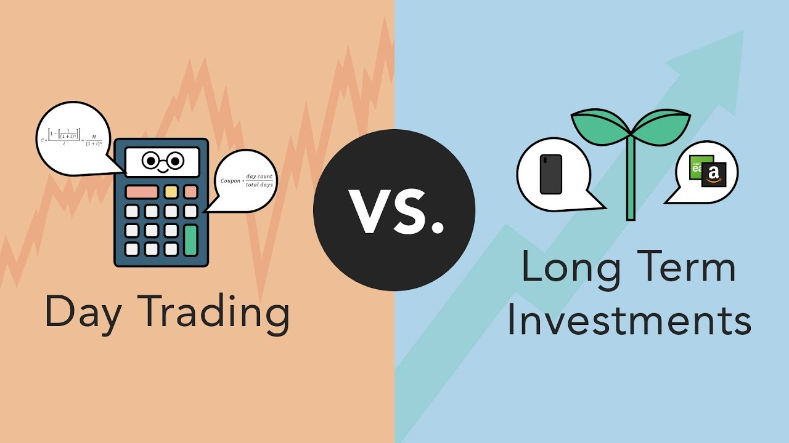
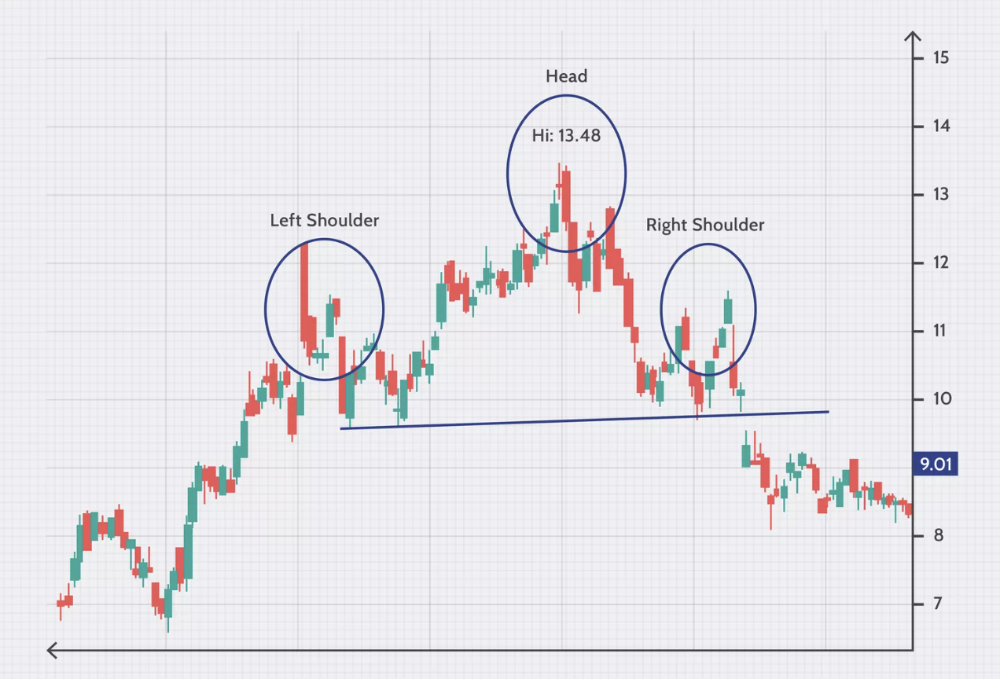
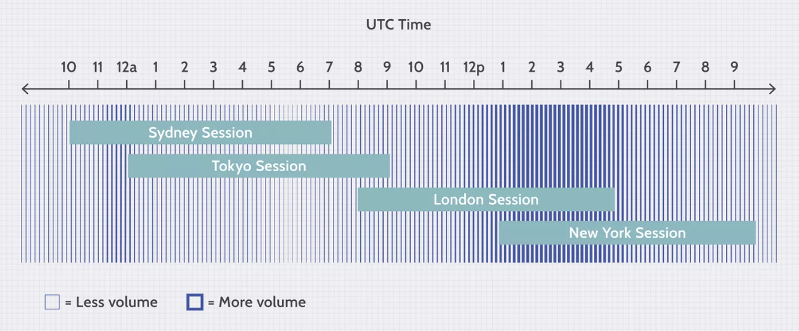

Day trading SPY, which stands for the SPDR S&P 500 ETF, is an investment strategy that involves the rapid buying and selling of options within a single trading day. SPY is not just any ETF; it's a market heavyweight that represents the 500 most sizable companies listed on U.S. stock exchanges and serves as a barometer for the overall health of the United States stock market. Because of its widespread influence and liquidity, SPY is a prime target for day traders who seek to capitalize on the minute-by-minute fluctuations that can occur within any given trading session.

The allure of day trading SPY lies in its potential for quick profits due to the ETF's high liquidity, which allows for easy entry and exit points within the market. This liquidity also ensures that price discovery is consistent, giving traders the confidence that the price of SPY options is a true reflection of market sentiment. However, the benefits do come with their fair share of risks. The speed at which these trades are made can amplify losses just as quickly as gains, and the price volatility can sometimes be severe, requiring traders to stay informed and react swiftly to market changes.

For those considering this approach, it’s essential to understand that day trading is not a guaranteed profit scheme; it requires a strategic mindset, a deep understanding of market indicators, and a strong grip on technical analysis to identify the right moments to enter and exit trades. The SPY's importance in the market, coupled with the high-stakes nature of day trading, creates a dynamic environment that, while potentially profitable, demands respect for the risks involved and an adherence to disciplined trading practices.

## Understanding SPY Options

SPY options are derivative contracts that give traders the right, but not the obligation, to buy or sell the SPDR S&P 500 ETF Trust shares at a specified price, known as the strike price, before the option expires. These options are a pivotal tool for traders because they offer a way to gain exposure to the performance of the S&P 500 index while requiring less capital than would be needed to buy the ETF shares outright. The significance of SPY options for traders cannot be overstated—they provide a highly liquid market that allows for quick entry and exit, with tight bid-ask spreads and substantial volume.

One of the primary advantages of trading SPY options is their liquidity, which is among the highest in the options market. This liquidity means that traders can execute large trades without significantly affecting the price. Moreover, SPY options offer the flexibility to implement a range of strategies, from straightforward directional bets to complex spreads. They also play a crucial role in price discovery, as the movements in SPY options can indicate broader market sentiment regarding the S&P 500.

When it comes to the basics of options trading with SPY, understanding the key terminologies such as "call" and "put" options, "in the money" (ITM), "at the money" (ATM), and "out of the money" (OTM), "expiration date," and "strike price" is fundamental. Calls grant the holder the right to buy the ETF at the strike price, while puts allow the holder to sell it. ITM options have intrinsic value, ATM options have a strike price close to the current price of the ETF, and OTM options are purely speculative with no intrinsic value. The expiration date is the date on which the option contract expires, and the strike price is the price at which the holder can buy or sell the underlying ETF.

For those seeking to deep dive deeper into the intricacies of SPY options and their strategic application in day trading, "Options as a Strategic Investment" by Lawrence G. McMillan is a comprehensive resource that covers a range of strategies and concepts applicable to trading SPY options[1].

## Technical Analysis for SPY Options

Technical analysis is an essential tool for SPY options traders. It involves scrutinizing past market data, primarily through charts, to forecast future price movements and identify trading signals. Traders rely on various chart patterns, indicators, and oscillators to make informed decisions.

For example, a head and shoulders pattern may signal a trend reversal, while moving averages can help pinpoint momentum and potential entry and exit points. The volume of trades and price movements are also key factors in confirming trends and signals suggested by chart patterns.

Reading SPY charts requires a keen eye for detail and an understanding of the nuances of market psychology that drive price movements. Candlestick patterns, such as doji or engulfing patterns, give insights into market sentiment and potential reversals or continuations of trends. The support and resistance levels on SPY charts are particularly critical as they can indicate the price points where the market may experience pushback, either preventing a fall below a certain level (support) or capping the rise above a certain level (resistance).

The unique aspect of SPY options is their thrice-weekly expiration — on Monday, Wednesday, and Friday — which has a profound impact on trading strategies. This frequency increases the number of opportunities traders have to enter and exit positions, but it also influences the time value of options. As expiration nears, the time decay accelerates, which can be a critical factor in the strategy for both option buyers and sellers. This aspect necessitates a more nuanced approach to trade durations and the selection of strike prices.

The timing of trades around these expiration days is strategic. For instance, traders might look for opportunities to trade options that are nearing expiration, taking advantage of the increased time decay, known as theta. On the other hand, some may prefer to trade options with more time until expiration to reduce the impact of time decay on the option's price.

For a comprehensive understanding of technical analysis specific to options, "Technical Analysis of the Financial Markets" by John J. Murphy provides a detailed exploration of the subject. Murphy’s work is considered a seminal text in the field, offering insights into how technical analysis can be tailored for the unique characteristics of options trading, including those of SPY options[2].

## Strategic Trading Hours

Identifying the best trading hours for SPY options is crucial for day traders looking to maximize their profits. Historical data and market volatility analysis reveal that the first and last hour of the trading day, known as the opening and closing bells, respectively, are often the most volatile. During these windows, trading volume surges as institutional investors adjust positions and traders react to overnight news and economic reports.

The opening hour, starting at 9:30 AM Eastern Time, is characterized by heightened volatility as the market absorbs new information and sets the tone for the day. This period can present lucrative opportunities for traders to capitalize on large price swings. However, the unpredictable nature of these swings also poses a higher risk.

Conversely, the final hour before the market close, from 3:00 PM to 4:00 PM Eastern Time, often sees a flurry of activity as traders close out positions to avoid overnight risk, leading to increased liquidity and potential profit opportunities. It's common for the SPY to set its high or low for the day during this time, which can be strategically advantageous for day traders.

A comparative study of trading hours indicates that mid-day trading tends to be quieter with less volatility, which can be less profitable for day trading strategies that rely on significant price movements. The reduced volatility is due to a lunchtime lull in trading activities, as many traders and institutional investors take a break, resulting in lower volume and slower price movements.

For day traders, understanding these patterns is essential for strategizing entry and exit points. By aligning trades with the times of increased volatility, traders can potentially improve the profitability of their trades, provided they also adhere to robust risk management practices to safeguard against the unpredictable nature of the market.

## Trading Strategies for SPY Options

Trading strategies for SPY options are as varied as the traders who implement them, each with its own risk profile and market view. A popular method is **trend trading**, where traders look to capitalize on the momentum of the market, entering trades in the direction of a prevailing trend. Indicators like moving averages and MACD can help identify these trends.

Another strategy is **swing trading**, which involves holding options for several days to capitalize on expected upward or downward market moves. Swing traders use a combination of technical and fundamental analysis to make their decisions, often looking for 'setups' or specific patterns that suggest a potential move.

For those looking for quicker trades, **scalping** may be the strategy of choice. This involves making numerous trades throughout the day for small profits. It requires a strict exit strategy because one large loss could eliminate the many small gains that have been accrued.

Some traders prefer to use **options spreads**, such as vertical spreads, iron condors, and straddles, to potentially profit from SPY’s price volatility or lack thereof. These strategies can be complex, combining multiple buy and sell options to reduce risk and capitalize on specific market conditions.

Professional traders often use a combination of strategies, adapting their approach to changing market conditions. A case study often referenced by experts is the trade executed on February 5, 2018, when the SPY experienced a significant drop. Traders who had employed a strategy combining protective puts and short calls (a form of a straddle) were able to mitigate losses and, in some cases, profit from the volatility spike.

## Risk Management in Day Trading SPY

Risk management is the cornerstone of successful day trading with SPY options. It involves identifying, assessing, and deciding how to handle various factors that could lead to financial loss. The key to managing these risks lies in the implementation of robust strategies that aim to preserve capital and maintain portfolio longevity.

One fundamental component of risk management is setting **stop losses**. A stop loss is an order placed with a broker to buy or sell once the stock reaches a certain price. It is designed to limit an investor’s loss on a security position. For SPY options, setting a stop loss can help traders exit a position if the market moves against them, thereby capping potential losses. It's crucial to set these stop losses at a point that balances the potential upside of a trade with the risk of losing capital.

Additionally, **knowing when to exit** a trade is as important as knowing when to enter. This decision should be based on a pre-defined trading plan that includes specific criteria for exiting trades, whether they're profitable or not. Successful traders often establish exit strategies based on technical indicators, option expiration dates, or the achievement of profit or loss thresholds.

Another aspect of risk management is **position sizing**, which involves determining how much capital to allocate to a particular trade based on the overall trading account size and risk tolerance. Proper position sizing helps prevent any single trade from having a disproportionate impact on the trader's account.

Diversification of strategies and not putting all capital into a single type of SPY option contract can also spread risk. Traders might choose a combination of short-term and long-term options, as well as a mix of call and put options, depending on their market outlook.

Lastly, maintaining a trading journal to track performance and decision-making processes can provide valuable insights into the effectiveness of one's risk management techniques. This self-analysis can lead to improved discipline and risk management in future trades.

For a deeper exploration of these concepts, the book "Trading Risk: Enhanced Profitability through Risk Control" by Kenneth L. Grant offers a comprehensive guide to risk management tailored to the needs of professional traders. Grant provides actionable strategies and frameworks for managing risk in the trading of financial instruments like SPY options[3].

## Trading Psychology and Discipline

Trading psychology and discipline are paramount in day trading SPY options, where emotional decision-making can be costly. The psychological aspect involves maintaining a level head and clear focus in the face of market volatility. Traders must manage their emotions, particularly fear and greed, which can lead to hasty decisions like chasing losses or deviating from a trading plan.

Discipline is the practice of adhering to a set trading plan with predefined rules for entering and exiting trades, regardless of emotional influences. This includes setting and following through with stop losses, not over-leveraging positions, and being consistent with trade sizes. It's about making informed decisions based on logic and analysis rather than impulse.

Developing discipline requires a structured approach to trading. One effective method is to maintain a trading journal where all trades are recorded, including the rationale behind each decision and the emotional state during the trade. Reviewing this journal regularly can help traders identify patterns in their behavior that may require adjustment.

Another method is to establish a routine that includes pre-market preparation and post-market review, ensuring that each trading day is approached with a fresh perspective and lessons learned are integrated into future strategies.

Mindfulness and meditation can also be incorporated into a trader's routine to improve focus and reduce stress. By practicing mindfulness, traders can increase their awareness of their mental state, which can help prevent emotional reactions during trading.

## Day Trading SPY with a Small Account

Day trading SPY with a small account is a challenge that requires strategic planning and meticulous risk management. Traders with limited capital must leverage the power of compounding gains while protecting their downside. One effective strategy is to focus on percentage returns, not dollar amounts, which can lead to more consistent account growth.

Position sizing is critical when operating with a smaller budget. It's advisable to risk only a small percentage of the account on any single trade, commonly suggested at 1-2%. This risk management technique helps to extend the longevity of the trading account, preventing significant losses that can be detrimental to a small capital base.

Utilizing options strategies that require less capital, like trading SPY options spreads, can also be beneficial. Vertical spreads, for instance, can define both the maximum gain and loss for a trade, which is ideal for accounts with a smaller balance. These strategies allow traders to participate in market movements while limiting risk.

Another approach is to take advantage of the leverage provided by options. Buying call or put options requires less capital than buying the stock itself, but it's important to understand that options can expire worthless, so traders must be selective and strategic in their trades.

For small account traders, it's also important to keep costs low. This means selecting a brokerage with competitive fees and commission structures that won't erode profits. Some brokerages offer free options trades or very low-cost contract fees, which can be a boon to traders mindful of their budget.

## Legal and Tax Implications

Day trading SPY options carries specific legal and tax implications that traders must be aware of to ensure compliance and optimal financial planning. Legally, day traders are subject to regulations set forth by the Securities and Exchange Commission (SEC) and other financial authorities, which include rules on pattern day trading and maintaining minimum account balances.

Tax implications are particularly important for day traders to understand. In the United States, the Internal Revenue Service (IRS) classifies traders who meet certain criteria as 'traders in securities,' which can impact the tax treatment of their income. SPY options, as with other securities, are subject to capital gains taxes, and the rate depends on whether the gains are long-term or short-term. Trades held for less than a year fall under short-term capital gains and are taxed at the trader’s ordinary income tax rate, which is often higher than the long-term capital gains rate.

Moreover, the 'wash-sale' rule is an essential tax consideration for traders who might incur losses. This rule prohibits traders from claiming a loss on a security if a repurchase of the same or substantially identical security is made within a 30-day period before or after the sale.

Day traders may also be eligible to claim certain expenses related to their trading activity, such as education, home office setup, and trading software subscriptions, as tax deductions. However, these expenses must be ordinary and necessary to the business of trading and appropriately documented.

For detailed guidance, traders should refer to IRS Publication 550, which outlines the tax treatment of investment income and expenses, and IRS Publication 544, which focuses on sales and other dispositions of assets. These publications provide authoritative information on the tax rules applicable to day trading activities. It's advisable for traders to consult with a tax professional who can provide advice tailored to their specific situation.

## Conclusion

In the journey to mastering day trading with SPY options, we’ve covered the broad landscape, from the foundational understanding of SPY's market significance to the intricate strategies that can be employed for trading success. We explored the importance of SPY options for their liquidity and price discovery benefits and discussed the necessity of grasping basic terminologies and concepts. We emphasized the critical role of technical analysis in identifying trading signals and considered how the unique expiration schedule of SPY options affects strategy.

We reviewed strategic trading hours, noting that market volatility and historical data suggest the opening and closing hours are prime for trading activity. We delved into various strategies, highlighting the importance of adapting these to one's style and the market’s temperament. The significance of risk management was underscored, particularly the setting of stop losses and the crucial decisions surrounding trade exits.

For a comprehensive list of resources, references, and further reading, please refer to the appendix section of this article. It includes a glossary of terms and a curated selection of materials that will aid in expanding your knowledge and skills in day trading SPY options.

💡 **Read more:**

- Trading strategies papers with code on [Equities](https://wiki.paperswithbacktest.com/trading-strategies/equities), [Cryptocurrencies](https://wiki.paperswithbacktest.com/trading-strategies/cryptocurrencies), [Commodities](https://wiki.paperswithbacktest.com/trading-strategies/commodities), [Currencies](https://wiki.paperswithbacktest.com/trading-strategies/currencies), [Bonds](https://wiki.paperswithbacktest.com/trading-strategies/bonds), [Options](https://wiki.paperswithbacktest.com/trading-strategies/options)
- [A curated list](https://github.com/paperswithbacktest/awesome-systematic-trading) of awesome libraries, packages, strategies, books, blogs, and tutorials for systematic trading
- [A bunch of datasets](https://huggingface.co/paperswithbacktest) for quantitative trading
- [A website to help you](https://paperswithbacktest.com/) become a quant trader and achieve financial independence

## References & Further Reading

[1]: ["Options as a Strategic Investment"](https://www.optionstrategist.com/products/options-strategic-investment-5th-edition) by Lawrence G. McMillan

[2]: ["Technical Analysis of the Financial Markets"](https://www.amazon.com/Technical-Analysis-Financial-Markets-Comprehensive/dp/0735200661) by John J. Murphy

[3]: ["Trading Risk: Enhanced Profitability through Risk Control"](https://www.amazon.com/Trading-Risk-Enhanced-Profitability-through/dp/0471650919) by Kenneth L. Grant