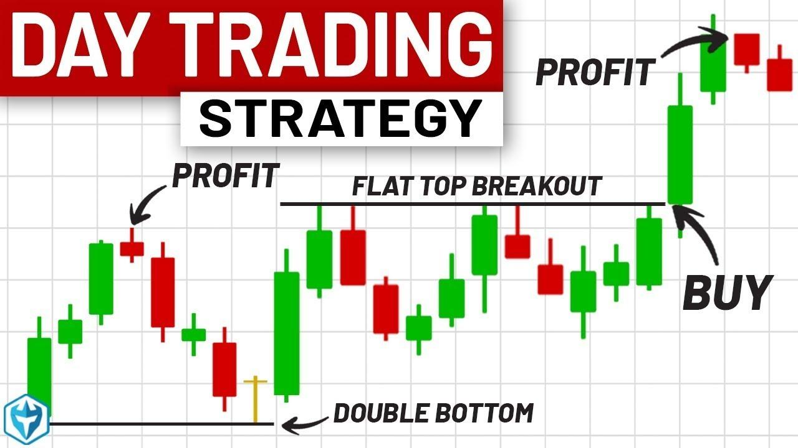

In today's fast-paced financial markets, trading has emerged as a popular career choice, attracting many aspiring traders to the opportunities presented by day trading and algorithmic trading. Both methods offer distinct paths to profitability and require a specific set of skills and knowledge to navigate effectively.

This guide aims to provide a comprehensive overview for those seeking success in trading, whether through the traditional approach of day trading or the technologically advanced realm of algorithmic trading. A thorough understanding of essential elements such as market dynamics, risk management, and strategic planning is crucial for thriving in these competitive environments. While day trading relies heavily on the trader's ability to accurately read and respond to short-term market movements, algorithmic trading harnesses the power of computer algorithms to execute trades with speed and precision, often across multiple markets simultaneously.



Key considerations in both trading styles include the acquisition of a strong foundational knowledge of financial markets, ongoing education in trading principles, and the prudent application of risk management techniques. In day trading, this may involve quick decision-making based on technical analysis, whereas algorithmic trading might require expertise in coding, backtesting, and system optimization.

Furthermore, a successful trading career demands adaptability and a readiness to learn continuously, as market conditions and technologies evolve. Whether enhancing strategies through technical analysis or embracing new computational tools, traders must remain vigilant and informed. By prioritizing ongoing learning and effectively managing risk, traders can position themselves to seize emerging opportunities in the ever-changing landscape of financial markets.

With these considerations in mind, traders can develop the skills and mindset necessary to navigate the intricacies of both day trading and algorithmic trading.

## Table of Contents

## Understanding Day Trading

Day trading involves the rapid buying and selling of securities within a single trading day, with the objective of capitalizing on short-term market movements. This style of trading can include stocks, options, futures, and currencies, depending on the trader's preference and experience. 

A fundamental aspect of [day trading](/wiki/day-trading-spy) is the reliance on technical analysis and market signals. Technical analysis involves evaluating historical price data and trading [volume](/wiki/volume-trading-strategy) to identify patterns and trends that can indicate future price movements. Day traders utilize various tools such as charts and indicators, including moving averages, Relative Strength Index (RSI), and candlestick patterns, to make informed decisions. For instance, a simple moving average can be calculated using:

$$
SMA = \frac{(P_1 + P_2 + \ldots + P_n)}{n}
$$

where $P$ represents the price at different intervals, providing insights into a security's average price over a defined period.

Market signals, on the other hand, are cues derived from price movements and trading patterns, helping traders to anticipate market behavior. These signals can alert traders to potential buying or selling opportunities, essential for executing multiple trades within a volatile market environment.

Success in day trading hinges on a strong foundation in core trading concepts and an understanding of market dynamics, such as [liquidity](/wiki/liquidity-risk-premium) and [volatility](/wiki/volatility-trading-strategies). Liquidity ensures that traders can enter and [exit](/wiki/exit-strategy) positions quickly without significant price changes, while volatility presents opportunities for profit through unexpected price swings. The ability to make quick decisions under pressure is crucial; given the fast-paced nature of day trading, delays can lead to missed opportunities or losses.

Traders often employ strategies such as [scalping](/wiki/gamma-scalping), which involves small, frequent trades to profit from minute price fluctuations, and [momentum](/wiki/momentum) trading, which focuses on securities moving significantly in one direction on high volume. Each strategy carries inherent risks, necessitating a comprehensive understanding and careful application tailored to individual market conditions.

Ultimately, day trading requires a disciplined approach, continuous monitoring of positions, and the resilience to withstand unpredictable market shifts. Building experience and maintaining psychological composure are key factors in navigating the pressures associated with day trading.

## Becoming a Successful Day Trader

To become a successful day trader, it is essential to begin with a comprehensive self-assessment. This process helps ensure you possess the emotional resilience, discipline, and financial stability necessary for day trading. Emotional resilience is crucial as day trading involves making quick decisions amidst high market volatility, which can lead to psychological stress. Discipline is needed to adhere to your trading strategy and avoid impulsive decisions driven by emotions such as fear or greed. Financial stability is equally important, as day trading requires significant capital investment that one should afford to risk without compromising personal financial security.

Understanding the need for substantial startup capital is fundamental. For example, in the United States, the Financial Industry Regulatory Authority (FINRA) mandates that pattern day traders maintain a minimum equity of $25,000 in their margin account. This requirement ensures that traders can buffer against potential losses while capitalizing on profitable opportunities.

A thorough understanding of market mechanics forms the backbone of day trading success. This involves knowledge of how different markets operate, including the roles of various market participants such as retail traders, institutional investors, and market makers. Familiarity with order types (e.g., market orders, limit orders, stop orders) is essential for executing trades efficiently. 

Staying informed about news events that could impact your trades is another crucial aspect of day trading. Economic indicators, corporate earnings reports, and geopolitical developments can all influence market movements. Utilizing an economic calendar can help traders anticipate and respond to these events. Integrating news feeds into your trading platform can also provide real-time updates, enabling swift decision-making.

In summary, becoming a prosperous day trader involves self-assessment to evaluate personal suitability, ensuring adequate financial resources, mastering market dynamics, and maintaining awareness of pertinent news. These foundational steps are critical to navigating the complexities and opportunities inherent in day trading.

## Developing Day Trading Strategies

Day traders require robust strategies to effectively manage diverse market conditions. They often employ techniques like momentum trading, [breakout](/wiki/breakout-trading) trading, and scalping, each demanding a particular skill set and understanding of market behavior.

Momentum trading capitalizes on the strength of a current trend. Traders identify securities that are moving significantly in one direction on high volume and attempt to ride the momentum to a desired profit. This approach requires constant monitoring of market trends and indicators, often involving tools like relative strength index (RSI) and moving average convergence divergence (MACD) for identifying strong price movements.

Breakout trading strives to benefit from sudden price movements when an asset breaks through a specified resistance or support level. Traders entering a position during these breakouts anticipate that the asset will continue in the breakout direction. Success in breakout trading depends heavily on timing and the ability to quickly recognize valid breakouts as opposed to false signals.

Scalping entails executing a large number of trades to profit from small price changes over a brief period. Traders aim to buy and sell stocks throughout the day to harvest minute profits, relying heavily on speed and volume. This strategy generally requires high-frequency trading platforms that provide low latency and rapid execution of trades.

Technical analysis plays a critical role in all these strategies. It involves evaluating securities by analyzing [statistics](/wiki/bayesian-statistics) generated by market activity, such as past prices and volume. Common techniques include chart patterns (like head and shoulders, flags, etc.), volume analysis, and use of various technical indicators to predict future price movements and identify potential trading opportunities.

Setting up stop-loss orders is essential for managing risk. Stop-loss orders automatically sell a position if the price reaches a predetermined level, thereby limiting potential losses. For example, a stop-loss can be set 5% below the purchase price, meaning if the stock's price falls by 5%, the position is automatically sold. This strategy shields traders from significant market movements contrary to their positions, preserving capital for future trades.

Developing a comprehensive and adaptable day trading strategy requires a blend of these techniques and an understanding of how various market indicators inform trading decisions. Regularly refining and adapting strategies as market conditions evolve ensures traders maintain a competitive edge.

## Algorithmic Trading: An Overview

Algorithmic trading, commonly referred to as algo trading, employs computer algorithms to execute trades at high speed and frequency, based on a set of predetermined criteria. These criteria can include factors such as timing, price, quantity, or any mathematical model. The main advantage of this approach is its capability to process a vast amount of data swiftly, enabling execution of multiple strategies over various markets simultaneously, which may enhance profit potential.

The foundation of [algorithmic trading](/wiki/algorithmic-trading) lies in the development of models that can identify trading opportunities and risks more effectively than a human could. Algorithms can be designed to monitor current market conditions and execute trades automatically, eliminating human emotional bias and reducing trading costs. These algorithms can be classified into several types based on their functions, such as trend-following algorithms, [arbitrage](/wiki/arbitrage) algorithms, and market-making algorithms.

To successfully create and maintain these complex algorithms, a deep understanding of programming and financial markets is essential. The process typically begins with the coding of trading strategies, which are then backtested using historical market data to ensure their effectiveness under different market conditions. Backtesting involves running the algorithm through historical data to evaluate how it would have performed in the past, thus determining its potential effectiveness in live trading scenarios. The results provide insights into the algorithm's potential risks and returns.

In Python, [backtesting](/wiki/backtesting) can be approached using libraries such as `Backtrader` or `Zipline`. These tools offer a comprehensive suite for backtesting trading strategies with historical data. An example of a basic backtesting setup in Python might look like this:

```python
import backtrader as bt

class MyStrategy(bt.Strategy):
    def __init__(self):
        self.simple_moving_average = bt.ind.SMA(self.data, period=15)

    def next(self):
        if self.data.close > self.simple_moving_average:
            self.buy()
        elif self.data.close < self.simple_moving_average:
            self.sell()

if __name__ == '__main__':
    cerebro = bt.Cerebro()
    data = bt.feeds.YahooFinanceData(dataname='AAPL', fromdate=datetime(2020, 1, 1), todate=datetime(2021, 1, 1))
    cerebro.adddata(data)
    cerebro.addstrategy(MyStrategy)
    cerebro.run()
    cerebro.plot()
```

Beyond coding and backtesting, maintaining these algorithms in dynamic market environments requires continuous tweaking and optimization. This involves fine-tuning the model's parameters and ensuring it adapts to evolving market conditions. Overfitting, a situation where a model performs well on historical data but poorly in live markets, must be avoided. Thus, regular reviews and adjustments of algorithmic strategies are critical for sustained success.

In conclusion, algorithmic trading leverages the power of modern computing to enhance trading efficiency and effectiveness. However, the intricate nature of developing and maintaining such algorithms necessitates proficiency in programming, a solid grasp of financial principles, and a commitment to iterative learning and adjustment to adapt to shifting market landscapes.

## Building and Testing Algorithmic Trading Strategies

Creating and validating algorithmic trading strategies is essential to harnessing the potential of automated trading systems. The process begins with formulating a trading idea, which serves as the foundation for subsequent development and testing. A trading idea typically represents a hypothesis about market behavior, which can be expressed through a set of predefined criteria or rules.

### Formulating a Trading Idea

A robust trading idea usually stems from observing market patterns, price behavior, or key economic indicators. It involves understanding the factors that influence asset prices and determining how these can be quantified into actionable trading rules. For example, a simple moving average crossover strategy could be considered, where a position is entered when a short-term moving average crosses above (or below) a long-term moving average.

### Backtesting with Historical Data

Backtesting is an essential step in evaluating the viability of the formulated trading idea. This involves running the strategy through historical market data to assess its performance. Backtesting helps identify the strengths and weaknesses of a strategy under various market conditions without the risk of financial loss. It provides key metrics such as the strategy's return, risk (e.g., maximum drawdown), and other performance indicators. Using Python, one can utilize libraries like `pandas`, `numpy`, and `[backtrader](/wiki/backtrader)` to set up and execute backtests efficiently. Here is a simple example using Python:

```python
import pandas as pd
import backtrader as bt

# Define a simple moving average crossover strategy
class SmaCross(bt.Strategy):
    params = (('sma1', 10), ('sma2', 30),)

    def __init__(self):
        sma1 = bt.ind.SMA(period=self.params.sma1)
        sma2 = bt.ind.SMA(period=self.params.sma2)
        self.crossover = bt.ind.CrossOver(sma1, sma2)

    def next(self):
        if not self.position:  # not in the market
            if self.crossover > 0:
                self.buy()
        elif self.crossover < 0:
            self.sell()

# Load historical data
data = bt.feeds.YahooFinanceData(dataname='AAPL', fromdate=pd.Timestamp('2020-01-01'),
                                 todate=pd.Timestamp('2021-01-01'))

# Initialize Cerebro engine
cerebro = bt.Cerebro()
cerebro.addstrategy(SmaCross)
cerebro.adddata(data)
cerebro.run()
cerebro.plot()
```

### Optimization and Avoiding Overfitting

Post-backtesting, optimizing the strategy to enhance its performance is crucial while safeguarding against overfitting. Overfitting happens when a strategy is too closely tailored to historical data, potentially causing underperformance in live conditions. To avoid overfitting, employ techniques such as:

- **Cross-Validation:** Divide the dataset into multiple subsets to test the robustness of the strategy across different time frames.
- **Parameter Sensitivity Analysis:** Analyze how changes in parameter values affect outcomes to identify the most stable and generalizable settings.

### Regular Review and Adjustment

Financial markets are dynamic, resulting in periodic changes in asset behaviors. Therefore, regularly reviewing and adjusting algorithms is crucial for ensuring that strategies remain effective. Incorporating new data, re-running backtests, and monitoring live trading results enable traders to adapt strategies to evolving market conditions.

Through consistent monitoring and refinement, algorithmic trading strategies can be evolved to sustain profitable trading opportunities, maintaining their relevancy in the face of market fluctuations. Continual learning, adaptation, and diligent testing form the pillars of successful algorithmic trading endeavors.

## Risk Management and Psychological Resilience

Effective risk management is a cornerstone of successful trading and involves strategies designed to mitigate potential losses. One widely adopted technique is the 1% rule, which suggests that traders risk no more than 1% of their capital on a single trade. For example, if a trader has $10,000 in their account, they should not risk more than $100 on any one trade. This method helps safeguard capital and maintain the trader's ability to stay active in the market over the long term.

Another key component of risk management is setting appropriate stop-loss limits. A stop-loss order is placed to sell a security once it reaches a certain price, thus capping potential losses. The stop-loss price should be determined based on market analysis and the trader’s risk tolerance. For instance, if a stock is purchased at $50, a trader might set a stop-loss order at $47, limiting the loss to $3 per share.

Psychological resilience and discipline play an equally vital role in successful trading. Emotional responses such as fear and greed can drive impulsive decisions that lead to adverse trading outcomes. To combat these emotions, traders should adhere to their pre-defined trading plans and rules. This discipline helps prevent the temptation to chase losses or hold losing positions for too long, both of which can exacerbate financial strain.

Understanding that consistent profits are not guaranteed is essential for maintaining psychological balance. Traders must accept that losing trades are a natural part of trading and that learning to manage drawdowns—periods in which their trading account is reduced—can be critical for long-term survival. One method to manage drawdowns is through diversification, which involves spreading risk across different assets or strategies. This helps to reduce overall risk and smooth out performance fluctuations.

To quantify and visualize risks, traders might use tools like the Sharpe Ratio, which measures risk-adjusted return, or Python libraries such as NumPy and pandas to analyze historical performance data. For example, a simple Python script can be written to calculate a portfolio's daily returns and volatility:

```python
import pandas as pd

# Assume 'prices' is a DataFrame with stock prices
returns = prices.pct_change()
mean_return = returns.mean()
volatility = returns.std()

sharpe_ratio = mean_return / volatility
print("Sharpe Ratio: ", sharpe_ratio)
```

This calculation can help traders understand potential performance under varying market conditions and adjust their strategies accordingly.

Ultimately, successful trading involves a synergy between robust risk management strategies and psychological resilience. By controlling risk exposure, maintaining emotional discipline, and continuously evaluating the effectiveness of these strategies, traders can better navigate the uncertain and often turbulent waters of financial markets.

## Resources and Tools for Traders

In the modern trading environment, leveraging the right platforms and tools is essential for both novice and experienced traders. Trading platforms provide access to financial markets and offer features such as real-time data, charting software, and execution capabilities. Popular platforms include MetaTrader 4 (MT4), NinjaTrader, and TradingView, each offering unique functionalities tailored to different trading needs. For instance, MT4 is favored for [forex](/wiki/forex-system) trading due to its user-friendly interface and automated trading support through Expert Advisors (EAs).

A crucial component of successful trading is the use of backtesting tools, which allow traders to simulate market conditions and test strategies using historical data. This process is vital in refining strategies before deploying them in live markets. Tools like MetaTrader's Strategy Tester or Python libraries such as Backtrader enable traders to evaluate the performance of their strategies. A basic Python backtesting setup might involve:

```python
import backtrader as bt

class MyStrategy(bt.Strategy):
    def __init__(self):
        self.sma = bt.indicators.SimpleMovingAverage(self.data.close, period=15)

    def next(self):
        if self.data.close[-1] < self.sma[-1] and self.data.close[0] > self.sma[0]:
            self.buy()
        elif self.data.close[-1] > self.sma[-1] and self.data.close[0] < self.sma[0]:
            self.sell()

cerebro = bt.Cerebro()
data = bt.feeds.YahooFinanceData(dataname='AAPL', fromdate=datetime(2020, 1, 1), todate=datetime(2021, 12, 31))
cerebro.adddata(data)
cerebro.addstrategy(MyStrategy)
cerebro.run()
```

This code sets up a simple moving average crossover strategy, demonstrating the backtesting process using historical data.

Beyond technical tools, educational resources play a critical role in a trader's development. These resources include online courses, webinars, podcasts, [books](/wiki/algo-trading-books), and articles on financial markets and trading strategies. Platforms like Coursera, Udemy, and Investopedia offer comprehensive courses on trading concepts and market analysis.

Engaging with trading communities and forums can provide invaluable insights and support. Communities such as Forex Factory, Elite Trader, or subreddit r/algotrading allow traders to exchange experiences, discuss strategies, and gain diverse perspectives. Participating in these forums can help traders stay updated on market trends and enhance their overall trading acumen.

In conclusion, effectively utilizing these resources and tools can significantly enhance a trader's ability to navigate complex market dynamics and improve their trading outcomes.

## The Future of Trading: Embracing Technology

As technology advances, the landscape of trading is undergoing transformative changes. Automation and algorithmic strategies are increasingly integral to modern trading, enabling traders to execute complex strategies with precision and speed.

Automation refers to the use of technology to execute trades based on pre-set rules and criteria. It removes the manual element from trading, reducing latency and human error. Algorithmic trading, a more sophisticated branch of automation, involves using algorithms to analyze data and execute trades at speeds and frequencies beyond human capability. This approach allows for the simultaneous management of multiple strategies across various markets, potentially increasing profitability and diversification.

Continuous learning and adaptation are crucial in leveraging technology effectively in trading. The pace of technological advancement necessitates a commitment to education and development to maintain a competitive edge. Traders need to familiarize themselves with the latest tools and platforms, ensuring they can harness these technologies to their advantage.

Emerging technologies like [machine learning](/wiki/machine-learning) (ML) and [artificial intelligence](/wiki/ai-artificial-intelligence) (AI) are particularly promising in refining and optimizing trading strategies. Machine learning involves training models on historical data to predict future market movements or to identify patterns that are not apparent through traditional analysis. For instance, a Python-based machine learning model can be trained using libraries such as TensorFlow or scikit-learn:

```python
from sklearn.ensemble import RandomForestClassifier
from sklearn.model_selection import train_test_split

# Example dataset with features (X) and labels (Y)
X, Y = load_data()  # Hypothetical function to load data

# Splitting data into training and testing sets
X_train, X_test, Y_train, Y_test = train_test_split(X, Y, test_size=0.2, random_state=42)

# Initializing and training the Random Forest model
model = RandomForestClassifier(n_estimators=100, random_state=42)
model.fit(X_train, Y_train)

# Evaluating the model
accuracy = model.score(X_test, Y_test)
print(f"Model Accuracy: {accuracy:.2f}")
```

AI goes a step further by potentially developing self-improving trading systems. These systems can adapt and respond to new data inputs without explicit programming, enhancing decision-making in dynamic market conditions.

To remain at the forefront of the trading industry, it is essential to embrace these technological advancements. By integrating automation, algorithmic strategies, machine learning, and AI, traders can optimize their operations, improve efficiency, and enhance their strategic outcomes. The future of trading hinges on the ability to adapt and innovate alongside these technological developments, ensuring that traders are equipped to tackle the challenges and capitalize on the opportunities presented by this evolving field.

## Conclusion

In both day trading and algorithmic trading, achieving success requires a well-rounded approach that combines knowledge, strategic planning, and self-discipline. The financial markets are dynamic and often unpredictable, necessitating regular evaluation and adaptation of trading methods to maintain a competitive edge. Traders should continuously assess the efficiency of their strategies, employing techniques like backtesting and optimization to identify areas for improvement. 

Moreover, personal growth in trading involves more than just refining strategies; it encompasses understanding market psychology, honing decision-making skills, and embracing technological advancements. With the growing influence of technology in trading, staying informed about innovations such as machine learning and artificial intelligence can provide traders with enhanced analytical tools and better market insights.

To thrive in an ever-evolving trading landscape, traders must commit to lifelong learning and adaptability. This ongoing education includes keeping up with market trends, expanding technical analysis skills, and networking with other professionals to exchange ideas and insights. By maintaining a proactive learning attitude, traders can enhance their ability to navigate market challenges and capitalize on emerging opportunities, ultimately achieving sustained success in their trading endeavors.

## References & Further Reading

[1]: Bergstra, J., Bardenet, R., Bengio, Y., & Kégl, B. (2011). ["Algorithms for Hyper-Parameter Optimization."](https://papers.nips.cc/paper/4443-algorithms-for-hyper-parameter-optimization) Advances in Neural Information Processing Systems 24.

[2]: ["Advances in Financial Machine Learning"](https://www.amazon.com/Advances-Financial-Machine-Learning-Marcos/dp/1119482089) by Marcos Lopez de Prado

[3]: ["Evidence-Based Technical Analysis: Applying the Scientific Method and Statistical Inference to Trading Signals"](https://www.amazon.com/Evidence-Based-Technical-Analysis-Scientific-Statistical/dp/0470008741) by David Aronson

[4]: ["Machine Learning for Algorithmic Trading"](https://github.com/stefan-jansen/machine-learning-for-trading) by Stefan Jansen

[5]: ["Quantitative Trading: How to Build Your Own Algorithmic Trading Business"](https://www.amazon.com/Quantitative-Trading-Build-Algorithmic-Business/dp/1119800064) by Ernest P. Chan