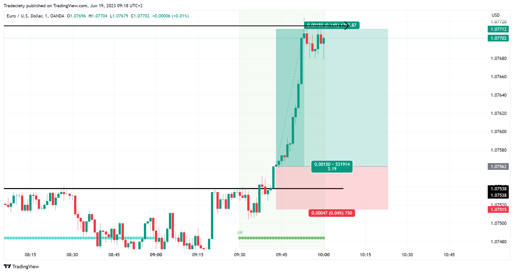

## Table of Contents

## What is day trading and how does it differ from other trading styles?

Day trading is a style of trading where people buy and sell stocks, currencies, or other financial products within the same day. They try to make money from small changes in the price of these items. Day traders usually close all their trades before the market closes, so they don't hold onto anything overnight. This means they don't have to worry about what might happen to the price while they're sleeping.

Day trading is different from other trading styles like swing trading and long-term investing. Swing traders might hold onto their trades for a few days or weeks, trying to catch bigger price moves. They are okay with keeping their trades open overnight or over weekends. Long-term investors, on the other hand, might hold onto their investments for months or years. They are more interested in the overall growth of a company or market, rather than short-term price changes. Each style has its own risks and rewards, and what works best can depend on a person's goals and how much time they can spend watching the markets.

## What are the basic principles a beginner should know before starting day trading?

Before starting day trading, it's important to understand a few basic principles. First, you need to know that day trading involves buying and selling financial products within the same day to make small profits from price changes. It requires a lot of time and attention because you need to watch the market closely. You should also be ready for the fact that day trading can be risky. You might lose money, so it's important to only trade with money you can afford to lose. Learning how to manage your money well is key, which means setting limits on how much you're willing to risk on each trade.

Another important principle is to have a good trading plan. This means deciding in advance what you will buy or sell, at what price, and when you will get out of the trade, whether you're making a profit or a loss. Sticking to your plan can help you avoid making quick decisions based on emotions like fear or greed, which can lead to bad trades. Lastly, it's helpful to start with a practice account, often called a demo account, where you can trade with fake money. This lets you get a feel for how the market works and practice your trading strategies without risking real money.

## What are the most common day trading strategies for beginners?

One common [day trading](/wiki/day-trading-spy) strategy for beginners is called "Scalping." With [scalping](/wiki/gamma-scalping), you try to make small profits from lots of tiny price changes during the day. You might buy a stock and then sell it just a few minutes later for a little bit more money. It's like trying to catch many small fish instead of waiting for one big one. This strategy needs you to watch the market very closely and act fast.

Another strategy beginners might use is "Momentum Trading." This involves finding stocks that are moving a lot in price and going up or down quickly. If a stock's price is going up fast, you buy it hoping it will keep going up so you can sell it for a profit. If it's going down fast, you might "short" it, which means you make money if the price keeps falling. The key is to jump on these fast-moving trends and get out before they change direction.

Lastly, beginners might try "Breakout Trading." This strategy involves watching for when a stock's price breaks through a certain level, like a high or low point it's been stuck at. If the price breaks above a high point, you might buy it expecting the price to keep going up. If it breaks below a low point, you might sell it or short it, expecting the price to keep going down. The trick is to spot these breakouts early and act quickly.

## How can one identify the best times of day to trade?

The best times to trade often depend on the market you're trading in, like stocks, [forex](/wiki/forex-system), or cryptocurrencies. For stock markets in the United States, the first couple of hours after the market opens are usually very busy. This is when a lot of news comes out and many people are buying and selling, which can lead to big price changes. This time is good for day traders because there's more chance to make money from these quick moves. Another good time can be right before the market closes, as people might be making last-minute trades that can also move prices a lot.

For forex markets, which are open 24 hours a day during the week, the best times are usually when two big markets are open at the same time. For example, when the London and New York markets are both open, there's a lot more trading going on, so prices can move more. This usually happens from around 8 AM to noon Eastern Time. For cryptocurrencies, the market is also open all the time, but it can get busier when big stock markets are open because more people are looking at their investments.

To find the best times for you, it can help to look at past data and see when prices moved the most in the markets you're interested in. Also, remember that what works best can change, so keep watching and learning from what happens in the market.

## What are the key technical indicators used in day trading?

In day trading, one of the key technical indicators is the Moving Average. This tool helps traders see the average price of a stock over a certain time, like 50 days or 200 days. It smooths out price changes and makes it easier to spot trends. Traders often use two moving averages, a short one and a long one, to see when they cross each other. If the short moving average goes above the long one, it might be a good time to buy because the price is going up. If it goes below, it might be a good time to sell because the price is going down.

Another important indicator is the Relative Strength Index (RSI). The RSI helps traders see if a stock is overbought or oversold. It's a number between 0 and 100. If the RSI is over 70, the stock might be overbought, which means the price might go down soon. If it's under 30, the stock might be oversold, which means the price might go up soon. Traders use this to decide when to buy or sell. It's a good way to see if a stock's price has moved too far, too fast.

The third key indicator is the Bollinger Bands. These are lines drawn above and below the moving average of a stock's price. The top line is usually two standard deviations above the moving average, and the bottom line is two standard deviations below. When the price touches the top band, it might be overbought, and when it touches the bottom band, it might be oversold. Traders watch these bands to see if the price is moving a lot or staying calm. If the bands are far apart, it means the price is moving a lot, and if they're close together, it means the price is not moving much.

## How does one manage risk effectively in day trading?

Managing risk in day trading is very important because it helps you protect your money. One way to do this is by setting stop-loss orders. A stop-loss order is like a safety net that automatically sells your stock if the price drops to a certain level. This stops you from losing too much money on one trade. Another way to manage risk is by not putting all your money into one trade. Instead, you should spread your money out over different trades. This is called diversification, and it means if one trade goes bad, you won't lose everything.

Another important part of managing risk is knowing how much money you can afford to lose. You should only use money that you don't need for important things like bills or food. This is called trading with risk capital. It's also a good idea to have a clear plan for each trade, including how much you're willing to risk and when you'll get out of the trade, whether you're making a profit or a loss. Sticking to your plan helps you avoid making quick decisions based on emotions, which can lead to big losses.

## What advanced strategies can experienced traders use to improve their day trading performance?

Experienced traders can use a strategy called "Scalping with Advanced Indicators" to improve their day trading performance. This involves using more complex technical indicators like the Stochastic Oscillator or the MACD (Moving Average Convergence Divergence) to find very short-term trading opportunities. The Stochastic Oscillator helps traders see if a stock is overbought or oversold in a more detailed way than the RSI, allowing them to make quick trades based on these signals. The MACD can help them spot changes in a stock's [momentum](/wiki/momentum), which is useful for deciding when to enter or [exit](/wiki/exit-strategy) a trade. By combining these indicators, experienced traders can make more precise and profitable trades in a short amount of time.

Another advanced strategy is "News-Based Trading." This involves closely watching economic reports, company earnings, and other news events that can cause big price moves in the market. Experienced traders use this information to predict how the market will react and make trades based on these predictions. For example, if a company reports better-than-expected earnings, a trader might buy the stock quickly, expecting the price to go up. On the other hand, if bad news comes out, they might sell or short the stock, expecting the price to drop. This strategy requires a deep understanding of how news affects the market and the ability to act fast when opportunities arise.

## How can algorithmic trading be integrated into day trading strategies?

Algorithmic trading can be a powerful tool for day traders. It involves using computer programs to buy and sell stocks based on a set of rules. These rules can be based on technical indicators, like moving averages or RSI, or they can use more complex math to find trading opportunities. By using algorithms, traders can make trades faster and more accurately than they could by hand. This can help them catch more small price moves and make more money. Plus, algorithms can trade all day without getting tired or making emotional decisions, which can lead to better results.

To use [algorithmic trading](/wiki/algorithmic-trading) in day trading, traders first need to create or buy a trading algorithm that fits their strategy. They can then set up the algorithm to run on their trading platform, which will automatically make trades based on the rules they've set. For example, a trader might program their algorithm to buy a stock when its price breaks above a certain moving average and sell it when it falls below another moving average. This way, the algorithm can watch the market and make trades even when the trader isn't looking. It's important for traders to keep an eye on how their algorithm is doing and make changes if it's not working well. This way, they can keep improving their trading strategy and performance.

## What psychological factors should traders be aware of when day trading?

When day trading, traders need to be aware of emotions like fear and greed. Fear can make traders sell their stocks too early, even if the price is still going up. They might be scared of losing money, so they get out of trades too soon and miss out on bigger profits. Greed can also be a problem. It can make traders hold onto stocks for too long, hoping for even bigger gains. But this can lead to big losses if the price suddenly drops. To do well in day trading, it's important to control these emotions and stick to a trading plan.

Another psychological [factor](/wiki/factor-investing) to watch out for is overconfidence. After making a few good trades, traders might start to think they can't lose. This can lead them to take bigger risks or trade more often than they should. Overconfidence can make traders ignore their trading plan and make quick decisions without thinking. It's important for traders to stay humble and remember that the market can be unpredictable. By staying disciplined and following their plan, traders can avoid the pitfalls of overconfidence and make better trading decisions.

## How do market news and events impact day trading strategies?

Market news and events can have a big impact on day trading strategies. When important news comes out, like a company's earnings report or a big economic announcement, it can make stock prices move a lot. Day traders need to be ready for these moves because they can create chances to make money. For example, if a company reports better earnings than expected, its stock price might go up fast. A day trader might buy the stock right away, hoping to sell it for a profit before the price goes down again. On the other hand, if bad news comes out, like a company missing its earnings goals, the stock price might drop quickly. A trader might then sell the stock or short it, expecting to make money as the price keeps falling.

To use market news and events in their strategies, day traders need to stay informed and act fast. They often use news feeds and economic calendars to keep track of when important news will come out. By knowing what to expect, traders can plan their trades around these events. For instance, they might decide to buy or sell a stock just before an earnings report, hoping to catch the first big move in the price. It's important for traders to be ready to change their plans if the market reacts differently than they expected. By staying flexible and keeping up with the news, day traders can make the most of the opportunities that market events create.

## What are the tax implications of day trading profits and losses?

Day trading profits and losses have special tax rules that traders need to know about. In the United States, if you're considered a day trader, your profits are usually taxed as ordinary income. This means they're added to your other income and taxed at your regular income tax rate, which can be as high as 37%. If you make a lot of money from day trading, this can push you into a higher tax bracket. On the other hand, if you have losses from day trading, you can use these to lower your taxable income. But there are limits to how much you can deduct each year, and any extra losses can be carried over to future years.

For people who aren't considered day traders but just trade as a hobby, things work a bit differently. Their profits are taxed as capital gains. If they hold a stock for less than a year before selling it, the profit is a short-term capital gain and is taxed at their regular income tax rate. If they hold it for more than a year, it's a long-term capital gain and is taxed at a lower rate, which can be 0%, 15%, or 20%, depending on their income. Losses can also be used to offset gains, but there are limits on how much loss you can deduct if you don't have gains to offset. It's important for traders to keep good records of all their trades to make tax time easier and to make sure they're following the rules.

## How can one evaluate and refine their day trading strategies over time?

To evaluate and refine day trading strategies over time, it's important to keep track of every trade you make. Write down the details like when you bought or sold, at what price, and why you made those choices. This helps you see what's working and what's not. Look at how much money you made or lost on each trade and compare it to what you were hoping for. If you notice that certain strategies are making more money than others, you can focus on those. If some strategies are always losing money, it might be time to change them or stop using them altogether.

After you've gathered enough data, take some time to think about what you can do better. Maybe you see that you're making good trades but getting out of them too soon. Or maybe you're holding onto losing trades for too long. You can use this information to adjust your trading plan. Try out new ideas in a practice account first to see if they work without risking real money. Keep testing and tweaking your strategies, and don't be afraid to learn from your mistakes. Over time, this will help you become a better day trader.

## What are the challenges and considerations?

Algorithmic trading systems are sophisticated and demand constant attention to ensure they perform optimally in ever-changing market environments. A key challenge is the need for continuous monitoring and adjustments. Market conditions can shift rapidly, necessitating real-time adaptations to maintain performance and profitability.

Overfitting is a significant risk when developing algorithmic trading strategies. This occurs when a strategy is excessively tailored to historical data, capturing noise rather than the underlying market structure. The result is a model that performs well in backtested scenarios but fails in live trading. To mitigate overfitting, traders might use techniques such as cross-validation and out-of-sample testing to ensure robustness.

Transaction costs, including commissions and slippage, are crucial factors to consider. These costs can erode the profitability of trading strategies, particularly those that rely on high-frequency trading where even minor inefficiencies can lead to substantial losses. Therefore, traders must account for these expenses during strategy development and [backtesting](/wiki/backtesting) to ensure that the strategy remains viable once implemented in real markets. Calculating expected transaction costs can be done using the formula:

$$
\text{Expected Cost} = \text{Spread} + (\text{Commission} \times \text{Trade Size}) + \text{Slippage}
$$

Technical issues represent another significant challenge. System failures or connectivity problems can have severe consequences, including missed opportunities and unexpected losses. Traders should implement robust fail-safes and redundancy protocols to minimize risk. This might include server uptime monitoring, multiple internet connections, and automatic alert systems to quickly respond to any disruptions in trading operations. Ensuring that the infrastructure is both reliable and resilient is essential to maintaining seamless trading activities.

Overall, while algorithmic trading offers many advantages, such as speed and precision, dealing with these challenges is integral to achieving success in the financial markets.

## References & Further Reading

[1]: Bergstra, J., Bardenet, R., Bengio, Y., & Kégl, B. (2011). ["Algorithms for Hyper-Parameter Optimization."](https://papers.nips.cc/paper/4443-algorithms-for-hyper-parameter-optimization) Advances in Neural Information Processing Systems 24.

[2]: ["Advances in Financial Machine Learning"](https://www.amazon.com/Advances-Financial-Machine-Learning-Marcos/dp/1119482089) by Marcos Lopez de Prado

[3]: ["Evidence-Based Technical Analysis: Applying the Scientific Method and Statistical Inference to Trading Signals"](https://www.amazon.com/Evidence-Based-Technical-Analysis-Scientific-Statistical/dp/0470008741) by David Aronson

[4]: ["Machine Learning for Algorithmic Trading"](https://github.com/stefan-jansen/machine-learning-for-trading) by Stefan Jansen

[5]: ["Quantitative Trading: How to Build Your Own Algorithmic Trading Business"](https://books.google.com/books/about/Quantitative_Trading.html?id=j70yEAAAQBAJ) by Ernest P. Chan