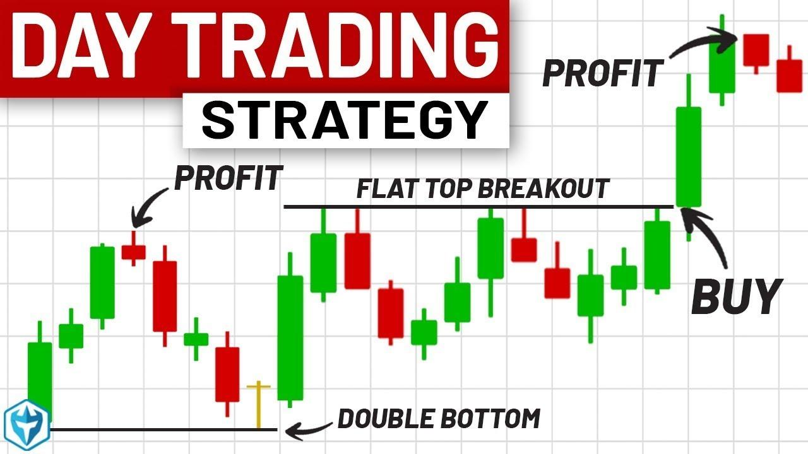

## Table of Contents

## What is day trading and how does it differ from other trading styles?

Day trading is a type of trading where people buy and sell stocks, currencies, or other financial products within the same day. They aim to make small profits from small changes in prices. Day traders usually do not hold onto their investments overnight because they want to avoid the risks that can happen when markets are closed.

Day trading is different from other trading styles like swing trading and long-term investing. Swing traders hold their investments for a few days or weeks, trying to catch bigger price movements. Long-term investors, on the other hand, might keep their investments for months or years, focusing on the overall growth of a company. Day trading requires a lot of attention and quick decisions, while swing trading and long-term investing need less daily monitoring but more patience.

## What are the basic requirements to start day trading?

To start day trading, you need a few basic things. First, you need enough money. Many brokers require a minimum amount of money to open a trading account, often around $25,000 if you want to be considered a pattern day trader in the U.S. You also need a computer or a smartphone with a good internet connection to access trading platforms and stay updated on market news.

Second, you need to choose a reliable broker. A broker is a company that lets you buy and sell financial products. Make sure to pick one that has low fees and good tools for [day trading](/wiki/day-trading-spy). You also need to learn about the markets you want to trade in. This means understanding how stocks, currencies, or other financial products work and keeping up with news that can affect their prices.

Lastly, you need to have a trading plan and the right mindset. A trading plan helps you decide when to buy and sell, and how much money you are willing to risk. Day trading can be stressful and risky, so it's important to stay calm and stick to your plan. It's also a good idea to practice with a demo account before using real money, to get a feel for how trading works.

## What are the most common day trading strategies for beginners?

One common day trading strategy for beginners is the "Breakout" strategy. This means watching a stock's price to see if it moves above or below a certain level, called a resistance or support level. When the price breaks out of this range, it often keeps moving in that direction. A beginner can buy when the price breaks above resistance and sell when it breaks below support. It's important to set stop-loss orders to limit losses if the price moves against the trade.

Another strategy is "Momentum Trading." This involves looking for stocks that are moving quickly in one direction. If a stock's price is going up fast, a beginner might buy it, hoping to sell it later at a higher price. The key is to get in and out of the trade quickly to take advantage of the [momentum](/wiki/momentum). Again, using stop-loss orders helps to manage risk if the price suddenly changes direction.

Lastly, "Scalping" is a strategy where beginners aim to make small profits from tiny price changes. Traders might buy and sell the same stock many times in a day, making a little money each time. This requires quick decisions and close attention to the market. Like the other strategies, using stop-loss orders is crucial to protect against big losses.

## How can one identify the best times of day to trade?

The best times of day to trade are usually when the markets are most active. For stocks, this is often right after the market opens at 9:30 AM Eastern Time and just before it closes at 4:00 PM Eastern Time. During these times, more people are buying and selling, which can lead to bigger price moves. It's good to pay attention to the first hour of trading because that's when a lot of news and reactions to news happen, making prices move a lot.

For [forex](/wiki/forex-system) trading, the best times are when multiple major markets are open at the same time. This happens during the overlap of the London and New York sessions, from about 8:00 AM to 12:00 PM Eastern Time. During this period, there's a lot of trading happening, which can create good opportunities for making money. It's also a good idea to watch out for times when important economic reports are released, as these can cause big price changes.

In general, the key is to trade when there's a lot of activity. This is when you're more likely to see the price movements you need to make money. But remember, trading during busy times can also be riskier, so always use stop-loss orders to protect your money.

## What are the key technical indicators used in day trading?

In day trading, some common technical indicators help traders make decisions. One popular indicator is the Moving Average, which shows the average price of a stock over a certain time period. Traders use short-term and long-term moving averages to spot trends. If a short-term moving average crosses above a long-term one, it might be a good time to buy. If it crosses below, it might be a good time to sell. Another useful indicator is the Relative Strength Index (RSI), which measures how fast prices are moving up or down. If the RSI is over 70, the stock might be overbought and due for a price drop. If it's under 30, the stock might be oversold and ready for a price increase.

Another key indicator is the Bollinger Bands, which show the highest and lowest prices a stock has reached recently. The bands get wider when prices are moving a lot and narrower when they're not moving much. Traders look for the price to touch the upper band as a sign to sell and the lower band as a sign to buy. The Volume indicator is also important because it shows how many shares are being traded. High [volume](/wiki/volume-trading-strategy) can mean a strong trend, while low volume might mean the trend is weak. By using these indicators together, day traders can make better guesses about when to buy and sell.

## How does one manage risk effectively in day trading?

Managing risk in day trading is very important to avoid losing too much money. One key way to do this is by using stop-loss orders. A stop-loss order is like a safety net that automatically sells your stock if the price drops to a certain level. This helps limit your losses if the market moves against you. Another important part of managing risk is not using too much of your money on one trade. Traders often talk about "position sizing," which means only risking a small part of your total money on each trade, like 1% or 2%. This way, even if you lose on a trade, it won't hurt your overall money too much.

Another way to manage risk is by having a clear trading plan and sticking to it. A trading plan helps you decide when to buy and sell, and how much money you are willing to risk. It's important to follow your plan and not let emotions like fear or greed make you do things you shouldn't. Also, it's a good idea to keep learning and practicing. Using a demo account to practice trading without real money can help you get better at managing risk before you start trading with real money. By using these methods, you can better protect your money and trade more safely.

## What are advanced day trading strategies that require more experience?

One advanced day trading strategy is "Range Trading." This strategy involves finding stocks that tend to move within a certain price range during the day. Experienced traders will buy the stock when it hits the lower end of the range and sell it when it reaches the higher end. The key to success with range trading is understanding the stock's behavior and being able to predict when it will hit the top or bottom of its range. This strategy requires a lot of watching and quick decisions, so it's not for beginners.

Another advanced strategy is "News Trading." This means trading based on news events that can affect stock prices. Experienced traders will look for news like earnings reports, economic data releases, or big company announcements. They try to predict how the market will react to this news and make trades based on those predictions. News trading can be very risky because the market can move quickly and unexpectedly, but it can also be very rewarding if you get it right. It takes a lot of knowledge about the market and the ability to think fast.

A third advanced strategy is "Algorithmic Trading." This involves using computer programs to make trading decisions based on a set of rules. Traders who use this strategy will write or buy software that can analyze market data and execute trades much faster than a human could. This can be very powerful because it takes the emotion out of trading and can find opportunities that a person might miss. However, it requires a good understanding of programming and a lot of time to set up and test the algorithms.

## How can one use leverage in day trading and what are the risks involved?

Leverage in day trading means borrowing money from your broker to buy more stocks than you could with just your own money. It's like using a credit card to buy something you can't afford right now. For example, if you have $10,000 and your broker gives you 2:1 leverage, you can trade with $20,000. This can help you make more money if the stock price goes up, but it also means you can lose more money if the price goes down. Many brokers let you use leverage, but you need to understand how it works and be careful with it.

The big risk with leverage is that it can make your losses much bigger. If the stock price goes down, you still have to pay back the money you borrowed, even if you lost money on the trade. This can lead to a "margin call," where your broker asks you to put more money into your account or sell some of your stocks to cover the loan. If you can't do that, the broker might sell your stocks without asking you first, which can be bad if the prices are low. So, using leverage can be a powerful tool, but it's important to use it wisely and understand the risks.

## What psychological factors should day traders be aware of?

Day traders need to be aware of their emotions, like fear and greed. Fear can make them sell their stocks too soon, even if the price might go up later. Greed can make them hold onto stocks too long, hoping for even bigger profits, which can lead to big losses if the price suddenly drops. It's important for day traders to stick to their trading plan and not let these emotions control their decisions. One way to do this is by setting clear rules for when to buy and sell and sticking to them, no matter what their emotions are telling them.

Another psychological [factor](/wiki/factor-investing) is the need for discipline. Day trading can be exciting, but it's also a lot of work. Traders need to be disciplined enough to spend time learning about the market, watching their trades, and sticking to their plan. It's easy to get lazy or distracted, but that can lead to bad decisions and losses. Having a routine and setting goals can help traders stay disciplined and focused on their trading.

## How do market trends and news affect day trading decisions?

Market trends and news can have a big impact on day trading decisions. When a stock is in an upward trend, meaning its price is going up over time, day traders might be more likely to buy it, hoping to sell it later at a higher price. On the other hand, if a stock is in a downward trend, traders might decide to sell or avoid buying it because they think the price will keep going down. Trends help traders guess where the price might go next, but they are not always right, so traders need to be careful.

News can also make a big difference in day trading. When important news comes out, like a company's earnings report or a big economic announcement, it can cause the stock price to move a lot in a short time. Day traders who know about these news events can try to predict how the market will react and make trades based on that. For example, if a company reports better earnings than expected, the stock price might go up, so a trader might buy the stock right after the news comes out. But news can be tricky because it's hard to predict exactly how the market will react, so traders need to be ready for surprises.

## What are the tax implications of day trading?

Day trading can have special tax rules that are different from regular investing. In the United States, if you do a lot of day trading, you might be considered a "pattern day trader." This means you need to be careful about how you report your earnings on your taxes. The money you make from day trading is usually seen as short-term capital gains, which means it's taxed at the same rate as your regular income. This can be higher than the tax rate for long-term investments, which you hold for more than a year. It's important to keep good records of all your trades, including when you bought and sold, how much you paid, and how much you made or lost.

Another thing to think about is the "wash-sale rule." This rule says you can't claim a loss on your taxes if you buy the same or a similar stock within 30 days before or after the sale. This can be tricky for day traders who trade the same stocks often. Also, if you're day trading as a business, you might be able to deduct some of your trading expenses, like the cost of your computer or trading software. But you need to talk to a tax professional to make sure you're doing everything right and not missing any important rules.

## How can one evaluate and improve their day trading performance over time?

To evaluate and improve day trading performance over time, it's important to keep a trading journal. In this journal, write down every trade you make, including when you bought and sold, the price, and how much money you made or lost. Also, note down why you made each trade and how you felt about it. By looking back at your journal, you can see patterns in your trading, like which strategies work best for you and when you make the most mistakes. This can help you figure out what to do more of and what to change.

Improving your performance also means learning from your mistakes and successes. If you see that you often lose money because you're holding onto stocks too long, you can work on setting stricter rules for when to sell. If you notice you do well with certain types of stocks or at certain times of the day, you can focus more on those. It's also helpful to keep learning about the market and trying out new strategies. Talking to other traders or joining a trading community can give you new ideas and help you see things from different angles.

## References & Further Reading

[1]: Bergstra, J., Bardenet, R., Bengio, Y., & Kégl, B. (2011). ["Algorithms for Hyper-Parameter Optimization."](https://dl.acm.org/doi/10.5555/2986459.2986743) Advances in Neural Information Processing Systems 24.

[2]: ["Advances in Financial Machine Learning"](https://www.amazon.com/Advances-Financial-Machine-Learning-Marcos/dp/1119482089) by Marcos Lopez de Prado

[3]: ["Evidence-Based Technical Analysis: Applying the Scientific Method and Statistical Inference to Trading Signals"](https://www.amazon.com/Evidence-Based-Technical-Analysis-Scientific-Statistical/dp/0470008741) by David Aronson

[4]: ["Machine Learning for Algorithmic Trading"](https://github.com/PacktPublishing/Machine-Learning-for-Algorithmic-Trading-Second-Edition) by Stefan Jansen

[5]: ["Quantitative Trading: How to Build Your Own Algorithmic Trading Business"](https://books.google.com/books/about/Quantitative_Trading.html?id=j70yEAAAQBAJ) by Ernest P. Chan