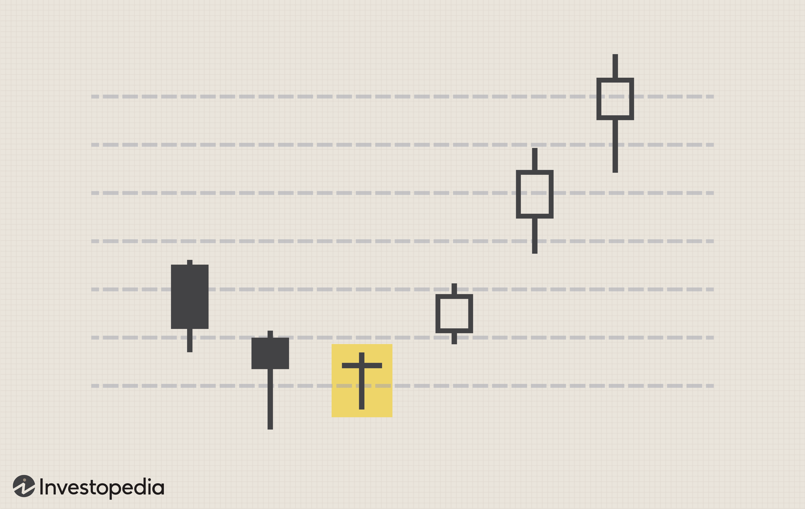

Stock market trading is a cornerstone of the global financial system. It facilitates the buying and selling of stocks, bonds, and other securities in a regulated environment, thereby contributing to economic growth and wealth distribution. The importance of stock market trading lies in its ability to provide liquidity, enable companies to raise capital, and offer investors opportunities for profit and financial diversification.

Among the myriad trading strategies, day trading and algorithmic (algo) trading have surged in popularity. Day trading involves buying and selling financial instruments within the same trading day, capitalizing on short-term market movements. It is a strategy favored by those who seek to exploit rapid price fluctuations, often operating in highly volatile markets. On the other hand, algorithmic trading utilizes computer programs and algorithms to automate trading based on predetermined criteria. This strategy allows for quick execution of trades, often at speeds and complexities beyond human capacity.



Understanding these trading strategies is crucial for anyone aspiring to succeed in the stock market. Each strategy requires a distinct set of skills and tools and comes with its own set of advantages and limitations. Being well-versed in various strategies helps traders make informed decisions that align with their financial goals and risk tolerance.

The primary objective of this article is to impart comprehensive knowledge of day trading and algorithmic trading strategies. It aims to elucidate their characteristics, benefits, and challenges, thereby aiding traders in selecting the strategy that best fits their needs.

Engaging in stock market trading has potential rewards, such as high returns on investment and portfolio diversification. However, it is equally fraught with risks, including market volatility and the chance of losing capital. Effective trading requires not only a grasp of market fundamentals but also the ability to manage these risks judiciously. Traders must continuously learn and adapt in response to ever-changing market conditions, balancing the thrill of potential rewards against the caution necessitated by inherent risks.

## Table of Contents

## Understanding Day Trading

Day trading is a financial strategy involving the buying and selling of financial instruments within the same trading day. This approach capitalizes on small price fluctuations, aiming to exploit market volatility for short-term gains. Unlike traditional investing, day traders do not hold positions overnight, minimizing exposure to price movements that occur after the market closes.

**Characteristics of Day Trading**

Day trading is characterized by its short-term focus, speculative nature, and dependency on market [volatility](/wiki/volatility-trading-strategies). Traders seek opportunities in the rapid price movements of stocks, currencies, or commodities, executing multiple trades throughout the day. This approach requires real-time monitoring and quick decision-making, as successful trades rely on seizing fleeting market opportunities.

**Benefits of Day Trading**

The primary benefit of [day trading](/wiki/day-trading-spy) lies in its potential for quick profits. By making numerous trades in a day, traders can compound small gains into significant returns. Moreover, day traders engage actively with the market, honing skills and strategies in a dynamic environment that rewards focus and agility. This active participation can provide a sense of immediacy and control, appealing to those who prefer hands-on involvement in financial markets.

**Challenges of Day Trading**

Day trading presents substantial challenges, primarily due to its high-risk nature. The potential for rapid financial loss is significant, given the speculative approach and volatility dependence. Constant market monitoring is essential, requiring traders to dedicate significant time and attention. Emotional stress is another [factor](/wiki/factor-investing), as the pressure to perform can impact decision-making and lead to impulsive trades.

**Examples of Common Day Trading Techniques**

Day traders employ various techniques to navigate market volatility. Two prominent methods are:

1. **Scalping**: This technique involves making numerous small trades to capture minor price movements. Scalpers aim to accumulate profits from small price changes over the course of the day, often holding positions for just minutes.

2. **Momentum Trading**: Traders using this approach look for stocks exhibiting strong upward or downward trends. Momentum traders capitalize on market shifts, hoping to ride the trend until signals indicate a reversal.

These techniques require a deep understanding of market conditions and the ability to act swiftly based on technical analysis and market data. Effective day trading rests on balancing the pursuit of immediate profits with prudent risk management strategies.

## Keys to Successful Day Trading

A well-defined day trading plan is essential for success as it guides traders in making disciplined and consistent decisions in the high-paced environment of the stock market. This plan should outline specific trading goals, identify preferred markets, and detail the strategies to be used throughout various market conditions. By sticking to a plan, traders can avoid impulsive decisions driven by emotions, which often lead to losses.

Risk management plays a critical role in day trading. The practice of setting stop-loss and take-profit levels is fundamental. Stop-loss orders help limit potential losses by automatically selling a security once it reaches a predetermined price, safeguarding against significant market downturns. Conversely, take-profit levels ensure that gains are secured when the asset price hits a target, preventing greed from eroding profits.

Leveraging technical analysis tools is pivotal for making informed trading decisions. Chart patterns, such as candlesticks or moving averages, alongside indicators like the Relative Strength Index (RSI) or Bollinger Bands, provide valuable insights into market trends and potential price movements. These tools help traders identify entry and [exit](/wiki/exit-strategy) points, enhancing their ability to capitalize on short-term price fluctuations.

The role of news and market sentiment in day trading success cannot be overstated. Economic announcements, geopolitical events, and company earnings reports can cause swift market movements. Traders must stay informed and act swiftly on news releases, often combining this information with technical analysis to make quick, informed decisions. Monitoring market sentiment, or the overall feeling traders and investors have about the market, also provides a clue about potential trends and reversals.

Psychological aspects are equally crucial in ensuring successful day trading. Maintaining discipline involves sticking to the defined trading plan even during volatile market conditions. Emotional control is critical; fear and greed can lead to irrational decisions that deviate from strategy and common sense. Techniques such as meditation, taking breaks, or employing automated trading systems can help manage stress and maintain a clear, focused mindset. By combining a sound trading plan, effective risk management, technical analysis, up-to-the-minute news awareness, and strong psychological control, traders enhance their chances of consistently achieving favorable outcomes in the stock market.

 to Algorithmic Trading

Algorithmic trading, commonly known as algo trading, refers to the use of computer programs and algorithms to automatically execute trading orders in financial markets. This method of trading heavily relies on advanced mathematical models and specific algorithms that determine order timing, pricing, and quantity. These algorithms, once programmed, are capable of executing trades at much higher speeds and frequencies than a human trader could achieve manually.

One of the primary benefits of [algorithmic trading](/wiki/algorithmic-trading) is its ability to process and react to market data with precision and speed. By leveraging high-speed computers, algo trading can exploit slight price differences and market inefficiencies in fractions of a second, a process known as high-frequency trading ([HFT](/wiki/high-frequency-trading-strategies)). This speed advantage allows traders and institutions to execute a large number of trades quickly, reducing transaction costs and potentially improving the efficiency of trade execution.

Algorithmic trading offers several advantages, including increased efficiency, the elimination of human error in decision-making processes, and the capacity to perform intricate calculations instantaneously. Algorithms can process vast amounts of data, including historical prices and volumes, to make informed decisions based on predefined criteria. This computational capability makes it feasible to implement complex strategies that would be impossible or impractical for human traders to [carry](/wiki/carry-trading) out manually.

However, algorithmic trading is not without its challenges and drawbacks. One significant challenge is the requirement for substantial technical skills. Traders need to have a strong understanding of programming languages, statistical methods, and financial markets to develop and manage effective algorithms. Additionally, high-quality and accurate data is crucial for the successful implementation of algo trading strategies. Poor or biased data can lead to incorrect predictions and result in substantial financial losses.

Furthermore, the dependency on technology introduces risks such as network failures, software bugs, and other technical glitches that can disrupt trading operations. To mitigate these risks, robust risk management and real-time monitoring systems must be in place.

The variety of algorithms used in trading is vast, ranging from simple rules-based models, such as moving averages or mean reversion strategies, to sophisticated models incorporating [machine learning](/wiki/machine-learning) techniques. Machine learning models can identify complex patterns in data and adapt to new information, offering the potential for more dynamic and responsive trading strategies. As technology continues to evolve, the integration of [artificial intelligence](/wiki/ai-artificial-intelligence) and [deep learning](/wiki/deep-learning) in algorithmic trading is expected to enhance its capabilities further, paving the way for more innovative and effective trading models.

In Python, basic algorithmic trading systems may utilize libraries such as NumPy, pandas, and scikit-learn for data manipulation and analysis. More advanced platforms might leverage TensorFlow or PyTorch for implementing neural networks in trading models. Here's a simple illustration of a moving average crossover strategy:

```python
import pandas as pd
import numpy as np

# Load historical stock price data
data = pd.read_csv('stock_prices.csv')

# Calculate short-term and long-term moving averages
short_term_window = 50
long_term_window = 200

data['Short_MA'] = data['Close'].rolling(window=short_term_window, min_periods=1).mean()
data['Long_MA'] = data['Close'].rolling(window=long_term_window, min_periods=1).mean()

# Generate signals
data['Signal'] = 0
data['Signal'][short_term_window:] = np.where(
    data['Short_MA'][short_term_window:] > data['Long_MA'][short_term_window:], 1, 0
)

# Determine positions
data['Position'] = data['Signal'].diff()

# Print the resulting DataFrame with signals
print(data)
```

In this example, a simple moving average crossover strategy is developed where trading signals are generated when the short-term moving average crosses above or below the long-term moving average. This type of strategy is one of the simplest forms of algorithmic trading, demonstrating the principles of rule-based algorithms. As indicated, the need for quality data and accurate calculations is integral to such strategies' success.

## Strategies for Successful Algo Trading

Designing and testing trading algorithms with historical data, known as [backtesting](/wiki/backtesting), is a fundamental strategy in algorithmic trading. Backtesting enables traders to simulate their algorithm's performance over past market data, providing insights into potential profitability and risk. By replicating how the algorithm would have performed historically, traders can evaluate its robustness and refine rules before implementing them in live trading. To conduct effective backtests, traders require high-quality historical data and attention to transaction costs, slippage, and market impact to ensure realistic results.

Choosing the right platform and software is crucial for the success of algorithmic trading. Traders should consider factors such as execution speed, access to data, integration capabilities, and supported programming languages. Platforms like MetaTrader, NinjaTrader, and TradeStation offer comprehensive environments for developing, testing, and deploying algorithms. These tools provide an interface for defining trading strategies using scripting languages, which can range from high-level languages like Python to proprietary scripting options.

Incorporating risk management within algorithms is essential to protect investments. This includes setting predefined conditions for stop-loss and take-profit levels to limit potential losses and lock in gains. Risk management can also involve diversification, where the algorithm is programmed to distribute investments across various assets or markets to reduce exposure to any single source of risk. Additionally, position sizing strategies, such as the Kelly Criterion or fixed fractional method, can be embedded within the algorithm to optimize the amount allocated per trade based on risk appetite and capital availability.

Examining case studies of successful algo trading strategies can provide valuable insights and inspiration for traders. One notable example is Renaissance Technologies' Medallion Fund, which notoriously employs [quantitative trading](/wiki/quantitative-trading) methods to achieve consistent high returns. Other cases include statistical [arbitrage](/wiki/arbitrage) strategies, which exploit short-term price differences between separate markets or securities, and trend-following strategies, which capitalize on prolonged market movements. Analyzing these strategies helps identify elements that contribute to success, such as robust model selection, data accuracy, and efficient execution.

The future of algorithmic trading lies in the advancements of artificial intelligence (AI) and machine learning (ML). These technologies enable algorithms to learn from vast amounts of data, identifying complex patterns and making data-driven decisions with minimal human intervention. AI-powered algorithms can adapt to changing market conditions, improve predictive accuracy, and optimize trade execution. Continued progress in AI and ML holds the promise of more sophisticated models, capable of executing intricate trading strategies with enhanced precision and efficiency.

## Comparing Day Trading and Algo Trading

Day trading and algorithmic (algo) trading, though distinct in approach, share several similarities that make them popular strategies in stock market trading. Both strategies aim to exploit short-term price movements to generate profits and often rely on technical analysis to inform decisions. However, the methods they use to achieve this goal differ significantly.

**Similarities between Day Trading and Algo Trading Strategies**

One key similarity between day trading and algorithmic trading is the focus on short-term market movements. Both strategies leverage the volatility and [liquidity](/wiki/liquidity-risk-premium) of financial markets to capitalize on price changes. Traders employing these techniques predominantly use technical analysis, such as chart patterns and indicators, to make real-time decisions. Furthermore, both strategies necessitate continuous learning and adaptation to evolve with market conditions and incorporate the latest tools and insights.

**Key Differences in Approach, Time Commitment, and Expertise**

The most significant difference between the two strategies lies in their execution. Day trading requires active participation, with traders manually executing trades based on real-time market analysis. This approach demands significant time commitment, as traders need to monitor the markets and adjust their strategies throughout the day. The expertise required centers around understanding market trends, technical indicators, and possessing the ability to make quick decisions under pressure.

Conversely, algorithmic trading relies on computers to automate the trading process through pre-defined rules. This method allows for the execution of trades at high speed and frequency, reducing the need for continuous manual intervention. The expertise required here is more technical, with traders needing knowledge of programming (e.g., Python) and an understanding of backtesting and data analysis to create and optimize trading algorithms.

**Pros and Cons of Each Strategy Based on Trader’s Goals and Resources**

The advantages of day trading include the potential for high returns due to active engagement in volatile markets and the satisfaction of making quick, informed decisions. However, this strategy is labor-intensive and can lead to emotional stress due to constant market monitoring.

Algorithmic trading, on the other hand, offers efficiency and reduced potential for human error as trades are executed automatically. It enables the handling of complex calculations and can lead to more disciplined trading due to its systematic nature. The challenges include the initial technical expertise required to design and maintain trading algorithms and the reliance on high-quality data for optimal performance.

**Integrating Both Approaches for a Diversified Trading Strategy**

Traders can integrate both day trading and algorithmic trading to take advantage of the strengths of each approach. For instance, a trader might use algorithmic trading to automate routine tasks or capitalize on short-lived market opportunities while employing day trading techniques to engage personally with longer, strategic trades. This combination can offer both flexibility and precision, allowing traders to diversify their strategies and potentially increase their chances of success.

**Tips on Choosing the Right Approach**

Selecting the appropriate trading strategy depends largely on individual trading styles, goals, and available resources. Traders who prefer hands-on engagement and have the time to dedicate to real-time monitoring may lean towards day trading. Those who are technologically inclined and can invest the resources needed to develop sophisticated trading algorithms may find algorithmic trading more suitable.

Ultimately, the choice of strategy should align with the trader's financial goals, risk tolerance, personal skills, and commitment level. As both strategies continue to evolve with advancements in technology and access to data, traders are encouraged to continuously refine their approaches and adapt to the ever-changing landscape of stock market trading.

## Conclusion

In conclusion, this article has provided an exploration of both day trading and algorithmic (algo) trading strategies, each with its unique characteristics, benefits, and challenges. Day trading, characterized by its short-term focus and reliance on market volatility, allows traders to engage actively with the potential for quick profits. Meanwhile, algo trading utilizes sophisticated algorithms to capitalize on speed and data, offering efficiency and minimizing human error, but requiring technical proficiency and high-quality data.

A crucial takeaway from examining these strategies is the importance of continuous learning and adaptation in the stock market. The financial environment is ever-evolving, and staying informed about market trends, new technologies, and emerging strategies is vital for success.

Traders are encouraged to practice and refine their strategies in real market conditions, which provides invaluable insights beyond theoretical knowledge. This hands-on experience aids in understanding nuances and honing decision-making skills, which are essential components of effective trading.

Balancing risk and reward is another paramount consideration. Both day trading and algo trading involve significant levels of risk. Successful traders employ robust risk management practices, such as setting stop-loss orders or incorporating protective algorithms, to safeguard their investments while exploiting opportunities for profit.

Finally, traders should continuously seek further resources and tools to enhance their trading skills. This can involve accessing educational material, utilizing advanced trading platforms, or engaging in communities with fellow traders. By remaining committed to learning and skill development, traders can better navigate the complexities of the stock market and increase their chances of success.

## References & Further Reading

[1]: Bergstra, J., Bardenet, R., Bengio, Y., & Kégl, B. (2011). ["Algorithms for Hyper-Parameter Optimization."](https://dl.acm.org/doi/10.5555/2986459.2986743) Advances in Neural Information Processing Systems 24.

[2]: ["Advances in Financial Machine Learning"](https://www.amazon.com/Advances-Financial-Machine-Learning-Marcos/dp/1119482089) by Marcos Lopez de Prado

[3]: ["Evidence-Based Technical Analysis: Applying the Scientific Method and Statistical Inference to Trading Signals"](https://www.amazon.com/Evidence-Based-Technical-Analysis-Scientific-Statistical/dp/0470008741) by David Aronson

[4]: ["Machine Learning for Algorithmic Trading"](https://github.com/PacktPublishing/Machine-Learning-for-Algorithmic-Trading-Second-Edition) by Stefan Jansen

[5]: ["Quantitative Trading: How to Build Your Own Algorithmic Trading Business"](https://books.google.com/books/about/Quantitative_Trading.html?id=j70yEAAAQBAJ) by Ernest P. Chan