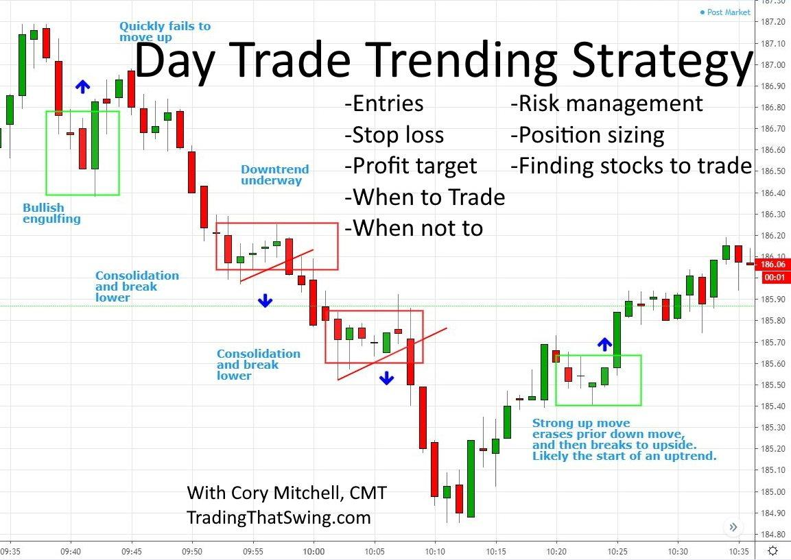

Trading is a compelling field that has captivated both individuals and institutions aiming to capitalize on the potential of financial markets. Two significant methods in trading are day trading and algo trading, each presenting distinct opportunities and challenges. Day trading involves executing numerous trades within a single day, leveraging short-term market movements to potentially gain profits or realize losses quickly. In contrast, algorithmic trading, or algo trading, uses sophisticated computer algorithms to automate trading decisions and executions, potentially optimizing efficiency and minimizing the role of human emotion in decision-making processes.

This article is dedicated to examining the intricacies of trading, with a particular focus on the risks and strategies associated with day trading and algo trading. Day traders and algo traders face a dynamic landscape that requires constant adaptation and strategy refinement to succeed. Market conditions can change rapidly, influencing the efficacy of various trading strategies and necessitating an agile approach to trade execution.



Understanding the elements of trading is crucial for anyone aspiring to thrive in these high-speed, high-stakes markets. Navigating the challenges and developing robust strategies are essential to managing the risks inherent in day trading and algo trading. This exploration aims to equip traders with the insights needed to make informed decisions in the ever-evolving world of trading.

## Table of Contents

## Understanding Trading Risks

Trading inherently involves risks that traders must navigate to achieve success. These risks are primarily influenced by market volatility, leverage, and trader psychology, all of which can significantly impact trading outcomes.

Day trading is characterized by executing trades within a single day, aiming to leverage short-term market movements. This style requires traders to make swift decisions due to rapid market fluctuations, which can lead to amplified outcomes. The fast-paced environment can increase both the potential for substantial profits and the risks of significant losses. Traders must be adept at analyzing market data and executing their strategies under pressure, necessitating strong decision-making skills and emotional resilience.

Algorithmic trading, or algo trading, introduces a different set of risks. It relies on computer algorithms to automate trading decisions and executions. While this method can offer precision and speed, it also poses risks such as technological failures. Software glitches, connectivity issues, and the risk of over-optimization—where a system is excessively tailored to historical data—can adversely affect trading performance. Overly optimized algorithms may fail under different market conditions, leading to unforeseen losses.

To mitigate these risks, effective risk management strategies are crucial. Setting stop-loss orders, which automatically sell a security when it reaches a certain price, is a common practice to limit potential losses. Utilizing appropriate leverage is also vital; while leverage can amplify gains, it can equally magnify losses if not used judiciously. 

Understanding prevailing market conditions is essential to managing trading risks. Market dynamics can be unpredictable, and traders must remain informed about economic indicators, geopolitical events, and other factors that influence market movements. Employing disciplined trading practices, such as sticking to a well-thought-out trading plan and avoiding emotional decision-making, can reduce exposure to unnecessary risks. 

In summary, trading involves navigating a complex landscape of risks and rewards. Whether one is engaged in [day trading](/wiki/day-trading-spy) or algo trading, effective risk management, an understanding of market dynamics, and disciplined trading practices are paramount to achieving success.

## Effective Day Trading Strategies

Day trading strategies are crafted to harness the rapid fluctuations of short-term market movements, thereby generating profits within a single trading day. Scalping, one of the most prevalent strategies, involves executing a large number of trades to capture small price differences. The aim is not to make huge profits on each trade but to accumulate considerable gains over time. For example, a scalper might buy a stock at $50 and sell it when it reaches $50.10, repeating this process multiple times throughout the day. This approach requires rigorous focus and quick decision-making skills, often employing sophisticated trading software to manage trades effectively and reduce execution time.

Range trading is another common strategy that relies on identifying the levels of support and resistance within a security’s price movement. Traders buy near the support level, anticipating a reversal in price direction, and sell near the resistance, expecting the ceiling of the range to hold. For instance, if a stock is consistently bouncing between $100 (support) and $110 (resistance), a range trader buys at $100 and sells at $110. This method assumes price stability within a certain range and requires a keen eye for trend identification, particularly when the range is breaking.

News-based trading capitalizes on the [volatility](/wiki/volatility-trading-strategies) sparked by significant market announcements or economic reports. Traders closely monitor financial news channels and economic calendars to anticipate and react to events like earnings releases, economic data, or geopolitical developments. The intense price swings associated with such news present lucrative opportunities for traders who can execute rapid trades based on their interpretations of how the news will affect the market. This strategy demands excellent analytical skills and real-time access to news feeds to make immediate trading decisions.

To succeed, traders must maintain flexibility and adaptability in their strategies. Market conditions can affect asset prices, requiring traders to swiftly modify their approaches. A combination of technical analysis, solid understanding of market trends, and a disciplined mindset becomes critical. Successful day traders often integrate stop-loss orders to limit potential losses and adjust their trading strategies to align with fluctuating market dynamics. By staying informed and agile, traders can optimize their trading performance and capitalize on fleeting market opportunities.

## Algo Trading: An Overview

Algorithmic trading, often referred to as algo trading, utilizes sophisticated algorithms to automate trading processes. This approach enables traders to execute orders with remarkable speed and precision, minimizing manual intervention and reducing emotional biases that can affect trading decisions.

Common [algorithmic trading](/wiki/algorithmic-trading) strategies consist of methods like [arbitrage](/wiki/arbitrage), trend-following, and mean reversion. Arbitrage exploits price discrepancies of the same or similar financial instruments across different markets or forms. For example, a trader might simultaneously buy and sell an asset to profit from the price difference. Trend-following strategies identify and capitalize on the directional movement of asset prices, assuming that they will continue in the same direction for some time. Mean reversion strategies, on the other hand, are based on the premise that asset prices will revert to their historical means or averages over time, thus identifying overbought or oversold conditions to generate trade signals.

Backtesting is an essential step in the development of algorithmic trading strategies. It involves testing strategy effectiveness on historical data to assess how it would have performed in the past. Through [backtesting](/wiki/backtesting), traders can evaluate the potential profitability and risk of a strategy. For example, a Python script using libraries such as Pandas and Numpy can be used to perform a simple backtest of a moving average crossover strategy:

```python
import pandas as pd

# Load historical market data into a DataFrame
data = pd.read_csv('historical_data.csv', parse_dates=True, index_col='Date')

# Calculate moving averages
data['Short_MA'] = data['Close'].rolling(window=40).mean()
data['Long_MA'] = data['Close'].rolling(window=100).mean()

# Generate buy and sell signals
data['Signal'] = 0
data['Signal'][40:] = np.where(data['Short_MA'][40:] > data['Long_MA'][40:], 1, 0)
data['Position'] = data['Signal'].diff()

# Strategic review: Calculate returns
data['Strategy_Returns'] = data['Position'].shift(1) * (data['Close'].pct_change())

# Output the performance of the strategy
print(data['Strategy_Returns'].cumsum().plot())
```

Understanding market microstructure is crucial for algorithmic traders as it affects how orders are executed and impacts strategy performance. Factors such as [order book](/wiki/order-book-trading-strategies) dynamics, price impact, and transaction costs need to be carefully managed to optimize the execution process.

Developing robust algorithms necessitates the integration of real-time market data analysis and continuous performance evaluation. Algorithms must adapt to changing market conditions to remain effective. This often involves ongoing refinement and optimization of algorithms, as well as incorporating [machine learning](/wiki/machine-learning) techniques for improved predictive power and adaptability.

In summary, algorithmic trading offers traders precision and efficiency, enabling them to capitalize on market opportunities with reduced emotional influence. By employing strategies like arbitrage, trend-following, and mean reversion, and conducting diligent backtesting and performance evaluation, traders can harness algorithmic trading's full potential for successful market engagement.

## Comparing Day Trading and Algo Trading

Day trading relies significantly on the intuition and analytical capabilities of traders. Human judgment plays a central role as traders monitor multiple data points, analyze market conditions, and make rapid decisions to exploit short-lived opportunities. This approach demands a profound understanding of market dynamics and the quick processing of evolving information. The human element in day trading offers flexibility in strategy adaptation but can be susceptible to emotional biases and errors during periods of heightened volatility.

Conversely, algorithmic trading, or algo trading, minimizes human intervention by executing trades based on pre-defined algorithms and computational models. This method offers precision and speed, processing vast data quantities in real-time to optimize trade execution. Algo trading strategies, formulated with mathematical models and computer programs, can consistently adhere to a planned approach without the pitfalls of human emotions. This automation allows for executing trades with greater accuracy and efficiency, often capitalizing on market opportunities not accessible in manual trading environments.

Both day trading and algo trading present distinct advantages and challenges. Day trading's primary strength lies in its flexibility, enabling traders to modify strategies in response to immediate market conditions. However, the reliance on human decision-making can be a double-edged sword, often leading to inconsistent outcomes influenced by emotional reactions to market pressures.

In contrast, algo trading excels in its systematic approach, providing traders with the ability to execute trades at unprecedented speeds and with meticulous accuracy. This can be particularly beneficial in markets that react swiftly to new information. Yet, the rigidity of algorithmic models can pose risks, such as failing to account for unprecedented market anomalies or the technological vulnerabilities inherent in automated systems.

Understanding the strengths and weaknesses of each approach allows traders to align their strategy with personal skills and objectives. For individuals who thrive in dynamic environments and possess strong analytical skills under pressure, day trading may offer a more suitable path. For those who favor methodical, data-driven decision-making, algo trading offers a compelling alternative. 

Ultimately, the choice between day trading and algo trading depends on individual trader preferences, risk tolerance, and resource availability. A well-informed decision requires assessing the market environment, personal expertise, and the tools at one's disposal.

## Conclusion

Trading, whether through day trading or algo trading, is a continuous journey marked by significant risks and potential rewards. Success demands active engagement with the markets, necessitating continuous learning to stay abreast of new developments and strategies. Effective risk management is a cornerstone of successful trading, playing a crucial role in safeguarding against unpredictable market fluctuations. 

Understanding market dynamics is vital, as the financial markets are influenced by a plethora of factors such as economic indicators, geopolitical events, and investor sentiment. Traders must be disciplined, adhering to their trading plans while remaining adaptable to evolving market conditions. This strategic adaptability is essential in optimizing trading outcomes as markets rarely behave in a predictable manner.

Day trading requires quick reflexes and instantaneous decision-making, capitalizing on short-term market movements. Conversely, algo trading employs systematic precision, utilizing pre-defined algorithms to execute trades with speed and accuracy. Regardless of the approach, staying informed through continuous education and market analysis equips traders with the necessary tools to remain agile in their strategies.

The insights provided in this article aim to furnish traders with a robust foundation of knowledge, enabling them to navigate the complexities of trading with confidence. By staying disciplined and informed, traders are better positioned to leverage opportunities while mitigating risks, thus enhancing their potential for success in the fast-paced world of trading.

## References & Further Reading

[1]: Bergstra, J., Bardenet, R., Bengio, Y., & Kégl, B. (2011). ["Algorithms for Hyper-Parameter Optimization."](https://dl.acm.org/doi/10.5555/2986459.2986743) Advances in Neural Information Processing Systems 24.

[2]: ["Advances in Financial Machine Learning"](https://www.amazon.com/Advances-Financial-Machine-Learning-Marcos/dp/1119482089) by Marcos Lopez de Prado

[3]: ["Evidence-Based Technical Analysis: Applying the Scientific Method and Statistical Inference to Trading Signals"](https://www.amazon.com/Evidence-Based-Technical-Analysis-Scientific-Statistical/dp/0470008741) by David Aronson

[4]: ["Machine Learning for Algorithmic Trading"](https://github.com/stefan-jansen/machine-learning-for-trading) by Stefan Jansen

[5]: ["Quantitative Trading: How to Build Your Own Algorithmic Trading Business"](https://github.com/LucindaYa/quant-resources/blob/master/Quantitative%20Trading%20How%20to%20Build%20Your%20Own%20Algorithmic%20Trading%20Business.pdf) by Ernest P. Chan