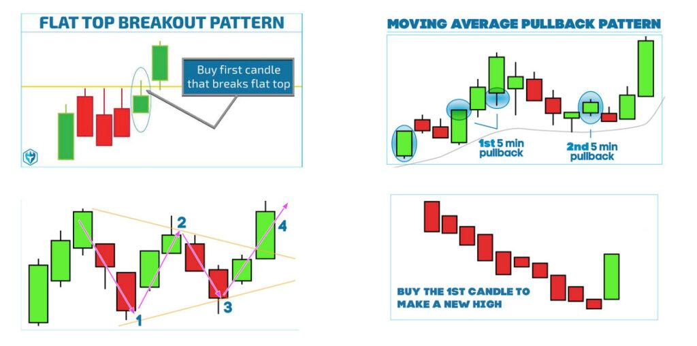

## Table of Contents

## What is day trading and how does it differ from other trading styles?

Day trading is a style of trading where people buy and sell stocks, currencies, or other financial products within the same day. They aim to make quick profits from small price changes in the market. Day traders usually do not hold onto their investments overnight because they want to avoid the risks that can happen when markets are closed.

Day trading is different from other trading styles like swing trading and long-term investing. Swing traders hold their investments for a few days or weeks, trying to profit from bigger price movements. Long-term investors, on the other hand, might keep their investments for months or years, focusing on the overall growth of the company or market. Day trading requires more time and attention because traders need to watch the market closely throughout the day, while swing trading and long-term investing can be less demanding in terms of time.

## What are the basic requirements to start day trading?

To start day trading, you need a few basic things. First, you need a computer or a smartphone with a good internet connection. This lets you keep an eye on the market and make trades quickly. You also need to open a trading account with a broker. Some brokers have special accounts just for day traders, so make sure you choose one that fits your needs. You'll need to put some money into this account to start trading. The amount can vary, but many brokers have a minimum deposit requirement.

Another important requirement is having enough time and knowledge. Day trading takes a lot of time because you need to watch the market closely all day. You also need to learn about the markets and how to analyze them. There are many resources available, like [books](/wiki/algo-trading-books), online courses, and trading communities, that can help you learn. It's a good idea to practice with a demo account before using real money. This way, you can get a feel for trading without risking your money.

## How much capital do I need to begin day trading?

To start [day trading](/wiki/day-trading-spy), you need to have some money in your trading account. The exact amount can be different depending on the broker you choose and the markets you want to trade in. Some brokers might let you start with as little as $500, but many experts suggest having at least $25,000 if you are in the United States. This is because of a rule called the Pattern Day Trader rule, which says you need at least $25,000 in your account if you want to make more than three day trades in a five-day period.

Having enough money is important because day trading can be risky. If you don't have enough money, a few bad trades can wipe out your account quickly. It's also a good idea to only use money that you can afford to lose, because there's no guarantee you'll make a profit. Starting with more money can give you more room to make mistakes and learn as you go.

## What are the best times of day to trade, and why?

The best times of day to trade are usually when the market is most active. For stocks in the United States, this is often right after the market opens at 9:30 AM Eastern Time and just before it closes at 4:00 PM Eastern Time. During these times, there are a lot of people buying and selling, which can make the prices move more. This can give day traders more chances to make money. Also, the first hour after the market opens is called the "opening range," and it's a popular time for traders because a lot of news and events from the night before can affect the prices.

Another good time to trade is during the overlap of major market sessions. For example, if you're trading [forex](/wiki/forex-system), the best time is when both the London and New York markets are open, from about 8:00 AM to 12:00 PM Eastern Time. This is when the most trading happens, and the prices can move a lot. Knowing when the markets are busiest can help you plan your trading day and increase your chances of making good trades.

## What are some common day trading strategies for beginners?

One common day trading strategy for beginners is called [scalping](/wiki/gamma-scalping). This means making a lot of small trades throughout the day to make small profits. The idea is to add up these small profits to make a bigger total. Scalpers watch the market closely and look for small price movements. They might use charts and technical indicators to help them decide when to buy and sell. This strategy can be good for beginners because it's simple and doesn't need a lot of money to start.

Another strategy is called [momentum](/wiki/momentum) trading. This is when traders look for stocks that are moving a lot in one direction. They buy these stocks hoping the price will keep going up, and then sell them when the price starts to slow down. Momentum traders often use news and events to find stocks that are moving. This strategy can be exciting but also risky, so it's important to learn how to manage your risks. Both scalping and momentum trading can help beginners get used to the fast pace of day trading and learn how to make quick decisions.

## How can I manage risk effectively while day trading?

Managing risk while day trading is very important. One way to do this is by setting stop-loss orders. A stop-loss order is like a safety net that automatically sells your stock if the price drops to a certain level. This helps you limit how much money you can lose on one trade. Another way to manage risk is by not using all your money on one trade. It's a good idea to only use a small part of your money for each trade, so if you lose, you still have money left to try again.

Another important part of managing risk is having a plan. Before you start trading, decide how much money you are willing to risk and stick to that plan. Don't let your emotions make you change your mind. If a trade is not going well, it's better to cut your losses and move on to the next trade. Also, make sure to learn from your mistakes. Keep a journal of your trades to see what works and what doesn't, and use that information to get better at managing your risks.

## What are the key technical indicators I should learn for day trading?

When you start day trading, it's helpful to know about some key technical indicators. One important one is the Moving Average. This helps you see the average price of a stock over a certain time, like 50 days or 200 days. It can show you if the stock's price is going up or down over time. Another useful indicator is the Relative Strength Index (RSI). This tells you if a stock is being bought a lot (overbought) or sold a lot (oversold). If the RSI is above 70, it might be overbought, and if it's below 30, it might be oversold.

Another key indicator to learn is the Bollinger Bands. These are lines drawn above and below the moving average that show how much the price of a stock is moving around. When the price touches the upper band, it might mean the stock is too expensive, and when it touches the lower band, it might mean it's too cheap. The MACD, or Moving Average Convergence Divergence, is also very useful. It shows the relationship between two moving averages and can help you see if the stock's momentum is changing. Learning these indicators can help you make better decisions when you're day trading.

## How do I choose a reliable broker for day trading?

Choosing a reliable broker for day trading is important because it can affect how well you do. You want to pick a broker that has a good reputation and is trusted by other traders. Look for reviews and ratings from other people who use the broker. Also, make sure the broker is regulated by a financial authority, like the SEC in the United States. This means they have to follow rules to keep your money safe. Another thing to check is the fees and commissions the broker charges. Some brokers might have low fees but offer fewer services, while others might charge more but give you better tools and support.

It's also good to think about what kind of trading platform the broker offers. A good platform should be easy to use and have all the tools you need, like charts and technical indicators. Some brokers even let you try out their platform for free with a demo account before you start trading with real money. Lastly, consider the customer service the broker provides. If you have a problem or a question, you want to be able to get help quickly. A reliable broker will have good customer support that you can reach easily.

## What are the psychological challenges of day trading and how can I overcome them?

Day trading can be tough on your mind because it's fast and stressful. You might feel scared to lose money, excited when you make money, or even angry when things don't go your way. These feelings can make you do things you might not do if you were calm, like holding onto a losing trade too long or selling a winning trade too soon. It's easy to let your emotions take over and make bad choices.

To overcome these challenges, it's important to have a plan and stick to it. Decide before you start trading how much money you're willing to risk and what you'll do in different situations. This helps you make decisions based on your plan, not your feelings. It's also helpful to take breaks and not trade all day long. This gives you time to calm down and think clearly. Talking to other traders or joining a trading community can also help because you can learn from their experiences and get support when you need it.

## How can I use advanced charting tools to improve my day trading?

Advanced charting tools can really help you do better at day trading. These tools let you see a lot of information about a stock's price in a way that's easy to understand. You can use them to draw lines and shapes on the chart to spot patterns and trends. For example, you might see that a stock's price keeps going up and down in a certain way. By using tools like trend lines or support and resistance levels, you can guess where the price might go next. This can help you decide when to buy or sell a stock.

Another way advanced charting tools help is by letting you use different technical indicators. These are special calculations that can tell you things like if a stock is being bought a lot or if its price is moving a lot. You can put indicators like the Moving Average, RSI, or Bollinger Bands on your chart to get more information. By looking at these indicators along with the price, you can make smarter trading choices. For example, if the RSI shows a stock is overbought, you might decide to sell it before the price drops. Using these tools can make you a better day trader by helping you understand the market better.

## What are some advanced day trading strategies for experienced traders?

One advanced day trading strategy for experienced traders is called "range trading." This strategy involves finding stocks that move within a certain price range over time. Traders look for stocks that have clear support and resistance levels. When the price gets close to the support level, traders might buy the stock, expecting it to bounce back up. When the price gets close to the resistance level, they might sell it, expecting it to drop back down. This strategy needs a good understanding of chart patterns and the ability to spot when a stock is likely to stay within its range.

Another advanced strategy is "[breakout](/wiki/breakout-trading) trading." This is when traders look for stocks that are about to break out of their usual price range. They watch for signs that the price is going to move past its resistance or support levels. If a stock breaks above its resistance, traders might buy it, hoping the price will keep going up. If it breaks below its support, they might sell it short, hoping the price will keep going down. Breakout trading can be risky because the price might not keep moving in the expected direction, so experienced traders use other tools like [volume](/wiki/volume-trading-strategy) and momentum indicators to confirm their trades.

## How can I continuously evaluate and improve my day trading performance?

To keep getting better at day trading, it's important to always look at how you're doing. One way to do this is by keeping a trading journal. Write down every trade you make, including why you made it, how much money you made or lost, and what you learned. This helps you see patterns in your trading and figure out what works and what doesn't. You can also use this journal to set goals for yourself and track your progress over time. Another way to evaluate your performance is by looking at your win rate and your risk-reward ratio. Your win rate is how often you make money on your trades, and your risk-reward ratio is how much you could lose compared to how much you could gain. By keeping an eye on these numbers, you can see if you're getting better and if you need to change your strategy.

Another important part of improving your day trading performance is learning from others. Join trading communities or forums where you can talk to other traders. They can give you new ideas and help you see things from a different perspective. You can also take courses or read books to learn more about trading strategies and techniques. It's also a good idea to try out new strategies in a demo account before using real money. This way, you can see if they work for you without risking your money. By always learning and trying to get better, you can become a more successful day trader.

## What are the strategies and analysis techniques for day trading?

Technical analysis plays a pivotal role in day trading by helping traders identify potential opportunities through the study of past market data. This approach relies heavily on charts and technical indicators, which can reveal price trends and market signals.

One of the foundational tools in technical analysis is the moving average, which smoothens price data to identify trends over a specific period. There are different types of moving averages, such as the simple moving average (SMA) and the exponential moving average (EMA). The SMA is calculated by averaging the closing prices over a given period:

$$
\text{SMA} = \frac{\sum_{i=1}^{n} P_i}{n}
$$

where $P_i$ represents the closing price at day $i$, and $n$ is the number of periods.

The Relative Strength Index (RSI) is another widely used indicator that measures the speed and change of price movements. RSI values range from 0 to 100, with levels above 70 often indicating overbought conditions, while levels below 30 suggest oversold conditions.

The Moving Average Convergence Divergence (MACD) is a momentum indicator that shows the relationship between two EMAs. The MACD line is calculated by subtracting the 26-period EMA from the 12-period EMA. A signal line, typically a 9-period EMA of the MACD, is used to identify buy or sell signals:

$$
\text{MACD} = \text{EMA}_{12} - \text{EMA}_{26}
$$

For traders employing various strategies, scalping is focused on capturing small price gaps on intraday timeframes. This method usually requires high-frequency trading and tight spreads, capitalizing on rapid price changes.

Momentum trading hinges on the conviction that stocks trending strongly in one direction will continue moving in that direction. Traders identify these trends and enter trades hoping to benefit from continued movement.

Breakout trading involves identifying critical resistance or support levels where a stock has previously failed to move past. A breakout occurs when the stock price surpasses these levels, often signaling strong momentum.

To ensure that strategies are effective and aligned with individual trading goals, [backtesting](/wiki/backtesting) is essential. This involves testing trading strategies on historical data to validate their effectiveness before committing real capital.

Here is an example of a simple backtesting script using Python, employing historical price data and a moving average crossover strategy:

```python
import pandas as pd

def backtest_strategy(data, short_window=40, long_window=100):
    signals = pd.DataFrame(index=data.index)
    signals['price'] = data['price']
    signals['short_mavg'] = data['price'].rolling(window=short_window, min_periods=1).mean()
    signals['long_mavg'] = data['price'].rolling(window=long_window, min_periods=1).mean()

    signals['signal'] = 0.0
    signals['signal'][short_window:] = np.where(signals['short_mavg'][short_window:] > signals['long_mavg'][short_window:], 1.0, 0.0)   
    signals['positions'] = signals['signal'].diff()

    return signals

# Example usage
# Load your historical price data into `price_data`
# signals = backtest_strategy(price_data)
```

This script calculates the short and long moving averages, generates buy signals when the short moving average crosses above the long moving average, and sell signals for the opposite cross.

Mastering technical analysis requires continual practice and review to ensure that one's trading strategies remain relevant and profitable in dynamic market conditions. By harnessing these tools and methods, traders can improve their decision-making and potentially enhance their trading outcomes.

## What are the basics of algo trading?

Algorithmic trading utilizes automated software to execute trades based on pre-defined criteria, enabling traders to capitalize on market opportunities with speed and precision. This approach leverages advanced algorithms, integrating data analysis and trade execution, often resulting in lower transaction costs, reduced human errors, and improved execution times.

### Benefits of Algorithmic Trading

1. **Cost Efficiency**: By automating trades, algorithmic trading significantly reduces the time and resources typically required for manual trading. The automation minimizes the need for constant human intervention, thereby reducing operational costs.

2. **Precision and Speed**: Algorithms can rapidly analyze large volumes of data and execute trades faster than human traders. This speed allows traders to take advantage of small price disparities, optimizing profitability while maintaining accuracy.

3. **Elimination of Human Error**: Automated systems strictly adhere to their programming, reducing the influence of emotional or irrational decision-making often present in human trading.

### Popular Indicators

Algorithmic trading often incorporates technical indicators, which are mathematical calculations based on historical price and volume data. Some commonly used indicators include:

- **Moving Averages**: These are used to smooth out price data, identifying trends by calculating the average of a security's price over a specified period. For instance, the simple moving average (SMA) is given by the formula:
$$
  \text{SMA} = \frac{P_1 + P_2 + \cdots + P_n}{n}

$$

  where $P_1, P_2, \ldots, P_n$ are the prices over $n$ periods.

- **Bollinger Bands**: These provide a visual representation of a security's price relative to its recent average and volatility. They consist of a middle band (SMA) and two outer bands, set at a standard deviation level above and below the SMA.

### Algorithmic Trading Strategies

Several strategies are prevalent in [algorithmic trading](/wiki/algorithmic-trading), each tailored to exploit different market behaviors:

- **Momentum Strategies**: These strategies exploit market momentum by purchasing securities showing an upward trend and selling those in decline.

- **Mean Reversion Strategies**: These are based on the premise that prices will revert to their historical means. Traders using this strategy identify securities deviating from their average price and engage in trades predicting a return to the mean.

### Python Example

Algorithmic trading can be implemented in various programming languages, with Python being popular for its robust libraries and ease of use. Below is a simple Python example using the `pandas` and `numpy` libraries to calculate a moving average:

```python
import pandas as pd
import numpy as np

# Example data: a DataFrame 'df' with a column 'price'
data = {'price': [100, 102, 104, 103, 105, 107, 108]}
df = pd.DataFrame(data)

# Calculate a 3-period simple moving average
df['SMA'] = df['price'].rolling(window=3).mean()

print(df)
```

This illustrative example highlights how algorithmic trading can facilitate efficient, systematic approaches to trading, leveraging technology to optimize decision-making and outcomes. Understanding the foundations of algorithmic indicators and strategies is essential for harnessing the full potential of trading algorithms.

## References & Further Reading

[1]: Bergstra, J., Bardenet, R., Bengio, Y., & Kégl, B. (2011). ["Algorithms for Hyper-Parameter Optimization."](https://proceedings.neurips.cc/paper/2011/file/86e8f7ab32cfd12577bc2619bc635690-Paper.pdf) Advances in Neural Information Processing Systems 24.

[2]: ["Advances in Financial Machine Learning"](https://www.amazon.com/Advances-Financial-Machine-Learning-Marcos/dp/1119482089) by Marcos Lopez de Prado

[3]: ["Evidence-Based Technical Analysis: Applying the Scientific Method and Statistical Inference to Trading Signals"](https://www.semanticscholar.org/paper/Evidence-Based-Technical-Analysis%3A-Applying-the-and-Aronson/3b33df8737f1772e9e14d66a08c9696f140a2ee1) by David Aronson

[4]: ["Machine Learning for Algorithmic Trading"](https://github.com/PacktPublishing/Machine-Learning-for-Algorithmic-Trading-Second-Edition) by Stefan Jansen

[5]: ["Quantitative Trading: How to Build Your Own Algorithmic Trading Business"](https://books.google.com/books/about/Quantitative_Trading.html?id=j70yEAAAQBAJ) by Ernest P. Chan