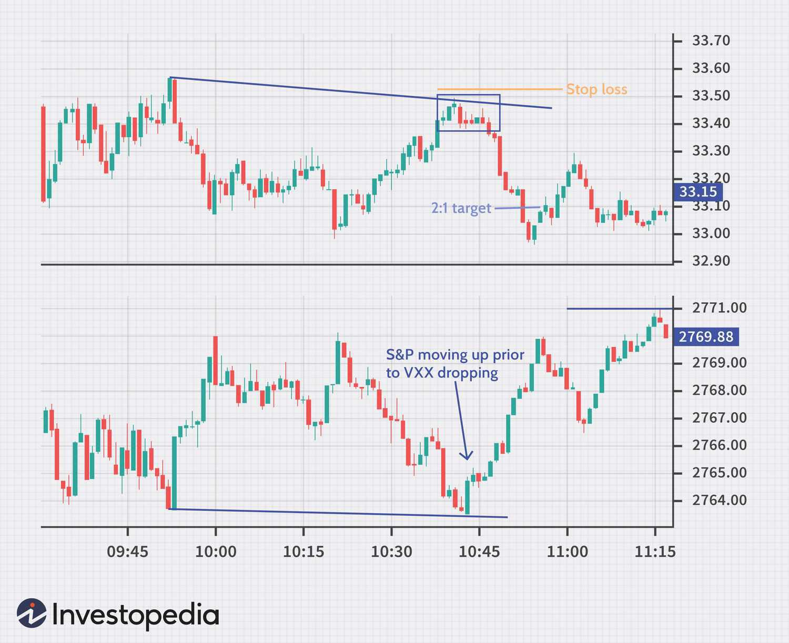

## Table of Contents

## What is day trading and how does it differ from other trading strategies?

Day trading is when people buy and sell stocks or other financial things within the same day. They try to make money from small changes in the prices during that day. Day traders usually don't keep their investments overnight because they want to avoid the risks that can happen when the market is closed.

Day trading is different from other trading strategies because it focuses on short-term gains. Other strategies, like swing trading or long-term investing, might hold onto stocks for days, weeks, or even years. Swing traders look for gains over a few days or weeks, while long-term investors might keep their stocks for many years, hoping the value will grow over time. Day trading requires a lot of attention and quick decisions, while other strategies can be more relaxed and need less watching.

## What are Volatility ETFs and why might they be attractive to day traders?

Volatility ETFs are exchange-traded funds that try to make money from changes in the stock market's ups and downs. They often follow the VIX, which is a measure of how much people expect the stock market to move around in the near future. These ETFs can go up when the stock market gets more unpredictable and can go down when the market calms down. 

Day traders might find Volatility ETFs attractive because they can change a lot in a short time. This means day traders can try to make quick profits from these big swings. Since day traders are looking to buy and sell within the same day, the fast changes in Volatility ETFs can give them more chances to make money than slower-moving investments.

## How can a beginner start day trading Volatility ETFs?

To start [day trading](/wiki/day-trading-spy) Volatility ETFs, a beginner needs to first open a brokerage account that lets them trade ETFs. They should look for a broker that has low fees and good tools for watching the market. After setting up the account, they need to learn about the Volatility ETFs they want to trade, like those that follow the VIX. They should understand how these ETFs work and what makes their prices go up or down.

Next, the beginner should practice trading without real money. Many brokers offer "paper trading" or "demo accounts" where you can pretend to trade and see how you do without losing any money. This is a good way to learn without risk. Once they feel ready, they can start trading with a small amount of money. It's important to start small because day trading can be risky, and they can lose money if they're not careful.

Lastly, beginners should set clear goals and rules for themselves. They should decide how much money they're willing to risk each day and stick to that limit. They should also learn to use stop-loss orders, which can help limit their losses if the market moves against them. By starting slow, practicing a lot, and always being careful, a beginner can slowly get better at day trading Volatility ETFs.

## What are the key risks associated with day trading Volatility ETFs?

Day trading Volatility ETFs can be very risky. One big risk is that these ETFs can change a lot in price in a short time. This means that if you buy one and the price goes down quickly, you could lose a lot of money. It's hard to predict what will happen next, so even if you think you're making a smart trade, things can go wrong fast. Also, these ETFs often use something called leverage, which can make the ups and downs even bigger. This means you could make more money if things go your way, but you could also lose more if they don't.

Another risk is that day trading can be stressful and take a lot of time. You need to watch the market all day and make quick decisions. If you don't have the right tools or enough experience, it can be hard to keep up. Plus, if you're not careful, you might start trading too much, which can lead to more losses. It's important to have a plan and stick to it, but when things are moving fast, it's easy to make mistakes.

## What technical analysis tools are most useful for trading Volatility ETFs?

When trading Volatility ETFs, some of the most useful technical analysis tools are moving averages and Bollinger Bands. Moving averages help you see the general trend of the [ETF](/wiki/etf-trading-strategies)'s price over time. There are different kinds, like the simple moving average (SMA) and the exponential moving average (EMA). They can help you decide when to buy or sell by showing you if the price is going up or down. Bollinger Bands are lines drawn above and below the moving average. They show how much the price is moving around. If the price goes outside the bands, it might mean the ETF is getting too high or too low, and it could be time to trade.

Another helpful tool is the Relative Strength Index (RSI). The RSI tells you if an ETF is being bought a lot (overbought) or sold a lot (oversold). If the RSI is above 70, the ETF might be overbought, and if it's below 30, it might be oversold. This can help you decide when to enter or [exit](/wiki/exit-strategy) a trade. Also, chart patterns like head and shoulders or double tops and bottoms can give you clues about where the price might go next. By using these tools together, you can make better guesses about when to trade Volatility ETFs.

## How does market volatility impact the performance of Volatility ETFs?

Market [volatility](/wiki/volatility-trading-strategies) directly affects the performance of Volatility ETFs. When the stock market gets more unpredictable and starts moving up and down a lot, the value of Volatility ETFs usually goes up. This is because these ETFs are designed to make money from big changes in the market. For example, if the VIX, which measures how much the market is expected to move, goes up, Volatility ETFs that follow the VIX will also go up. So, if you own these ETFs during a time when the market is very volatile, you might see your investment grow.

On the other hand, when the market calms down and there's less volatility, the value of Volatility ETFs tends to go down. This happens because these ETFs are made to profit from big swings in the market, so if the market is stable, there's less opportunity for them to make money. If you're holding these ETFs during a quiet time in the market, you might see their value drop. This is why it's important to watch market conditions closely if you're trading Volatility ETFs, as their performance is closely tied to how much the market is moving around.

## What are some common strategies used by experienced traders in Volatility ETFs?

Experienced traders often use a strategy called mean reversion when trading Volatility ETFs. This means they believe that if the price of the ETF goes too high or too low, it will eventually come back to a more normal level. So, if the ETF's price shoots up because the market is very volatile, these traders might sell it, expecting the price to go down again soon. On the other hand, if the ETF's price drops a lot because the market is calm, they might buy it, thinking the price will go back up when volatility returns. This strategy relies on understanding the normal range of the ETF's price and waiting for good times to buy or sell.

Another common strategy is [trend following](/wiki/trend-following). Traders using this approach watch for clear trends in the ETF's price. If they see the price of the Volatility ETF going up over time, they might keep buying it, hoping the trend will continue. If they see the price going down, they might keep selling or shorting it, expecting the downward trend to keep going. This strategy requires being able to spot trends early and having the patience to stick with them, even if there are small ups and downs along the way. Both mean reversion and trend following need a lot of practice and understanding of how Volatility ETFs move with the market.

## How can one manage the emotional aspects of trading Volatility ETFs?

Trading Volatility ETFs can be exciting but also stressful because their prices can change a lot in a short time. It's important to keep your emotions in check so you don't make quick decisions that you might regret later. One way to manage this is by having a clear plan before you start trading. Decide when you will buy or sell, and stick to that plan even if you feel nervous or excited. This helps you stay calm because you know you're following a strategy you thought about when you were not feeling pressured.

Another way to handle the emotional side of trading is to take breaks and not watch the market all the time. It's easy to get caught up in every little move of the ETF's price, but that can make you feel stressed and lead to bad decisions. Set times to check on your trades and then do something else to relax. Also, talk to other traders or friends about how you're feeling. Sometimes, just sharing your worries can help you feel better and make smarter choices when you go back to trading.

## What are the tax implications of day trading Volatility ETFs?

When you day trade Volatility ETFs, you need to think about taxes. In the United States, any profits you make from trading are considered capital gains. If you hold an ETF for less than a year before selling it, which is common in day trading, the profit is a short-term capital gain. Short-term capital gains are taxed at your regular income tax rate, which can be pretty high depending on how much money you make. So, if you make a lot of quick trades and profits, you might end up paying a big chunk of those profits in taxes.

To manage your taxes better, you can keep track of your trades and losses. If you have losses from trading, you can use them to reduce your taxable income. This is called tax loss harvesting. You can use these losses to offset your gains, which means you might pay less in taxes. It's a good idea to talk to a tax professional who can help you understand all the rules and make sure you're doing everything right. They can give you advice on how to handle your taxes in a way that works best for you.

## How do macroeconomic factors influence Volatility ETF performance?

Macroeconomic factors can have a big impact on Volatility ETFs. Things like interest rates, inflation, and big economic news can make the stock market move a lot. When there's a lot of uncertainty about these things, like when people are worried about the economy, the VIX, which measures how much people expect the market to move, usually goes up. This makes Volatility ETFs, which often follow the VIX, go up too. So, if there's a lot of economic news that makes people nervous, Volatility ETFs can do well because they make money from the market being unpredictable.

On the other hand, when the economy is doing well and there's less uncertainty, the VIX usually goes down. This means Volatility ETFs will also go down because there's less movement in the market for them to make money from. For example, if the government says the economy is growing and people feel more confident, Volatility ETFs might not do as well. Traders need to keep an eye on these big economic factors because they can change how well Volatility ETFs perform.

## What advanced trading techniques can be applied to maximize returns from Volatility ETFs?

One advanced trading technique for maximizing returns from Volatility ETFs is called options trading. Options are like bets on where the ETF's price will go. You can buy call options if you think the ETF's price will go up, or put options if you think it will go down. Using options can give you bigger gains if you're right about the ETF's price movement, but it's also riskier because you can lose money if you're wrong. Experienced traders might use options to make more money from the big swings in Volatility ETFs, but it takes a lot of practice and understanding of how options work.

Another technique is called pairs trading. This is when you trade two Volatility ETFs at the same time, one that you think will go up and one that you think will go down. The idea is that if you're right, you'll make money from both trades. For example, you might buy a Volatility ETF that follows the VIX and also sell short another ETF that moves in the opposite direction. This can help you make money no matter which way the market goes, as long as the two ETFs move as you expect. Pairs trading needs careful watching and a good understanding of how different ETFs relate to each other, but it can be a smart way to trade when the market is unpredictable.

## How can one evaluate the performance and adjust strategies when trading Volatility ETFs?

To evaluate the performance of Volatility ETFs, you need to look at how they're doing over time. Check if the ETF is making money or losing it compared to when you bought it. You can use charts and graphs to see the ups and downs. It's also helpful to compare the ETF's performance to the VIX or other market measures to see if it's doing what you expect. If the ETF is not doing well, think about why. Is it because the market is calm, or is there something else going on? Keeping a trading journal can help you track your trades and see what works and what doesn't.

When you see how the Volatility ETF is performing, you might need to adjust your trading strategies. If the ETF is doing better than expected, you might want to hold onto it longer or buy more. But if it's not doing well, you might need to sell it or change your approach. For example, if the market is very calm and the ETF's price is going down, you might switch to a mean reversion strategy and wait for volatility to come back. Or, if the ETF is going up a lot, you might use a trend-following strategy and keep buying. Always be ready to change your plan based on what the market is doing and what you learn from your past trades.

## References & Further Reading

[1]: Bergstra, J., Bardenet, R., Bengio, Y., & Kégl, B. (2011). ["Algorithms for Hyper-Parameter Optimization."](https://papers.nips.cc/paper/4443-algorithms-for-hyper-parameter-optimization) Advances in Neural Information Processing Systems 24.

[2]: ["Advances in Financial Machine Learning"](https://www.amazon.com/Advances-Financial-Machine-Learning-Marcos/dp/1119482089) by Marcos Lopez de Prado

[3]: ["Evidence-Based Technical Analysis: Applying the Scientific Method and Statistical Inference to Trading Signals"](https://www.amazon.com/Evidence-Based-Technical-Analysis-Scientific-Statistical/dp/0470008741) by David Aronson

[4]: ["Machine Learning for Algorithmic Trading"](https://github.com/stefan-jansen/machine-learning-for-trading) by Stefan Jansen

[5]: ["Quantitative Trading: How to Build Your Own Algorithmic Trading Business"](https://books.google.com/books/about/Quantitative_Trading.html?id=j70yEAAAQBAJ) by Ernest P. Chan