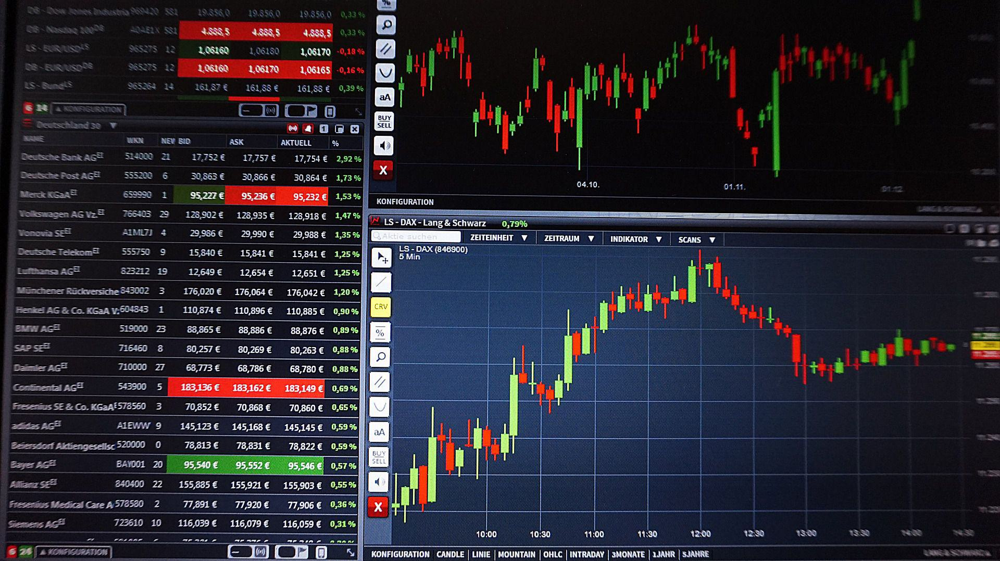

The financial markets have evolved substantially over the years, developing into a sophisticated and extensive ecosystem filled with diverse trading opportunities. Among the trading styles that have garnered popularity are day trading, margin trading, and algorithmic trading (also known as algo trading). Each of these approaches equips traders with distinct strategies designed to navigate the financial markets, offering unique advantages while simultaneously posing specific risks.

Day trading is an approach where traders buy and sell financial instruments within a single trading day, striving to profit from minor price fluctuations. It requires a comprehensive understanding of market dynamics and the ability to make rapid decisions. Margin trading, on the other hand, involves borrowing funds from a broker to increase buying power, allowing traders to open larger positions. This approach amplifies potential gains but also exacerbates potential losses, necessitating a solid grasp of the associated risks and regulatory requirements.



Algorithmic trading utilizes computer algorithms to automate the trading process, leveraging predefined rules based on various market parameters such as timing, price, and volume. This method offers benefits like increased execution speed and reduced human error, making it an appealing option for traders seeking efficiency and precision.

Understanding these trading styles is crucial for anyone involved in the financial markets, as each path offers different strategies and levels of risk suitable for varying trader profiles. Knowledge of these approaches aids in making informed decisions, ensuring traders can effectively exploit market opportunities while managing potential pitfalls.

## Table of Contents

## Understanding Day Trading

Day trading is a method of trading where individuals buy and sell financial instruments such as stocks, currencies, or commodities within a single trading day. The primary goal is to capitalize on small price fluctuations that occur during the day. Given the inherent volatility of the markets, day trading is characterized by high-speed decisions and rapid execution of trades, which makes it an attractive practice for experienced traders. However, it comes with elevated risks and demands a deep understanding of market dynamics and a well-devised strategy to be profitable.

The essence of day trading lies in exploiting short-term market inefficiencies or price movements. To achieve this, traders employ various strategies such as [scalping](/wiki/gamma-scalping), momentum trading, and technical analysis. Scalping involves making numerous trades over short timeframes to aggregate small profits, while momentum trading focuses on riding trends for as long as they appear strong. Technical analysis, which involves analyzing charts and patterns, helps traders predict future price movements and make informed decisions.

Day trading requires constant attention to market movements and the ability to act quickly because the window of opportunity for profit is often brief. The associated high risk stems not only from market [volatility](/wiki/volatility-trading-strategies) but also from the potential for rapid accumulation of transaction costs due to frequent trading activities. Moreover, emotional discipline and stress management skills are crucial, as the pressure of making real-time decisions can lead to costly mistakes if not handled properly.

Many day traders use sophisticated tools and platforms that provide real-time market data, advanced charting capabilities, and news analysis to enhance their decision-making process. Additionally, they often utilize margin accounts to increase their purchasing power, but this also amplifies potential losses, making risk management practices essential.

Despite the challenges, successful day traders can achieve significant returns by accurately reading market signals and executing trades swiftly. Skills such as interpreting economic reports, understanding market sentiment, and maintaining emotional detachment from trades are vital. Beginners are usually advised to start with simulated trading to gain experience without financial risk.

In summary, while [day trading](/wiki/day-trading-spy) can lead to quick profits, it is recommended primarily for seasoned traders who possess a robust strategy, comprehensive market knowledge, and a high tolerance for risk. Effective day traders remain disciplined, alert, and continuously adapt their strategies to ever-changing market conditions.

## Exploring Margin Trading

Margin trading is a process by which traders enhance their buying power by borrowing funds from a brokerage firm. This mechanism allows traders to acquire larger positions than would be possible with only their available capital. By using this borrowed capital, traders introduce leverage into their trading strategy, magnifying both potential returns and risks.

The fundamental concept of leveraging is straightforward: it enables traders to amplify their investments. For example, if a trader has $1,000 and a brokerage offers 2:1 leverage, the trader can control up to $2,000 of assets. This doubling of investment potential can lead to higher profits if the market moves favorably. However, leverage also increases the risk of significant losses if the market moves against the trader’s position.

A critical aspect of margin trading is understanding margin calls and the maintenance margin requirement. The maintenance margin is the minimum account balance a trader must maintain after borrowing funds. If the account balance falls below this threshold, the broker issues a margin call, demanding that the trader deposit additional funds or liquidate positions to meet the minimum requirement. Failure to meet a margin call can result in the broker forcibly closing positions, potentially at a loss.

Mathematically, the equity in a margin account is represented by:

$$
\text{Equity} = \text{Total Account Value} - \text{Borrowed Funds}
$$

The maintenance margin requirement can be expressed as:

$$
\text{Maintenance Margin} = \text{Total Account Value} \times \text{Maintenance Margin Ratio}
$$

Understanding these concepts is paramount for managing the risks associated with margin trading. Traders must employ prudent risk management strategies, maintain adequate equity levels, and monitor their positions closely to mitigate the danger of forced liquidation.

 to Algorithmic Trading

Algorithmic trading, often referred to as algo trading, involves the use of computer programs to facilitate the trading of financial instruments at speeds and frequencies that exceed human capabilities. By leveraging sophisticated algorithms, traders can execute orders based on a predefined set of instructions that take into account various factors such as timing, price, and [volume](/wiki/volume-trading-strategy). This approach supports a diverse array of strategies, enabling both optimization and precision in the execution of trades.

At its core, [algorithmic trading](/wiki/algorithmic-trading) is driven by a series of logical rules established to automate trading decisions. These rules can range from simple conditions to highly complex mathematical models. For instance, an algorithm may be set to buy a stock if its 50-day moving average crosses above its 200-day moving average—a strategy known as moving average crossover. Such strategies are often backtested using historical data to ascertain their effectiveness before implementation in live trading environments.

One of the key advantages of algorithmic trading is the substantial reduction of human error. By removing the emotional biases and reactionary behavior often associated with manual trading, algo trading ensures that trade execution is systematic and consistent. Furthermore, algorithmic systems are capable of scanning multiple markets simultaneously, executing trades at very high speeds, often in milliseconds or microseconds, which is impossible for a human trader to replicate.

The ability to backtest is another significant benefit of algorithmic trading. Backtesting involves running an algorithmic strategy against historical market data to assess how it would have performed in the past. This practice allows traders to refine and optimize their strategies based on empirical evidence before risking real capital. Python, a popular programming language within the finance industry, offers several libraries such as `pandas`, `numpy`, and `[backtrader](/wiki/backtrader)` that facilitate the [backtesting](/wiki/backtesting) process. Here is a simple Python code snippet demonstrating a backtesting framework using `backtrader`:

```python
import backtrader as bt

class SimpleStrategy(bt.Strategy):
    def __init__(self):
        self.sma = bt.indicators.SimpleMovingAverage(self.data.close, period=15)

    def next(self):
        if self.data.close > self.sma:
            self.buy(size=10)
        elif self.data.close < self.sma:
            self.sell(size=10)

# Initialize cerebro engine
cerebro = bt.Cerebro()
cerebro.addstrategy(SimpleStrategy)

# Load data and add to cerebro
data = bt.feeds.YahooFinanceData(dataname='AAPL', fromdate=datetime(2020, 1, 1), todate=datetime(2021, 1, 1))
cerebro.adddata(data)

# Run backtest
cerebro.run()
cerebro.plot()
```

In addition to these benefits, algo trading can also enhance market [liquidity](/wiki/liquidity-risk-premium) and contribute to tighter spread prices due to its efficiency in trade execution. However, the rapid pace and reliance on technology also introduce potential risks, including system failures, network connectivity issues, and vulnerabilities to high-frequency trading strategies, which must be conscientiously managed.

In summary, algorithmic trading represents a revolutionary development in the trading landscape, offering unparalleled speed, accuracy, and efficiency. Its impact on modern financial markets underscores the need for robust technological infrastructure and continual advancement in algorithmic strategy development.

## Day Trading on Margin

Day trading on margin combines the principles of day trading with those of margin trading, providing traders with the ability to utilize increased leverage for intraday opportunities. This methodology involves borrowing funds from a broker to increase one's buying power, allowing traders to potentially amplify their returns from small price movements in the market. Using leverage means that traders can open larger positions than their capital would normally allow, increasing both potential returns and risks.

Historically, day trading on margin has been popular among experienced traders who can effectively manage the intense demands of such high-stakes trading. The necessity for a robust risk management strategy becomes paramount, as the increased leverage associated with margin can lead to significant losses if trades move unfavorably. The concept of a margin call, wherein brokers demand additional funds or securities to maintain an open position, is particularly relevant in this context. Margin traders must adhere to maintenance margin requirements, which dictate the minimum amount of equity that must be maintained in a margin account to avoid liquidation of positions.

A practical example of margin utilization in day trading can be demonstrated through a scenario where a trader uses a margin account with a 2:1 leverage ratio. If the trader possesses $10,000 of their own capital, they could potentially control $20,000 worth of securities. The formula to determine the buying power available through leverage is:

$$
\text{Buying Power} = \text{Equity} \times \text{Leverage Ratio}
$$

$$
\text{Buying Power} = 10,000 \times 2 = 20,000
$$

While this increased buying power allows for more substantial investment opportunities, the associated financial risk also doubles, necessitating careful monitoring of market positions and quick response to price movements.

In practice, successful day trading on margin requires acute awareness of market trends, disciplined entry and [exit](/wiki/exit-strategy) strategies, and adherence to predefined loss limits. Implementing stop-loss orders is a common strategy to automatically limit potential losses should a trade move against the trader's forecast. Moreover, diversification across different asset classes and keeping a watchful eye on volatility indicators are considered crucial for risk mitigation.

Ultimately, the leverage offered through day trading on margin can be advantageous for generating higher returns, but it calls for a comprehensive understanding of market dynamics and a commitment to stringent risk management protocols.

## Pattern Day Trading Rules

Pattern day trading rules are regulatory requirements established by the Financial Industry Regulatory Authority (FINRA) to address the risks associated with frequent trading activities. These rules are specifically aimed at traders who place four or more day trades within five business days in a margin account. Such individuals are classified as "pattern day traders" and must comply with additional requirements than other traders.

The primary mandate for pattern day traders is to maintain a minimum equity of $25,000 in their margin accounts at all times. This requirement ensures traders have a sufficient financial cushion to cover potential losses that might arise due to the inherent volatility and high stakes of day trading. The rationale behind this stipulation is to mitigate the financial risks both for the traders and the brokerage firms facilitating the trades.

Maintaining the $25,000 minimum equity can be achieved through a combination of cash and eligible securities held in the account. If an account falls below this threshold, the trader must deposit additional funds to continue day trading activities. Brokerage firms have the authority to restrict trading activities or freeze accounts that do not comply with these equity requirements, thereby adding a layer of protection against excessive risk-taking.

The rules imply that pattern day traders need to be well-capitalized and experienced in managing risks. The requirement encourages disciplined trading and helps prevent traders from taking on more risk than their financial position can support. By enforcing these rules, FINRA aims to foster a stable and fair trading environment while protecting investors from the potential pitfalls of unchecked rapid trading behavior.

## Common Algorithmic Trading Strategies

Algorithmic trading strategies are designed to systematically execute trades by leveraging mathematical models and computational algorithms. Among the most widely utilized strategies are [trend following](/wiki/trend-following), [arbitrage](/wiki/arbitrage), mean reversion, and market timing. Each strategy offers distinct methodologies to optimize trading decisions while minimizing human emotional biases.

**Trend Following**

Trend following is based on the premise that prices tend to move in a given direction—upward or downward—for a period. Algorithms designed for this strategy identify and exploit these trends using various indicators such as moving averages and [momentum](/wiki/momentum) indicators. For example, a crossover of short-term moving averages over long-term ones can signal an upward trend, prompting a buy signal:

```python
def trend_following_strategy(prices, short_window=50, long_window=200):
    short_mavg = prices.rolling(window=short_window, min_periods=1).mean()
    long_mavg = prices.rolling(window=long_window, min_periods=1).mean()
    signal = (short_mavg > long_mavg).astype(int)
    return signal
```

**Arbitrage**

Arbitrage strategies seek to profit from price discrepancies of identical or similar financial instruments on different markets or in different forms. High-frequency trading algorithms can execute these simultaneously in milliseconds. A common format is [statistical arbitrage](/wiki/statistical-arbitrage) which might use pairs trading—a strategy involving matching a long position with a short position in two stocks with high correlation.

**Mean Reversion**

Mean reversion is based on the concept that asset prices will revert to their historical mean or average value over time. Traders using this strategy believe that deviations from the mean present trading opportunities. The challenge is accurately predicting when and to what extent prices will revert. This can involve sophisticated statistical tools and tests, such as cointegration:

```python
def mean_reversion_strategy(prices, lookback=50):
    rolling_mean = prices.rolling(window=lookback, min_periods=1).mean()
    rolling_std = prices.rolling(window=lookback, min_periods=1).std()
    z_score = (prices - rolling_mean) / rolling_std
    signal = (z_score < -1).astype(int)  # Buy signal when price is one std dev below mean
    return signal
```

**Market Timing**

Market timing strategies involve making buy or sell decisions of financial assets by attempting to predict future market price movements. These predictions may be based on economic data, technical indicators, or sentiment analysis derived from news feed processing through natural language processing (NLP) algorithms.

Selecting an appropriate algorithmic strategy necessitates a comprehensive understanding of current market conditions and a clear alignment between the algorithm’s logic and the trader’s or investor’s objectives. It's essential to thoroughly backtest these algorithms using historical data to validate their efficacy and to understand under what circumstances each strategy performs best. The ultimate goal is to ensure that the chosen strategy aligns with the trader’s risk tolerance and return expectations.

## Risks and Benefits of These Trading Styles

Each trading style—day trading, margin trading, and algorithmic trading—offers distinct advantages and poses various risks that traders need to carefully consider.

### Day Trading

**Benefits:**  
Day trading can provide rapid returns because it capitalizes on small price movements within a single trading day. This approach allows for liquidity advantages, as positions are not held overnight, reducing exposure to market fluctuations that occur when markets are closed.

**Risks:**  
Day trading is inherently high-risk due to its exposure to market volatility. Traders must be vigilant, as failure to execute trades quickly or adhere to a pre-defined strategy can result in significant losses. Emotional decision-making often exacerbates these risks, making it unsuitable for inexperienced traders. Effective strategies like setting stop-loss orders are vital to mitigate these risks.

### Margin Trading

**Benefits:**  
Margin trading amplifies purchasing power by using leverage, allowing traders to potentially realize higher profits than they could with their available capital. This is especially advantageous during bullish market conditions where the trader anticipates strong upward price movements.

**Risks:**  
The leverage that makes margin trading potentially profitable also amplifies potential losses. If the market moves against the trader's position, losses can exceed the initial investment, resulting in a margin call. This mandates the need for traders to maintain sufficient equity in their accounts to avoid forced liquidation of positions. Knowledge of margin requirements and stringent risk management practices, such as portfolio diversification, are essential to manage these risks.

### Algorithmic Trading

**Benefits:**  
Algorithmic trading allows for executing trades at speeds that human traders cannot match, thereby exploiting short-lived market opportunities. Algorithms eliminate human errors associated with emotions or mechanical mistakes and enable backtesting strategies against historical data, fostering data-driven decisions.

**Risks:**  
Despite its advantages, algorithmic trading can suffer from overfitting when strategies are too closely tailored to historical data, reducing their effectiveness in live markets. Additionally, algorithmic systems can encounter technical failures or unexpected market conditions their models do not account for, resulting in losses. Traders must continuously monitor and update their algorithms to sustain efficacy.

### Risk Management Strategies

For all these trading styles, robust risk management is crucial. Tools like stop-loss orders can cap potential losses by automatically selling positions once they hit a certain lower price threshold. This reduction in downside risk can help preserve capital in volatile markets. Additionally, maintaining a diversified portfolio by spreading investments across different assets or sectors reduces exposure to any single asset's volatility, thereby enhancing overall portfolio stability.

Conclusively, while day trading, margin trading, and algorithmic trading present lucrative opportunities, they demand a comprehensive understanding of their respective mechanics and risks. Successful traders must deploy diligent risk management strategies, combining market insights with disciplined execution, to thrive amidst unpredictability.

## Conclusion

Financial markets trading presents a multitude of opportunities, encompassing day trading, margin trading, and algorithmic trading. Each method offers unique strategies that can yield substantial profits if executed with precision and sound judgment. To navigate these trading avenues successfully, traders must possess a comprehensive understanding of the specific dynamics and technicalities associated with each style.

Day trading demands acute market awareness and a robust, agile strategy due to its reliance on capitalizing on short-term price fluctuations within a single trading day. It requires traders to remain vigilant and execute decisions rapidly to seize profitable opportunities. Conversely, margin trading involves leveraging borrowed funds to amplify potential returns, demanding stringent risk management practices to avert significant financial losses due to its inherent volatility.

Algorithmic trading introduces an advanced technological approach, using sophisticated algorithms to execute trades at incredible speeds and volumes. This method requires a deep knowledge of programming, statistical analysis, and financial markets to develop and implement effective algorithms that can outperform human traders.

Traders who aim to succeed in these environments must also commit to ongoing education and adaptability. Financial markets are inherently dynamic, influenced by a host of external factors including economic indicators, geopolitical events, and technological advancements. Thus, maintaining a position of continuous learning and adaptability equips traders to respond effectively to market shifts, refine their strategies, and optimize their risk management approaches.

Ultimately, achieving success in financial markets trading hinges on a trader's ability to meld their understanding of each trading style with strategic foresight and adaptive management. By employing rigorous strategies tailored to the complexities of each trading method, traders can enhance their potential for success while mitigating associated risks.

## References & Further Reading

[1]: Bergstra, J., Bardenet, R., Bengio, Y., & Kégl, B. (2011). ["Algorithms for Hyper-Parameter Optimization."](https://papers.nips.cc/paper/4443-algorithms-for-hyper-parameter-optimization) Advances in Neural Information Processing Systems 24.

[2]: ["Advances in Financial Machine Learning"](https://www.amazon.com/Advances-Financial-Machine-Learning-Marcos/dp/1119482089) by Marcos Lopez de Prado

[3]: ["Evidence-Based Technical Analysis: Applying the Scientific Method and Statistical Inference to Trading Signals"](https://www.amazon.com/Evidence-Based-Technical-Analysis-Scientific-Statistical/dp/0470008741) by David Aronson

[4]: ["Machine Learning for Algorithmic Trading"](https://github.com/stefan-jansen/machine-learning-for-trading) by Stefan Jansen

[5]: ["Quantitative Trading: How to Build Your Own Algorithmic Trading Business"](https://www.amazon.com/Quantitative-Trading-Build-Algorithmic-Business/dp/1119800064) by Ernest P. Chan