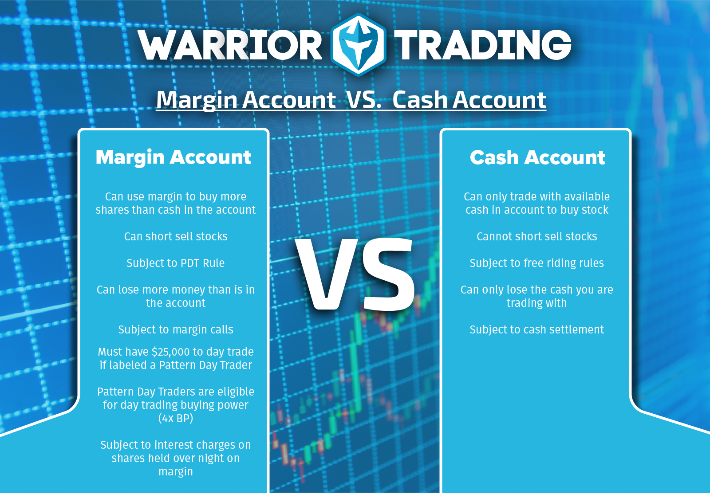

## Table of Contents

## What is day trading and how does it differ from other types of trading?

Day trading is when someone buys and sells stocks or other financial things within the same day. They try to make money from small changes in prices during that day. Day traders usually don't keep their investments overnight. They watch the market closely all day and make quick decisions.

Day trading is different from other types of trading because it focuses on short-term gains. For example, in swing trading, people might hold onto their investments for a few days or weeks to make money from bigger price changes. In long-term investing, people might keep their investments for months or years, hoping the value will grow over time. Day trading needs a lot of attention and can be riskier because prices can change a lot in a short time.

## What is margin in the context of trading?

Margin in trading is when you borrow money from your broker to buy more stocks or other investments than you could with just your own money. It's like getting a loan to trade. You put up some of your own money as a deposit, which is called the margin, and the broker lends you the rest. This can let you make bigger trades and possibly make more money, but it also means you could lose more if the trades don't go well.

Using margin can be risky because if the value of your investments goes down, you might have to pay back the loan even if you lose money on your trades. This is called a margin call, where your broker asks you to add more money to your account or sell some of your investments to cover the loan. Because of these risks, it's important to understand margin well before using it in trading.

## How can margin be used in day trading?

In [day trading](/wiki/day-trading-spy), margin can be used to buy more stocks or other investments than you could with just your own money. If you think a stock's price will go up quickly during the day, you can use margin to buy more of it. This way, if the price does go up, you can make more money because you have more shares. But remember, using margin means you're borrowing money, so you'll need to pay interest on the loan.

Using margin in day trading can be risky. If the stock price goes down instead of up, you could lose more money than you started with because you'll still have to pay back the loan. This is called a margin call, where your broker might ask you to put more money in your account or sell some of your stocks to cover the loan. Because day trading happens so fast, these ups and downs can happen quickly, making margin trading even riskier.

## What are the benefits of using margin for day trading?

Using margin in day trading can help you make more money if your trades go well. When you use margin, you can buy more stocks than you could with just your own money. If the stock price goes up, you make more profit because you have more shares. This means you can take advantage of small price changes during the day and possibly earn more than you would without margin.

But remember, using margin also has risks. If the stock price goes down, you could lose more money than you started with because you have to pay back the loan you got from your broker. Day trading moves fast, so prices can change a lot in a short time. This makes using margin riskier, but if you're careful and good at trading, it can still be a useful tool to make more money.

## What are the risks associated with day trading on margin?

Day trading on margin can be risky because you're using borrowed money to buy stocks. If the stock price goes down, you could lose more money than you started with. This is because you still have to pay back the loan, even if your trades lose money. Day trading happens fast, so prices can change a lot in a short time. This makes the risk even bigger because you might not have time to react if the market turns against you.

Another risk is getting a margin call. This happens when the value of your investments drops below a certain level, and your broker asks you to add more money to your account or sell some of your stocks to cover the loan. If you can't meet the margin call, your broker might sell your stocks without asking you, which could mean you lose even more money. So, even though using margin can help you make more money if your trades go well, it can also lead to bigger losses if they don't.

## How does margin interest work and how can it impact day trading profits?

When you use margin to day trade, you borrow money from your broker to buy more stocks. You have to pay interest on the money you borrow, just like you would with any loan. The [interest rate](/wiki/interest-rate-trading-strategies) can change depending on your broker and the amount of money you borrow. This interest is usually charged daily but added to your account monthly. So, the longer you keep the borrowed money, the more interest you have to pay.

This interest can affect your day trading profits. If you make a good trade and the stock price goes up, you can make more money because you bought more shares with the borrowed money. But you need to make enough profit to cover the interest you have to pay. If you don't make enough to cover the interest, your profits will be smaller. And if your trades lose money, you still have to pay the interest, which can make your losses bigger. So, it's important to think about the cost of the interest when you use margin for day trading.

## What are the margin requirements set by brokers for day trading?

Brokers have rules called margin requirements that say how much money you need to have in your account to use margin for day trading. For day trading, the Federal Reserve's Regulation T says you need at least $2,000 in your account to start using margin. But many brokers have their own rules and might ask for more money. This extra money is called a "maintenance margin," and it's there to make sure you can cover any losses if your trades don't go well.

If you want to be a "pattern day trader," which means you do a lot of day trading, the rules are stricter. The Financial Industry Regulatory Authority (FINRA) says that pattern day traders need to have at least $25,000 in their account. This is to make sure you have enough money to handle the fast and risky nature of day trading. If your account balance falls below this amount, you might not be able to keep day trading until you add more money.

## How can a beginner prepare to start day trading with margin?

If you're a beginner wanting to start day trading with margin, it's important to learn a lot first. You should understand how the stock market works, what day trading is, and how margin can help or hurt you. Read [books](/wiki/algo-trading-books), take online courses, and practice with a fake trading account before you use real money. This way, you can get a feel for how the market moves without losing any money. Also, make sure you know about margin requirements and how interest works because these can affect how much money you make or lose.

Once you feel ready, start with a small amount of money that you can afford to lose. Choose a good broker that offers margin trading and check their rules carefully. Make sure you have at least the minimum amount needed in your account, which is usually $2,000 for regular margin trading or $25,000 if you want to be a pattern day trader. Keep an eye on your trades and be ready to act quickly because day trading happens fast. And always remember, using margin can make your wins bigger, but it can also make your losses bigger, so be careful and keep learning as you go.

## What strategies are effective for managing risk when day trading with margin?

To manage risk when day trading with margin, it's important to set clear rules for yourself. Decide how much money you're okay with losing before you start trading. This is called setting a "stop-loss" order, which automatically sells your stock if it drops to a certain price. This helps you avoid big losses. Also, don't use all your money at once. Spread it out over different trades so if one trade goes bad, you still have money left to keep trading. This is called diversification.

Another good strategy is to keep an eye on your account balance and make sure it stays above the margin requirements. If it gets too low, your broker might make a margin call, and you'll have to add more money or sell some stocks quickly. To avoid this, keep some extra money in your account as a buffer. It's also smart to learn as much as you can about the stocks you're trading and the market in general. The more you know, the better you can predict what might happen and make smarter choices. Remember, day trading with margin can be risky, so always be careful and keep learning.

## How do experienced traders use margin to enhance their day trading performance?

Experienced traders use margin to buy more stocks than they could with their own money. They do this to make bigger profits if the stock prices go up. They know the market well and can guess when a stock will go up or down. So, they use margin to take advantage of small price changes during the day. They might use tools like charts and news to help them decide when to buy and sell. They also keep a close eye on their account to make sure they have enough money to cover the margin requirements.

These traders also know how to manage the risks that come with using margin. They set stop-loss orders to limit how much they can lose on a trade. They don't put all their money into one trade but spread it out over different stocks. This way, if one trade goes bad, they still have money to keep trading. They also keep some extra money in their account to avoid margin calls. They understand that using margin can make their profits bigger, but it can also make their losses bigger, so they are always careful and keep learning about the market.

## What are the regulatory considerations and rules for day trading with margin?

When you want to day trade with margin, you need to know the rules set by the government and the rules set by your broker. The Federal Reserve's Regulation T says you need at least $2,000 in your account to start using margin. If you do a lot of day trading, which makes you a "pattern day trader," the Financial Industry Regulatory Authority (FINRA) says you need at least $25,000 in your account. These rules are there to make sure you have enough money to handle the risks of day trading.

Brokers also have their own rules about how much money you need to keep in your account to keep using margin. This is called the "maintenance margin." If the value of your investments goes down and your account balance falls below this amount, your broker might make a "margin call." This means you have to add more money to your account or sell some of your stocks quickly to cover the loan. It's important to know these rules and follow them so you can keep trading without problems.

## How can one evaluate the performance of day trading with margin over time?

To evaluate how well you're doing with day trading using margin over time, you need to look at your profits and losses. Keep track of how much money you make or lose on each trade. Add up all your profits and subtract all your losses to see if you're making money overall. Also, think about how much you're paying in interest for using margin. If the interest is too high, it might eat into your profits, so you need to make sure your trades are making enough money to cover that cost.

It's also important to look at how well you're managing risk. Check if you're sticking to your stop-loss orders and not using too much of your money on one trade. See if you're keeping enough money in your account to avoid margin calls. Over time, you can see if you're getting better at making smart choices and managing the risks of day trading with margin. If you're making more money and having fewer big losses, that's a good sign that your performance is improving.

## What is Exploring Margin Trading?

Margin trading is a process by which traders enhance their buying power by borrowing funds from a brokerage firm. This mechanism allows traders to acquire larger positions than would be possible with only their available capital. By using this borrowed capital, traders introduce leverage into their trading strategy, magnifying both potential returns and risks.

The fundamental concept of leveraging is straightforward: it enables traders to amplify their investments. For example, if a trader has $1,000 and a brokerage offers 2:1 leverage, the trader can control up to $2,000 of assets. This doubling of investment potential can lead to higher profits if the market moves favorably. However, leverage also increases the risk of significant losses if the market moves against the trader’s position.

A critical aspect of margin trading is understanding margin calls and the maintenance margin requirement. The maintenance margin is the minimum account balance a trader must maintain after borrowing funds. If the account balance falls below this threshold, the broker issues a margin call, demanding that the trader deposit additional funds or liquidate positions to meet the minimum requirement. Failure to meet a margin call can result in the broker forcibly closing positions, potentially at a loss.

Mathematically, the equity in a margin account is represented by:

$$
\text{Equity} = \text{Total Account Value} - \text{Borrowed Funds}
$$

The maintenance margin requirement can be expressed as:

$$
\text{Maintenance Margin} = \text{Total Account Value} \times \text{Maintenance Margin Ratio}
$$

Understanding these concepts is paramount for managing the risks associated with margin trading. Traders must employ prudent risk management strategies, maintain adequate equity levels, and monitor their positions closely to mitigate the danger of forced liquidation.

 to Algorithmic Trading

Algorithmic trading, often referred to as algo trading, involves the use of computer programs to facilitate the trading of financial instruments at speeds and frequencies that exceed human capabilities. By leveraging sophisticated algorithms, traders can execute orders based on a predefined set of instructions that take into account various factors such as timing, price, and [volume](/wiki/volume-trading-strategy). This approach supports a diverse array of strategies, enabling both optimization and precision in the execution of trades.

At its core, [algorithmic trading](/wiki/algorithmic-trading) is driven by a series of logical rules established to automate trading decisions. These rules can range from simple conditions to highly complex mathematical models. For instance, an algorithm may be set to buy a stock if its 50-day moving average crosses above its 200-day moving average—a strategy known as moving average crossover. Such strategies are often backtested using historical data to ascertain their effectiveness before implementation in live trading environments.

One of the key advantages of algorithmic trading is the substantial reduction of human error. By removing the emotional biases and reactionary behavior often associated with manual trading, algo trading ensures that trade execution is systematic and consistent. Furthermore, algorithmic systems are capable of scanning multiple markets simultaneously, executing trades at very high speeds, often in milliseconds or microseconds, which is impossible for a human trader to replicate.

The ability to backtest is another significant benefit of algorithmic trading. Backtesting involves running an algorithmic strategy against historical market data to assess how it would have performed in the past. This practice allows traders to refine and optimize their strategies based on empirical evidence before risking real capital. Python, a popular programming language within the finance industry, offers several libraries such as `pandas`, `numpy`, and `[backtrader](/wiki/backtrader)` that facilitate the [backtesting](/wiki/backtesting) process. Here is a simple Python code snippet demonstrating a backtesting framework using `backtrader`:

```python
import backtrader as bt

class SimpleStrategy(bt.Strategy):
    def __init__(self):
        self.sma = bt.indicators.SimpleMovingAverage(self.data.close, period=15)

    def next(self):
        if self.data.close > self.sma:
            self.buy(size=10)
        elif self.data.close < self.sma:
            self.sell(size=10)

# Initialize cerebro engine
cerebro = bt.Cerebro()
cerebro.addstrategy(SimpleStrategy)

# Load data and add to cerebro
data = bt.feeds.YahooFinanceData(dataname='AAPL', fromdate=datetime(2020, 1, 1), todate=datetime(2021, 1, 1))
cerebro.adddata(data)

# Run backtest
cerebro.run()
cerebro.plot()
```

In addition to these benefits, algo trading can also enhance market [liquidity](/wiki/liquidity-risk-premium) and contribute to tighter spread prices due to its efficiency in trade execution. However, the rapid pace and reliance on technology also introduce potential risks, including system failures, network connectivity issues, and vulnerabilities to high-frequency trading strategies, which must be conscientiously managed.

In summary, algorithmic trading represents a revolutionary development in the trading landscape, offering unparalleled speed, accuracy, and efficiency. Its impact on modern financial markets underscores the need for robust technological infrastructure and continual advancement in algorithmic strategy development.

## Is Day Trading on Margin a good strategy?

Day trading on margin combines the principles of day trading with those of margin trading, providing traders with the ability to utilize increased leverage for intraday opportunities. This methodology involves borrowing funds from a broker to increase one's buying power, allowing traders to potentially amplify their returns from small price movements in the market. Using leverage means that traders can open larger positions than their capital would normally allow, increasing both potential returns and risks.

Historically, day trading on margin has been popular among experienced traders who can effectively manage the intense demands of such high-stakes trading. The necessity for a robust risk management strategy becomes paramount, as the increased leverage associated with margin can lead to significant losses if trades move unfavorably. The concept of a margin call, wherein brokers demand additional funds or securities to maintain an open position, is particularly relevant in this context. Margin traders must adhere to maintenance margin requirements, which dictate the minimum amount of equity that must be maintained in a margin account to avoid liquidation of positions.

A practical example of margin utilization in day trading can be demonstrated through a scenario where a trader uses a margin account with a 2:1 leverage ratio. If the trader possesses $10,000 of their own capital, they could potentially control $20,000 worth of securities. The formula to determine the buying power available through leverage is:

$$
\text{Buying Power} = \text{Equity} \times \text{Leverage Ratio}
$$

$$
\text{Buying Power} = 10,000 \times 2 = 20,000
$$

While this increased buying power allows for more substantial investment opportunities, the associated financial risk also doubles, necessitating careful monitoring of market positions and quick response to price movements.

In practice, successful day trading on margin requires acute awareness of market trends, disciplined entry and [exit](/wiki/exit-strategy) strategies, and adherence to predefined loss limits. Implementing stop-loss orders is a common strategy to automatically limit potential losses should a trade move against the trader's forecast. Moreover, diversification across different asset classes and keeping a watchful eye on [volatility](/wiki/volatility-trading-strategies) indicators are considered crucial for risk mitigation.

Ultimately, the leverage offered through day trading on margin can be advantageous for generating higher returns, but it calls for a comprehensive understanding of market dynamics and a commitment to stringent risk management protocols.

## References & Further Reading

[1]: Bergstra, J., Bardenet, R., Bengio, Y., & Kégl, B. (2011). ["Algorithms for Hyper-Parameter Optimization."](https://papers.nips.cc/paper/4443-algorithms-for-hyper-parameter-optimization) Advances in Neural Information Processing Systems 24.

[2]: ["Advances in Financial Machine Learning"](https://www.amazon.com/Advances-Financial-Machine-Learning-Marcos/dp/1119482089) by Marcos Lopez de Prado

[3]: ["Evidence-Based Technical Analysis: Applying the Scientific Method and Statistical Inference to Trading Signals"](https://www.amazon.com/Evidence-Based-Technical-Analysis-Scientific-Statistical/dp/0470008741) by David Aronson

[4]: ["Machine Learning for Algorithmic Trading"](https://github.com/stefan-jansen/machine-learning-for-trading) by Stefan Jansen

[5]: ["Quantitative Trading: How to Build Your Own Algorithmic Trading Business"](https://www.amazon.com/Quantitative-Trading-Build-Algorithmic-Business/dp/1119800064) by Ernest P. Chan