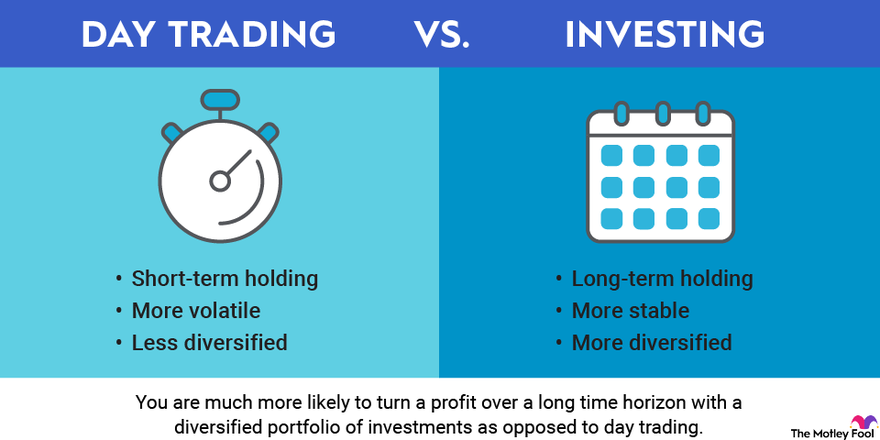

## Table of Contents

## What is day trading and how does it differ from other trading styles?

Day trading is when people buy and sell stocks or other financial things during one day. They try to make money from small changes in prices. Day traders watch the market closely all day and make quick decisions. They don't keep their investments overnight because they want to avoid risks that can happen when the market is closed.

Day trading is different from other styles like swing trading and long-term investing. Swing traders might hold onto their investments for a few days or weeks, trying to catch bigger price moves. Long-term investors, on the other hand, might keep their investments for months or years. They focus on the overall growth of a company or market, not just daily changes. So, day trading is all about quick moves and watching the market closely, while other styles can be more relaxed and focus on longer periods.

## What are the basic requirements to start day trading?

To start day trading, you need a few basic things. First, you need a computer or a smartphone with a good internet connection. This helps you stay connected to the market all day. You also need to open a brokerage account. A brokerage account is like a special bank account where you can buy and sell stocks. Some brokers offer special accounts just for day traders, so you might want to look for those.

Next, you need some money to start trading. Many brokers have a minimum amount of money you need to have in your account to day trade. This is called the "minimum equity requirement," and it's often around $25,000 in the United States. You also need to learn about the market and how to trade. There are many free resources online, like videos and articles, that can teach you the basics. It's a good idea to practice with a "demo account" first, where you can trade without using real money.

Lastly, you need to have a good plan and discipline. Day trading can be risky, so you should know when to buy and sell, and how much money you're willing to lose. It's important to stick to your plan and not let emotions control your decisions. With the right tools, knowledge, and discipline, you can start [day trading](/wiki/day-trading-spy) and try to make money from the market's ups and downs.

## What are the common strategies used in day trading?

Day traders use many different strategies to try to make money. One common strategy is called "[scalping](/wiki/gamma-scalping)." Scalping means buying and selling stocks very quickly, often within minutes, to make small profits from tiny price changes. Day traders who use scalping need to watch the market closely and make fast decisions. Another strategy is "[momentum](/wiki/momentum) trading." This is when traders look for stocks that are moving a lot in one direction and try to jump on the trend to make money. They believe that if a stock is going up fast, it will keep going up for a while, so they buy it and sell it when they think the trend is about to end.

Another popular strategy is "range trading." In range trading, traders look for stocks that seem to move up and down between two prices. They buy the stock when it's at the lower price and sell it when it gets to the higher price. This way, they can make money from the stock's predictable movements. Lastly, some day traders use "news-based trading." They watch for big news that can affect stock prices, like company earnings reports or economic announcements. When good news comes out, they buy the stock hoping the price will go up, and when bad news comes out, they might sell it or even "short" it, which means they bet that the price will go down. Each of these strategies has its own risks and rewards, so day traders need to choose the ones that fit their style and goals.

## How important is technical analysis in day trading?

Technical analysis is very important in day trading. It's a way of looking at charts and patterns to guess where stock prices might go next. Day traders use technical analysis to make quick decisions about when to buy and sell. They look at things like moving averages, which show the average price of a stock over time, and other indicators that can signal if a stock is about to go up or down. Without technical analysis, it would be much harder for day traders to spot good trading opportunities and make money from small price changes.

Even though technical analysis is helpful, it's not perfect. Sometimes the patterns and signals can be wrong, and the stock price can go in the opposite direction from what the analysis predicted. That's why day traders also need to use other tools, like watching the news and understanding the overall market, to make better decisions. But overall, technical analysis is a key part of day trading because it helps traders make sense of the fast-moving market and find the best times to trade.

## What are the risks associated with day trading and how can they be managed?

Day trading can be risky because the market can change quickly, and you might lose money. One big risk is that you could make bad decisions if you're not careful. It's easy to get caught up in the excitement and make trades based on feelings instead of facts. Another risk is that you might use too much money on one trade, which can lead to big losses if the trade goes wrong. Also, the costs of trading, like fees and commissions, can add up and eat into your profits.

To manage these risks, it's important to have a good plan and stick to it. You should decide ahead of time how much money you're willing to risk on each trade and never bet more than you can afford to lose. Using "stop-loss orders" can help limit your losses. A stop-loss order automatically sells your stock if the price drops to a certain level, so you don't lose too much money. It's also a good idea to keep learning about the market and practicing with a demo account before using real money. By being disciplined and careful, you can reduce the risks of day trading and increase your chances of making money.

## How does one select the right stocks or assets for day trading?

Choosing the right stocks or assets for day trading can be tricky, but there are some things you can look at to help you decide. First, you want to pick stocks that are easy to trade and have a lot of people buying and selling them. These are called "liquid" stocks, and they're good for day trading because you can get in and out of your trades quickly. You should also look at how much the stock's price moves during the day. Stocks that move a lot can give you more chances to make money, but they can also be riskier.

Another thing to consider is the news and events that might affect the stock's price. If there's a big news story or a company is about to report its earnings, the stock might move a lot, giving you a good trading opportunity. You can use tools like stock screeners to find stocks that meet your criteria, like ones that are liquid and have big price movements. It's also a good idea to stick to stocks you know about and understand, so you can make better decisions about when to buy and sell.

Technical analysis can also help you pick the right stocks. By looking at charts and patterns, you can spot trends and decide which stocks might go up or down soon. But remember, no method is perfect, and you should always be ready for the stock to move in a way you didn't expect. By combining these different ways of looking at stocks, you can increase your chances of [picking](/wiki/asset-class-picking) the right ones for day trading.

## What role does market volatility play in day trading?

Market [volatility](/wiki/volatility-trading-strategies) is really important for day traders. It means how much the prices of stocks go up and down during the day. When the market is very volatile, the prices can change a lot, which gives day traders more chances to make money. They can buy a stock when the price is low and sell it when it goes up, or they can sell a stock when the price is high and buy it back when it goes down. So, day traders like it when the market is volatile because it means more opportunities to trade.

But, volatility can also be risky. If the prices move a lot, it's harder to predict what will happen next. Sometimes, a stock can suddenly drop a lot, and if you're not careful, you could lose money. That's why day traders need to be good at managing risks. They use things like stop-loss orders to limit how much they can lose if the market moves against them. So, while volatility can be good for making money, it also means day traders need to be extra careful and have a good plan.

## How can a day trader use leverage effectively and safely?

Leverage lets day traders borrow money from their broker to make bigger trades. This can help them make more money if the trade goes well, but it can also lead to bigger losses if the trade goes wrong. To use leverage effectively, day traders need to understand how much they're borrowing and how much they can lose. They should only use leverage on trades they're confident about and never bet more than they can afford to lose. It's important to have a clear plan and stick to it, so they don't get carried away and take too much risk.

To use leverage safely, day traders should set strict limits on how much they're willing to borrow. They can use tools like stop-loss orders to automatically sell a stock if it starts to lose too much money, which helps limit their losses. It's also a good idea to keep learning about the market and practicing with a demo account before using real money with leverage. By being careful and disciplined, day traders can use leverage to their advantage without taking on too much risk.

## What are the psychological challenges faced by day traders and how to overcome them?

Day trading can be really hard on your mind. One big challenge is dealing with stress and fear. When you're watching the market all day, it's easy to feel stressed out, especially if your trades aren't going well. Fear can make you sell your stocks too early or stop you from taking good chances. Another challenge is greed. When you're making money, it's tempting to keep trading and take bigger risks, which can lead to big losses. Also, day traders can feel lonely because they're working by themselves and making quick decisions all day.

To overcome these challenges, it's important to stay calm and stick to your plan. Take breaks when you need them and don't let your feelings control your trades. It can help to talk to other traders or join a trading community so you don't feel so alone. Setting clear goals and knowing how much you're willing to lose can help you avoid getting too greedy. Remember, it's okay to take a step back and think about your trades before making a move. By staying disciplined and keeping a clear head, you can handle the ups and downs of day trading better.

## How do day traders use advanced tools like algorithmic trading?

Day traders use [algorithmic trading](/wiki/algorithmic-trading) to make their trading easier and faster. Algorithmic trading means using computer programs to buy and sell stocks automatically, based on rules set by the trader. These programs can watch the market all day and make trades in seconds, which is much faster than a person can do. This helps day traders take advantage of small price changes that they might miss if they were trading by hand. By using algorithms, day traders can also trade more often and handle more stocks at the same time.

Even though algorithmic trading can be very helpful, it's not perfect. The programs need to be set up correctly, and the rules they follow need to be good ones. If the rules are wrong, the program might make bad trades and lose money. Day traders need to keep an eye on their algorithms and make sure they're working well. They also need to understand how the algorithms work so they can fix any problems that come up. By using algorithmic trading carefully and smartly, day traders can make their trading more efficient and possibly make more money.

## What are the tax implications of day trading?

Day trading can affect your taxes in a big way. When you make money from day trading, it's usually considered short-term capital gains. This means you have to pay taxes on your profits at your regular income tax rate, which can be higher than the tax rate for long-term investments. You also need to keep track of all your trades because you have to report them on your tax return. If you don't keep good records, you might miss out on some tax benefits or end up paying more than you need to.

Another thing to think about is the wash-sale rule. This rule says that if you sell a stock at a loss and buy the same or a similar stock within 30 days, you can't use that loss to lower your taxes right away. You have to wait until you sell the new stock to use the loss. Day traders need to be careful about this rule because they trade a lot and might accidentally break it. Talking to a tax professional can help you understand all the tax rules and make sure you're doing everything right.

## How can one evaluate the performance and improve their day trading skills over time?

To evaluate your day trading performance, you need to keep track of your trades and look at how well you're doing over time. You can use a trading journal to write down every trade you make, including when you bought and sold, how much you made or lost, and why you made those trades. By looking at your journal, you can see patterns in your trading and figure out what's working and what's not. You can also use numbers like your win rate, which is how often you make money on your trades, and your risk-reward ratio, which is how much you're risking compared to how much you could make. These numbers can help you see if you're getting better at trading or if you need to change your strategy.

To improve your day trading skills, you need to keep learning and practicing. You can read [books](/wiki/algo-trading-books) and articles about trading, watch videos, or take courses to learn new strategies and understand the market better. It's also helpful to talk to other traders and learn from their experiences. Practicing with a demo account can let you try out new ideas without risking real money. As you learn and practice, you should keep updating your trading plan and be willing to change your strategies if they're not working. Over time, by being disciplined and always trying to get better, you can become a more successful day trader.

## References & Further Reading

[1]: Bergstra, J., Bardenet, R., Bengio, Y., & Kégl, B. (2011). ["Algorithms for Hyper-Parameter Optimization."](https://papers.nips.cc/paper/4443-algorithms-for-hyper-parameter-optimization) Advances in Neural Information Processing Systems 24.

[2]: ["Advances in Financial Machine Learning"](https://www.amazon.com/Advances-Financial-Machine-Learning-Marcos/dp/1119482089) by Marcos Lopez de Prado

[3]: ["Evidence-Based Technical Analysis: Applying the Scientific Method and Statistical Inference to Trading Signals"](https://www.amazon.com/Evidence-Based-Technical-Analysis-Scientific-Statistical/dp/0470008741) by David Aronson

[4]: ["Machine Learning for Algorithmic Trading"](https://github.com/stefan-jansen/machine-learning-for-trading) by Stefan Jansen

[5]: ["Quantitative Trading: How to Build Your Own Algorithmic Trading Business"](https://books.google.com/books/about/Quantitative_Trading.html?id=j70yEAAAQBAJ) by Ernest P. Chan