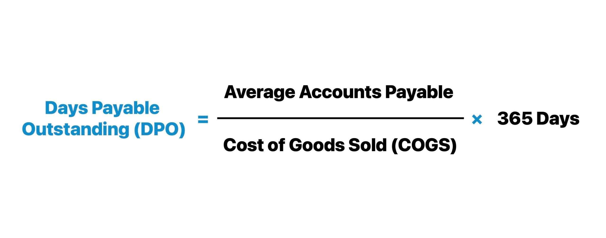

## Table of Contents

## What is Days Payable Outstanding (DPO)?

Days Payable Outstanding (DPO) is a financial measure that shows how many days, on average, a company takes to pay its suppliers after receiving goods or services. It is important because it helps businesses understand their cash flow and manage their working capital effectively. A lower DPO means a company pays its bills quickly, which might be good for maintaining strong supplier relationships but could also mean less cash on hand for other uses.

Calculating DPO involves using the company's accounts payable, cost of goods sold, and the number of days in the period being analyzed. The formula is: DPO = (Accounts Payable / Cost of Goods Sold) * Number of Days. For example, if a company has $50,000 in accounts payable, a cost of goods sold of $600,000 over a year (365 days), the DPO would be (50,000 / 600,000) * 365 = 30.42 days. This means the company takes about 30 days to pay its suppliers on average.

## Why is DPO important for a business?

DPO is important for a business because it shows how quickly the business pays its bills. If a business has a low DPO, it means they pay their suppliers fast. This can be good because suppliers might like them more and give them better deals. But, paying too fast can also mean the business has less money to use for other things, like growing the business or saving for emergencies.

On the other hand, a high DPO means the business takes longer to pay its bills. This can help the business keep more cash on hand, which can be useful for other needs. But, if the DPO is too high, suppliers might get upset and stop giving the business good deals or even stop doing business with them. So, finding the right balance with DPO is key for managing money well and keeping good relationships with suppliers.

## How does DPO affect a company's cash flow?

DPO affects a company's cash flow by showing how long they take to pay their bills. If a company has a low DPO, it means they pay their suppliers quickly. This can be good for keeping suppliers happy, but it also means the company has less cash on hand. Less cash can make it harder for the company to pay for other things they need, like new equipment or expanding the business.

On the other hand, if a company has a high DPO, it means they take longer to pay their bills. This can help the company keep more cash in their bank account, which can be useful for other needs or emergencies. However, if the DPO is too high, suppliers might get upset and stop giving the company good deals or even stop doing business with them. So, finding the right balance with DPO is important for managing cash flow well and keeping good relationships with suppliers.

## What is the basic formula for calculating DPO?

The basic formula for calculating Days Payable Outstanding (DPO) is: DPO = (Accounts Payable / Cost of Goods Sold) * Number of Days. This formula helps you figure out how many days, on average, a company takes to pay its suppliers after getting goods or services.

To use the formula, you need to know the company's accounts payable, which is the money they owe to suppliers, and the cost of goods sold, which is how much it cost them to buy the things they sell. You also need to know the number of days in the period you're looking at, usually a year, which is 365 days. For example, if a company has $50,000 in accounts payable and a cost of goods sold of $600,000 over a year, the DPO would be (50,000 / 600,000) * 365 = 30.42 days. This means the company takes about 30 days to pay its suppliers on average.

## Can you explain the components of the DPO formula?

The DPO formula has three main parts: accounts payable, cost of goods sold, and the number of days. Accounts payable is the money a company owes to its suppliers for goods or services it has received but not yet paid for. This number is important because it shows how much money the company needs to pay out soon.

Cost of goods sold, or COGS, is the total cost of all the goods a company has sold during a certain time period, like a year. This includes the cost of materials and labor used to make the products. The number of days is usually 365 for a year, but it can be different if you're looking at a shorter or longer period. By using these three pieces of information in the formula, you can figure out how many days it takes for the company to pay its bills on average.

## How does the choice of accounting method affect DPO?

The way a company does its accounting can change how long it looks like they take to pay their bills, which is what DPO measures. If a company uses the cash method of accounting, they only count money when it actually moves in or out of their bank account. So, if they get a bill but don't pay it right away, it won't show up in their accounts payable until they pay it. This can make their DPO seem shorter than it really is because the bills aren't counted until they're paid.

On the other hand, if a company uses the accrual method of accounting, they count bills as soon as they get them, even if they haven't paid them yet. This means their accounts payable will show all the bills they owe, making their DPO look longer. So, the choice between cash and accrual accounting can make a big difference in how a company's DPO is calculated and how it looks to others.

## What are common industry benchmarks for DPO?

DPO can be different for each industry. For example, in the retail industry, companies often have a DPO of around 30 to 45 days. This is because they need to pay their suppliers quickly to keep getting new products to sell. In the manufacturing industry, DPO might be a bit longer, around 60 to 90 days. This is because making things takes time, and companies need more time to pay for the materials they use.

In the tech industry, DPO can vary a lot. Some tech companies might have a DPO of 30 to 60 days, but others might take longer, up to 90 days or more. This depends on how they work with their suppliers and how they manage their cash. Knowing these benchmarks can help a company see if they are paying their bills faster or slower than others in their industry, which can be useful for managing money and keeping good relationships with suppliers.

## How can a company improve its DPO?

A company can improve its DPO by negotiating better payment terms with its suppliers. If a company can get its suppliers to agree to longer payment terms, like 60 or 90 days instead of 30, it can keep its cash longer. This means the company will have more money on hand to use for other things, like growing the business or saving for emergencies. It's all about talking to suppliers and seeing if they can be more flexible with when the company needs to pay.

Another way to improve DPO is by managing the accounts payable process more efficiently. If a company can make its payment process faster and more organized, it can take advantage of any discounts for early payment or avoid late fees. This means looking at how the company handles its bills and making sure everything is done on time. By keeping a close eye on when bills are due and making sure payments are made when they should be, a company can keep its DPO in a good spot.

## What are the potential risks of manipulating DPO?

If a company tries to change its DPO on purpose, it might face some big problems. One big risk is that suppliers might get upset if the company takes too long to pay its bills. If suppliers think they won't get paid on time, they might stop giving the company good deals or even stop doing business with them. This can make it hard for the company to get the things it needs to keep working.

Another risk is that changing DPO can mess up the company's money flow. If a company waits too long to pay its bills, it might seem like they have more cash than they really do. This can fool people into thinking the company is doing better than it is. But if the company can't pay its bills when they're due, it might have to borrow money quickly or even go out of business. So, it's important for a company to be careful and honest when dealing with its DPO.

## How does DPO relate to other financial metrics like Days Sales Outstanding (DSO) and Days Inventory Outstanding (DIO)?

DPO, or Days Payable Outstanding, shows how long a company takes to pay its suppliers. It's one part of a bigger picture that also includes Days Sales Outstanding (DSO) and Days Inventory Outstanding (DIO). DSO tells you how long it takes for a company to get paid by its customers after selling them something. DIO shows how long it takes for a company to turn its inventory into sales. When you look at all three together, you can see how well a company is managing its cash flow.

Together, DPO, DSO, and DIO help make up the Cash Conversion Cycle (CCC). The CCC is the time it takes for a company to turn its investments in inventory into cash from sales. A shorter CCC means the company is turning its money around faster, which is usually good. If a company has a high DPO but a low DSO and DIO, it might be keeping its cash longer but also getting paid by customers and selling inventory quickly. Balancing these three metrics can help a company keep enough cash to run smoothly.

## What advanced methods can be used to analyze DPO trends over time?

To analyze DPO trends over time, a company can use time series analysis. This method looks at how DPO changes from one period to another, like month to month or year to year. By using time series analysis, a company can spot patterns or cycles in their DPO. For example, they might see that DPO goes up during certain times of the year, like the holiday season, because they need more time to pay suppliers due to higher sales. This can help the company plan better and make sure they have enough cash to cover their bills.

Another advanced method is regression analysis. This method helps a company understand what things affect their DPO. For instance, a company might use regression analysis to see if changes in sales, the cost of goods sold, or even the economy have an impact on how long it takes them to pay their bills. By figuring out these relationships, a company can make smarter decisions about how to manage their DPO. For example, if they find that higher sales lead to a longer DPO, they might try to negotiate better payment terms with suppliers during busy times.

## How can data analytics and machine learning be applied to optimize DPO in large corporations?

Data analytics and machine learning can help big companies make their DPO better by looking at a lot of information and finding patterns that people might miss. For example, by using data analytics, a company can see how their DPO changes over time and figure out what makes it go up or down. They can look at things like how much they buy, how fast they sell things, and even what's happening in the economy. Machine learning can take this a step further by predicting what the DPO might be in the future based on past data. This can help the company plan ahead and make sure they have enough cash to pay their bills on time.

With machine learning, companies can also try out different ways to pay their bills and see which one works best. For example, they can use a computer model to see what would happen if they paid their suppliers a little faster or a little slower. This can help them find the best balance between keeping their suppliers happy and keeping enough cash on hand. By using these smart tools, big companies can make better decisions about how to manage their money and keep their business running smoothly.

## What is the Formula and Calculation of DPO?

The Days Payable Outstanding (DPO) is an important financial metric calculated using the formula: 

$$
\text{DPO} = \left( \frac{\text{Accounts Payable}}{\text{Cost of Goods Sold}} \right) \times \text{Number of Days}
$$

This formula breaks down into several key components:

1. **Accounts Payable**: This represents the total balance that a company owes to its suppliers for purchases made on credit. It often reflects the short-term obligations a company has incurred while purchasing goods or services.

2. **Cost of Goods Sold (COGS)**: This refers to the direct costs associated with the production of goods that have been sold by a company. It includes the cost of materials, direct labor, and any overhead expenses directly tied to the manufacturing process.

3. **Number of Days**: Typically represented by the number of days in a period (commonly 365 days for a year), this component allows for the consistent calculation of DPO across different timeframes.

### Practical Application of DPO Calculation

To illustrate the calculation, consider a hypothetical scenario:

- Assume a company has Accounts Payable amounting to $500,000.
- The Cost of Goods Sold for the year is $2,500,000.
- For an annual calculation (365 days), the DPO would be calculated as:

$$
\text{DPO} = \left( \frac{500,000}{2,500,000} \right) \times 365 = 73 \text{ days}
$$

This means, on average, the company takes 73 days to pay its suppliers. 

### Variations and Considerations

Different accounting practices could lead to variations in DPO calculation:

- **Using Average Accounts Payable**: Instead of taking the amount of Accounts Payable at a single point in time, some companies may use an average value over a period to mitigate the effects of any fluctuations. The formula then becomes:

$$
\text{DPO} = \left( \frac{\text{Average Accounts Payable}}{\text{Cost of Goods Sold}} \right) \times \text{Number of Days}
$$

- **Weighted Average for COGS**: Certain industries might benefit from using a weighted average for COGS if production costs vary significantly over time.

These methodologies help in achieving a more nuanced understanding of DPO, especially in environments with significant financial and operational variability, and can provide insights into how efficiently a company manages its vendor payments relative to its production costs.

## References & Further Reading

[1]: Bergstra, J., Bardenet, R., Bengio, Y., & Kégl, B. (2011). ["Algorithms for Hyper-Parameter Optimization."](https://papers.nips.cc/paper/4443-algorithms-for-hyper-parameter-optimization) Advances in Neural Information Processing Systems 24.

[2]: ["Advances in Financial Machine Learning"](https://www.amazon.com/Advances-Financial-Machine-Learning-Marcos/dp/1119482089) by Marcos Lopez de Prado

[3]: ["Evidence-Based Technical Analysis: Applying the Scientific Method and Statistical Inference to Trading Signals"](https://www.amazon.com/Evidence-Based-Technical-Analysis-Scientific-Statistical/dp/0470008741) by David Aronson

[4]: ["Machine Learning for Algorithmic Trading"](https://github.com/stefan-jansen/machine-learning-for-trading) by Stefan Jansen

[5]: ["Quantitative Trading: How to Build Your Own Algorithmic Trading Business"](https://www.amazon.com/Quantitative-Trading-Build-Algorithmic-Business/dp/1119800064) by Ernest P. Chan