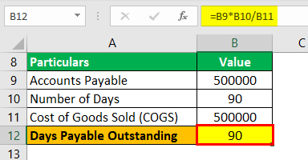

Days Payable Outstanding (DPO) is a critical financial metric that offers significant insights into a company’s efficiency in managing payment strategies towards its suppliers. As a vital component of financial health, DPO measures the average time a company takes to settle its debts with trade creditors. This period not only impacts the company's cash flow management but also reflects its ability to negotiate favorable credit terms, directly influencing its liquidity and operational strategy.

Understanding DPO is particularly important for companies focused on optimizing cash flow and retaining robust supplier relationships. An efficiently managed DPO can provide a company with the liquidity needed for investments or operations, while a poorly managed one may lead to strained supplier relationships and financial instability. High DPO values can indicate effective cash utilization or potential liquidity issues, whereas low values might suggest either a strong credit profile or an opportunity cost regarding cash management.



This article examines the intersection of DPO with algorithmic trading, illustrating how this financial metric can unlock new potentials for traders and financial strategists. Algorithmic trading, which utilizes complex algorithms to make trading decisions and execute trades at speeds and frequencies that are impossible for human traders, can benefit from integrating DPO data. By leveraging DPO, algorithmic models can enhance investment strategies and cash flow management, ultimately leading to optimized trading outcomes.

Additionally, we explore how to calculate DPO and the implications it holds for businesses. The traditional formula for DPO is given by:

$$
\text{DPO} = \left(\frac{\text{Accounts Payable}}{\text{Cost of Goods Sold}}\right) \times \text{Number of Days}
$$

Incorporating DPO into algorithmic trading models can provide unique insights, helping anticipate liquidity shifts and refine trading strategies through machine learning and artificial intelligence enhancements. This comprehensive guide aims to arm financial professionals with actionable insights on leveraging DPO for improved financial and trading efficiencies.

## Table of Contents

## Understanding Days Payable Outstanding (DPO)

Days Payable Outstanding (DPO) is a financial metric that calculates the average number of days a company takes to settle its invoices and financial obligations with its trade creditors. This metric serves as an indicator of a company's cash flow management capabilities and reflects its effectiveness in negotiating payment terms with suppliers. 

The efficiency of a company's cash flow management is often gauged through its DPO value. A higher DPO suggests that the company is adept at extending the time it retains available cash before making payments to creditors, allowing the company to utilize this cash for short-term investments or other operational needs. This can be advantageous in terms of increasing [liquidity](/wiki/liquidity-risk-premium) and utilizing funds for potentially profitable endeavors. However, a persistently high DPO could also hint at potential cash flow challenges, implying that the company might struggle to meet its financial obligations punctually.

Conversely, a lower DPO can be indicative of strong creditworthiness and a good relationship with suppliers. Such companies often pay their creditors promptly, promoting trust and potentially gaining favorable terms, such as discounts for early payments. Nevertheless, maintaining a low DPO could also represent a missed opportunity to utilize cash more effectively elsewhere in the company’s operations.

In summary, DPO provides insights into a company's financial practices related to cash flow management and supplier engagement. It is not inherently good or bad but must be interpreted within the context of the industry and specific business strategy.

## The Formula and Calculation of DPO

The Days Payable Outstanding (DPO) is an important financial metric calculated using the formula: 

$$
\text{DPO} = \left( \frac{\text{Accounts Payable}}{\text{Cost of Goods Sold}} \right) \times \text{Number of Days}
$$

This formula breaks down into several key components:

1. **Accounts Payable**: This represents the total balance that a company owes to its suppliers for purchases made on credit. It often reflects the short-term obligations a company has incurred while purchasing goods or services.

2. **Cost of Goods Sold (COGS)**: This refers to the direct costs associated with the production of goods that have been sold by a company. It includes the cost of materials, direct labor, and any overhead expenses directly tied to the manufacturing process.

3. **Number of Days**: Typically represented by the number of days in a period (commonly 365 days for a year), this component allows for the consistent calculation of DPO across different timeframes.

### Practical Application of DPO Calculation

To illustrate the calculation, consider a hypothetical scenario:

- Assume a company has Accounts Payable amounting to $500,000.
- The Cost of Goods Sold for the year is $2,500,000.
- For an annual calculation (365 days), the DPO would be calculated as:

$$
\text{DPO} = \left( \frac{500,000}{2,500,000} \right) \times 365 = 73 \text{ days}
$$

This means, on average, the company takes 73 days to pay its suppliers. 

### Variations and Considerations

Different accounting practices could lead to variations in DPO calculation:

- **Using Average Accounts Payable**: Instead of taking the amount of Accounts Payable at a single point in time, some companies may use an average value over a period to mitigate the effects of any fluctuations. The formula then becomes:

$$
\text{DPO} = \left( \frac{\text{Average Accounts Payable}}{\text{Cost of Goods Sold}} \right) \times \text{Number of Days}
$$

- **Weighted Average for COGS**: Certain industries might benefit from using a weighted average for COGS if production costs vary significantly over time.

These methodologies help in achieving a more nuanced understanding of DPO, especially in environments with significant financial and operational variability, and can provide insights into how efficiently a company manages its vendor payments relative to its production costs.

## Strategic Implications of DPO

A high Days Payable Outstanding (DPO) can significantly influence a company's financial strategy by providing increased liquidity. This enhanced liquidity arises from the longer duration over which a company holds onto its cash before settling its obligations to suppliers. By extending the payment period, companies can channel their available cash into short-term investments or operational needs, potentially [earning](/wiki/earning-announcement) returns that exceed the costs associated with delayed payments. 

However, while a high DPO can be beneficial, it is not universally advantageous for every firm. Its effectiveness varies greatly across industries, depending on the typical payment terms and practices common within each sector. For instance, industries with tight supply chains or reliant on perishable goods may naturally operate with a lower DPO, whereas industries with longer production cycles might benefit from extending payment periods. Furthermore, a company’s negotiating power with its suppliers plays a crucial role. Strong relationships and bargaining leverage allow businesses to negotiate favorable terms without damaging supplier ties.

Effective DPO management goes beyond merely maximizing cash retention. It involves balancing payment terms to maintain strategic supplier relationships, ensuring that prolonged payment cycles do not strain these critical partnerships. Suppliers may have varied tolerances for delayed payments, and pushing these limits could result in diminished goodwill, strained negotiations, or disruptions in supply lines. Therefore, firms must consider the broader implications of their DPO management, prioritizing sustainable financial practices that align with both internal cash flow goals and supplier expectations.

By strategically managing DPO, companies can enhance their financial health, positioning themselves to take advantage of market opportunities while maintaining robust supplier networks. This balance is essential for sustaining long-term operational efficiency and competitiveness.

## DPO in the Context of Algo Trading

Integrating Days Payable Outstanding (DPO) data into [algorithmic trading](/wiki/algorithmic-trading) models presents a promising frontier for optimizing cash flow management and enhancing trading strategies. This integration allows financial strategists to harness liquidity indicators effectively, potentially turning them into actionable insights for trading decisions.

One of the primary ways DPO data can be leveraged is through algorithmic models that predict trends based on its fluctuations. For instance, consider a scenario where a company exhibits an upward trend in its DPO. Such a pattern might suggest improved liquidity as the company retains cash longer. In algorithmic trading, anticipating these liquidity increases allows traders to adjust their positions in advance, aligning their strategies with expected cash flow conditions. This proactive stance can improve risk management and enhance return profiles.

To implement this, predictive modeling can be built using historical DPO data. Python, with its robust libraries, offers tools for such analysis. Here's a simple example of using Python to model DPO trends:

```python
import pandas as pd
from sklearn.linear_model import LinearRegression
import numpy as np

# Example dataset
data = {
    'Month': ['2023-01', '2023-02', '2023-03', '2023-04'],
    'DPO': [45, 47, 48, 50]
}
df = pd.DataFrame(data)

# Preparing the data
df['Month'] = pd.to_datetime(df['Month'])
df['MonthIndex'] = np.arange(len(df))

# Linear regression model
model = LinearRegression()
model.fit(df[['MonthIndex']], df['DPO'])

# Predict future DPO
future_index = np.array([[5]])  # e.g., predict for the 5th month
predicted_dpo = model.predict(future_index)
print(f"Predicted DPO for next month: {predicted_dpo[0]:.2f}")
```

In addition to trend analysis, utilizing [machine learning](/wiki/machine-learning) and [artificial intelligence](/wiki/ai-artificial-intelligence) helps refine algorithmic interpretations of DPO data. Machine learning algorithms, such as neural networks, can detect nonlinear patterns and subtle dependencies in the data that traditional models might overlook. This capability is crucial in high-frequency trading environments where even minor inefficiencies in interpreting financial metrics can significantly impact performance.

Furthermore, AI systems can continuously learn from new data, adapting to shifts in market conditions and refining trading algorithms in real-time. Through this continuous learning process, traders can maintain a competitive edge by ensuring their strategies are always aligned with the most current financial insights, including those derived from DPO.

Overall, integrating DPO into algorithmic trading not only offers a strategic advantage in cash flow management but also represents a convergence of financial analysis and technology, driving innovative trading practices.

## Case Studies: DPO and Algorithmic Trading

In recent years, integrating financial metrics such as Days Payable Outstanding (DPO) into algorithmic trading has become increasingly prevalent. This approach improves strategy efficiency and enhances decision-making capabilities based on real-time financial health indicators. 

One notable example is Amazon, which strategically manages its supplier payments using DPO to bolster its market position. Amazon's high DPO allows the company to maintain greater liquidity, which can be redirected into growth initiatives or competitive pricing strategies. By effectively managing DPO, Amazon minimizes financing costs and maximizes cash availability, thus gaining an edge over competitors who may not optimize their payment cycles as efficiently.

Proprietary trading firms also employ DPO data to enhance their trading strategies. These firms integrate DPO readings into their algorithms to predict liquidity trends and adjust trading positions accordingly. For instance, a firm might detect an upward trend in a company's DPO, suggesting that the company is extending payment terms to suppliers. This could signal either strategic cash flow management or potential liquidity issues. By analyzing such trends, firms develop competitive trading strategies that anticipate market movements based on corporate payment behaviors.

These examples illustrate how blending traditional financial metrics like DPO with sophisticated trading algorithms can yield powerful insights and strategic advantages. By harnessing DPO data, companies and trading entities can optimize both operational and market strategies, resulting in more informed decision-making processes.

## Challenges and Considerations

When integrating Days Payable Outstanding (DPO) into algorithmic trading strategies, it is crucial to address various challenges and considerations to ensure effective implementation and avoid common pitfalls.

One potential pitfall is the over-reliance on DPO data which may lead to misinterpretations of a company's financial health. A high DPO, although often indicative of enhanced liquidity and efficient cash flow management, can also signal underlying financial distress if a company is unable to pay its suppliers on time. For traders, this misinterpretation can result in misguided investment strategies, as DPO does not encompass all aspects of a company's financial condition. Complementary metrics such as liquidity ratios and profitability indicators should be used alongside DPO to build a more comprehensive view of a company's financial strategy.

Industry-specific challenges also arise in accurately benchmarking DPO values for strategic advantage. DPO norms can vary widely across industries due to differences in business models, supplier relationships, and operational cycles. For example, industries with longer production cycles, such as manufacturing, typically have higher DPO values compared to service-based industries. Consequently, using DPO benchmarks applicable to one industry may not be suitable for another. Financial analysts and algorithmic trading models must consider industry-specific factors and adjust their DPO benchmarks to accurately reflect competitive positioning and strategic goals.

Furthermore, when tailoring algorithmic models to specific business environments, considerations must be made to ensure precise use of DPO data. This involves integrating real-time data analytics and machine learning techniques to account for dynamic market conditions and evolving business needs. Python, a popular language in data science, can be employed to develop algorithms that adjust dynamically based on live DPO inputs. For example:

```python
import numpy as np
import pandas as pd

def adjust_strategy(dpo, industry_avg):
    if dpo > 1.1 * industry_avg:
        return "Sell"
    elif dpo < 0.9 * industry_avg:
        return "Buy"
    else:
        return "Hold"

# Sample data
dpo_values = pd.Series([75, 60, 90])
industry_avg = 70

# Applying strategy
strategy = dpo_values.apply(lambda x: adjust_strategy(x, industry_avg))
print(strategy)
```

Such models need to incorporate considerations of accounting practices, seasonal variations, and macroeconomic factors that influence DPO figures. Only by addressing these challenges can DPO be reliably utilized in crafting algorithmic trading strategies that reflect the true economic health and operational efficiency of businesses.

## Conclusion

Days Payable Outstanding (DPO) operates both as a crucial financial metric and a strategic tool within algorithmic trading. By assessing the average time a company takes to pay its suppliers, DPO offers insights into the firm's cash flow management and financial health. For algorithmic trading, the integration of DPO highlights its potential in forecasting liquidity changes and optimizing investment strategies. 

In future developments, the embrace of financial metrics like DPO in automated trading systems is anticipated to expand. The rise of machine learning and artificial intelligence offers opportunities for models to incorporate DPO dynamically, improving decision-making and timing in trading activities. With enhanced data analysis capabilities, these technologies promise refined interpretations of DPO, allowing for more informed anticipatory adjustments in trading positions.

Continued research and innovation remain crucial in harmonizing financial analysis with algorithmic trading strategies. By advancing these integrations, businesses can achieve holistic optimization, enhancing both financial and trading efficiency. Exploring the multifaceted role of metrics like DPO will undoubtedly contribute to a more comprehensive understanding of cash flow management and strategic investments.

## FAQs

**What is the optimal DPO value for a specific industry?**

The optimal Days Payable Outstanding (DPO) value varies significantly across industries due to distinct operational characteristics and business cycles. An industry characterized by high liquidity and capital-intensive operations, such as manufacturing, typically has a higher DPO. This allows such companies to maintain cash flow flexibility and invest in their operations. Conversely, industries like retail often display a lower DPO since their business model relies heavily on maximizing inventory turnover and maintaining strong supplier relationships. There is no one-size-fits-all optimal DPO value, and companies should benchmark their DPO against industry standards and adjust based on strategic needs and supplier negotiations.

**How does DPO differ from other key financial metrics?**

DPO differs from other financial metrics by focusing specifically on the time span a company takes to settle its payables. While closely related to metrics such as Days Sales Outstanding (DSO) and Days Inventory Outstanding (DIO), which together form the cash conversion cycle (CCC), DPO provides specific insights into a company’s cash management and supplier payment strategies. DSO measures the average time a company takes to collect revenue after a sale, whereas DIO indicates how long a company holds inventory before selling it. Together, these metrics offer a more comprehensive view of a company's working capital efficiency, but DPO singularly highlights the payables strategy and liquidity management.

**What role does DPO play in strategic cash flow management for traders?**

For traders, especially those utilizing algorithmic trading, DPO serves as a leverage point to optimize cash positions and predict liquidity behaviors. By analyzing DPO trends, traders can anticipate changes in a company’s cash reserves, which may affect its market position or stock price. Algorithmically, integrating DPO into trading models assists in adjusting trades based on expected liquidity changes, potentially improving profitability. Traders can develop predictive models that use historical DPO patterns to signal favorable or unfavorable trading conditions, thereby aligning trading strategies with the underlying financial health denoted by the company’s payables strategy.

## References & Further Reading

[1]: Bergstra, J., Bardenet, R., Bengio, Y., & Kégl, B. (2011). ["Algorithms for Hyper-Parameter Optimization."](https://papers.nips.cc/paper/4443-algorithms-for-hyper-parameter-optimization) Advances in Neural Information Processing Systems 24.

[2]: ["Advances in Financial Machine Learning"](https://www.amazon.com/Advances-Financial-Machine-Learning-Marcos/dp/1119482089) by Marcos Lopez de Prado

[3]: ["Evidence-Based Technical Analysis: Applying the Scientific Method and Statistical Inference to Trading Signals"](https://www.amazon.com/Evidence-Based-Technical-Analysis-Scientific-Statistical/dp/0470008741) by David Aronson

[4]: ["Machine Learning for Algorithmic Trading"](https://github.com/stefan-jansen/machine-learning-for-trading) by Stefan Jansen

[5]: ["Quantitative Trading: How to Build Your Own Algorithmic Trading Business"](https://www.amazon.com/Quantitative-Trading-Build-Algorithmic-Business/dp/1119800064) by Ernest P. Chan