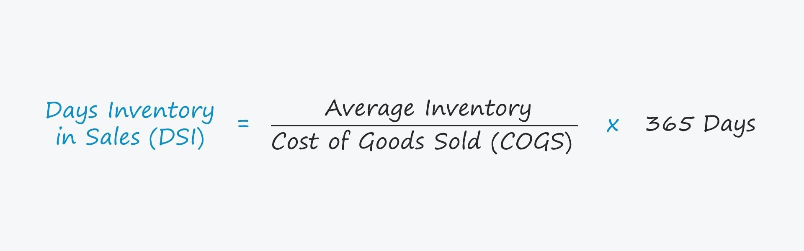

## Table of Contents

## What is Days Sales of Inventory (DSI)?

Days Sales of Inventory (DSI) is a financial measure that shows how many days it takes for a company to turn its inventory into sales. It helps businesses understand how quickly they are selling their products. A lower DSI means that a company is selling its inventory quickly, which is usually good because it means the company is efficient and not holding onto products for too long.

To calculate DSI, you divide the average inventory by the cost of goods sold, and then multiply the result by the number of days in the period you are looking at, usually a year (365 days). For example, if a company's average inventory is $50,000 and its cost of goods sold is $200,000, the DSI would be (50,000 / 200,000) * 365 = 91.25 days. This means it takes about 91 days for the company to sell its inventory.

## How is Days Sales of Inventory calculated?

Days Sales of Inventory (DSI) is a way to find out how many days it takes for a company to sell all its inventory. To calculate DSI, you need to know two things: the average inventory and the cost of goods sold. The average inventory is the total value of all the products the company has, divided by the number of periods you are looking at. The cost of goods sold is how much it cost the company to make or buy the products that were sold during that time.

To do the calculation, you take the average inventory and divide it by the cost of goods sold. Then, you multiply that number by the number of days in the period you are looking at, which is usually 365 days for a year. For example, if a company's average inventory is $50,000 and its cost of goods sold is $200,000, the DSI would be (50,000 / 200,000) * 365 = 91.25 days. This means it takes about 91 days for the company to sell all its inventory.

## Why is DSI important for a business?

Days Sales of Inventory (DSI) is important for a business because it shows how quickly the company is selling its products. If the DSI is low, it means the company is selling its inventory fast, which is usually a good thing. It shows that the company is efficient and not holding onto products for too long. This can help the business manage its cash flow better because it doesn't have a lot of money tied up in unsold products.

On the other hand, a high DSI can be a warning sign. It might mean that the company is not selling its products as quickly as it should. This could lead to problems like having to store a lot of unsold goods, which can be expensive. It might also mean that the company needs to look at its pricing or marketing strategies to see if they can sell their products faster. Understanding DSI helps a business make better decisions about production, sales, and inventory management.

## What does a high DSI indicate about a company's inventory management?

A high DSI means that a company is taking a long time to sell its inventory. This can be a sign that the company is not managing its inventory well. When products sit in the warehouse for a long time, it can cost the company more money because they have to pay for storage and might have to lower prices to sell the old stock.

Having a high DSI can also mean that the company needs to look at its sales strategies. Maybe the products are not popular, or the company is not doing a good job of marketing them. By understanding why the DSI is high, the company can make changes to sell its products faster and manage its inventory better.

## What does a low DSI suggest about a company's inventory turnover?

A low DSI means that a company is selling its inventory quickly. This is a good thing because it shows that the company is efficient at turning its products into sales. When a company has a low DSI, it means they don't have a lot of money tied up in unsold products, which is good for their cash flow.

Having a low DSI also suggests that the company is good at managing its inventory. They are probably doing a good job of matching what they produce or buy to what customers want to buy. This can help the company avoid having to store a lot of products for a long time, which can be expensive.

## How can DSI be used to compare companies within the same industry?

DSI can be used to compare companies within the same industry by looking at how quickly each company sells its inventory. For example, if one company has a DSI of 30 days and another has a DSI of 60 days, the first company is selling its products twice as fast as the second one. This can help investors and managers see which company is better at managing its inventory and turning products into sales.

Using DSI to compare companies can also show if a company is doing better or worse than the average for its industry. If the average DSI for the industry is 45 days, a company with a DSI of 30 days is doing better than average, while a company with a DSI of 60 days is doing worse. This information can help businesses see where they stand and what they might need to do to improve their inventory management.

## What are the limitations of using DSI as a performance metric?

DSI is a useful way to look at how quickly a company sells its products, but it has some limits. One big limit is that DSI does not tell you why the number is high or low. For example, a high DSI might mean that the company is not selling its products fast enough, but it could also mean that the company is holding onto inventory because they expect prices to go up. Without more information, it's hard to know what the DSI really means.

Another limitation is that DSI can be different from one industry to another. What is a good DSI in one industry might be bad in another. For example, a grocery store might have a low DSI because food goes bad quickly, while a car dealer might have a higher DSI because cars don't spoil. Comparing DSI across different industries can be confusing and not very helpful. It's better to compare DSI within the same industry, but even then, other factors like seasonal changes or special promotions can affect the numbers.

## How does DSI relate to other financial ratios like inventory turnover ratio?

DSI and inventory turnover ratio are closely related because they both look at how fast a company sells its products. DSI shows how many days it takes to sell the inventory, while the inventory turnover ratio tells you how many times a company sells and replaces its inventory in a year. To find the inventory turnover ratio, you divide the cost of goods sold by the average inventory. If the inventory turnover ratio is high, it means the company is selling its products quickly, which leads to a low DSI.

Both ratios help a business understand how well it is managing its inventory. A high inventory turnover ratio means a low DSI, which is usually good because it shows the company is efficient. But, a very high turnover might mean the company is not keeping enough stock, which could lead to missed sales. On the other hand, a low inventory turnover ratio means a high DSI, which might show that the company is not selling its products fast enough. This could be a sign that the company needs to change its sales or marketing strategies.

## Can DSI be influenced by seasonal fluctuations, and if so, how?

Yes, DSI can be influenced by seasonal fluctuations. Many businesses see changes in their sales at different times of the year. For example, a toy store might sell a lot more toys around Christmas, so their DSI would be lower during that time. But after the holidays, the store might not sell as many toys, so their DSI would go up because it takes longer to sell the rest of their inventory.

Because of these seasonal changes, it can be hard to use DSI to compare how well a company is doing at different times of the year. If you only look at the DSI for one month, it might not give you a good picture of how the company manages its inventory all year. It's better to look at the DSI over a longer time, like a whole year, to see the average and understand how seasonal changes affect it.

## How can a company improve its DSI?

A company can improve its DSI by selling its products faster. One way to do this is by making sure they have the right products that people want to buy. If a company knows what its customers like, it can focus on selling those items. Another way is to offer sales or discounts to get people to buy more. This can help move inventory faster, which will lower the DSI. Also, the company can use better marketing to let more people know about their products, which can increase sales and improve the DSI.

Another important way to improve DSI is by managing inventory better. This means not keeping too much stock that doesn't sell quickly. The company can use technology to keep track of what is selling and what isn't, and then order more of the popular items and less of the slow-moving ones. It's also helpful to work with suppliers to get products faster when they are needed. By keeping the right amount of inventory, a company can sell its products faster and have a lower DSI.

## What are the industry benchmarks for DSI, and how do they vary across different sectors?

Industry benchmarks for DSI can be different depending on the type of business. For example, in the grocery business, DSI is usually low, around 10 to 20 days. This is because food goes bad quickly, so stores need to sell it fast. In the car industry, DSI might be higher, around 50 to 70 days. Cars don't spoil like food, so dealers can keep them in stock longer. Knowing these benchmarks helps a company see if they are doing well compared to others in their industry.

DSI can also change a lot within the same industry. For example, in the clothing business, a fast-fashion store might have a DSI of about 30 to 45 days because they change their styles often. But a high-end clothing store might have a DSI of 60 to 90 days because their customers take more time to decide on expensive items. So, even within the same industry, what is a good DSI can be different depending on the type of products and how the company sells them.

## How can advanced analytics and forecasting models be used to optimize DSI?

Advanced analytics and forecasting models can help a company optimize its DSI by predicting how much of each product they will sell. These models look at past sales data, seasonal trends, and other information to guess what customers will want in the future. By knowing what products will sell well, the company can order just the right amount of inventory. This means they won't have too much stock sitting around, which can lower their DSI and help them sell products faster.

These models can also help the company see patterns in their sales that they might not notice otherwise. For example, they might find out that certain products sell better at certain times of the year or in certain locations. With this information, the company can plan their inventory better. They can make sure they have enough of the popular items when they are needed and not order too much of the slow-selling ones. This helps the company manage its inventory more efficiently and keep their DSI low.

## What is Understanding Days Sales of Inventory (DSI)?

Days Sales of Inventory (DSI) is a fundamental financial metric used to assess how effectively a company manages its inventory. It represents the average number of days a company takes to sell its entire inventory during a specific period. Calculating DSI provides valuable insights into operational efficiency and helps businesses identify areas for potential improvement in inventory turnover.

A lower DSI value is preferable as it signifies the company's ability to efficiently convert inventory into sales. This efficiency reflects strengths in sales performance and inventory management, indicating that a company spends less time holding onto stock before selling it. Conversely, a high DSI might suggest overstocking, slower sales, or inefficiencies in inventory management processes.

The formula for calculating DSI is:

$$
\text{DSI} = \left( \frac{\text{Average Inventory}}{\text{Cost of Goods Sold}} \right) \times \text{Number of Days}
$$

Where:
- **Average Inventory** is the average value of inventory for the period, often calculated by [(Beginning Inventory + Ending Inventory) / 2].
- **Cost of Goods Sold (COGS)** corresponds to the direct costs attributable to the production of the goods sold in a company.
- **Number of Days** usually represents the period over which the DSI is being calculated, commonly 365 days for annual analysis.

By assessing DSI, companies can pinpoint specific inventory management challenges that may be impacting their financial performance. A detailed examination of DSI alongside other inventory metrics allows businesses to refine their strategies, optimize inventory levels, and enhance overall operational efficiency.

## What are the FAQs on DSI and Inventory Management?

What is considered a good DSI value?

A good Days Sales of Inventory (DSI) value typically depends on the industry and the specific business model. In general, a lower DSI indicates more efficient inventory management, suggesting that the company quickly converts inventory into sales. For example, a retail company might consider a DSI of around 30-40 days to be good, reflecting rapid inventory turnover. Conversely, in industries like manufacturing, where production cycles are longer, a DSI ranging from 50 to 70 days might be acceptable. It's essential to compare a company's DSI with industry benchmarks and its historical performance to make a meaningful assessment.

How does DSI relate to inventory turnover ratios?

DSI and inventory turnover ratios both measure how efficiently a company manages its inventory, albeit from different perspectives. The inventory turnover ratio indicates how many times a company's inventory is sold and replaced over a period, typically expressed annually. It is calculated as:

$$
\text{Inventory Turnover Ratio} = \frac{\text{Cost of Goods Sold (COGS)}}{\text{Average Inventory}}
$$

DSI, on the other hand, expresses the average number of days it takes to sell the inventory. The relationship between DSI and the inventory turnover ratio can be mathematically expressed as:

$$
\text{DSI} = \frac{\text{Number of Days in Period}}{\text{Inventory Turnover Ratio}}
$$

Therefore, a higher inventory turnover ratio corresponds to a lower DSI, indicating efficient inventory management. A careful analysis of both metrics provides insights into a company's inventory practices.

In what ways can algorithmic trading benefit from DSI data?

Algorithmic trading can significantly benefit from incorporating DSI data in several ways:

1. **Market Movement Predictions**: DSI trends can be analyzed to gauge a company's sales efficiency and potential future stock performance. An improving DSI might indicate stronger sales prospects, influencing stock price positively.

2. **Trading Signals**: Algorithms can incorporate DSI as a factor to generate buy or sell signals. For instance, an unexpectedly high DSI might suggest overstocking, potentially signaling a future decline in stock price due to inventory write-offs.

3. **Sector Comparisons**: Algorithms can use DSI to compare peer companies within the same industry. Firms with lower DSI than the industry average may be considered attractive investment opportunities due to better inventory management.

4. **Risk Management**: By tracking changes in DSI, algorithms can assess operational risks associated with inventory management, thus making more informed trading decisions.

In Python, such an algorithmic strategy might look like:

```python
def calculate_dsi(cogs, average_inventory):
    return (average_inventory / cogs) * 365

def trading_signal(dsi, industry_average_dsi):
    if dsi < industry_average_dsi:
        return "buy"
    elif dsi > industry_average_dsi:
        return "sell"
    else:
        return "hold"

# Example usage
cogs = 1000000
average_inventory = 50000
industry_avg_dsi = 40

company_dsi = calculate_dsi(cogs, average_inventory)
signal = trading_signal(company_dsi, industry_avg_dsi)
print(f"DSI: {company_dsi}, Trading Signal: {signal}")
```
Such strategies demonstrate how DSI can enhance decision-making processes in algorithmic trading environments.

## References & Further Reading

[1]: ["Inventory Management Explained: A Focus on Forecasting, Lot Sizing, Safety Stock, and Ordering Systems"](https://www.amazon.com/Inventory-Management-Explained-Forecasting-Ordering/dp/0972763112) by David J. Piasecki

[2]: ["Advanced Trading Strategies and Techniques"](https://www.investopedia.com/advanced-trading-strategies-and-instruments-4689645) by Zura Kakushadze

[3]: ["High-Frequency Trading: A Practical Guide to Algorithmic Strategies and Trading Systems"](https://www.ahmetbeyefendi.com/wp-content/uploads/2020/07/High-Frequency-Trading-Irene-Aldridge.pdf) by Irene Aldridge

[4]: ["Principles of Financial Modelling: Model Design and Best Practices Using Excel and VBA"](https://onlinelibrary.wiley.com/doi/book/10.1002/9781118903933) by Michael Rees

[5]: ["Inventory Optimization: Models and Simulations"](https://www.amazon.com/Inventory-Optimization-Simulations-Nicolas-Vandeput-ebook/dp/B08FQSXXFB) edited by Nilay Shah

[6]: ["The Handbook of Trading: Strategies for Navigating and Profiting from Currency, Bond, and Stock Markets"](https://www.amazon.com/Handbook-Trading-Strategies-Navigating-McGraw-Hill/dp/0071743537) by Greg N. Gregoriou

[7]: ["Financial Statement Analysis"](https://www.investopedia.com/terms/f/financial-statement-analysis.asp) by John J. Wild, Leopold A. Bernstein, and K. R. Subramanyam.