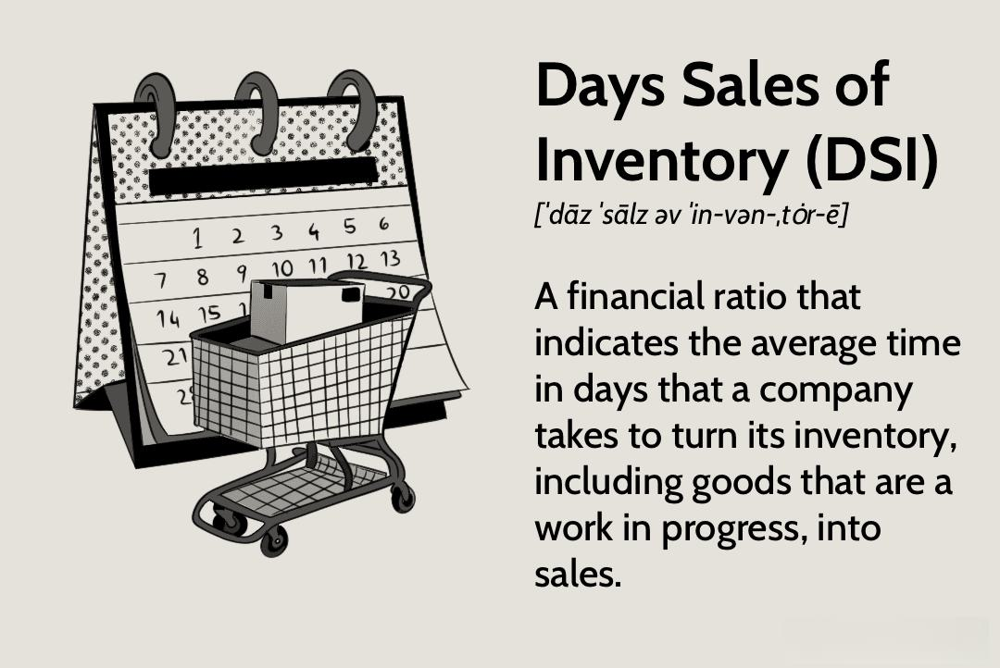

Understanding financial metrics and their impact on business operations is crucial in today's fast-paced market environment. Companies must navigate a complex financial landscape where efficient operations can significantly enhance profitability and provide a competitive edge. Among these financial metrics, Days Sales of Inventory (DSI) stands out as an essential ratio that offers valuable insights into a company's inventory management practices.

Days Sales of Inventory (DSI) is a key financial ratio that provides insights into inventory management efficiency. It assesses how long, on average, a company takes to convert its inventory into sales. This metric is pivotal for businesses aiming to optimize their inventory turnover since a lower DSI indicates greater efficiency by signifying quicker conversion of inventory into cash.



The mathematical formulation of DSI is straightforward, calculated as:
$$
\text{DSI} = \left( \frac{\text{Average Inventory}}{\text{Cost of Goods Sold}} \right) \times \text{Number of Days}
$$
This formula enables businesses to evaluate their inventory turnover, identifying potential areas where improvements can be made to enhance operational efficiency.

Beyond its traditional role in inventory management, DSI has significant implications in modern algorithmic trading. By incorporating DSI data, algorithmic trading strategies can make more informed decisions about stock performances and market trends. This integration of financial metrics into trading algorithms can lead to more accurate predictions and consequently higher returns.

This article aims to bridge the gap between traditional inventory management techniques and modern algorithmic trading strategies. By thoroughly exploring DSI, we offer insights into its practical applications and strategic importance, providing businesses with tools to enhance their operational and financial performance. The convergence of these fields represents an opportunity for companies to leverage financial data for strategic advantage across multiple domains.

## Table of Contents

## Understanding Days Sales of Inventory (DSI)

Days Sales of Inventory (DSI) is a fundamental financial metric used to assess how effectively a company manages its inventory. It represents the average number of days a company takes to sell its entire inventory during a specific period. Calculating DSI provides valuable insights into operational efficiency and helps businesses identify areas for potential improvement in inventory turnover.

A lower DSI value is preferable as it signifies the company's ability to efficiently convert inventory into sales. This efficiency reflects strengths in sales performance and inventory management, indicating that a company spends less time holding onto stock before selling it. Conversely, a high DSI might suggest overstocking, slower sales, or inefficiencies in inventory management processes.

The formula for calculating DSI is:

$$
\text{DSI} = \left( \frac{\text{Average Inventory}}{\text{Cost of Goods Sold}} \right) \times \text{Number of Days}
$$

Where:
- **Average Inventory** is the average value of inventory for the period, often calculated by [(Beginning Inventory + Ending Inventory) / 2].
- **Cost of Goods Sold (COGS)** corresponds to the direct costs attributable to the production of the goods sold in a company.
- **Number of Days** usually represents the period over which the DSI is being calculated, commonly 365 days for annual analysis.

By assessing DSI, companies can pinpoint specific inventory management challenges that may be impacting their financial performance. A detailed examination of DSI alongside other inventory metrics allows businesses to refine their strategies, optimize inventory levels, and enhance overall operational efficiency.

## The Importance of DSI in Inventory Management

Days Sales of Inventory (DSI) plays a critical role in evaluating a company's inventory management and [liquidity](/wiki/liquidity-risk-premium) status by indicating how long stock remains before being sold. A high DSI value might signal overstocking or inefficiencies, constraining cash flow due to funds being tied up in unsold inventory. This scenario can result in increased holding costs, which directly impacts a company's profitability. Conversely, a low DSI value reflects efficient turnover, highlighting strong sales performance and effective inventory management.

By keeping a careful watch on DSI, businesses can make informed decisions that help optimize their inventory levels, thereby positively influencing cash flow. With inventory constituting a significant portion of current assets, reducing the time inventory sits on the shelves minimizes the risk of holding obsolete or unsellable items. This proactive management can lead to enhanced profit margins by cutting storage and deterioration costs.

Furthermore, an efficient DSI supports operational agility, making it easier for a company to respond to changes in consumer demand without committing excessive resources to storage. This nimbleness not only supports better customer service but also enhances the ability to allocate capital toward growth opportunities, again reinforcing profitability.

## Factor Affecting DSI: Industry Comparisons

DSI, or Days Sales of Inventory, varies significantly across different industries due to distinct differences in product types, turnover rates, and business models. These variations are crucial for assessing how efficiently a company manages its inventory relative to industry standards.

Retail industries often exhibit lower DSI values. This is largely because retail businesses typically deal with fast-moving consumer goods that require rapid turnover to maintain freshness and meet consumer demand efficiently. For instance, grocery stores often have a DSI measured in days rather than weeks or months. This swift inventory movement is necessary to cater to consumer preferences and minimize spoilage.

Conversely, manufacturing industries tend to have higher DSI values. Manufacturing companies, such as automobile manufacturers, often maintain large inventories of raw materials and work-in-progress goods. The production process can be lengthy and capital-intensive, leading to a slower inventory turnover rate and, consequently, a higher DSI. This is expected in industries where products require extensive assembly and quality assurance before reaching the market.

Understanding industry benchmarks is critical for evaluating the effectiveness of a company’s DSI. Industry averages provide a baseline against which companies can measure their performance. A company with a DSI significantly higher than the industry average may indicate overstocking or inefficiencies in sales processes. Conversely, a DSI lower than the industry benchmark might suggest superior inventory management or stronger sales, but it could also imply stock shortages, which may hamper sales if not managed properly.

Therefore, companies must compare their DSI against industry standards to determine operational efficacy. Benchmarking against industry norms helps businesses identify opportunities for improvement and optimize their inventory levels to align with best practices within their sectors. Understanding these industry-specific nuances is essential for setting realistic targets and developing strategies to improve inventory turnover and overall financial performance.

## DSI and Algorithmic Trading

Algorithmic trading has transformed the landscape of financial markets by integrating comprehensive data analysis to inform trading decisions. Days Sales of Inventory (DSI) emerges as a valuable metric in this context, offering insights that can influence trading strategies significantly. By analyzing DSI data, traders can assess the inventory management efficiency of companies, providing indirect signals about their operational health and potential stock performance.

Algorithms can be designed to incorporate DSI data to predict market movements. For instance, a declining DSI may signal that a company is efficiently converting inventory to sales, which might predict positive future stock performance. Conversely, a rising DSI could suggest overstocking or reduced sales velocity, potentially indicating weaker future performance. Algorithms leveraging such trends can thus make informed predictions and adjustments.

Incorporating DSI into trading algorithms involves using inventory turnover rates as a [factor](/wiki/factor-investing) for predictive model inputs. Here is a simplistic example using Python to calculate DSI trends and integrate them into a basic trading strategy:

```python
import pandas as pd

# Sample inventory data
data = {
    'Average Inventory': [50000, 48000, 51000],
    'COGS': [250000, 240000, 255000],  # Cost of Goods Sold
    'Days': [365, 365, 365]
}

# Creating a DataFrame
df = pd.DataFrame(data)

# Calculate DSI
df['DSI'] = (df['Average Inventory'] / df['COGS']) * df['Days']

# Simple trading signal based on DSI trend: Buy if DSI decreases, Sell if DSI increases
df['Signal'] = df['DSI'].diff().apply(lambda x: 'Buy' if x < 0 else 'Sell')

print(df[['DSI', 'Signal']])
```

This example showcases a fundamental approach to utilizing DSI in [algorithmic trading](/wiki/algorithmic-trading). More sophisticated models might integrate additional factors, including sector-specific benchmarks and historical performance data, to refine predictions.

Incorporating DSI into trading algorithms can lead to more precise market predictions, improving returns. By acknowledging inventory turnover rates reflected through DSI, traders gain a competitive advantage in evaluating not just the surface financial metrics, but the underlying operational efficiency that ultimately drives stock performance. As such, DSI proves to be more than just an inventory measure; it becomes a pivotal component of a nuanced trading strategy.

## Case Study: Application of DSI in Business

Leading companies in the retail and manufacturing sectors frequently rely on Days Sales of Inventory (DSI) to optimize inventory levels and enhance operational efficiency. Among these, Walmart stands out as a prime example of leveraging DSI for strategic advantage.

Walmart, known for its vast inventory and efficient supply chain, utilizes DSI as a critical metric to maintain optimal inventory levels. By monitoring DSI, Walmart can determine how quickly it turns inventory into sales, enabling it to adjust purchasing strategies and manage stock levels more effectively. This approach ensures that the company can meet customer demand without overstocking, which minimizes holding costs and the risk of obsolescence.

Changes in DSI often lead to shifts in Walmart's business strategies. For instance, a rising DSI might indicate slower sales or overstocking, prompting Walmart to implement promotions or adjust inventory procurement. Conversely, a declining DSI could suggest strong sales, driving Walmart to increase inventory replenishments to avoid stockouts. These strategic adjustments help Walmart sustain its competitive edge by aligning inventory with market demand.

A notable example of DSI-driven decision-making at Walmart includes its response to fluctuating consumer purchasing patterns. During periods of economic uncertainty, Walmart closely monitors DSI to adapt its inventory to anticipated shifts in consumer behavior, such as increased demand for essential goods. By aligning inventory levels with changing consumption trends, Walmart not only ensures customer satisfaction but also maintains cash flow stability.

Moreover, DSI analysis allows Walmart to streamline supply chain operations. By understanding inventory turnover rates, the company can negotiate better terms with suppliers and optimize logistics, reducing lead times and enhancing responsiveness to market dynamics.

In summary, Walmart effectively uses DSI to inform strategic business decisions, from inventory management to broader supply chain initiatives. This application underscores the importance of DSI in refining operational efficiency and sustaining profitability in a competitive retail landscape.

## Conclusion

Days Sales of Inventory (DSI) plays a pivotal role in assessing a company's business health and operational efficiency. It transcends beyond a mere statistical measure, serving as a lens through which management can view and optimize their inventory strategies. By effectively understanding and utilizing DSI, businesses can manage their inventory more adeptly, thus improving financial outcomes. This translates to not only enhanced liquidity and reduced holding costs but also bolstered profit margins, as inventory is converted to sales more swiftly.

Moreover, the integration of DSI insights into algorithmic trading provides a substantial competitive advantage in today’s intricate financial markets. Algorithmic trading algorithms assess vast amounts of data in real time, and incorporating DSI as a variable can enhance the prediction of stock performance and market movements. This integration can lead to more precise trading strategies, as the ability to detect variations in inventory efficiency offers predictive insights on a company's potential stock price movements.

In essence, DSI's value is multifaceted; it aids businesses in maintaining financial stability and informs smarter trading strategies. As businesses strive for operational excellence and market competitiveness, focusing on DSI is indispensable, offering a vital perspective on inventory management and its broader impact on financial success.

## FAQs on DSI and Inventory Management

What is considered a good DSI value?

A good Days Sales of Inventory (DSI) value typically depends on the industry and the specific business model. In general, a lower DSI indicates more efficient inventory management, suggesting that the company quickly converts inventory into sales. For example, a retail company might consider a DSI of around 30-40 days to be good, reflecting rapid inventory turnover. Conversely, in industries like manufacturing, where production cycles are longer, a DSI ranging from 50 to 70 days might be acceptable. It's essential to compare a company's DSI with industry benchmarks and its historical performance to make a meaningful assessment.

How does DSI relate to inventory turnover ratios?

DSI and inventory turnover ratios both measure how efficiently a company manages its inventory, albeit from different perspectives. The inventory turnover ratio indicates how many times a company's inventory is sold and replaced over a period, typically expressed annually. It is calculated as:

$$
\text{Inventory Turnover Ratio} = \frac{\text{Cost of Goods Sold (COGS)}}{\text{Average Inventory}}
$$

DSI, on the other hand, expresses the average number of days it takes to sell the inventory. The relationship between DSI and the inventory turnover ratio can be mathematically expressed as:

$$
\text{DSI} = \frac{\text{Number of Days in Period}}{\text{Inventory Turnover Ratio}}
$$

Therefore, a higher inventory turnover ratio corresponds to a lower DSI, indicating efficient inventory management. A careful analysis of both metrics provides insights into a company's inventory practices.

In what ways can algorithmic trading benefit from DSI data?

Algorithmic trading can significantly benefit from incorporating DSI data in several ways:

1. **Market Movement Predictions**: DSI trends can be analyzed to gauge a company's sales efficiency and potential future stock performance. An improving DSI might indicate stronger sales prospects, influencing stock price positively.

2. **Trading Signals**: Algorithms can incorporate DSI as a factor to generate buy or sell signals. For instance, an unexpectedly high DSI might suggest overstocking, potentially signaling a future decline in stock price due to inventory write-offs.

3. **Sector Comparisons**: Algorithms can use DSI to compare peer companies within the same industry. Firms with lower DSI than the industry average may be considered attractive investment opportunities due to better inventory management.

4. **Risk Management**: By tracking changes in DSI, algorithms can assess operational risks associated with inventory management, thus making more informed trading decisions.

In Python, such an algorithmic strategy might look like:

```python
def calculate_dsi(cogs, average_inventory):
    return (average_inventory / cogs) * 365

def trading_signal(dsi, industry_average_dsi):
    if dsi < industry_average_dsi:
        return "buy"
    elif dsi > industry_average_dsi:
        return "sell"
    else:
        return "hold"

# Example usage
cogs = 1000000
average_inventory = 50000
industry_avg_dsi = 40

company_dsi = calculate_dsi(cogs, average_inventory)
signal = trading_signal(company_dsi, industry_avg_dsi)
print(f"DSI: {company_dsi}, Trading Signal: {signal}")
```
Such strategies demonstrate how DSI can enhance decision-making processes in algorithmic trading environments.

## References & Further Reading

[1]: ["Inventory Management Explained: A Focus on Forecasting, Lot Sizing, Safety Stock, and Ordering Systems"](https://www.amazon.com/Inventory-Management-Explained-Forecasting-Ordering/dp/0972763112) by David J. Piasecki

[2]: ["Advanced Trading Strategies and Techniques"](https://www.investopedia.com/advanced-trading-strategies-and-instruments-4689645) by Zura Kakushadze

[3]: ["High-Frequency Trading: A Practical Guide to Algorithmic Strategies and Trading Systems"](https://www.ahmetbeyefendi.com/wp-content/uploads/2020/07/High-Frequency-Trading-Irene-Aldridge.pdf) by Irene Aldridge

[4]: ["Principles of Financial Modelling: Model Design and Best Practices Using Excel and VBA"](https://onlinelibrary.wiley.com/doi/book/10.1002/9781118903933) by Michael Rees

[5]: ["Inventory Optimization: Models and Simulations"](https://www.amazon.com/Inventory-Optimization-Simulations-Nicolas-Vandeput-ebook/dp/B08FQSXXFB) edited by Nilay Shah

[6]: ["The Handbook of Trading: Strategies for Navigating and Profiting from Currency, Bond, and Stock Markets"](https://www.amazon.com/Handbook-Trading-Strategies-Navigating-McGraw-Hill/dp/0071743537) by Greg N. Gregoriou

[7]: ["Financial Statement Analysis"](https://www.investopedia.com/terms/f/financial-statement-analysis.asp) by John J. Wild, Leopold A. Bernstein, and K. R. Subramanyam.