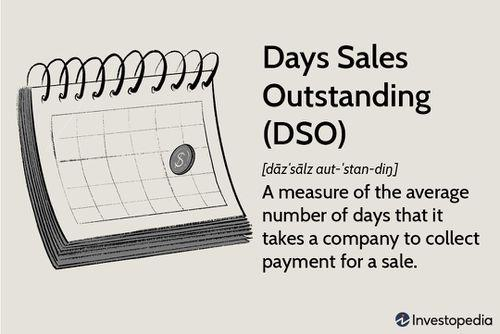

Days Sales Outstanding (DSO) is a fundamental financial metric that provides insight into the efficiency of a company's credit and collections processes. It quantifies the average number of days a company takes to collect payment after a credit sale, offering a clear view of its cash flow health. In this article, we examine the significance of DSO in financial analysis and its emerging relevance in algorithmic trading.

Incorporating DSO into algorithmic trading models can enhance the understanding of a company's cash flow efficiency. By integrating DSO with other financial metrics, algorithmic traders can better assess a company’s financial stability and predict performance trends. This metric allows traders to identify patterns that may indicate financial health or distress, potentially providing a competitive advantage in the fast-paced trading environment.



DSO, as an indicator, is crucial for investors and algorithmic trading systems aiming to predict financial stability and performance. It reflects a company's operational efficiency and cash flow management, factors that are critical for evaluating investment opportunities. Through a detailed examination of DSO, both investors and traders can gain valuable insights into the qualitative aspects of a company's financial operations, helping inform investment strategies and trading decisions.

## Table of Contents

## Understanding Days Sales Outstanding (DSO)

Days Sales Outstanding (DSO) is a critical metric used to gauge the efficiency of a company's credit and collection efforts. It highlights the average number of days a company takes to collect payment from its customers after a sale is made on credit. A higher DSO value signifies a protracted collection process, which may result in cash flow constraints for the business. Such delays in cash inflows can hinder the company's ability to meet operational expenses and invest in growth opportunities. Conversely, a low DSO indicates a streamlined collection process, facilitating better liquidity management and ensuring that cash is readily available for operational needs.

Understanding the DSO is vital as it forms a key component of the cash conversion cycle, which encompasses the entire operational process from purchasing inventory to collecting cash from sales. This cycle directly affects a company's liquidity and its operational efficiency. The calculation of DSO involves the equation:

$$
\text{DSO} = \left( \frac{\text{Accounts Receivable}}{\text{Total Credit Sales}} \right) \times \text{Number of Days in Period}
$$

This formula computes the average days required to convert credit sales into cash. By evaluating the accounts receivable against total credit sales, and scaling this by the duration of the period, companies can determine their collection efficiency. A careful analysis of DSO, alongside other financial metrics, can provide crucial insights into a company's collection practices and its impact on cash flow health.

## DSO in Financial Metrics and Algorithmic Trading

Algorithmic trading has revolutionized financial markets by enabling the execution of trades using advanced quantitative models and financial metrics. Days Sales Outstanding (DSO) is one such metric that plays a crucial role in these models, providing valuable insights into a company’s cash flow health and credit risk. By integrating DSO into trading algorithms, traders can enhance their assessment of a company's [liquidity](/wiki/liquidity-risk-premium) and financial stability, offering a competitive edge in predicting stock performance and market dynamics.

A company with a high DSO may experience slower collections from its credit sales, which can indicate potential cash flow challenges. Such situations might raise concerns about the firm's ability to cover its short-term liabilities, making it a vital metric for algorithmic traders assessing credit risk. Conversely, a low DSO suggests efficient collection processes, indicating a more favorable cash flow position that can be attractive for investors looking for stable investment opportunities.

The integration of DSO into financial models allows traders to utilize this metric alongside other key data points such as earnings, revenue, and costs. This multi-faceted approach is beneficial for forecasting a company’s financial outcomes and gauging its market potential. For example, a Python function to calculate DSO could be structured as follows:

```python
def calculate_dso(accounts_receivable, credit_sales, days):
    return (accounts_receivable / credit_sales) * days
```

Recognizing trends or anomalies in DSO over time provides deeper insights into a company’s operational effectiveness and could uncover significant trading opportunities. An upward trend in DSO might suggest deteriorating collection practices or increasing credit sales that outpace the growth in accounts receivable management, potentially forecasting liquidity issues. On the other hand, a downward trend may reflect improved financial practices, warranting positive attention from investors and traders.

Algorithmic traders can benefit from bending DSO trends to their strategy by identifying patterns that predict stock price movements or other market behaviors. Such data-driven insights could lead to informed decisions on shorting stocks with unfavorable DSO indications or investing in companies that demonstrate robust collection policies reflected by a low DSO, potentially yielding higher returns. This strategic application underscores the necessity of continually monitoring and analyzing DSO as part of a comprehensive financial analysis framework in [algorithmic trading](/wiki/algorithmic-trading) systems.

## Applications and Implications of DSO Analysis

Days Sales Outstanding (DSO) analysis plays a critical role in understanding a company's financial health and operational efficiency. A high DSO can be indicative of liquidity issues, suggesting that a company might face challenges in meeting short-term obligations. This scenario could be the result of client dissatisfaction or inefficiencies in the credit management process, both of which can contribute to increased stock [volatility](/wiki/volatility-trading-strategies). The uncertainty around cash flows becomes a [factor](/wiki/factor-investing) for investors, who may respond with caution, potentially impacting the company's stock price.

On the other hand, a low DSO is generally seen as a positive indicator. It suggests efficient cash collection processes, which not only enhance liquidity but also point towards a robust operational model. This efficiency attracts positive market attention, as it signals a company's ability to convert sales into cash rapidly, providing more flexibility for business operations and potential growth investments.

The analysis of DSO can serve as a forecasting tool for possible cash flow challenges. By identifying trends and deviations in DSO over time, companies can proactively adjust their credit policies and refine their collection strategies. This proactive approach not only mitigates potential cash flow disruptions but also strengthens customer relationships by aligning credit terms with the financial realities of both the company and its clients.

For traders and investors, DSO trends act as early warning signals for underlying business challenges. A sudden increase in DSO might suggest emerging issues such as a slowdown in sales or changes in customer payment behaviors, prompting a review of the company's financial stability. Conversely, a decreasing trend in DSO may indicate improvements in either sales efficiency or collection processes.

DSO variations across industries necessitate a contextual understanding for accurate interpretation. Different industries operate on distinct credit terms and business cycles, thereby affecting typical DSO levels. For example, industries with longer production times may naturally exhibit higher DSO compared to those with faster turnover rates. As such, industry benchmarks are vital when analyzing DSO, ensuring that assessments are grounded in sector-specific norms rather than arbitrary comparisons.

In summary, DSO analysis provides vital insights into a company's financial operations, offering both challenges and opportunities for informed decision-making. Businesses and investors who fully understand the implications of DSO can leverage this knowledge to optimize financial health and enhance market performance.

## Limitations of DSO

Days Sales Outstanding (DSO) is a vital metric in assessing how efficiently a company manages its credit sales and cash flow. However, it has certain limitations that can influence its interpretation and usefulness:

1. **Exclusion of Cash Transactions**: DSO primarily measures the time it takes to collect accounts receivable stemming from credit sales, disregarding cash transactions. This focus can skew DSO results, especially in businesses where cash sales form a significant part of the revenue. This limitation could lead to an incomplete picture of the company’s overall cash conversion efficiency.

2. **Impact of Seasonal Fluctuations**: DSO is often subject to seasonal variations in sales and collections, which can distort its interpretation when viewed over a short timeframe. For example, a retailer might see increased sales and extended credit periods during the holiday season, temporarily elevating DSO. Therefore, analyzing DSO over longer periods or multiple cycles can provide more meaningful insights regarding trends.

3. **Industry-Specific Interpretations**: DSO values can vary significantly across different industries due to unique business models, credit policies, and customer payment behaviors. A high DSO might be typical in industries with longer credit terms, such as construction, whereas it could signal inefficiencies in fast-moving consumer goods sectors. Consequently, comparative DSO analysis should be contextualized within the specific industry's norms to avoid inaccurate conclusions.

4. **Need for Complementary Metrics**: To gain a comprehensive understanding of a company's credit risk and cash flow efficiency, DSO should be supplemented with other metrics. For instance, Delinquent Days Sales Outstanding (DDSO) provides additional insights by focusing on overdue accounts, which can be crucial for assessing the quality of receivables and potential risk exposure.

5. **Integration with Other Financial Indicators**: While DSO is an important metric, analyzing it in isolation could result in a limited view of a company’s financial health. Combining DSO with other indicators, such as inventory turnover or accounts payable outstanding, supports a more holistic evaluation of the company’s operational efficiency and liquidity position. This integrated approach allows for more robust financial assessments and strategic decision-making.

By addressing these limitations, stakeholders can better interpret DSO and incorporate it effectively alongside other financial data to enhance their analyses and forecasts.

## Conclusion

Days Sales Outstanding (DSO) stands as a crucial indicator for assessing how effectively a company manages its credit sales and cash flow. By measuring the average number of days required to collect payments from customers, DSO provides insights into the operational efficiency and liquidity of a company. Involving DSO in algorithmic trading models can significantly enhance the prediction of financial stability and identify potential trading opportunities. The ability of DSO to reflect cash flow health makes it a valuable metric for traders seeking to understand the credit risk and performance trends of an enterprise.

However, while DSO is a useful metric, its analysis must be undertaken alongside other financial metrics to ensure a well-rounded evaluation of a company's financial health. Metrics such as Delinquent Days Sales Outstanding (DDSO), accounts receivable turnover, and cash conversion cycles offer additional layers of insight. A comprehensive analysis that includes these indicators allows for a more accurate understanding of a company's financial operations.

Furthermore, when interpreting DSO data, recognizing industry standards and historical trends is essential. Different industries exhibit varying credit terms and collection practices, and these characteristics must be considered to avoid misleading conclusions. Historical trends can highlight patterns or anomalies that may impact future financial stability or indicate changes in a company's credit policy effectiveness.

For traders and businesses, mastering the nuances of DSO and actively managing it can lead to enhanced financial performance and stability. Reducing DSO may result in improved cash flow, reduced borrowing costs, and increased investment capacity. Thus, optimizing DSO not only contributes to healthier cash management but also places companies in a favorable position in the market.

## References & Further Reading

[1]: ["Advances in Financial Machine Learning"](https://www.amazon.com/Advances-Financial-Machine-Learning-Marcos/dp/1119482089) by Marcos Lopez de Prado

[2]: ["Evidence-Based Technical Analysis: Applying the Scientific Method and Statistical Inference to Trading Signals"](https://www.amazon.com/Evidence-Based-Technical-Analysis-Scientific-Statistical/dp/0470008741) by David Aronson

[3]: ["Machine Learning for Algorithmic Trading"](https://github.com/stefan-jansen/machine-learning-for-trading) by Stefan Jansen

[4]: ["Quantitative Trading: How to Build Your Own Algorithmic Trading Business"](https://www.amazon.com/Quantitative-Trading-Build-Algorithmic-Business/dp/1119800064) by Ernest P. Chan

[5]: Brigham, E., & Houston, J. (2016). ["Fundamentals of Financial Management,"](https://books.google.com/books/about/Fundamentals_of_Financial_Management.html?id=9uUXEAAAQBAJ) which covers financial metrics including DSO.