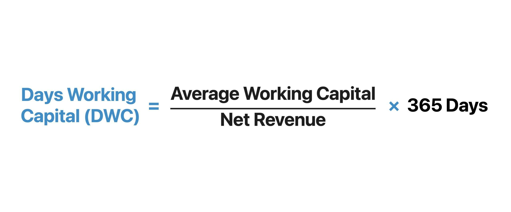

Financial metrics, business finance, working capital, and algorithmic trading are integral components of the modern financial landscape. Each element plays a unique role in evaluating business performance, ensuring liquidity, and optimizing trading strategies. These components are essential for businesses and investors looking to navigate the complex environment of today’s financial markets.

Financial metrics offer a quantitative view of an organization's performance and financial health, capturing essential insights on liquidity, profitability, and solvency. Common metrics—such as earnings per share, return on assets, and financial ratios—serve as benchmarks for assessing operational efficiency and investment viability. These metrics are crucial for comparing a company's performance against competitors and industry standards, enabling informed strategic decisions.



Working capital, defined as current assets minus current liabilities, provides a measure of a company's short-term financial health and operational efficiency. A positive working capital indicates that a company can cover its short-term debts and continue its operations smoothly. Efficient management of working capital, involving the optimization of inventory, accounts receivable, and payables, is vital for sustaining business operations and capitalizing on growth opportunities.

Algorithmic trading, also known as algo trading, utilizes computer algorithms to automate trading processes through predefined criteria, optimizing trade execution speed and efficiency. By minimizing human intervention, algo trading reduces transaction costs and human errors while executing high-frequency trading strategies. Techniques such as arbitrage, trend-following, and index fund rebalancing are examples of strategies enhanced by algorithmic trading.

The integration of traditional financial metrics with advanced technology in algorithmic trading marks a new era in finance. This synergy enables more sophisticated trading strategies by embedding financial analysis directly into trading models. Advanced techniques including machine learning and artificial intelligence help further by identifying market trends and opportunities, enhancing asset allocation, risk management, and overall profitability.

A comprehensive understanding of these areas equips businesses and investors with the tools necessary to make informed decisions in a competitive market. Combining financial metrics with algorithmic trading systems represents a powerful approach to navigating financial markets, ensuring better financial health, and setting new standards in strategic growth and competitive advantage as the financial landscape evolves.

## Table of Contents

## Understanding Financial Metrics

Financial metrics are essential tools for evaluating a company's performance and providing a comprehensive view of its operational success and financial health. These metrics fall into various categories such as [liquidity](/wiki/liquidity-risk-premium), profitability, and solvency, each serving a distinct purpose in assessing different facets of a business.

Liquidity metrics evaluate a company's ability to meet its short-term obligations. They are crucial for understanding whether a business can efficiently manage its current assets and liabilities. Two common liquidity ratios are the current ratio and the quick ratio. The current ratio is defined as:

$$
\text{Current Ratio} = \frac{\text{Current Assets}}{\text{Current Liabilities}}
$$

This metric indicates whether a company has enough resources to pay its short-term obligations with its short-term assets. The quick ratio, a more stringent measure, strips out inventory from current assets, ensuring that only the most liquid assets are considered. It is calculated as follows:

$$
\text{Quick Ratio} = \frac{\text{Current Assets} - \text{Inventory}}{\text{Current Liabilities}}
$$

Profitability metrics determine a company's ability to generate earnings relative to its revenue, assets, and equity. Earnings per share (EPS) and return on assets (ROA) are widely utilized for this purpose. EPS measures a company's profit allocated to each outstanding share of common stock and is given by:

$$
\text{EPS} = \frac{\text{Net Income} - \text{Preferred Dividends}}{\text{Average Outstanding Shares}}
$$

Return on assets quantifies how efficiently a company uses its assets to produce profit. It is expressed as:

$$
\text{ROA} = \frac{\text{Net Income}}{\text{Total Assets}}
$$

Solvency metrics assess a company's long-term financial stability and its ability to meet long-term obligations. These metrics help investors and management understand how a company is capitalizing operations and its capacity to repay debt. Key solvency ratios include the debt-to-equity ratio.

By leveraging these financial metrics, businesses can compare their performance with industry standards and competitors, identifying strengths and uncovering areas for growth and improvement. This benchmarking process is crucial for strategic decision-making and ensuring that a company remains competitive and financially robust in the market.

Incorporating financial metrics into regular business assessments not only aids in understanding a company's current position but also assists in forecasting and planning future operations. This insight ultimately equips businesses to make informed decisions, optimize performance, and secure long-term growth and sustainability.

## The Importance of Working Capital

Working capital represents a pivotal aspect of a company's short-term financial health and operational efficiency. It is calculated as the difference between a company's current assets and current liabilities. Mathematically, it is expressed as:

$$
\text{Working Capital} = \text{Current Assets} - \text{Current Liabilities}
$$

Current assets include cash, accounts receivable, inventory, and other assets that are expected to be converted into cash within a year. Current liabilities encompass accounts payable, short-term debt, and other financial obligations due within the same timeframe. A positive working capital indicates that a company has more short-term assets than liabilities, thus suggesting that it can comfortably meet its short-term obligations.

Efficient management of working capital is vital for maintaining smooth business operations and capitalizing on growth opportunities. Businesses that skillfully manage their working capital can reduce their reliance on external borrowing, minimize financial costs, and improve profitability. This involves precise handling of several critical components:

1. **Inventory Management**: Balancing inventory levels to avoid excess stock and stockouts is crucial. Efficient inventory management can free up significant capital tied in unsold goods, thereby improving liquidity.

2. **Receivables Management**: Optimizing the collection of accounts receivable ensures that a company can cover its short-term debts without financial strain. Implementing effective credit policies and timely collection processes can improve cash flow.

3. **Payables Management**: Extending accounts payable while maintaining good supplier relationships can enhance liquidity. Companies that strategically manage their payables can preserve cash for other operational needs.

By optimizing these components, a company can enhance its financial resilience, allowing it to navigate market fluctuations and take advantage of new opportunities. Furthermore, effective working capital management can lead to improved credit ratings and lower interest rates on borrowed funds, providing additional financial stability.

In summary, working capital is a critical measure of a company's financial health in the near term. Strategic management of inventory, receivables, and payables is instrumental in optimizing liquidity and supporting the overall financial position of the business.

## Algorithmic Trading in Finance

Algorithmic trading, commonly referred to as algo trading, represents a modern approach to executing trades using computer algorithms. These algorithms are designed to perform trading operations at optimal times by following predefined criteria. By automating the trading process, algo trading enhances trading efficiency, significantly reduces transaction costs, and minimizes the potential for human error. This form of trading allows for speedy and precise execution in financial markets, crucial in competitive trading environments.

A prominent feature of [algorithmic trading](/wiki/algorithmic-trading) is its ability to facilitate high-frequency trading ([HFT](/wiki/high-frequency-trading-strategies)). HFT involves executing a large number of trades at extremely high speeds, often on the scale of milliseconds. This rapid pace allows traders to capitalize on small price discrepancies across various markets, leading to potential profits from minor price variations.

Beyond high-frequency trading, algorithmic trading also supports strategic approaches such as [arbitrage](/wiki/arbitrage), trend-following, and index fund rebalancing. Arbitrage strategies take advantage of price discrepancies in different markets or instruments, providing risk-free profit opportunities when executed efficiently. Trend-following strategies, on the other hand, rely on the persistence of price movements, using algorithms to identify and act on emerging trends in market prices. Index fund rebalancing is another application where algorithms ensure that investment portfolios are adjusted to maintain desired asset allocations or to mirror index compositions effectively.

The implementation of algorithmic trading marks a significant milestone in the evolution of finance, harnessing advanced technology to achieve superior trading outcomes. Complex algorithms, often enhanced by [machine learning](/wiki/machine-learning) and [artificial intelligence](/wiki/ai-artificial-intelligence), are capable of analyzing vast datasets at remarkable speeds, identifying patterns or signals that may not be apparent through manual analysis. This technological advancement empowers traders and financial institutions to optimize their trading strategies, manage risks more effectively, and potentially increase overall trading profitability.

## Integrating Financial Metrics with Algo Trading

Integrating financial metrics into algorithmic trading models significantly enhances trading strategies by incorporating comprehensive analytical insights. Such integration focuses on the dynamic use of metrics like the current ratio, quick ratio, and return on assets in trading algorithms to enable real-time decision-making. These metrics provide critical information about a company's liquidity, operational efficiency, and profitability, which are essential for determining the viability of investments.

The current ratio, defined as current assets divided by current liabilities, assesses a company's ability to pay short-term obligations. The quick ratio, or acid-test ratio, refines this analysis by excluding inventory from current assets, thus offering a more stringent evaluation of liquidity. Return on assets (ROA), calculated as net income divided by total assets, measures how efficiently a company uses its assets to generate profit. Incorporating these metrics into algorithmic models allows traders to make informed decisions grounded in the financial health and operational effectiveness of potential investments.

The advent of machine learning and artificial intelligence (AI) further enhances these strategies. Machine learning algorithms can analyze vast amounts of historical and real-time data to identify patterns and predict market trends. For instance, neural networks can be trained to recognize patterns in financial metrics that correlate with stock price movements. This enables dynamic adjustment of trading strategies based on evolving market conditions. A simple implementation in Python might involve using the Pandas library to handle financial data and Scikit-learn for building predictive models:

```python
import pandas as pd
from sklearn.model_selection import train_test_split
from sklearn.ensemble import RandomForestClassifier

# Load financial data
data = pd.read_csv('financial_data.csv')

# Define features (e.g., current ratio, quick ratio, ROA)
features = data[['current_ratio', 'quick_ratio', 'return_on_assets']]
target = data['stock_trend']  # Assuming stock trend is a binary outcome

# Split data into training and test sets
X_train, X_test, y_train, y_test = train_test_split(features, target, test_size=0.2, random_state=42)

# Train a Random Forest model
model = RandomForestClassifier()
model.fit(X_train, y_train)

# Predict market trends
predictions = model.predict(X_test)
```

By using AI and machine learning, algorithmic trading models become adaptive systems, optimizing asset allocation and risk management by leveraging real-time data. This enhances overall profitability by ensuring that trading decisions are based on objective, data-driven insights rather than intuition alone.

The integration of financial metrics and advanced algorithmic trading not only bolsters the capabilities of traders but also sets a new benchmark for precision in the financial markets, offering a competitive edge by systematically managing risk and maximizing returns.

## Conclusion

Combining financial metrics with algorithmic trading systems offers a robust framework for navigating financial markets. This synergy empowers businesses and investors with tools that enhance both strategic growth and competitive advantage. Understanding the critical role of working capital and financial metrics is paramount in ensuring not only financial health but also in facilitating informed decision-making. 

The balance of current assets and liabilities, expressed through working capital, is essential for maintaining liquidity and operational efficiency. Meanwhile, financial metrics such as earnings per share and return on assets provide insights into a company's operational performance and financial stability. These metrics allow for benchmarking against industry standards and can inform areas ripe for growth and improvement.

Integrating these conventional financial tools with advanced technologies in algorithmic trading marks a significant evolution in financial practices. Algorithmic trading systems use complex algorithms to execute trades that capitalize on real-time market conditions, thereby minimizing human error and transaction costs. By embedding financial metrics into these algorithms, traders can make data-driven decisions that effectively manage risks and optimize returns.

As the financial landscape transforms, leveraging insights from both traditional financial analysis and innovative trading technologies will be crucial. The combination not only facilitates more accurate market prediction and asset allocation but also enhances overall profitability. This multidimensional approach sets a new benchmark in modern finance, ensuring that businesses and investors are well-equipped to thrive in an increasingly competitive environment.

## References & Further Reading

[1]: Bergstra, J., Bardenet, R., Bengio, Y., & Kégl, B. (2011). ["Algorithms for Hyper-Parameter Optimization."](https://dl.acm.org/doi/10.5555/2986459.2986743) Advances in Neural Information Processing Systems 24.

[2]: ["Advances in Financial Machine Learning"](https://www.amazon.com/Advances-Financial-Machine-Learning-Marcos/dp/1119482089) by Marcos Lopez de Prado

[3]: ["Evidence-Based Technical Analysis: Applying the Scientific Method and Statistical Inference to Trading Signals"](https://www.amazon.com/Evidence-Based-Technical-Analysis-Scientific-Statistical/dp/0470008741) by David Aronson

[4]: ["Machine Learning for Algorithmic Trading"](https://github.com/stefan-jansen/machine-learning-for-trading) by Stefan Jansen

[5]: ["Quantitative Trading: How to Build Your Own Algorithmic Trading Business"](https://www.amazon.com/Quantitative-Trading-Build-Algorithmic-Business/dp/1119800064) by Ernest P. Chan