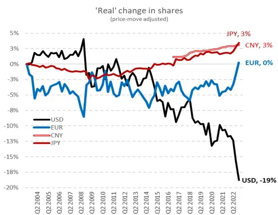

## Table of Contents

## What is de-dollarization?

De-dollarization is when countries try to use less of the US dollar in their trade and financial dealings. They do this because they want to depend less on the US dollar and use their own money or other currencies more. This can happen for many reasons, like wanting to be more independent, avoiding risks from changes in the US dollar's value, or because of political reasons.

When countries de-dollarize, they might start trading with each other using their own currencies. For example, instead of buying oil in US dollars, they might use euros or yuan. This can change how the world's money system works and affect the power of the US dollar. It's a big change that can take a long time and involves many countries working together.

## Why are countries interested in de-dollarization?

Countries are interested in de-dollarization because they want to be less dependent on the US dollar. When a country uses the US dollar a lot, it can be risky. If the value of the US dollar goes up or down a lot, it can hurt their economy. Also, if the US decides to put sanctions on a country, it can be hard for that country to do business if they rely on the US dollar. So, by using their own money or other currencies more, countries can feel more in control and safer.

Another reason is political. Some countries don't like how much power the US has because of the US dollar. They think it's not fair that the US can influence the world's economy so much. By using other currencies, these countries hope to make the world's money system more balanced. This way, no single country has too much control. It's a way for them to show they want a different kind of global money system.

## What are the historical examples of de-dollarization?

One historical example of de-dollarization happened in the 1970s. During this time, many countries in Europe started using the Deutsche Mark more instead of the US dollar. This was because the US dollar was losing value quickly. Countries wanted a more stable currency for their trade. So, they used the Deutsche Mark, which was strong and stable. This helped them avoid the risks that come with using a currency that loses value.

Another example is when China started using the yuan more for international trade in the early 2000s. China wanted to make the yuan a big player in the world's money system. They did this by making deals with other countries to use the yuan instead of the US dollar. For example, they made deals with Russia and some countries in South America. This helped China have more control over its money and less risk from changes in the US dollar's value.

A more recent example is when Russia and Iran started using their own currencies for trade because of US sanctions. The US put sanctions on these countries, which made it hard for them to use the US dollar. So, they started trading with each other using the Russian ruble and the Iranian rial. This helped them keep doing business even though the US tried to stop them. It shows how countries can use de-dollarization to avoid the effects of US sanctions.

## How does de-dollarization impact the global economy?

De-dollarization can change the global economy in big ways. When countries start using the US dollar less, it can make the US dollar less important in the world. This can affect how much the US dollar is worth and how much power the US has over the world's money system. If many countries start using other currencies for trade, it can make the world's money system more balanced. No one country would have as much control as the US does now. This can make the global economy more stable because countries won't be as affected by changes in the US dollar's value.

But de-dollarization can also cause problems. If countries switch to using other currencies quickly, it can make the world's money system less stable. It can be hard for businesses and countries to adjust to using different currencies. This can lead to confusion and make it harder for them to do business. Also, if the US dollar becomes less important, it can hurt the US economy. The US might have less power to influence the global economy, which can be bad for American businesses and workers. So, while de-dollarization can make the world's money system more fair, it can also bring new challenges and risks.

## What are the current trends in de-dollarization?

Currently, more countries are trying to use less of the US dollar in their trade. One big trend is that countries like China and Russia are making more deals with each other using their own currencies. For example, China is using the yuan more for trade with countries in Asia, Africa, and even some in Europe. Russia has been using the ruble more, especially after the US put sanctions on them. These countries want to depend less on the US dollar because they think it's risky and they want more control over their own money.

Another trend is that some countries are working together to make new systems for trade that don't use the US dollar. For example, the BRICS countries (Brazil, Russia, India, China, and South Africa) are talking about creating a new currency for trade among themselves. Also, more countries are using the euro and other currencies for buying and selling things. This shows that countries are trying to make the world's money system more balanced and less controlled by the US dollar. These trends could change how the global economy works in the future.

## Which countries are actively pursuing de-dollarization?

Many countries are actively trying to use less of the US dollar. China is one of the biggest countries doing this. They want to use the yuan more for trade with other countries. They have made deals with countries in Asia, Africa, and even some in Europe to use the yuan instead of the US dollar. Russia is another country trying to use less of the US dollar. They have been using the ruble more, especially after the US put sanctions on them. Both China and Russia want to depend less on the US dollar because they think it's risky and they want more control over their own money.

Other countries are also working together to use less of the US dollar. The BRICS countries (Brazil, Russia, India, China, and South Africa) are talking about making a new currency for trade among themselves. This would help them use less of the US dollar. Some countries are also using the euro and other currencies more for buying and selling things. They want to make the world's money system more balanced and not controlled so much by the US dollar. These efforts show that many countries are trying to change how the global economy works.

## What are the potential risks of de-dollarization for a country?

De-dollarization can be risky for a country. If a country starts using less of the US dollar and more of its own money, its own currency might become less stable. This can make it hard for people and businesses to know how much their money is worth. If the value of their money goes up and down a lot, it can hurt the economy. Also, if a country's currency is not used much around the world, it can be hard to do business with other countries. They might not want to use a currency that is not well-known or trusted.

Another risk is that de-dollarization can make it harder for a country to get loans and investments. Many banks and investors like to use the US dollar because it's stable and trusted. If a country uses its own currency more, these banks and investors might not want to lend money or invest there. This can slow down the country's economy and make it harder to grow. Also, if the US dollar becomes less important, it can change how the world's money system works. This can bring new problems and challenges that a country might not be ready for.

## How does de-dollarization affect international trade?

De-dollarization changes how countries trade with each other. When countries use less of the US dollar, they start using their own money or other currencies more. This can make trade more complicated because businesses need to learn how to use different currencies. It can also make trade more expensive because changing money from one currency to another can cost money. But it can also help countries trade more with each other if they use currencies that are easier for them to get.

If many countries start using less of the US dollar, it can change the world's money system. The US dollar has been very important for a long time, and if it becomes less important, it can affect how much things cost around the world. This can make prices go up or down in different countries. It can also make the world's money system more balanced because no one country would have as much control as the US does now. But it can also make the world's money system less stable if countries switch to using different currencies too quickly.

## What role do alternative currencies play in de-dollarization?

Alternative currencies play a big part in de-dollarization. When countries want to use less of the US dollar, they start using their own money or other currencies more. For example, China uses the yuan more for trade with other countries. Russia uses the ruble more, especially after the US put sanctions on them. By using their own money, these countries depend less on the US dollar and have more control over their economy.

Using alternative currencies can also help countries trade more with each other. If two countries use the same currency, it's easier for them to buy and sell things. This can make trade cheaper and faster. But it can also make things more complicated because businesses need to learn how to use different currencies. If many countries start using alternative currencies, it can change how the world's money system works. This can make the world's money system more balanced but also less stable if countries switch too quickly.

## What are the geopolitical implications of de-dollarization?

De-dollarization can change how countries work together and compete with each other. When countries use less of the US dollar, it can make the US less powerful in the world. The US has a lot of control over the world's money system because the US dollar is used so much. If countries start using their own money or other currencies more, the US might not be able to influence the global economy as much. This can make other countries feel more independent and less worried about what the US does.

But de-dollarization can also cause tension between countries. Some countries might not like it if others start using different currencies for trade. They might think it's not fair or that it makes the world's money system less stable. Also, if countries work together to use less of the US dollar, it can make groups of countries more powerful. For example, if the BRICS countries (Brazil, Russia, India, China, and South Africa) make a new currency for trade, they could have more control over the global economy. This can change how countries work together and compete with each other in big ways.

## How can de-dollarization be measured and tracked?

De-dollarization can be measured and tracked by looking at how much countries use the US dollar for trade and keeping money. One way to do this is by checking how many deals between countries are done in US dollars compared to other currencies. For example, if China and Russia start using the yuan and ruble more for trade, that's a sign of de-dollarization. Another way is to look at how much US dollars are kept in a country's banks and how much they use other currencies instead. If a country starts keeping less US dollars and more of their own money or other currencies, it shows they are trying to use less of the US dollar.

Another way to track de-dollarization is by watching what countries say and do. If countries talk about using less of the US dollar and make plans to do so, it's a sign that de-dollarization is happening. For example, if the BRICS countries talk about making a new currency for trade, it shows they want to use less of the US dollar. Also, looking at news and reports about trade deals and financial agreements can help track de-dollarization. If more deals are being made in currencies other than the US dollar, it's a clear sign that countries are moving away from using the US dollar.

## What are the future prospects and challenges of de-dollarization?

The future of de-dollarization looks like it could change how the world's money system works a lot. More and more countries are trying to use less of the US dollar and more of their own money or other currencies. This could make the world's money system more balanced, with no one country having too much control. Countries like China and Russia are already making more deals with each other using their own currencies. If this keeps happening, the US dollar might become less important around the world. This could give countries more control over their own money and make them less worried about what the US does.

But de-dollarization also comes with big challenges. If countries switch to using different currencies too quickly, it can make the world's money system less stable. It can be hard for businesses and countries to adjust to using different currencies. This can lead to confusion and make it harder for them to do business. Also, if the US dollar becomes less important, it can hurt the US economy. The US might have less power to influence the global economy, which can be bad for American businesses and workers. So, while de-dollarization can make the world's money system more fair, it can also bring new problems and risks that countries need to be ready for.

## References & Further Reading

[1]: ["The Future of the Dollar and the World Reserve System"](https://archive.org/details/futureofdollarwo0000morr) by Barry Eichengreen, Brookings Institution.

[2]: ["Advances in Financial Machine Learning"](https://www.amazon.com/Advances-Financial-Machine-Learning-Marcos/dp/1119482089) by Marcos Lopez de Prado.

[3]: ["Algorithmic Trading: Winning Strategies and Their Rationale"](https://www.amazon.com/Algorithmic-Trading-Winning-Strategies-Rationale-ebook/dp/B00CY5HC0U) by Ernie Chan.

[4]: ["Algorithmic and High-Frequency Trading"](https://www.amazon.com/Algorithmic-High-Frequency-Trading-Mathematics-Finance/dp/1107091144) by Álvaro Cartea, Sebastian Jaimungal, and Jos é Penalva.

[5]: ["De-dollarization and the Global Economy"](https://www.jpmorgan.com/insights/global-research/currencies/de-dollarization) by Council on Foreign Relations.

[6]: ["Currency Wars: The Making of the Next Global Crisis"](https://www.amazon.com/Currency-Wars-Making-Global-Crisis/dp/1591845564) by James Rickards.