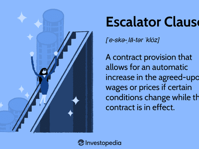

In the fast-evolving world of finance, understanding the legal frameworks governing trading contracts is crucial for both investors and service providers. These legal agreements play a pivotal role in structuring the interaction between different trading entities, ensuring a common language and set of expectations that help mitigate risks associated with financial transactions. As algorithmic trading becomes increasingly sophisticated, the intricacies of these contracts have expanded, necessitating the inclusion of specific clauses to manage market volatility and promote transaction fairness.

One such clause gaining prominence is the de-escalation clause, which acts as a financial safeguard by allowing for price adjustments under specific conditions. This clause is particularly useful in high-frequency trading environments characterized by rapid exchanges and volatile price movements. In contrast to escalation clauses, which permit price increases in response to rising costs, de-escalation clauses provide a mechanism for prices to decrease, reflecting favorable changes in market conditions. This dual capability ensures that contracts remain fair and sustainable, protecting the economic interests of the involved parties.



The integration of de-escalation clauses in trading contracts is instrumental in maintaining an equilibrium amid market fluctuations. It provides both investors and service providers with a means to adjust to changing cost structures swiftly and efficiently, thus preserving the integrity of automated trading strategies. By understanding these clauses and their implications for algorithmic trading, financial professionals can better navigate the complexities of modern trading practices.

The importance of grasping the function of de-escalation clauses cannot be overstated. These provisions ensure that financial agreements remain adaptable and resilient, even in the face of unpredictable market conditions. By contemplating these aspects, one can appreciate how strategic adjustments in contract terms, such as the inclusion of de-escalation clauses, are critical to safeguarding interests and maintaining fairness in volatile market conditions.

## Table of Contents

## Understanding Legal Agreements in Financial Contracts

Legal agreements are essential components of financial transactions, serving as the foundational framework within which trading activities take place. These agreements are designed to delineate the rights and responsibilities of each party involved, ensuring that all participants have a clear understanding of their obligations and entitlements. This clarity helps to minimize potential disputes, promoting smoother transactions.

In the context of algorithmic trading, the need for robust contracts becomes even more pronounced due to the complexity and speed of automated systems. Algorithmic trading leverages sophisticated software and mathematical models to execute trades at remarkable speeds. As these systems operate autonomously, it is crucial that contracts address specific needs and challenges associated with their implementation. 

Contracts in [algorithmic trading](/wiki/algorithmic-trading) typically include terms detailing service levels, pricing structures, and contingency plans. Service level agreements (SLAs) are integral, as they specify the expected performance and reliability of the trading systems. For example, metrics such as uptime percentages or latency thresholds might be outlined to ensure the systems deliver as anticipated. Pricing structures in these contracts can be quite complex, often involving dynamic pricing models that reflect the [volatility](/wiki/volatility-trading-strategies) and rapid changes in market conditions.

Contingency plans are another vital component. Given the potential for system failures or unexpected market events, it is essential that contracts include strategies for risk management and business continuity. This might involve outlining procedures for system failures, specifying backup plans, or defining the roles and responsibilities during such events.

Understanding these fundamental elements is crucial for maintaining operational integrity in financial markets. By ensuring that all parties are aware of their contractual obligations and the mechanisms in place to address potential issues, these agreements provide a stable and predictable environment in which algorithmic trading can flourish. This not only safeguards individual interests but also contributes to the broader goal of fairness and transparency in financial transactions.

## The Role of Contract Terms in Algorithmic Trading

Algorithmic trading fundamentally relies on the use of sophisticated mathematical and statistical models that are designed to execute orders at speeds and frequencies far beyond human capacity. This computational efficiency, while beneficial for maximizing trading opportunities, necessitates precisely defined contractual frameworks to manage significant operational risks. The contractual terms associated with these trading systems are crucial for ensuring performance efficiency, risk mitigation, and compliance with evolving regulatory standards.

Performance metrics within algorithmic trading contracts are vital, as they set the benchmarks for trade execution quality, latency, and success rates. These metrics provide measurable standards against which trading activities are assessed, ensuring consistent adherence to expected service levels. For example, performance metrics might involve the average execution speed of an algorithm or the slippage tolerable per trade. These parameters are key in maintaining a system’s trading integrity and operational efficiency.

Comprehensive risk management is another pivotal component of these contracts. Algorithms inherently entail risks such as market volatility, system failures, and unexpected economic events that can drastically affect trading outcomes. Contractual terms must address these risks by stipulating contingency measures such as system redundancies, error correction protocols, and limits on trading volumes. Additionally, they should cover the responsibilities and liabilities of service providers in the event of system malfunction or network downtimes.

Compliance with regulatory standards is an equally critical contractual element, given the stringent oversight in financial markets. Algorithmic trading must adhere to regulations regarding data protection, market manipulation, and trading transparency. Contracts typically specify the compliance obligations of parties, such as maintaining audit trails for each executed trade and meeting disclosure requirements. Ensuring that algorithmic systems align with these legal obligations mitigates legal and financial risks potentially incurred from regulatory breaches.

Tailoring these contract terms to the needs of algorithmic trading also involves addressing the system's adaptability to changing market conditions and technological advancements. Terms may involve provisions for software updates, system enhancements, and periodic reviews to incorporate emerging technologies and methods. By doing so, contract terms ensure that trading systems remain robust, secure, and competitive in a fast-paced trading environment.

In summary, the contractual framework in algorithmic trading must be meticulously crafted to encompass performance metrics, risk management, and regulatory compliance. The design of these terms is critical to safeguarding trading operations and ensuring they meet both current market demands and regulatory standards, ultimately protecting all parties involved from undue risk and loss.

## Introducing the De-Escalation Clause

A de-escalation clause is an essential feature in financial contracts, offering the flexibility to adjust prices downward when certain cost conditions change favorably. This mechanism ensures that contracts remain fair and equitable by reflecting actual market improvements. Unlike escalation clauses, which permit price increases due to rising costs, de-escalation clauses counterbalance by allowing prices to decrease, thus safeguarding parties from excessive liabilities when market dynamics shift advantageously.

The integration of de-escalation clauses into financial agreements, particularly in high-stakes environments like trading, serves multiple purposes. Primarily, these clauses help maintain ongoing sustainability in contract execution by aligning contract prices with the current economic landscape, thereby protecting parties from overpayment. This is critical in trading environments where cost variables such as market indices, interest rates, or commodity prices can fluctuate rapidly.

Structuring a de-escalation clause typically involves setting predefined conditions under which price adjustments are triggered. These conditions might be linked to external benchmarks, such as a drop in the Consumer Price Index (CPI) or a decrease in market-specific rates. Once these conditions are met, the contract allows for a renegotiation or automatic reduction of prices.

For example, consider a financial contract where payments are tied to a specific index. A de-escalation clause could state that if this index decreases by more than 5% over a specified period, the payment terms adjust downward by an equivalent percentage. This ensures that the cost structure remains aligned with prevailing market conditions, protecting both parties from financial losses associated with outdated terms.

In trading contexts, sophisticated algorithms can be employed to calculate and apply these adjustments accurately. An algorithmic trading system might use Python code to integrate financial data, identify the necessary conditions for de-escalation, and execute the adjustments seamlessly. Below is a simple example in Python that illustrates how one might implement a basic condition check for de-escalation based on market indices:

```python
def apply_de_escalation(current_price, market_index, threshold=0.05):
    """
    Apply de-escalation based on market index decrease.

    :param current_price: float, the current price in the contract
    :param market_index: float, the current market index value
    :param threshold: float, percentage decrease required to trigger de-escalation
    :return: float, new price after de-escalation
    """
    initial_index = 100  # hypothetical initial index value
    if initial_index - market_index > threshold * initial_index:
        de_escalation_factor = (initial_index - market_index) / initial_index
        return current_price * (1 - de_escalation_factor)
    return current_price

# Example usage:
current_price = 1000
market_index = 94  # Market index has decreased by 6%
new_price = apply_de_escalation(current_price, market_index)
print(f"New Contract Price: {new_price}")
```

In conclusion, the implementation of de-escalation clauses is a prudent strategy in financial agreements, especially those involving volatile trading activities. These clauses not only provide a balanced approach to contract management but also foster fairness by adapting to favorable economic changes, ensuring that both parties are aligned with market realities.

## Applications of De-Escalation Clauses in Financial Contracts

In fast-moving financial markets, de-escalation clauses play a vital role in aligning contract prices with current market conditions. These clauses are indispensable in high-volatility environments, such as algorithmic trading, where costs can vary unpredictably. By providing a mechanism to adjust prices downward when market conditions improve, de-escalation clauses protect parties from overpaying, thus enhancing the sustainability of financial agreements.

Algorithmic trading, characterized by its reliance on sophisticated computational models and high-speed execution, is particularly susceptible to rapid cost changes. Market data fees, transaction costs, and [liquidity](/wiki/liquidity-risk-premium) premiums are among the elements that can fluctuate significantly. De-escalation clauses help mitigate these risks by allowing contract terms to reflect present market dynamics, thus reducing financial exposure to adverse price movements.

One notable application of de-escalation clauses is in contracts influenced by fluctuating supply chain costs or market indexes. For instance, in scenarios where the price of raw materials drops, a de-escalation clause could trigger a price reduction in the contract, aligning the agreed price with the actual cost structure faced by the supplier. Such applications ensure that pricing remains fair and reflective of actual market conditions, preventing one party from unfairly benefiting at the expense of another.

Consider a hypothetical case study where a financial contract stipulates pricing based on a specific market index. Should this index experience a substantial decline due to economic changes, a de-escalation clause could automatically adjust the contract price downward. This adaptive feature not only safeguards against overpayments but also maintains the contract's relevance and fairness amidst shifting economic landscapes.

In conclusion, de-escalation clauses provide a pragmatic approach to handling the uncertainties inherent in volatile markets. By aligning pricing terms with real-time market circumstances, these clauses offer a means of maintaining the economic equilibrium within financial contracts, particularly those subjected to the rapid pace and unpredictability of algorithmic trading.

## Balancing Escalation and De-Escalation Clauses

Contracts frequently integrate both escalation and de-escalation clauses as a strategy to manage and adjust to dynamic market conditions. This dual approach ensures that financial risks are fairly distributed between the involved parties, mitigating potential consequences from unforeseen market changes. These clauses are vital in the context of trading contracts, especially within volatile financial markets, where rapid price adjustments are common.

Escalation clauses are designed to account for rising costs, allowing for adjustments in contract pricing when specific conditions, such as increased raw material costs or inflation, occur. In contrast, de-escalation clauses allow for reductions in pricing under favorable circumstances, like when the prices of necessary inputs decline or when cost-saving innovations occur in the production or trading processes.

The strategic combination of these clauses enables flexibility and adaptability. When negotiating these provisions, parties should focus on defining the triggers clearly, specifying the exact conditions and indices that will lead to price adjustments. For example, an escalation clause might state that if the cost of a commodity rises by more than 10% over a six-month period, the contract price will increase accordingly. Conversely, a de-escalation clause can adjust prices downward if the index measuring logistics costs drops by a certain percentage.

Here is a simple Python example illustrating how a pricing model might adjust based on these clauses:

```python
def adjust_price(base_price, cost_index, escalation_rate=0.1, de_escalation_rate=0.1):
    if cost_index > 1.1:
        new_price = base_price * (1 + escalation_rate)
    elif cost_index < 0.9:
        new_price = base_price * (1 - de_escalation_rate)
    else:
        new_price = base_price
    return new_price

base_price = 100
cost_index = 1.15  # Example increase in cost
new_price = adjust_price(base_price, cost_index)
print(f"The adjusted contract price is: {new_price}")
```

In essence, the balance between escalation and de-escalation clauses ensures that contracts remain equitable and economically viable for both parties. This balance is key in protecting businesses from the financial burden of sudden cost hikes while also offering savings opportunities when expenses decrease. The negotiation and implementation of these clauses should always aim for clarity and mutual benefits, creating agreements that are both fair and dynamically responsive to market realities. This balance will increasingly be important, particularly as markets continue to experience rapid and unpredictable changes.

## Conclusion and Future Outlook

Incorporating de-escalation clauses in trading contracts is rapidly becoming a priority for financial professionals as global markets exhibit increasing unpredictability. Such clauses act as a crucial safety mechanism, allowing contracts to adapt and remain equitable, even when faced with significant market volatility. By facilitating price adjustments in response to declining costs, de-escalation clauses prevent parties from overpaying and help sustain the contract's long-term viability.

As algorithmic trading continues to evolve, achieving new levels of sophistication and complexity, the demand for precise and adaptable legal agreements becomes more acute. Algorithmic trading systems inherently involve high-speed decision-making and execution, creating a landscape in which traditional contractual frameworks may struggle to keep pace. Consequently, introducing innovative clauses such as de-escalation provisions is imperative for maintaining fairness and operational balance.

Looking ahead, the successful integration of these clauses will heighten the role of continuous collaboration between legal experts and financial professionals. Such partnerships are essential for developing contract terms that accommodate the swiftly changing dynamics of financial markets. Legal professionals must possess a nuanced understanding of algorithmic trading systems' technical intricacies, while financial specialists need to appreciate the legal safeguards necessary to cushion against financial risk.

Moreover, as regulatory environments become more stringent, contracts that include adaptable clauses will offer an edge by ensuring compliance with evolving standards. The ability to swiftly amend contract terms to mirror market conditions and regulatory changes will become a key differentiator in the competitive landscape.

In summary, as the financial sector navigates an era characterized by rapid technological advancement and volatility, the deployment of de-escalation clauses offers a viable strategy to bolster contract fairness and sustainability. By fostering ongoing dialogue and collaboration between legal and financial sectors, the industry can better equip itself to manage and mitigate the complexities of modern trading environments.

## References & Further Reading

[1]: Bergstra, J., Bardenet, R., Bengio, Y., & Kégl, B. (2011). ["Algorithms for Hyper-Parameter Optimization."](https://dl.acm.org/doi/10.5555/2986459.2986743) Advances in Neural Information Processing Systems 24.

[2]: ["Advances in Financial Machine Learning"](https://www.amazon.com/Advances-Financial-Machine-Learning-Marcos/dp/1119482089) by Marcos Lopez de Prado

[3]: ["Evidence-Based Technical Analysis: Applying the Scientific Method and Statistical Inference to Trading Signals"](https://www.amazon.com/Evidence-Based-Technical-Analysis-Scientific-Statistical/dp/0470008741) by David Aronson

[4]: ["Machine Learning for Algorithmic Trading"](https://github.com/stefan-jansen/machine-learning-for-trading) by Stefan Jansen

[5]: ["Quantitative Trading: How to Build Your Own Algorithmic Trading Business"](https://www.amazon.com/Quantitative-Trading-Build-Algorithmic-Business/dp/1119800064) by Ernest P. Chan

[6]: Menkveld, A. J. (2013). "High Frequency Trading and the New-Market Makers." *Journal of Financial Markets*, 16(4), 712-740.

[7]: Aldridge, I. (2013). ["High-Frequency Trading: A Practical Guide to Algorithmic Strategies and Trading Systems"](https://www.amazon.com/High-Frequency-Trading-Practical-Algorithmic-Strategies/dp/1118343506) (2nd ed.). Wiley.