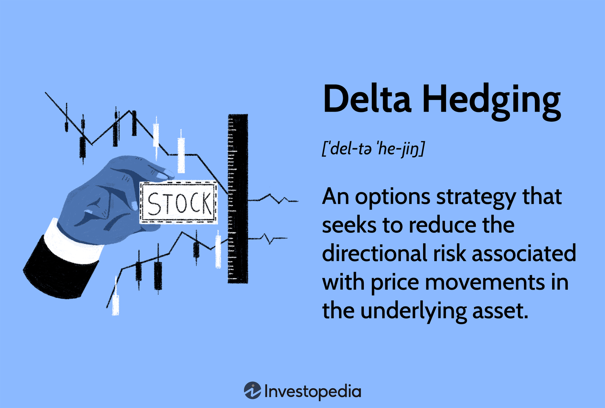

## Table of Contents

## What is the basic concept of de-hedging?

De-hedging is when someone decides to stop protecting their investments from risks. Imagine you have a bet on a football game, and you also made another bet to protect yourself in case your first bet loses. De-hedging would be like canceling that second bet, so you're fully exposed to the outcome of the game again.

People might choose to de-hedge if they think the risk they were protecting against is no longer a big deal, or if they want to take a bigger chance on their investment. It's a bit like deciding to go all in on a gamble, hoping for a bigger reward but also accepting a higher risk of losing everything.

## How does de-hedging differ from hedging?

Hedging is like buying insurance for your investments. It's when you make a move to protect yourself from losing money if things don't go as planned. For example, if you own a stock and you're worried it might go down in value, you might buy another investment that will go up if the stock goes down. This way, you're safer because you won't lose as much money if the stock drops.

De-hedging is the opposite. It's when you decide to cancel that insurance and take the risk again. If you hedged your stock by buying another investment, de-hedging would mean selling that other investment. Now, you're back to facing the full risk of the stock going down. People might do this if they think the stock will go up a lot and they want to get the full benefit, or if they think the risk of the stock going down isn't as big anymore.

## What are the common reasons for implementing a de-hedging strategy?

One common reason for de-hedging is when an investor believes the risk they were protecting against has decreased. For example, if someone hedged against a stock dropping in value but now thinks the stock will actually go up, they might de-hedge to enjoy the full potential gain without the cost of the hedge. Another reason is when the cost of maintaining the hedge becomes too high. If the hedge is expensive and the investor feels the risk isn't worth the cost anymore, they might choose to de-hedge to save money.

Another reason for de-hedging is when an investor wants to take on more risk for a chance at a higher reward. If someone thinks a big opportunity is coming up and they want to maximize their potential profit, they might decide to remove their hedges. This can be risky, but it can also lead to bigger gains if things go well. Overall, de-hedging is about reassessing the balance between risk and reward and deciding that taking on more risk might be worth it.

## Can you explain the mechanism of de-hedging in simple terms?

De-hedging is like deciding to stop using an umbrella when you think it's not going to rain anymore. Imagine you bought an umbrella (a hedge) to protect yourself from the rain (risk of losing money). But now you think the rain will stop, so you close the umbrella and put it away. In investing, this means you get rid of the thing you used to protect your money, like selling an investment that was meant to protect you if your main investment went down.

People might choose to de-hedge for different reasons. One reason could be that they think the risk they were protecting against isn't a big deal anymore. For example, if you thought a stock might go down but now you think it will go up, you might decide to stop protecting yourself. Another reason could be that keeping the protection (the hedge) is too expensive, so it's better to take the risk and save the money you'd spend on the hedge.

## What are the potential risks associated with de-hedging?

De-hedging can be risky because it means you're no longer protected from losing money. If you had a hedge in place, like an investment that would go up if your main investment went down, getting rid of that hedge means you're now fully exposed to the risk of your main investment losing value. If things go badly, you could lose a lot more money than if you had kept the hedge.

Another risk is that you might de-hedge at the wrong time. If you think the risk has gone away but it actually hasn't, you could end up losing money you could have saved by keeping the hedge. It's like thinking the rain has stopped and putting away your umbrella, only to get soaked because it starts pouring again. Timing is important, and getting it wrong can lead to big losses.

## How does de-hedging affect portfolio management?

De-hedging can change how you manage your investments. When you decide to de-hedge, you're choosing to take on more risk. This means your portfolio could go up a lot if things go well, but it could also go down a lot if things go badly. You need to watch your investments more closely because you don't have the protection you used to have. This might mean you need to check your investments more often and be ready to make quick decisions if the market changes.

Another way de-hedging affects portfolio management is by changing how much you might earn or lose. Without the hedge, you're aiming for bigger rewards, but you're also facing bigger risks. This can make your portfolio more exciting but also more stressful. You might need to adjust other parts of your portfolio to balance out the increased risk, like putting some money into safer investments. Overall, de-hedging means you're taking a more active role in managing your investments and being ready for whatever the market does next.

## What tools and techniques are used in de-hedging?

De-hedging often involves selling off the investments or financial instruments that were used as hedges. For example, if you used options to hedge against a drop in stock prices, de-hedging would mean selling those options. Another common tool is closing out futures contracts that were used to hedge against commodity price changes. These actions remove the protective layer you had in place, leaving your original investments exposed to market risks again.

In addition to selling off hedges, de-hedging can also involve adjusting the overall balance of your portfolio. This might mean shifting money from safer, less risky investments to more aggressive ones that have higher potential returns. Techniques like rebalancing your asset allocation or using stop-loss orders can help manage the increased risk after de-hedging. It's all about making sure your investments match your new risk tolerance and investment goals after you've decided to take off the safety net.

## Can you provide an example of a successful de-hedging strategy?

Imagine you own shares in a tech company, and you're worried the stock might go down. So, you buy put options as a hedge. These options will make you money if the stock price drops, helping to offset any losses from your shares. But then, the company announces a breakthrough in their technology, and you think the stock is going to soar. You decide to de-hedge by selling your put options. Now, you're fully exposed to the stock's price movements again, but you're betting on a big win.

A few weeks later, the stock does indeed go up a lot because of the new technology. Because you de-hedged and sold your put options, you get to enjoy the full increase in the stock's value. If you had kept the hedge, the put options would have limited your gains. By de-hedging at the right time, you took on more risk but also reaped a bigger reward.

## How do market conditions influence the decision to de-hedge?

Market conditions play a big role in deciding whether to de-hedge. If the market is doing well and you think it will keep going up, you might feel safe enough to remove your hedges. For example, if the economy is growing and your investments are doing better than expected, you might think the risk of losing money is lower. So, you could decide to de-hedge to enjoy more of the gains without the cost of keeping the hedge in place.

On the other hand, if the market is shaky or you see signs that it might go down, you might keep your hedges or even add more. De-hedging in a risky market can be dangerous because you're taking off your safety net when you might need it the most. So, you need to watch the market closely and think about whether the good times will last or if trouble is coming. Your decision to de-hedge will depend on how confident you feel about the market's future.

## What are the advanced metrics used to evaluate the effectiveness of de-hedging?

To figure out if de-hedging is working well, investors use some special numbers and measures. One important measure is the risk-adjusted return, like the Sharpe Ratio. This tells you how much extra return you're getting for the extra risk you're taking after de-hedging. If the Sharpe Ratio goes up after you de-hedge, it means you're doing better for the risk you're taking. Another measure is the Sortino Ratio, which looks at the downside risk specifically. If this goes up, it means you're managing the risk of losing money better after de-hedging.

Another advanced metric is Value at Risk (VaR), which helps you understand the worst-case scenario for your investments. If your VaR goes down after de-hedging, it might mean you're less likely to lose a big amount of money. But you also need to look at the potential upside, so some people use metrics like the Treynor Ratio, which looks at how much return you're getting for the market risk you're taking. If this goes up after de-hedging, it's a sign that you're getting more reward for the risk you're taking. All these numbers help investors decide if de-hedging was a good move or if they should think about hedging again.

## How does de-hedging integrate with other risk management strategies?

De-hedging is like taking off a safety net you had set up to protect your investments. It's part of a bigger plan to manage risks. When you de-hedge, you might start using other ways to keep your investments safe. For example, you could use stop-loss orders, which automatically sell your investment if it drops to a certain price. This helps limit how much money you could lose. You might also spread your money across different types of investments, called diversification, to reduce the risk of losing everything if one investment goes bad.

Another way de-hedging fits into risk management is by changing how much risk you're willing to take. After de-hedging, you might decide to put more money into safer investments to balance out the risk. This could mean buying bonds or other investments that don't change in value as much as stocks. By doing this, you're trying to keep a good balance between risk and reward. De-hedging isn't just about taking off the hedge; it's about adjusting your whole plan to make sure you're still managing risks in a smart way.

## What are the current trends and future directions in de-hedging research and application?

In the world of investing, de-hedging is becoming more popular as people try to get bigger rewards from their investments. Researchers are looking into new ways to decide when to de-hedge, using fancy math and computer models. They're trying to find the best times to take off the safety net and take more risk. There's also a lot of interest in how de-hedging works with other ways of managing risk, like using stop-loss orders or spreading investments across different types of assets. People want to know how all these strategies can work together to make their investments safer and more profitable.

Looking ahead, de-hedging is likely to keep growing as a big part of how investors manage their money. As markets change and new technology comes out, people will keep finding new ways to use de-hedging to their advantage. There will be more research on how to use data and [artificial intelligence](/wiki/ai-artificial-intelligence) to make better decisions about when to de-hedge. Also, as more people invest in things like cryptocurrencies and other new kinds of investments, they'll need to figure out how de-hedging fits into these new areas. The future of de-hedging will be about balancing risk and reward in smarter and more creative ways.

## References & Further Reading

[1]: Bergstra, J., Bardenet, R., Bengio, Y., & Kégl, B. (2011). ["Algorithms for Hyper-Parameter Optimization"](https://dl.acm.org/doi/10.5555/2986459.2986743). Advances in Neural Information Processing Systems 24.

[2]: ["Advances in Financial Machine Learning"](https://www.amazon.com/Advances-Financial-Machine-Learning-Marcos/dp/1119482089) by Marcos Lopez de Prado

[3]: ["Evidence-Based Technical Analysis: Applying the Scientific Method and Statistical Inference to Trading Signals"](https://www.amazon.com/Evidence-Based-Technical-Analysis-Scientific-Statistical/dp/0470008741) by David Aronson

[4]: ["Machine Learning for Algorithmic Trading"](https://github.com/stefan-jansen/machine-learning-for-trading) by Stefan Jansen

[5]: ["Quantitative Trading: How to Build Your Own Algorithmic Trading Business"](https://www.amazon.com/Quantitative-Trading-Build-Algorithmic-Business/dp/1119800064) by Ernest P. Chan