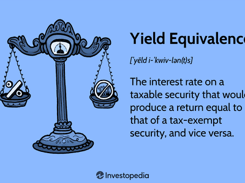

In the world of financial markets, tax liabilities and strategies significantly impact trading outcomes. For traders involved in algorithmic trading, understanding tax rules such as the de minimis calculation becomes essential, as it influences their overall tax strategy significantly. The de minimis tax rule is crucial for determining how certain financial instruments, particularly discount bonds, are taxed. This rule affects algorithmic traders who often engage in bond trading by delineating how discounts on bond acquisitions are treated for tax purposes. 

Understanding the de minimis rule is vital for algorithmic traders, as it helps differentiate between ordinary income and capital gains taxation. A disparity in these tax treatments can significantly affect the profitability of trades. Algorithmic trading systems can be optimized by incorporating the de minimis calculation, allowing traders to exploit favorable tax treatments, potentially enhancing their net returns.



This article aims to unravel the intricacies of the de minimis calculation, outlining its implications on tax rules and its impact on algorithmic trading strategies. By accurately integrating de minimis calculations into trading algorithms, algorithmic traders can elevate their post-tax financial outcomes.

## Table of Contents

## Understanding the De Minimis Tax Rule

The de minimis tax rule is critical in deciding the taxation of discount bonds, focusing on whether the discount is taxed as ordinary income or as a capital gain. This rule is essential because capital gains tax treatment is often more beneficial than ordinary income tax, affecting the profitability of certain bond trades.

To understand this rule, it is necessary to recognize that it establishes a specific threshold for discounts on bonds. The threshold is calculated by comparing the total discount accrued over the bond’s term to maturity. If a bond's discount is deemed "de minimis," it is treated as a capital gain rather than ordinary income when the bond matures or is sold. This distinction is important because capital gains are usually subject to lower tax rates than ordinary income.

The term "de minimis" comes from the Latin phrase "de minimis non curat lex," which translates to "the law does not concern itself with trifles." In the context of tax regulations, the de minimis rule is applied to minor discounts, indicating that such minimal reductions are subject to a more favorable tax treatment due to their insignificance.

For practical application, consider a bond with a par value (original face value), and assume that the bond was purchased at a discount. The de minimis threshold can be evaluated using a straightforward formula, which determines the minimum amount above which the discount is treated as ordinary income. If the actual discount is less than this threshold, it is treated as a capital gain.

Recognizing the implications of the de minimis rule aids traders in making informed decisions, leading to optimized tax outcomes. The difference between ordinary income and capital gains taxation can significantly influence traders' net earnings, driving the importance of this tax rule in [algorithmic trading](/wiki/algorithmic-trading) strategies.

## Detailed Breakdown of De Minimis Calculation

To execute the de minimis calculation for a discount bond, begin by determining the threshold amount that distinguishes capital gain treatment from ordinary income. This calculation involves using the bond's par value and its maturity period. Below is a step-by-step breakdown of the process:

1. **Calculate the De Minimis Amount**: 
   - Multiply the bond’s par value by 0.25%. This factor represents the minimal threshold percentage prescribed under the de minimis rule.
   - Next, multiply the resulting product by the number of years remaining to the bond's maturity from the date of purchase. This computation adjusts the minimal threshold based on the time remaining until the bond matures.

   Mathematically, the de minimis amount can be expressed as:
$$
   \text{De Minimis Amount} = \text{Par Value} \times 0.0025 \times \text{Years to Maturity}

$$

2. **Determine the Cut-off Purchase Price**:
   - Subtract the de minimis amount from the bond's par value. The resulting figure represents the maximum price at which the bond could have been purchased to ensure the discount is treated as a capital gain rather than ordinary income.

   This can be represented as:
$$
   \text{Cut-off Purchase Price} = \text{Par Value} - \text{De Minimis Amount}

$$

Understanding this cut-off is crucial for traders, as purchasing the bond at or below this price allows for any discount to be taxed as a capital gain. Given that capital gains generally receive more favorable tax treatment compared to ordinary income, this optimization can improve overall tax efficiency when trading in bond markets. For professionals engaging in algorithmic trading, ensuring that systems are programmed to perform these calculations during trade execution can aid in maximizing post-tax returns.

## Implications for Algorithmic Trading

Algorithmic traders, particularly those engaged in high-frequency trading, need to be acutely aware of the tax implications associated with the de minimis rule when trading discount bonds. The ability of algorithmic systems to be programmed for optimal trade execution under this tax rule provides an opportunity to enhance net earnings by capitalizing on favorable tax treatments.

The de minimis rule affects how discounts on bonds are treated for tax purposes—whether they are taxed as ordinary income or capital gains. In many cases, capital gains tax treatment is more favorable, allowing traders to retain more of their earnings. Algorithms used in trading can be designed to automatically calculate the de minimis threshold for each bond. This allows traders to make informed decisions regarding the tax implications of each trade.

Here's a simple Python function that can be used to calculate the de minimis threshold for a bond:

```python
def calculate_de_minimis_threshold(par_value, years_to_maturity):
    """
    Calculate the de minimis threshold for a bond.

    Parameters:
    par_value (float): The par value of the bond.
    years_to_maturity (int): The number of years to the bond's maturity.

    Returns:
    float: The de minimis threshold.
    """
    return par_value * 0.0025 * years_to_maturity

# Example usage
par_value = 100  # Bond's par value
years_to_maturity = 5  # Number of years to maturity
threshold = calculate_de_minimis_threshold(par_value, years_to_maturity)
print(f"The de minimis threshold is: {threshold}")
```

By programming such calculations into trading algorithms, traders can automatically evaluate whether the discount on a bond falls below the de minimis threshold. If the discount is above this threshold, it would be advantageous for the algorithm to pursue trade strategies that favor capital gains treatment to optimize tax efficiency.

Further, integrating these calculations into algorithmic systems supports real-time decision-making by recognizing and executing trades that align with favorable tax strategies. This proactive approach is essential in high-frequency trading environments where decisions must be made on the fly.

To leverage these advantages, traders should routinely update and test their algorithms for compliance with current tax regulations, ensuring that strategies remain aligned with legal requirements and financial goals. Investing in the development of such algorithmic capabilities can significantly impact post-tax earnings and overall trading success.

## Case Studies and Examples

Consider a 10-year bond with a par value of $100 and five years to maturity. The de minimis threshold for this bond can be calculated using the formula:

$$
\text{De Minimis Threshold} = (\text{Par Value}) \times 0.0025 \times (\text{Years to Maturity})
$$

Substituting the values into the formula gives:

$$
100 \times 0.0025 \times 5 = 1.25
$$

According to the de minimis rule, if the bond is purchased for a price less than $98.75 (i.e., the par value $100 minus the de minimis threshold $1.25), any discount on the bond would be taxed as ordinary income. This tax treatment can significantly impact the net earnings from the trade, making it crucial to consider this calculation in trading strategies.

### Real-World Scenarios

1. **Scenario: Slightly Below Threshold Purchase**

   Suppose an algorithmic trading system identifies a bond trading at $98.70, just slightly below the de minimis threshold of $98.75. A financially astute decision would involve evaluating if the potential tax obligation as ordinary income would erode any projected profits from the trade. The trading algorithm must account for this threshold and may opt out of purchasing if the trade would not be profitable post-tax.

2. **Scenario: Optimal Purchase Above Threshold**

   Consider another scenario where an algorithm recognizes a bond available at $98.80. While initially appearing marginally more expensive than a $98.70 offer, this purchase price is above the de minimis threshold. Thus, any resulting gain will be treated as a capital gain instead of as ordinary income, likely favorable for the investor due to lower tax rates on capital gains. The algorithm, in this case, strategically purchases the bond, intending to optimize tax efficiency.

### Python Code Illustration

Programmatic implementation can further elucidate these calculations, especially when embedded in algorithmic trading systems. Here's a simple Python function to determine whether a bond purchase price falls under the de minimis threshold:

```python
def is_below_de_minimis(par_value, years_to_maturity, purchase_price):
    de_minimis_threshold = par_value * 0.0025 * years_to_maturity
    de_minimis_price = par_value - de_minimis_threshold
    return purchase_price < de_minimis_price

# Example Usage
par_value = 100
years_to_maturity = 5
purchase_price = 98.70

if is_below_de_minimis(par_value, years_to_maturity, purchase_price):
    print("The purchase falls under the de minimis threshold; taxed as ordinary income.")
else:
    print("The purchase is above the de minimis threshold; taxed as capital gain.")
```

Correctly implementing and understanding these calculations can be advantageous for algorithmic traders seeking to maximize post-tax profit, demonstrating the integral role of tax rules in high-frequency trading strategies.

## Challenges and Considerations

Ensuring compliance with the de minimis tax rule in algorithmic trading presents significant challenges. Automated trading systems must be meticulously programmed to adhere to complex tax regulations, necessitating rigorous auditing and regular updates. These systems must accurately interpret and apply the de minimis rule to determine whether the discount on bonds should be taxed as ordinary income or capital gains. 

Moreover, variations in the implementation of the de minimis rule across different jurisdictions add another layer of complexity. Traders engaging in cross-border transactions must account for these discrepancies to maintain compliance with local tax laws. This issue necessitates a flexible and responsive system design capable of handling multiple tax regimes.

Algorithmic traders are thus compelled to maintain continuous updates of their systems to adapt to regulatory changes. Tax laws, including those concerning the de minimis rule, are subject to frequent modifications that can affect trading strategies and outcomes. Traders must therefore equip their algorithms with robust capabilities to quickly incorporate new regulations to optimize tax efficiency continuously.

In summary, successful algorithmic trading requires sophisticated programming and ongoing system enhancements to ensure compliance with the evolving landscape of tax rules like the de minimis. Failure to do so can lead to suboptimal tax treatments and potential legal complications.

## Conclusion

The de minimis tax rule serves as a critical component for algorithmic traders working with bonds, providing a precise mechanism to distinguish between capital gains and ordinary income. By integrating exact de minimis calculations into trading algorithms, traders have the opportunity to enhance their post-tax earnings. This requires a solid grasp of how purchases near or below the de minimis threshold can shift the tax treatment of the discount on a bond.

For instance, traders may implement the calculation as follows:

```python
def de_minimis_threshold(par_value, years_to_maturity, rate=0.0025):
    return par_value * rate * years_to_maturity

threshold = de_minimis_threshold(100, 5)
```

By ensuring their algorithmic systems take these factors into consideration, they're able to automate decisions that optimize the tax treatment of trades. However, given the complexity of the tax landscape, it's advisable for traders to regularly consult with tax professionals. This ensures that they not only adhere to existing regulations but also capitalize on tax efficiencies within their strategies. A proactive approach in aligning with dynamic regulatory frameworks can markedly influence the financial outcomes of algorithmic trading endeavors.

## References & Further Reading

[1]: Fabozzi, F. J., Modigliani, F., & Jones, F. J. (2010). ["Foundations of Financial Markets and Institutions"](https://www.amazon.com/Foundations-Financial-Markets-Institutions-International/dp/1292021772) (4th Edition). Pearson.

[2]: Hull, J. (2018). ["Options, Futures, and Other Derivatives"](https://www.amazon.com/Options-Futures-Other-Derivatives-9th/dp/0133456315) (9th Edition). Pearson.

[3]: Lopez de Prado, M. (2018). ["Advances in Financial Machine Learning"](https://www.amazon.com/Advances-Financial-Machine-Learning-Marcos/dp/1119482089). Wiley.

[4]: Chincarini, L. B., & Kim, D. (2006). ["Quantitative Equity Portfolio Management: An Active Approach to Portfolio Construction and Management"](https://archive.org/details/quantitativeequi0000chin_c9d6). McGraw-Hill.

[5]: ["Tax Treatment of Bonds"](https://www.schwab.com/learn/story/your-guide-to-bond-taxes) by the Internal Revenue Service (IRS) 

[6]: Chan, E. P. (2009). ["Quantitative Trading: How to Build Your Own Algorithmic Trading Business"](https://github.com/ftvision/quant_trading_echan_book). Wiley.