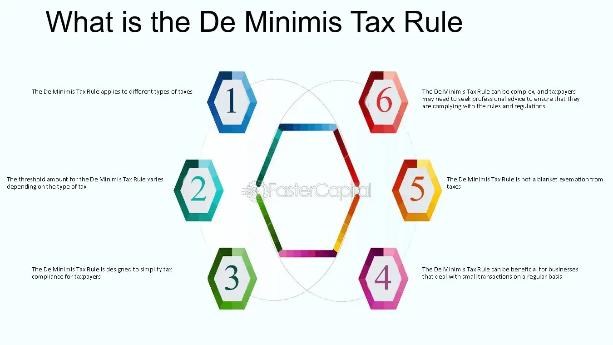

## Table of Contents

## What is the De Minimis Tax Rule?

The De Minimis Tax Rule is a regulation that allows businesses to avoid keeping detailed records for very small perks or benefits given to employees. These small benefits are so minor that they are not worth the effort of tracking and reporting them for tax purposes. Examples of these benefits might include occasional snacks, birthday cakes, or small holiday gifts. The rule helps businesses save time and money by not having to account for these minor items in their tax calculations.

To qualify under the De Minimis Tax Rule, the value of the benefit must be so small that accounting for it would be unreasonable or administratively impractical. The Internal Revenue Service (IRS) decides what counts as "de minimis," and this can vary. For instance, a company might provide a small gift card to employees, and if the value is low enough, it might not need to be reported as income. However, if the benefits become too frequent or valuable, they may no longer be considered de minimis, and the company would need to report them.

## How does the De Minimis Tax Rule affect small businesses?

The De Minimis Tax Rule helps small businesses by letting them give small gifts or perks to employees without worrying about taxes. For example, if a small business owner wants to celebrate an employee's birthday with a cake, they don't have to report the cost of the cake on tax forms. This saves time and money because the business doesn't need to keep detailed records of these small items.

However, small businesses need to be careful. If the gifts or perks become too big or too frequent, they might not count as "de minimis" anymore. The IRS decides what is small enough, and if a business gives out too many big gifts, they might have to start reporting them. So, while the rule makes things easier, small businesses still need to keep an eye on what they're giving out to stay within the rules.

## What types of transactions are typically covered under the De Minimis Tax Rule?

The De Minimis Tax Rule covers small perks or benefits that businesses give to their employees. These can include things like occasional snacks, birthday cakes, or small holiday gifts. For example, if a company buys a pizza for the team once in a while, they don't have to report it on tax forms. These items are so small that it's not worth the time and effort to keep track of them for tax purposes.

However, the rule only applies if the value of these benefits is very low. If the gifts or perks become too big or happen too often, they might not be considered "de minimis" anymore. For instance, giving out large gift cards every month might need to be reported. The IRS decides what counts as small enough, so businesses need to be careful and make sure their gifts stay within the rules.

## What is the threshold for the De Minimis Tax Rule in different countries?

In the United States, the De Minimis Tax Rule does not have a specific dollar amount set as a threshold. Instead, the IRS decides what is considered "de minimis" based on the value and frequency of the benefits. For example, occasional snacks or small holiday gifts might be seen as de minimis, but if these become too frequent or valuable, they might not qualify anymore. Businesses need to be careful and make sure their gifts stay small and infrequent to avoid having to report them for tax purposes.

In other countries, the rules can be different. For example, in the United Kingdom, the threshold for de minimis benefits is set at £50 per employee per year. This means that if a business gives an employee gifts or perks worth less than £50 in total over the year, they don't have to report it for tax. In Canada, there isn't a specific dollar amount, but the benefits must be so small that accounting for them would be unreasonable. Each country has its own rules, so businesses need to check the local laws to make sure they are following them correctly.

## How is the De Minimis Tax Rule applied in international trade?

In international trade, the De Minimis Tax Rule helps countries manage customs duties on small shipments. If the value of a shipment is very low, countries might not charge any customs duty on it. This makes it easier and cheaper to send small packages across borders because businesses and individuals don't have to pay taxes on these tiny shipments.

Each country sets its own threshold for what counts as "de minimis" in international trade. For example, the United States has a de minimis value of $800, meaning that shipments valued at less than $800 can enter the country duty-free. Other countries might have different thresholds, like the European Union, which has a de minimis value of €150 for most goods. These rules help streamline trade and reduce costs for small shipments, but businesses need to know the specific thresholds for each country they are dealing with.

## Can the De Minimis Tax Rule be applied to digital goods?

The De Minimis Tax Rule can apply to digital goods, just like it does to physical items. If a digital good, like an e-book or a small software download, is valued below a country's de minimis threshold, it might not be subject to customs duties or taxes. This makes it easier for businesses to send small digital items across borders without worrying about extra costs.

However, the rules can be different for each country. Some countries might have specific rules for digital goods, while others treat them the same as physical goods. It's important for businesses to check the local laws in each country they are dealing with to make sure they understand how the De Minimis Tax Rule applies to their digital products.

## What are the potential benefits of the De Minimis Tax Rule for consumers?

The De Minimis Tax Rule can help consumers by making it cheaper and easier to buy things from other countries. If the value of what they're buying is small enough, they won't have to pay extra taxes or fees when it arrives. This means that people can order small items online, like a book or a small gift, without worrying about extra costs.

This rule also makes shopping more convenient. Because small shipments don't have to go through a lot of paperwork and checks, they can get to the consumer faster. So, if someone wants to buy something from another country, the De Minimis Tax Rule can help them get it quicker and at a lower price.

## How do customs authorities enforce the De Minimis Tax Rule?

Customs authorities enforce the De Minimis Tax Rule by checking the value of shipments that come into their country. If the value is below the set threshold, they let the shipment through without charging any customs duties or taxes. This makes it easier for small packages to move quickly across borders because there's less paperwork and fewer checks needed.

To make sure the rule is followed, customs officials might ask for proof of the value of the goods. This could be an invoice or a receipt. If they find out that someone is trying to get around the rule by splitting up a big shipment into smaller ones, they might charge the full duty and even add penalties. So, while the De Minimis Tax Rule helps with small shipments, it's important for everyone to be honest about the value of what they're sending.

## What are the common challenges faced by businesses in applying the De Minimis Tax Rule?

One big challenge for businesses in applying the De Minimis Tax Rule is knowing what counts as "de minimis." Different countries have different rules, so a business has to check each country's threshold. For example, what's okay in the U.S. might not be okay in the U.K. This can be confusing and take a lot of time to figure out, especially if a business sells to many different countries.

Another challenge is keeping track of how often and how much they give out. If a business gives too many gifts or if the gifts are too valuable, they might not be able to use the De Minimis Tax Rule anymore. This means they have to be careful not to go over the limit, or they'll have to start reporting and paying taxes on those gifts. It can be hard to balance giving nice things to employees or customers while staying within the rules.

## How has the De Minimis Tax Rule evolved over time, and what are the current trends?

The De Minimis Tax Rule has changed a lot over time. In the beginning, it was mostly about small gifts and perks for employees. But as more people started shopping online, countries began using the rule for international shipments too. This helped make it easier and cheaper to send small packages across borders. Over the years, countries have changed their de minimis thresholds to keep up with inflation and changes in how people buy things.

Today, one big trend is that more countries are looking at their de minimis thresholds to see if they need to be updated. This is because online shopping has grown a lot, and countries want to make sure their rules still make sense. Another trend is that some countries are thinking about how to apply the rule to digital goods, like e-[books](/wiki/algo-trading-books) and software. This is tricky because digital goods don't have the same kind of value as physical items, but countries still want to keep things fair and simple for everyone.

## What are the implications of the De Minimis Tax Rule on global e-commerce?

The De Minimis Tax Rule has a big impact on global e-commerce by making it easier and cheaper for people to buy things from other countries. If someone wants to buy a small item, like a book or a gift, and it's worth less than the de minimis threshold, they won't have to pay extra taxes or fees when it arrives. This means more people can shop online from anywhere in the world without worrying about extra costs, which helps e-commerce businesses grow.

However, the rule also creates some challenges. Different countries have different thresholds, so businesses that sell to many countries have to keep track of a lot of different rules. This can be confusing and take a lot of time. Also, if businesses try to get around the rule by splitting up big shipments into smaller ones, they might get into trouble with customs. So while the De Minimis Tax Rule helps e-commerce, it also means businesses need to be careful and honest about what they're sending.

## How can businesses optimize their operations to take advantage of the De Minimis Tax Rule?

Businesses can optimize their operations by making sure they understand the de minimis thresholds in all the countries they sell to. They should keep their shipments small and under the threshold to avoid paying extra taxes and fees. For example, if a business sells to the U.S., they should keep shipments under $800 to take advantage of the rule. By doing this, they can save money and make their products cheaper for customers, which can help them sell more.

Another way to optimize is by being careful about how often and how much they give out in perks or gifts to employees. If a business wants to give small gifts like snacks or holiday presents, they should make sure these stay small and don't happen too often. This way, they can keep using the De Minimis Tax Rule and not have to report these gifts for tax purposes. By staying within the rules, businesses can save time and money on paperwork and taxes.

## What is a Detailed Breakdown of De Minimis Calculation?

To execute the de minimis calculation for a discount bond, begin by determining the threshold amount that distinguishes capital gain treatment from ordinary income. This calculation involves using the bond's par value and its maturity period. Below is a step-by-step breakdown of the process:

1. **Calculate the De Minimis Amount**: 
   - Multiply the bond’s par value by 0.25%. This factor represents the minimal threshold percentage prescribed under the de minimis rule.
   - Next, multiply the resulting product by the number of years remaining to the bond's maturity from the date of purchase. This computation adjusts the minimal threshold based on the time remaining until the bond matures.

   Mathematically, the de minimis amount can be expressed as:
$$
   \text{De Minimis Amount} = \text{Par Value} \times 0.0025 \times \text{Years to Maturity}

$$

2. **Determine the Cut-off Purchase Price**:
   - Subtract the de minimis amount from the bond's par value. The resulting figure represents the maximum price at which the bond could have been purchased to ensure the discount is treated as a capital gain rather than ordinary income.

   This can be represented as:
$$
   \text{Cut-off Purchase Price} = \text{Par Value} - \text{De Minimis Amount}

$$

Understanding this cut-off is crucial for traders, as purchasing the bond at or below this price allows for any discount to be taxed as a capital gain. Given that capital gains generally receive more favorable tax treatment compared to ordinary income, this optimization can improve overall tax efficiency when trading in bond markets. For professionals engaging in [algorithmic trading](/wiki/algorithmic-trading), ensuring that systems are programmed to perform these calculations during trade execution can aid in maximizing post-tax returns.

## What are some case studies and examples?

Consider a 10-year bond with a par value of $100 and five years to maturity. The de minimis threshold for this bond can be calculated using the formula:

$$
\text{De Minimis Threshold} = (\text{Par Value}) \times 0.0025 \times (\text{Years to Maturity})
$$

Substituting the values into the formula gives:

$$
100 \times 0.0025 \times 5 = 1.25
$$

According to the de minimis rule, if the bond is purchased for a price less than $98.75 (i.e., the par value $100 minus the de minimis threshold $1.25), any discount on the bond would be taxed as ordinary income. This tax treatment can significantly impact the net earnings from the trade, making it crucial to consider this calculation in trading strategies.

### Real-World Scenarios

1. **Scenario: Slightly Below Threshold Purchase**

   Suppose an algorithmic trading system identifies a bond trading at $98.70, just slightly below the de minimis threshold of $98.75. A financially astute decision would involve evaluating if the potential tax obligation as ordinary income would erode any projected profits from the trade. The trading algorithm must account for this threshold and may opt out of purchasing if the trade would not be profitable post-tax.

2. **Scenario: Optimal Purchase Above Threshold**

   Consider another scenario where an algorithm recognizes a bond available at $98.80. While initially appearing marginally more expensive than a $98.70 offer, this purchase price is above the de minimis threshold. Thus, any resulting gain will be treated as a capital gain instead of as ordinary income, likely favorable for the investor due to lower tax rates on capital gains. The algorithm, in this case, strategically purchases the bond, intending to optimize tax efficiency.

### Python Code Illustration

Programmatic implementation can further elucidate these calculations, especially when embedded in algorithmic trading systems. Here's a simple Python function to determine whether a bond purchase price falls under the de minimis threshold:

```python
def is_below_de_minimis(par_value, years_to_maturity, purchase_price):
    de_minimis_threshold = par_value * 0.0025 * years_to_maturity
    de_minimis_price = par_value - de_minimis_threshold
    return purchase_price < de_minimis_price

# Example Usage
par_value = 100
years_to_maturity = 5
purchase_price = 98.70

if is_below_de_minimis(par_value, years_to_maturity, purchase_price):
    print("The purchase falls under the de minimis threshold; taxed as ordinary income.")
else:
    print("The purchase is above the de minimis threshold; taxed as capital gain.")
```

Correctly implementing and understanding these calculations can be advantageous for algorithmic traders seeking to maximize post-tax profit, demonstrating the integral role of tax rules in high-frequency trading strategies.

## References & Further Reading

[1]: Fabozzi, F. J., Modigliani, F., & Jones, F. J. (2010). ["Foundations of Financial Markets and Institutions"](https://www.amazon.com/Foundations-Financial-Markets-Institutions-International/dp/1292021772) (4th Edition). Pearson.

[2]: Hull, J. (2018). ["Options, Futures, and Other Derivatives"](https://www.amazon.com/Options-Futures-Other-Derivatives-9th/dp/0133456315) (9th Edition). Pearson.

[3]: Lopez de Prado, M. (2018). ["Advances in Financial Machine Learning"](https://www.amazon.com/Advances-Financial-Machine-Learning-Marcos/dp/1119482089). Wiley.

[4]: Chincarini, L. B., & Kim, D. (2006). ["Quantitative Equity Portfolio Management: An Active Approach to Portfolio Construction and Management"](https://archive.org/details/quantitativeequi0000chin_c9d6). McGraw-Hill.

[5]: ["Tax Treatment of Bonds"](https://www.schwab.com/learn/story/your-guide-to-bond-taxes) by the Internal Revenue Service (IRS) 

[6]: Chan, E. P. (2009). ["Quantitative Trading: How to Build Your Own Algorithmic Trading Business"](https://github.com/ftvision/quant_trading_echan_book). Wiley.