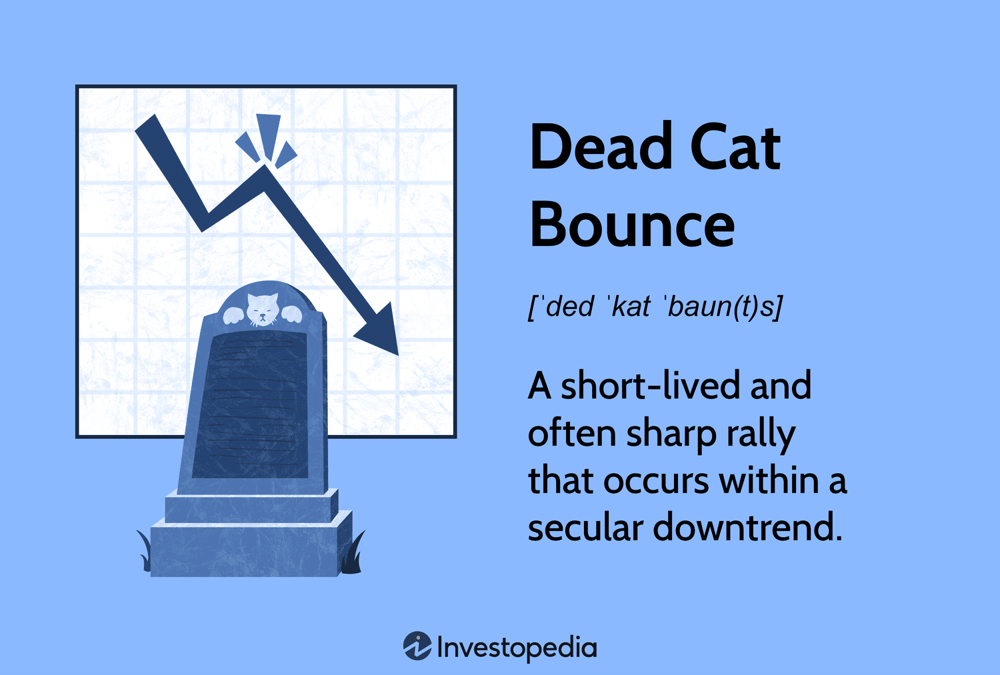

## Table of Contents

## What is a dead cat bounce in the context of investing?

A dead cat bounce is a term used in investing to describe a temporary recovery in the price of a stock or market after a big drop. It's called a "dead cat bounce" because even a dead cat will bounce if it falls from a high enough place, but it's still dead. In the same way, a stock might go up a bit after falling a lot, but it's not a sign that the stock is getting better. It's just a short break in the downward trend.

Investors need to be careful with a dead cat bounce because it can trick them into thinking the stock is starting to recover. If they buy the stock during this small rise, they might lose money when the price starts to fall again. It's important for investors to look at other information and not just the price to decide if a stock is a good buy. Understanding if a price increase is a real recovery or just a dead cat bounce can help investors make better choices.

## How can you identify a dead cat bounce in stock prices?

To spot a dead cat bounce, you need to look at how the stock has been doing over time. If the stock price has been going down for a while and then suddenly goes up a bit, that could be a dead cat bounce. It's like the stock is taking a short break from falling, but it's not really getting better. You can see this by looking at a chart of the stock's price over days or weeks. If the price goes up after a big drop but then starts to go down again, it's probably just a dead cat bounce.

Another way to tell if it's a dead cat bounce is by looking at the news and other information about the company. If there's no good news or reason for the stock to go up, then the small rise in price might not last. It's important to check if the company is doing better or if there are other reasons for the stock to go up. If there's nothing new and good happening, the price increase is likely just a dead cat bounce, and the stock will probably keep going down.

## What causes a dead cat bounce to occur in the market?

A dead cat bounce happens when a stock price goes up a little bit after it has been falling a lot. This small rise can trick people into thinking the stock is getting better, but it's usually just a short break in the downward trend. The main reason for a dead cat bounce is that some investors see the big drop and think the stock is now a good deal. They buy the stock, hoping it will go back up, which causes the price to rise a bit. But since the stock was falling for a reason, like the company not doing well, the price usually starts to fall again.

Another reason for a dead cat bounce can be short-term trading. Some traders might buy the stock to sell it quickly for a small profit, which can cause the price to go up temporarily. But these traders are not interested in holding the stock for a long time; they just want to make a quick gain. So, once they sell, the price can drop again. Understanding why a stock price is moving can help investors tell if a rise is a real recovery or just a dead cat bounce.

## Can you give examples of dead cat bounces in historical stock market events?

One example of a dead cat bounce happened with the stock of Enron in 2001. Enron was a big company, but it was found out that they were hiding how bad their business was doing. When this was discovered, their stock price fell a lot. But then, it went up a little bit for a short time. People thought maybe the stock was getting better, but it was just a dead cat bounce. After that small rise, the stock kept falling because the company's problems were still there.

Another example was with Lehman Brothers in 2008. Lehman Brothers was a big bank that got into trouble during the financial crisis. Their stock price dropped a lot, but then it went up a little bit for a few days. Some people thought this meant the stock was recovering, but it was just a dead cat bounce. After that small increase, the stock price kept going down, and Lehman Brothers ended up going bankrupt. These examples show how a dead cat bounce can trick people into thinking a stock is getting better when it's not.

## How does a dead cat bounce differ from a genuine market recovery?

A dead cat bounce is when a stock price goes up a little bit after it has been falling a lot, but then it starts to fall again. It's like the stock takes a short break from going down, but it's not really getting better. This happens because some people see the big drop and think the stock is a good buy, so they buy it and make the price go up a little. But since the reasons the stock was falling are still there, like the company not doing well, the price goes back down.

A genuine market recovery is different because it's a real sign that the stock or the market is getting better. This happens when the company starts to do better, or there's good news that makes people want to buy the stock. The price goes up and keeps going up because the reasons for the rise are strong and real. It's important for investors to look at the news and other information about the company to tell if the price increase is a dead cat bounce or a genuine recovery.

## What are the risks of investing during a dead cat bounce?

Investing during a dead cat bounce is risky because you might think the stock is getting better when it's not. A dead cat bounce is when the stock price goes up a little after a big drop, but then it starts to fall again. If you buy the stock during this small rise, thinking it's a good deal, you could lose money when the price goes back down. It's like buying something because it's on sale, but then finding out it's still not worth the price.

The main risk is that the reasons the stock was falling in the first place, like the company not doing well, are still there. So, even if the stock goes up a bit, it's not a sign that things are getting better. If you invest during a dead cat bounce, you might end up losing money because the stock price will likely keep going down. It's important to look at more than just the price and see if there's real news or changes in the company that show it's improving before you decide to buy.

## How can technical analysis help in predicting a dead cat bounce?

Technical analysis can help predict a dead cat bounce by looking at charts and patterns of stock prices. When a stock has been going down for a while and then suddenly goes up a little, it might be a dead cat bounce. Technical analysts look for patterns like a sharp drop followed by a small rise, and then another drop. They use tools like moving averages and trend lines to see if the small rise is just a break in the downward trend or if it's the start of a real recovery. If the stock price stays below important moving averages or if the rise doesn't break through key resistance levels, it's more likely to be a dead cat bounce.

Another way technical analysis helps is by looking at trading [volume](/wiki/volume-trading-strategy). If the small rise in price happens with low trading volume, it might mean that not many people are buying the stock, and the rise is not strong. On the other hand, if the rise comes with high volume, it could be a sign of a real recovery. By combining these signs from charts and volume, technical analysts can make better guesses about whether a price increase is a dead cat bounce or the start of something better. This can help investors decide if it's a good time to buy or if they should wait.

## What strategies can investors use to avoid losses from a dead cat bounce?

Investors can avoid losses from a dead cat bounce by being careful and doing their homework. When they see a stock price go up after a big drop, they should not rush to buy it. Instead, they should look at the company's news and see if there's a good reason for the price to go up. If the company is still having problems, the small rise in price is probably just a dead cat bounce, and it's better to wait and see what happens next. By taking their time and not getting tricked by the small rise, investors can avoid buying a stock that might keep going down.

Another way to avoid losses is by using technical analysis to look at the stock's price chart. Investors can watch for patterns that show a dead cat bounce, like a sharp drop followed by a small rise and then another drop. They can also look at trading volume to see if the rise is strong or weak. If the rise happens with low volume, it's more likely to be a dead cat bounce. By using these tools and not just looking at the price, investors can make smarter choices and avoid buying stocks during a dead cat bounce.

## How does market sentiment influence the occurrence of a dead cat bounce?

Market sentiment plays a big role in causing a dead cat bounce. When a stock has been falling a lot, some investors might start to feel hopeful. They see the big drop and think the stock is now a good deal. This hope can make them buy the stock, which pushes the price up a little bit. But if the stock was falling because the company was doing badly, the hope is not based on anything real. So, the small rise in price is just a dead cat bounce, caused by people's feelings rather than the company getting better.

Even though market sentiment can make the stock price go up a little, it doesn't change the real problems the company might have. If the company's bad news is still there, the price will likely start to fall again after the small rise. Investors need to be careful and not let their feelings trick them into thinking a dead cat bounce is a real recovery. By looking at the company's news and other information, they can tell if the rise in price is just because of hope or if it's a sign that the company is actually doing better.

## What role do short sellers play during a dead cat bounce?

Short sellers can make a dead cat bounce happen or make it worse. When a stock price has been falling a lot, short sellers might think it will keep going down. They borrow the stock and sell it, hoping to buy it back later at a lower price and make a profit. But if the stock price goes up a little because some people think it's a good deal, short sellers might get worried. They might decide to buy back the stock to cut their losses, which can push the price up even more and cause a dead cat bounce.

Even though short sellers can help cause a dead cat bounce, they can also make it end faster. If the stock price goes up a little but the company's problems are still there, short sellers might keep selling the stock. This can make the price start to fall again after the small rise. So, short sellers can play a big part in both making a dead cat bounce happen and making it go away.

## How can fundamental analysis be used to differentiate a dead cat bounce from a sustainable recovery?

Fundamental analysis helps investors tell if a stock's price going up is a real recovery or just a dead cat bounce by looking at the company's financial health and news. When a stock price goes up a little after a big drop, investors should check if the company is doing better. They can look at things like the company's earnings, how much money it's making, and if there's good news about the company. If the company's problems are still there, like it's losing money or has bad news, the small rise in price is probably just a dead cat bounce. But if the company is starting to do better, the price increase might be a real recovery.

By using [fundamental analysis](/wiki/fundamental-analysis), investors can see if the reasons for the stock price going up are strong and real. If the company's financials are getting better and there's good news, like new products or better sales, the price increase is more likely to be a sustainable recovery. But if the company's financials are still bad and there's no good news, the price rise is probably just a dead cat bounce. This way, investors can make smarter choices and avoid buying stocks that might keep going down.

## What advanced indicators or tools are available for expert investors to detect potential dead cat bounces?

Expert investors can use advanced indicators like the Relative Strength Index (RSI) and the Moving Average Convergence Divergence (MACD) to spot potential dead cat bounces. The RSI measures how fast a stock's price is going up or down and shows if it's overbought or oversold. If a stock has been falling a lot and then goes up a little, but the RSI stays low, it might mean the stock is still weak and the rise is just a dead cat bounce. The MACD looks at the difference between two moving averages and can show if the stock's trend is changing. If the MACD line crosses above the signal line during a small rise after a big drop, but then quickly crosses back down, it could be a sign of a dead cat bounce.

Another tool experts use is the Bollinger Bands, which show the stock's price range and [volatility](/wiki/volatility-trading-strategies). If a stock's price goes up a little after falling a lot but stays inside the lower Bollinger Band, it might mean the stock is still in a downtrend and the rise is not strong. Expert investors also look at the volume of trades. If the small rise happens with low volume, it suggests that not many people are buying the stock, and the rise might be a dead cat bounce. By combining these indicators, expert investors can get a better idea if a stock's price increase is just a temporary bounce or the start of a real recovery.

## How can we identify market trends?

Market trends provide critical insights into the trajectory of the economy, offering investors crucial data to aid informed decision-making. Recognizing these trends is integral to deciphering movements such as a dead cat bounce—a temporary recovery in a declining market—versus a genuine market reversal.

Economic indicators are vital in identifying market trends. These include metrics such as Gross Domestic Product (GDP), unemployment rates, inflation rates, and other factors that give a snapshot of economic health. For instance, a steady increase in GDP might indicate a growing economy, whereas rising unemployment could signal economic distress.

Sentiment analysis is another tool used to gauge market trends. This involves assessing the mood of the market participants, often through data from social media, news articles, and financial reports. Techniques such as natural language processing (NLP) can be employed to quantify sentiment from large datasets. For example, positive sentiment might be derived from increasingly optimistic news reports about a sector, while negative sentiment might be noted from widespread social media pessimism about a company.

Historical patterns also play a significant role. By examining past market behaviors during similar economic conditions, investors can gain insight into potential future outcomes. Statistical techniques can be used to evaluate these patterns. Consider the use of moving averages, a common method for smoothing out price data to identify trends. A simple moving average (SMA) can be calculated as follows:

$$
\text{SMA}_n = \frac{\sum_{i=0}^{n-1} P_i}{n}
$$

where $P_i$ is the price at time $i$ and $n$ is the number of time periods.

In the context of a dead cat bounce, understanding underlying market trends is crucial. If economic indicators suggest a weakening economy but sentiment analysis shows a temporary surge in optimism, this might point to a dead cat bounce rather than a sustainable market recovery. Historical patterns of similar divergences can further reinforce such predictions.

Leveraging economic indicators, sentiment analysis, and historical patterns enables investors to discern whether a market trend is part of a broader shift or merely a temporary anomaly. As such, these tools are indispensable for navigating the complexities of modern financial markets, especially when trying to differentiate between a temporary market bounce and a genuine market shift.

## References & Further Reading

[1]: Malkiel, B. G. (2003). ["The Efficient Market Hypothesis and Its Critics."](https://pubs.aeaweb.org/doi/10.1257/089533003321164958) Journal of Economic Perspectives, 17(1), 59-82.

[2]: Lo, A. W., & MacKinlay, A. C. (1988). ["Stock Market Prices Do Not Follow Random Walks: Evidence from a Simple Specification Test."](https://academic.oup.com/rfs/article-abstract/1/1/41/1601244) Review of Financial Studies, 1(1), 41-66.

[3]: Lopez de Prado, M. (2018). ["Advances in Financial Machine Learning."](https://www.amazon.com/Advances-Financial-Machine-Learning-Marcos/dp/1119482089) Wiley.

[4]: Chan, E. P. (2009). ["Quantitative Trading: How to Build Your Own Algorithmic Trading Business."](https://github.com/ftvision/quant_trading_echan_book) Wiley.

[5]: Aronson, D. R. (2007). ["Evidence-Based Technical Analysis: Applying the Scientific Method and Statistical Inference to Trading Signals."](https://onlinelibrary.wiley.com/doi/book/10.1002/9781118268315) Wiley.

[6]: Jansen, S. (2020). ["Machine Learning for Algorithmic Trading: Predictive models to extract signals from market and alternative data for systematic trading strategies with Python."](https://www.amazon.com/Machine-Learning-Algorithmic-Trading-alternative/dp/1839217715) Packt Publishing.

[7]: Hendershott, T., Jones, C. M., & Menkveld, A. J. (2011). ["Does Algorithmic Trading Improve Liquidity?"](https://onlinelibrary.wiley.com/doi/full/10.1111/j.1540-6261.2010.01624.x) Journal of Financial Economics, 24(3), 835-859.