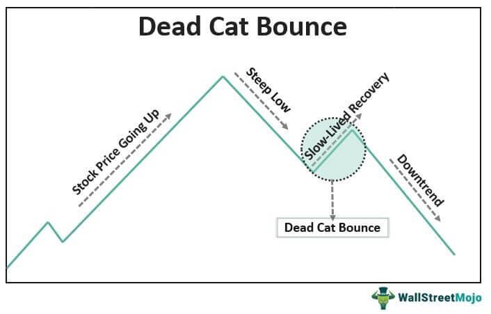

In the ever-evolving world of finance, understanding market trends is crucial for investors seeking to maximize returns and minimize risks. One of the intriguing phenomena in the market is the "dead cat bounce," a term used to describe a temporary recovery in the price of a declining asset. This phenomenon often misleads investors into perceiving a short-term market revival, only for the prices to plunge once again. Recognizing and interpreting these misleading signals is pivotal to effective investing.

Simultaneously, the rise of algorithmic trading is reshaping how investors interact with the market. By employing complex algorithms to automate trading decisions, algorithmic trading enhances market efficiency and liquidity, often executing trades faster than any human could. This technique has become a dominant force in modern investing, influencing price movements and volatility across markets.



This article examines the concept of the dead cat bounce, investigates current market trends, and considers the significant impact of algorithmic trading on contemporary investment strategies.

## Table of Contents

## Understanding the Dead Cat Bounce

A dead cat bounce is a term used in finance to describe a temporary recovery in the price of an asset experiencing a prolonged decline. This brief resurgence is traditionally followed by a continued downturn, ultimately misleading investors into perceiving the market as recovering when it is not. The metaphor suggests that even a 'dead cat' will bounce if it falls from a significant height, underlining the deceptive nature of this phenomenon.

The primary challenge with a dead cat bounce is the difficulty in distinguishing it from a genuine market reversal. This can lead to misjudgments where investors, swayed by a short-term increase, may mistakenly assume a bullish trend, causing them to make premature investment decisions. These misinterpretations can result in financial losses as the market likely returns to its previous downward trajectory after the bounce.

Recognizing a dead cat bounce requires a comprehensive understanding of market patterns and investor behavior. One might consider examining factors such as trading volumes during the bounce, broader market conditions, and economic indicators that align with the asset's performance. For instance, if a stock experiences a sudden uptick in price but has declining trading volume, this might indicate a dead cat bounce, signifying weaker investor confidence in a sustained recovery.

Ultimately, distinguishing between a dead cat bounce and a true market rebound is crucial for minimizing the risks of hasty investment actions. Developing strategies to accurately predict these movements can make a significant difference in investment outcomes, emphasizing the importance of keen market awareness and analysis.

## Identifying Market Trends

Market trends provide critical insights into the trajectory of the economy, offering investors crucial data to aid informed decision-making. Recognizing these trends is integral to deciphering movements such as a dead cat bounce—a temporary recovery in a declining market—versus a genuine market reversal.

Economic indicators are vital in identifying market trends. These include metrics such as Gross Domestic Product (GDP), unemployment rates, inflation rates, and other factors that give a snapshot of economic health. For instance, a steady increase in GDP might indicate a growing economy, whereas rising unemployment could signal economic distress.

Sentiment analysis is another tool used to gauge market trends. This involves assessing the mood of the market participants, often through data from social media, news articles, and financial reports. Techniques such as natural language processing (NLP) can be employed to quantify sentiment from large datasets. For example, positive sentiment might be derived from increasingly optimistic news reports about a sector, while negative sentiment might be noted from widespread social media pessimism about a company.

Historical patterns also play a significant role. By examining past market behaviors during similar economic conditions, investors can gain insight into potential future outcomes. Statistical techniques can be used to evaluate these patterns. Consider the use of moving averages, a common method for smoothing out price data to identify trends. A simple moving average (SMA) can be calculated as follows:

$$
\text{SMA}_n = \frac{\sum_{i=0}^{n-1} P_i}{n}
$$

where $P_i$ is the price at time $i$ and $n$ is the number of time periods.

In the context of a dead cat bounce, understanding underlying market trends is crucial. If economic indicators suggest a weakening economy but sentiment analysis shows a temporary surge in optimism, this might point to a dead cat bounce rather than a sustainable market recovery. Historical patterns of similar divergences can further reinforce such predictions.

Leveraging economic indicators, sentiment analysis, and historical patterns enables investors to discern whether a market trend is part of a broader shift or merely a temporary anomaly. As such, these tools are indispensable for navigating the complexities of modern financial markets, especially when trying to differentiate between a temporary market bounce and a genuine market shift.

## Algorithmic Trading in Modern Markets

Algorithmic trading employs complex algorithms to automate trading decisions, offering significant advantages in terms of speed and efficiency. These algorithms leverage historical data and statistical models to identify trading opportunities, allowing trades to be executed at speeds and frequencies unattainable for human traders. The increased market efficiency and [liquidity](/wiki/liquidity-risk-premium) resulting from [algorithmic trading](/wiki/algorithmic-trading) bring both opportunities and challenges for market participants.

One of the primary benefits of algorithmic trading is its ability to quickly identify patterns within massive datasets. Algorithms analyze diverse inputs, such as historical price data, trading [volume](/wiki/volume-trading-strategy), and [order book](/wiki/order-book-trading-strategies) information, to forecast price movements and execute trades. This rapid analysis and execution enable traders to capitalize on short-lived market inefficiencies. For instance, high-frequency trading ([HFT](/wiki/high-frequency-trading-strategies)) algorithms can execute thousands of trades per second, thereby narrowing bid-ask spreads and enhancing market liquidity.

Despite its advantages, algorithmic trading can significantly influence market dynamics, particularly during volatile market conditions such as dead cat bounces. In these scenarios, the swift decision-making capabilities of trading algorithms can either stabilize or destabilize markets. Algorithms designed to exploit small price movements might amplify [volatility](/wiki/volatility-trading-strategies) by reacting simultaneously to perceived trading signals. For example, during a dead cat bounce, a temporary upturn in an asset's price might trigger buy signals in multiple trading algorithms, thereby increasing buying pressure and artificially inflating the asset's price. As prices begin to fall again, sell signals might simultaneously trigger, exacerbating the downturn.

To illustrate the mechanics of a simple trading algorithm, consider a Python code snippet that uses a moving average crossover strategy to determine buy and sell signals based on price trends:

```python
def moving_average(data, window_size):
    return data.rolling(window=window_size).mean()

def trading_strategy(prices, short_window, long_window):
    signals = {}
    short_mavg = moving_average(prices, short_window)
    long_mavg = moving_average(prices, long_window)

    signals['buy'] = (short_mavg > long_mavg) & (short_mavg.shift(1) <= long_mavg.shift(1))
    signals['sell'] = (short_mavg < long_mavg) & (short_mavg.shift(1) >= long_mavg.shift(1))

    return signals
```

In this example, when the short-term moving average crosses above the long-term moving average, a buy signal is generated, suggesting a potential uptrend. Conversely, a sell signal is generated when the short-term moving average crosses below the long-term moving average, indicating a potential downtrend. This basic strategy highlights how algorithms can systematically analyze data and execute trades based on predefined criteria.

Algorithmic trading continues to transform financial markets, necessitating careful consideration of its implications. As algorithmic trading strategies evolve, traders must account for market phenomena like dead cat bounces to optimize their approach while mitigating the risks associated with short-term volatility. Understanding the interplay between algorithmic trading and market dynamics is essential for effectively navigating modern markets.

## The Interaction Between Dead Cat Bounce and Algo Trading

Algorithmic trading significantly influences market volatility, particularly during dead cat bounces. This phenomenon, as defined earlier, involves a brief recovery in the price of an asset undergoing a consistent decline, often misleading investors into anticipating a market rebound. Algorithmic trading, especially high-frequency trading (HFT), can amplify these short-term fluctuations. The speed and volume at which algorithms operate mean that even minimal price movements can trigger automated trading activities, thereby increasing volatility.

Algorithms typically rely on historical data and statistical models to make trading decisions in milliseconds. However, without the capability to accurately differentiate between a temporary price recovery (such as a dead cat bounce) and a genuine market reversal, these algorithms can execute trades based on misleading signals. This automatic execution of trades can result in unsound trading decisions, especially if the algorithms do not incorporate safeguards or filters for detecting such anomalous market conditions. For instance, an algorithm designed to buy stocks when prices are perceived to have hit a low might mistakenly initiate purchases during a dead cat bounce, assuming incorrectly that the prices will continue to rise.

Python code can be utilized to create more sophisticated algorithms that account for these potential pitfalls. For instance:

```python
def detect_dead_cat_bounce(prices, window_size=5):
    """
    Identifies potential dead cat bounces by analyzing recent price movements.

    :param prices: List of recent asset prices.
    :param window_size: Number of periods to consider for detecting a bounce.
    :return: Boolean indicating if a dead cat bounce is likely.
    """
    recent_trend = prices[-window_size:]
    return recent_trend[-1] > min(recent_trend) and sum(recent_trend) / window_size < recent_trend[-1]

# Example usage
price_data = [100, 98, 95, 94, 97, 96]  # Hypothetical price data
if detect_dead_cat_bounce(price_data):
    print("Potential dead cat bounce detected. Proceed with caution.")
else:
    print("No dead cat bounce detected.")
```

Investors employing algorithmic strategies must consider the unique characteristics of dead cat bounces to enhance their trading approaches. By incorporating detection mechanisms for temporary market phenomena or integrating [machine learning](/wiki/machine-learning) algorithms that adapt to changing market conditions, traders can reduce the risk of executing erroneous trades. This strategy not only optimizes portfolio performance but also contributes to more stable financial markets. Additionally, understanding the limitations and potential failures of algorithmic models helps in designing better trading systems that are resilient to the transient volatility observed during such market conditions.

## Conclusion

As markets evolve, comprehending phenomena like the dead cat bounce becomes essential for investors and traders striving to enhance their decision-making strategies. This peculiar market occurrence can mislead investors into interpreting temporary recoveries as lasting reversals, potentially leading to suboptimal investment choices. Knowing when a dead cat bounce is occurring allows investors to better time their market entry and [exit](/wiki/exit-strategy), thereby minimizing potential losses.

Algorithmic trading has significantly redefined market operations by enabling rapid trade executions and efficient market analysis. This technology empowers traders to identify fleeting opportunities and react to market changes quicker than ever before. However, while algorithmic trading offers substantial benefits, it also requires precise programming and a profound understanding of market psychology. Algorithms must be designed to recognize and adapt to temporary market phenomena such as the dead cat bounce to avoid erroneous trading decisions.

Staying informed about current market trends and technological advancements is paramount for successfully navigating modern investing's complexities. Investors should leverage data-driven insights and continuously refine their approach to align with evolving market dynamics. By integrating an awareness of both market psychology and technology, traders can achieve a more robust and effective investment strategy in today's fast-paced financial environment.

## References & Further Reading

[1]: Malkiel, B. G. (2003). ["The Efficient Market Hypothesis and Its Critics."](https://pubs.aeaweb.org/doi/10.1257/089533003321164958) Journal of Economic Perspectives, 17(1), 59-82.

[2]: Lo, A. W., & MacKinlay, A. C. (1988). ["Stock Market Prices Do Not Follow Random Walks: Evidence from a Simple Specification Test."](https://academic.oup.com/rfs/article-abstract/1/1/41/1601244) Review of Financial Studies, 1(1), 41-66.

[3]: Lopez de Prado, M. (2018). ["Advances in Financial Machine Learning."](https://www.amazon.com/Advances-Financial-Machine-Learning-Marcos/dp/1119482089) Wiley.

[4]: Chan, E. P. (2009). ["Quantitative Trading: How to Build Your Own Algorithmic Trading Business."](https://github.com/ftvision/quant_trading_echan_book) Wiley.

[5]: Aronson, D. R. (2007). ["Evidence-Based Technical Analysis: Applying the Scientific Method and Statistical Inference to Trading Signals."](https://onlinelibrary.wiley.com/doi/book/10.1002/9781118268315) Wiley.

[6]: Jansen, S. (2020). ["Machine Learning for Algorithmic Trading: Predictive models to extract signals from market and alternative data for systematic trading strategies with Python."](https://www.amazon.com/Machine-Learning-Algorithmic-Trading-alternative/dp/1839217715) Packt Publishing.

[7]: Hendershott, T., Jones, C. M., & Menkveld, A. J. (2011). ["Does Algorithmic Trading Improve Liquidity?"](https://onlinelibrary.wiley.com/doi/full/10.1111/j.1540-6261.2010.01624.x) Journal of Financial Economics, 24(3), 835-859.