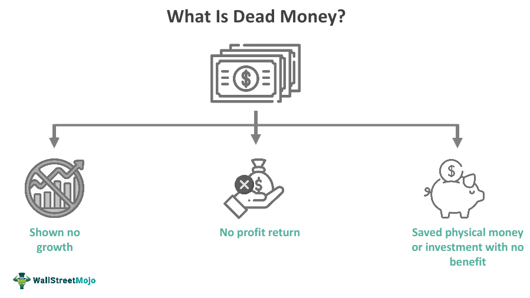

In today's complex financial landscape, understanding financial terms and implementing effective money management strategies are crucial for individual investors and traders. Navigating the intricate world of financial markets requires a firm grasp of key concepts that can significantly influence investment outcomes. This article aims to demystify key financial terms like 'dead money' and explore advanced concepts such as algorithmic trading and its money management implications.

'Dead money' refers to investments that languish without appreciable returns, acting as a potential drag on the overall performance of an investment portfolio. Recognizing and managing such investments is essential for maintaining portfolio vitality and achieving growth objectives. As we examine what constitutes 'dead money,' we will shed light on its impact on investment portfolios and discuss strategies for mitigating its effects.



Algorithmic trading, or algo trading, represents a cutting-edge approach to trading in which computer algorithms execute trades based on predefined criteria, often at speeds and frequencies impractical for human traders. Algo trading strategies can be optimized by incorporating robust money management principles, thus ensuring that investments remain aligned with an investor's financial goals and risk tolerance. Effective money management within algorithmic trading not only amplifies potential returns but also minimizes risks associated with market volatility.

Whether you're a novice trader or seasoned investor, grasping these concepts can lead to more informed financial decisions and improved portfolio performance. In a rapidly evolving financial ecosystem, understanding the interplay between traditional investment practices and modern technological advancements is indispensable. Let's begin by unpacking these terminologies and understanding how they interconnect in the broader financial ecosystem.

## Table of Contents

## Understanding Key Financial Terms

To navigate financial markets effectively, understanding key financial terms is critical as they directly impact investment strategies. One such term is "dead money," which refers to investments offering minimal or no returns over time. These investments can be detrimental to a portfolio's overall performance, as they occupy capital that could otherwise be allocated to more lucrative opportunities. Investments classified as dead money often stagnate, providing neither substantial income nor appreciation in value. Recognizing these investments involves careful performance analysis and market research, allowing investors to make more informed decisions about reallocating resources.

Another essential term is "money management," which encompasses the strategic methodologies used to optimize investments and safeguard capital, serving as a cornerstone for successful trading. Effective money management involves establishing clear financial goals, defining risk tolerance levels, and consistently evaluating investment performance. This approach not only aids in maximizing returns but also in minimizing losses, thereby preserving capital and ensuring long-term financial stability.

"Algorithmic trading" or "algo trading" utilizes automated systems to execute trades based on pre-defined criteria, leveraging data and mathematical models to enhance decision-making processes. The automation of trading strategies allows for rapid execution and eliminates human emotional biases, which can often cloud judgment and lead to suboptimal investing choices. Algo trading systems employ various strategies, including market-making, statistical arbitrage, and trend following, often requiring continuous refinement and backtesting to remain effective.

These financial terms—dead money, money management, and [algorithmic trading](/wiki/algorithmic-trading)—constitute the foundation of financial literacy. Mastery of these concepts empowers investors to craft strategies that are resilient to market fluctuations, enabling decisions driven by data and logic rather than emotions or market noise. Through understanding these terms, investors can achieve a more strategic allocation of resources and an improved portfolio performance, ultimately paving the way for more successful investment outcomes.

## Dead Money: Implications and Management

Dead money in an investment context denotes capital that is locked in assets generating minimal or no returns, adversely affecting the growth potential of an investment portfolio. This capital inertia can impede the overall performance and [liquidity](/wiki/liquidity-risk-premium) of an investor's assets.

To effectively manage dead money, investors must first recognize its characteristics. Common indicators include negligible price movement over extended periods, fundamental weaknesses in the underlying business or asset, and persistent underperformance relative to the market or sector benchmarks. Performance analysis and thorough market research are crucial in identifying such non-performing assets. Tools like earnings reports, price ratios, and historical performance reviews can provide insights into an asset's viability.

Once identified, managing dead money involves making strategic choices. The two primary approaches are divestment and portfolio restructuring. Divestment entails selling off non-performing investments to free up capital, which can then be reinvested into more promising ventures. Conversely, restructuring might involve reallocating investments within the portfolio to emphasize dynamic, income-generating assets. Diversification is a key tactic here; by spreading capital across various asset classes or sectors, investors can reduce the reliance on any single underperforming investment, thereby mitigating overall risk.

Even when dead money is identified, it may not always be wise to dispose of the asset immediately. In certain circumstances, particularly during market downturns, dead money can represent a potential buying opportunity. If there is a foreseeable path to recovery or if the asset’s fundamentals signal future improvement, holding or even increasing the position might yield long-term benefits.

In summary, the effective management of dead money requires vigilance in performance monitoring and the agility to adapt investment strategies. By maintaining a diversified portfolio and regularly reviewing asset performance, investors can minimize the adverse impacts of dead money and capitalize on opportunities for value recovery.

## Algo Trading: Strategies and Money Management

Algorithmic trading has fundamentally transformed the trading landscape, relying on cutting-edge technology to achieve speed and accuracy whilst minimizing the emotional biases typically associated with human trading decisions. By leveraging sophisticated mathematical models and high-speed data analysis, algorithmic trading enables traders to execute trades with unparalleled efficiency.

**Risk-Based Strategies**: In algorithmic trading, risk-based strategies focus on reducing potential losses by optimizing the size of traded positions and implementing stringent risk management rules. A common technique is the use of stop-loss orders, which automatically sell a security when it reaches a certain price, preventing further losses. This method ensures that traders maintain control over potential downfalls in volatile markets. For instance, if a stock is purchased at $100, a stop-loss order might be set at $95 to cap the maximum loss at 5%. This approach helps in safeguarding capital and maintaining financial stability.

**Yield-Based Strategies**: Yield-based strategies in algorithmic trading are centered around maximizing returns by employing complex algorithms to predict price movements and market trends. These strategies may incorporate advanced statistical methods and machine learning to analyze large datasets, identify patterns, and forecast future price changes. Python libraries such as NumPy and pandas are often utilized to handle quantitative analysis tasks, while scikit-learn and TensorFlow can be employed for building predictive models.

```python
import numpy as np
import pandas as pd
from sklearn.linear_model import LinearRegression

# Sample code for predicting future price using linear regression
data = pd.read_csv('market_data.csv')
X = data[['feature1', 'feature2', 'feature3']]
y = data['price']

model = LinearRegression()
model.fit(X, y)

# Predict future prices
future_prices = model.predict(new_data)
```

**Effective Money Management**: Effective money management within algorithmic trading requires a delicate balance between risk and reward. Traders must ensure they have sufficient capital to withstand market fluctuations while also maximizing potential profit opportunities. This involves setting appropriate position sizes based on risk tolerance and continuously refining algorithms through backtesting. Backtesting allows traders to simulate trading strategies using historical data, evaluating their performance and identifying areas for improvement.

```python
def backtest_strategy(data, strategy):
    # Example backtesting function for a given strategy
    initial_balance = 100000
    balance = initial_balance

    for index, row in data.iterrows():
        action = strategy(row)
        balance += execute_trade(action, row['price'])

    return balance - initial_balance

# Define a simple strategy
def strategy(data_row):
    if data_row['momentum'] > 0:
        return 'buy'
    else:
        return 'sell'
```

**For Novice Traders**: For beginners venturing into algorithmic trading, implementing a robust money management system is crucial for ensuring sustainable trading practices. Novice traders should focus on developing simple yet effective strategies, starting with smaller position sizes to limit exposure and gradually increasing complexity as they gain confidence and understanding. Additionally, continuous learning and adaptation are key, as the dynamic nature of financial markets demands constant evolution of trading strategies.

Algorithmic trading demands a methodical approach to risk management, integrating both technical and strategic expertise. By leveraging technology and data-driven insights, traders can achieve more consistent and sustainable outcomes.

## Identifying and Managing Dead Money in Algo Portfolios

Algorithmic trading portfolios are designed to exploit market inefficiencies through sophisticated algorithms, but over time, certain trading strategies may become less effective. This ineffectiveness, often termed "dead money," can lead to a significant drag on portfolio performance. Identifying and managing dead money is crucial to maintain capital efficiency and ensure consistent returns.

Regular evaluation of algo trading systems is essential for investors. This involves analyzing the performance metrics of individual algorithms to ensure they continue to meet expected return objectives. Algorithms that fail to perform due to changing market conditions or technological advancements may contribute to dead money. For example, a strategy designed for a specific market environment may falter if the market dynamics shift, such as a change in [volatility](/wiki/volatility-trading-strategies) patterns or liquidity structures.

Implementing dynamic risk management protocols can help mitigate the impact of dead money. This involves continuously monitoring risk metrics and adjusting strategies in response to market changes. Python libraries like NumPy and pandas can be used to conduct performance analyses and risk assessments efficiently. Below is a basic example of how one might identify underperforming strategies using Python:

```python
import numpy as np
import pandas as pd

# Sample portfolio performance data
data = {'Strategy': ['Strat_A', 'Strat_B', 'Strat_C'],
        'Returns': [0.02, -0.01, 0.005],
        'Benchmark_Returns': [0.015, 0.015, 0.015]}

df = pd.DataFrame(data)

# Identify dead money strategies with returns less than benchmark
dead_money = df[df['Returns'] < df['Benchmark_Returns']]
print(dead_money)
```

The integration of a systematic review process is another effective strategy for managing dead money. By setting up regular intervals for strategy assessment, investors can decide whether to refine existing algorithms, re-allocate resources to more promising strategies, or divest entirely from non-performing assets. This systematic approach ensures that the portfolio remains agile and responsive to new opportunities.

Moreover, a well-designed review mechanism facilitates the reallocation of capital from stagnant strategies to those with better growth prospects, preserving overall portfolio health. By leveraging real-time data analytics and [backtesting](/wiki/backtesting) tools, investors can optimize strategy selection and portfolio adjustments.

In conclusion, identifying and managing dead money in algo portfolios requires an ongoing commitment to performance evaluation and risk management, leveraging technology and data analytics to stay ahead in the competitive landscape of algorithmic trading.

## Conclusion and Future Prospects

Understanding and managing financial terms such as "dead money" alongside leveraging technology in algorithmic trading are crucial for achieving financial success in contemporary markets. As technology continues to advance, the integration of [artificial intelligence](/wiki/ai-artificial-intelligence) (AI) and [machine learning](/wiki/machine-learning) into algorithmic trading is set to offer more adaptive and efficient trading strategies. These technologies enable the analysis of large data sets to identify patterns and trends that may not be visible to human traders, thereby enhancing decision-making processes and execution speed.

Investors and traders need to stay informed of these technological advancements by continuously educating themselves and adapting their trading strategies. Engaging with educational resources, attending seminars, and participating in online courses are all effective ways to keep up-to-date with the latest developments. It is equally important for traders to refine their analytical skills and apply insights from data science into their trading models.

Effective money management remains a critical element of successful trading, allowing investments to endure market fluctuations and seize opportunities as they arise. Employing sound risk management techniques, such as setting clear stop-loss and take-profit levels, allows traders to protect their capital and optimize their portfolio performance. The application of diversification strategies also mitigates risk, fostering investment stability.

The future of trading lies in the balanced integration of technology, financial intelligence, and strategic money management. The symbiotic relationship between these elements will drive the evolution of trading practices, enabling investors to maintain a competitive edge. As markets and technologies evolve, remaining agile and informed will be key for traders and investors aiming to optimize their financial performance and achieve long-term success.

## References & Further Reading

[1]: Bergstra, J., Bardenet, R., Bengio, Y., & Kégl, B. (2011). ["Algorithms for Hyper-Parameter Optimization."](https://papers.nips.cc/paper/4443-algorithms-for-hyper-parameter-optimization) Advances in Neural Information Processing Systems 24.

[2]: ["Advances in Financial Machine Learning"](https://www.amazon.com/Advances-Financial-Machine-Learning-Marcos/dp/1119482089) by Marcos Lopez de Prado

[3]: ["Evidence-Based Technical Analysis: Applying the Scientific Method and Statistical Inference to Trading Signals"](https://www.amazon.com/Evidence-Based-Technical-Analysis-Scientific-Statistical/dp/0470008741) by David Aronson

[4]: ["Machine Learning for Algorithmic Trading"](https://github.com/stefan-jansen/machine-learning-for-trading) by Stefan Jansen

[5]: ["Quantitative Trading: How to Build Your Own Algorithmic Trading Business"](https://www.amazon.com/Quantitative-Trading-Build-Algorithmic-Business/dp/1119800064) by Ernest P. Chan