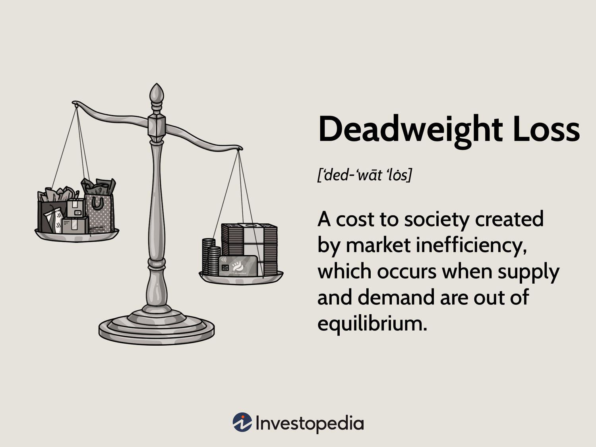

Understanding the concept of deadweight loss is crucial to grasping the complexities of market inefficiencies. Deadweight loss represents the loss of economic efficiency when supply and demand are out of balance, a common occurrence in today's markets. In an ideal market, resources are allocated in a manner where consumer and producer surplus are maximized, achieving what economists call Pareto efficiency. However, various factors such as taxes, price controls, and monopolistic practices can disturb this balance, resulting in deadweight loss.

Deadweight loss manifests when there are fewer transactions in the market than would occur in a perfectly competitive equilibrium. This inefficiency leads to a net loss in total social welfare since the benefits missed by not trading exceed the benefits accrued from the transactions that do take place. Mathematical representation often involves the calculation of the area between supply and demand curves that are left unrealized due to the intervention, depicted graphically as a triangle on a supply-demand graph.

The exploration of deadweight loss often focuses on how market interventions, such as price ceilings and taxation, create inefficiencies. Price ceilings, such as rent controls, can lead to housing shortages by setting prices below equilibrium, discouraging supply while increasing demand. Similarly, taxes increase the price paid by buyers and decrease the price received by sellers, thus reducing the number of transactions and creating a loss of consumer and producer surplus that we identify as deadweight loss.

In the context of modern financial markets, algorithmic trading plays a significant role. Algorithmic trading employs sophisticated algorithms to execute trades at high speed, potentially improving market efficiency by narrowing bid-ask spreads and increasing liquidity. However, it also carries risks such as flash crashes and market manipulation, which can exacerbate inefficiencies and contribute to deadweight loss.

Understanding the economic impacts of deadweight loss and the roles that interventions and technologies play is vital for assessing their broader implications on the economy. Algorithmic trading, in conjunction with regulatory frameworks, may either counteract or aggravate these inefficiencies. The subsequent sections of this article will explore these topics, highlighting areas where policy and technology intersect in the quest to minimize deadweight loss and promote economic welfare.

## Table of Contents

## Understanding Deadweight Loss

Deadweight loss occurs when resources are not allocated efficiently within a market, generally due to interventions or market structures that disrupt the natural balance of supply and demand. Market control measures such as price controls, taxes, and monopolistic practices are primary contributors to this inefficiency.

Price controls, including price ceilings and floors, disrupt the natural equilibrium. For example, a price ceiling set below the equilibrium price leads to increased demand but decreased supply, resulting in a shortage. Conversely, a price floor above the equilibrium price results in reduced demand and a surplus of goods.

Taxes introduce distortions by increasing the price of goods, effectively reducing consumption and production. This scenario shifts the supply or demand curve, depending on who bears the tax burden, leading to a decline in the overall market equilibrium quantity and creating a gap, or deadweight loss, between the quantity supplied and the quantity demanded at the taxed price level.

Monopolistic practices also contribute to deadweight loss by restricting output to maximize profits, thereby keeping prices higher than they would be in a competitive market. This restriction lowers consumer surplus as consumers face higher prices and fewer choices, and although the monopoly may gain in producer surplus, the overall social surplus is diminished.

Mathematically, deadweight loss can be represented as the loss in total surplus but is more visually intuitive in a supply and demand graph, where it appears as the area of a triangle formed by the supply and demand curves and the quantity axis. The triangle area illustrates the quantity of resources underutilized or misallocated due to market inefficiencies.

Understanding deadweight loss is central to diagnosing inefficiencies in markets and finding areas for improvement to achieve equilibrium. It serves as a benchmark for economists and policymakers to identify the societal costs imposed by inefficiencies. Recognizing the presence and implications of deadweight loss enables more informed decision-making aimed at enhancing economic welfare and achieving market efficiencies.

## Market Inefficiencies and Their Causes

Market inefficiencies arise from various economic interventions such as price ceilings, price floors, taxes, and monopolistic practices. These factors often disrupt the natural equilibrium of markets, where supply meets demand at an optimal price point, leading to an inefficient allocation of resources.

Price ceilings are restrictions that cap the maximum price that can be charged for a good or service. A common example is rent control, where regulations limit the rent landlords can charge tenants. Although intended to make housing more affordable, price ceilings can lead to shortages. As the price is kept artificially low, the quantity demanded increases, while the quantity supplied decreases, creating a gap that results in a shortage of housing.

Conversely, price floors set a minimum price for goods or services. A notable example is the minimum wage law, which stipulates the lowest hourly wage that employers can legally pay their workers. While aimed at ensuring fair wages, price floors can lead to surpluses in the labor market. When the minimum wage is set above the equilibrium wage, the quantity of labor supplied exceeds the quantity demanded, potentially resulting in unemployment, especially among low-skilled workers.

Taxation is another source of market inefficiency. By imposing taxes, governments increase the cost of goods and services, which typically reduces consumption. This leads to a decrease in both consumer and producer surplus, causing a societal welfare loss known as deadweight loss. The extent of the distortion depends on the elasticity of supply and demand; more elastic markets tend to experience larger inefficiencies due to taxation.

Monopolies or oligopolies also contribute to market inefficiencies by restricting output to raise prices, resulting in a reduction of consumer surplus and overall economic welfare. Monopolistic practices create barriers to entry, limit competition, and can lead to resource misallocation as these entities have the power to dictate prices rather than letting competitive market forces reach an equilibrium.

Understanding these forms of inefficiency is crucial for policymakers attempting to rectify market imbalances. Effective interventions require a careful analysis of the market conditions, the elasticity of demand and supply, and the potential impacts of different policy measures on economic welfare. By addressing these inefficiencies, governments and institutions can work towards more efficient markets and improved social welfare.

## The Role of Algorithmic Trading

Algorithmic trading utilizes sophisticated algorithms to execute trades at rapid speeds and large volumes, significantly influencing market dynamics. These algorithms analyze market data, detect trading signals, and execute buy or sell orders in fractions of a second, often outperforming human traders in both speed and efficiency. By automating trading processes, [algorithmic trading](/wiki/algorithmic-trading) can enhance market efficiency, particularly by narrowing bid-ask spreads. This reduction in spreads lowers transaction costs for all market participants and enhances [liquidity](/wiki/liquidity-risk-premium), leading to a more efficient market environment.

However, the rapid execution capabilities of algorithmic trading also entail substantial risks. One notable risk is the potential for flash crashes, where markets experience extreme [volatility](/wiki/volatility-trading-strategies) within a very short time frame. Flash crashes can be triggered by algorithmic strategies such as high-frequency trading, which rely on speed advantages to capitalize on minute price discrepancies. These volatile events underscore the vulnerability of markets to sudden, large-scale fluctuations, contributing to instability.

Moreover, algorithmic trading systems, if poorly designed or unchecked, may engage in market manipulation. Strategies like quote stuffing or layering can create artificial market activity, misleading participants and potentially leading to inefficient market outcomes. Both flash crashes and market manipulation illustrate how algorithmic trading might exacerbate inefficiencies and generate deadweight loss, disrupting the balance of supply and demand.

The complex relationship between algorithmic trading and deadweight loss reflects both the potential benefits and challenges within financial markets. By improving price discovery mechanisms and market liquidity, algorithmic trading can mitigate certain inefficiencies, reducing the gap between the actual market conditions and the ideal market equilibrium. Conversely, the creation of artificial demand or supply through manipulative practices can lead to market distortions, increasing deadweight loss.

Given the dual nature of its impact, the regulation of algorithmic trading is crucial. Effective regulatory measures can help mitigate risks while enabling the advantageous aspects of these trading systems. Strategies include implementing circuit breakers to manage abrupt market movements and enhancing transparency requirements to deter manipulative practices. By striking a balance, regulators aim to foster a secure and competitive trading environment that maximizes the efficiency benefits of algorithmic trading while minimizing its potential for harm.

## Examples of Deadweight Loss in Practice

The implementation of various economic policies often leads to deadweight loss, a scenario where the equilibrium between supply and demand is disturbed, resulting in inefficiencies in the market. One prevalent example of this is the imposition of a sales tax. When a sales tax is introduced, the cost of goods increases, thereby discouraging consumption. As the price paid by consumers rises, the demand for these goods typically declines, leading to unsold inventory. This scenario is reflected in the standard supply and demand model where a tax causes the supply curve to shift upwards (or demand curve downwards), creating a wedge between what consumers pay and what producers receive. Consequently, the quantity of goods traded in the market decreases, creating a deadweight loss represented by the area between the demand and supply curves, known as the Harberger triangle.

Rent controls are another significant contributor to deadweight loss. When a cap is placed on the rents that landlords can charge, it often leads to a housing shortage. The controlled price usually falls below the market equilibrium level, causing a higher quantity demanded than supplied. This misalignment ultimately results in reduced incentives for landlords to rent out properties or invest in maintenance, deteriorating the quality and availability of housing over time. The difference between the lower controlled price and the higher equilibrium price results in a deadweight loss, as the transaction quantities are reduced from what they could have been in an unrestricted market.

Similarly, minimum wage laws, intended to ensure fair earnings for low-skilled workers, can paradoxically lead to unemployment within this demographic. By setting a floor on wages that is above the equilibrium level, employers might respond by hiring fewer workers to curb labor costs. This creates a surplus in the labor market, where the quantity of labor supplied by workers exceeds the quantity demanded by employers. The classical supply and demand framework demonstrates this inefficiency as a deadweight loss, leading to fewer job opportunities than in the absence of the minimum wage regulation.

Understanding these examples provides critical insights into how deadweight loss manifests in realistic settings, impacting prices and traded quantities. By scrutinizing these conditions, economists can develop strategies to address and minimize deadweight loss, potentially proposing policies that adjust tax levels, remove price controls, or provide compensation mechanisms to realign supply and demand more efficiently.

## Mitigating Deadweight Loss through Policy

Efficient market policies play a critical role in minimizing deadweight loss by ensuring that supply and demand are well-aligned. Government interventions, such as subsidies, tax credits, and flexible pricing policies, are instrumental in addressing market inefficiencies. Subsidies can lower the cost of production or consumption, encouraging higher levels of output and demand. For example, subsidies for renewable energy sources can make them more competitive against fossil fuels, aligning market prices more closely with true production costs and mitigating deadweight loss caused by environmental externalities.

Tax credits can also incentivize businesses and consumers to engage in certain economic activities, effectively reducing tax burdens and promoting welfare-enhancing behaviors. Flexible pricing policies allow markets to better adjust to changes in supply and demand conditions, reducing the likelihood of shortages or surpluses that contribute to deadweight loss.

Promoting competitive markets is essential for reducing deadweight loss. High levels of competition prevent monopolistic practices that can lead to inefficient pricing and allocation of resources. Reducing barriers to entry, such as excessive regulation or tariffs, fosters a competitive environment where innovation thrives, costs are lowered, and markets operate more efficiently. This aligns producers' and consumers' interests, reducing the disparity between the quantities supplied and demanded.

The utilization of technology and data analytics provides an enhanced framework for optimizing market policies. Advanced analytics can identify inefficiencies within markets, allowing policymakers to make informed decisions based on real-time data. For instance, predictive analytics can forecast potential mismatches in supply and demand, enabling preemptive policy adjustments to avoid deadweight loss.

Policymakers who understand and apply these principles can significantly boost economic efficiency and societal welfare. By leveraging a combination of governmental interventions, competitive market promotion, and cutting-edge technology, significant strides can be made in aligning supply with demand, thereby minimizing deadweight loss and enhancing overall economic equilibrium.

## Conclusion

Deadweight loss poses a significant barrier to achieving optimal market efficiency and improving economic welfare. Identifying and understanding the causes and impacts of deadweight loss, such as price controls, taxes, and monopolistic practices, is crucial for crafting effective policy interventions. These inefficiencies lead to a reduction in total social surplus, affecting both consumer and producer surplus.

Algorithmic trading, powered by advanced algorithms and high-frequency techniques, can potentially serve as a tool for enhancing market efficiency by narrowing bid-ask spreads. However, it also brings challenges, including flash crashes and market manipulation risks. These activities highlight the necessity for careful regulation to mitigate adverse effects while capitalizing on the efficiency gains algorithmic trading can offer.

Addressing deadweight loss requires a balanced approach that incorporates both technological advancements and strategic policy solutions. Efficient market policies, such as subsidies and tax credits, alongside fostering competitive markets, can help align supply and demand, thereby minimizing inefficiencies. Additionally, leveraging technology and data analytics can provide valuable insights into optimizing these market strategies.

Ongoing research and innovation are essential as we adapt to the rapidly changing financial landscape. Understanding these dynamics is vital to reducing deadweight loss and fostering a more efficient and equitable economy. By continuously exploring and implementing innovative solutions, policymakers can navigate these complexities and enhance overall economic welfare.

## References & Further Reading

[1]: Pindyck, R. S., & Rubinfeld, D. L. (2013). *Microeconomics*. Pearson Education. [Link to book](https://archive.org/details/microeconomics0007pind)

[2]: Harberger, A. C. (1964). "The Measurement of Waste." *The American Economic Review*, 54(3), 58-76. [JSTOR link](https://www.jstor.org/stable/1818490)

[3]: De Long, J. B., Shleifer, A., Summers, L. H., & Waldmann, R. J. (1990). "Noise Trader Risk in Financial Markets." *The Journal of Political Economy*, 98(4), 703-738. [Link to article](https://www.semanticscholar.org/paper/Noise-Trader-Risk-in-Financial-Markets-Long-Shleifer/5add0432dcc9b8cd180e8fa510105e0870dc2a8f)

[4]: Haldane, A. G., & May, R. M. (2011). "Systemic risk in banking ecosystems." *Nature*, 469(7330), 351-355. [DOI link](https://www.nature.com/articles/nature09659)

[5]: Lopez de Prado, M. (2018). *Advances in Financial Machine Learning*. Wiley. [Link to book](https://books.google.com/books/about/Advances_in_Financial_Machine_Learning.html?id=oU9KDwAAQBAJ)