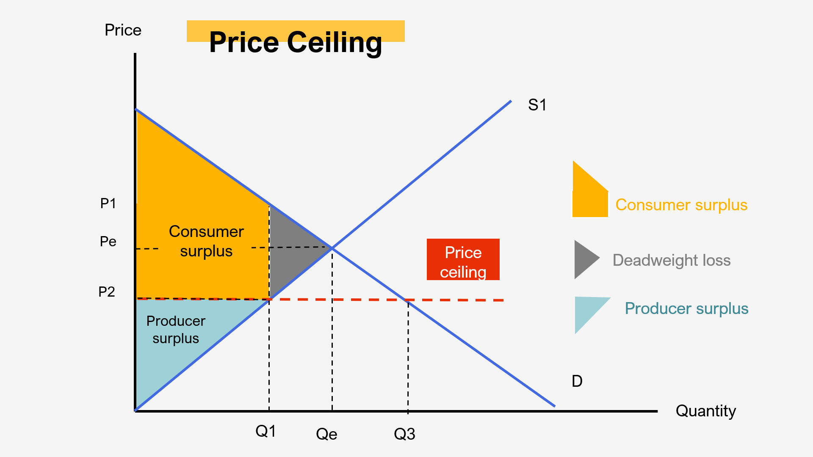

## Table of Contents

## What is deadweight loss?

Deadweight loss is a term used in economics to describe the loss of economic efficiency that happens when the market is not working as well as it could. It's like a waste of resources because the market isn't matching up buyers and sellers in the best way possible. This can happen for many reasons, like when the government puts a tax on something or sets a price that's too high or too low.

For example, imagine if the government decided to put a tax on chocolate. This tax would make chocolate more expensive, so some people who really like chocolate might decide not to buy it anymore because it's too pricey. At the same time, chocolate makers might not sell as much chocolate as they could if there was no tax. The difference between what could have been sold and what actually gets sold because of the tax is the deadweight loss. It's the missed chance for both buyers and sellers to be happier and for the economy to work better.

## How does deadweight loss occur in a market?

Deadweight loss happens in a market when something stops it from working as smoothly as it could. This usually happens because of things like taxes, price controls, or monopolies. When there's a tax on a product, it makes the product more expensive for buyers. Because of this, some people who would have bought the product at a lower price decide not to buy it anymore. At the same time, sellers might not sell as much of the product because fewer people are buying it. The difference between what could have been bought and sold without the tax, and what actually gets bought and sold, is the deadweight loss.

Another way deadweight loss can happen is through price controls, like when the government sets a maximum price for something. If the government says that a product can't be sold for more than a certain price, it might be lower than what sellers need to make a profit. Because of this, sellers might not want to sell as much of the product, and buyers might want to buy more than what's available. This creates a shortage, and the difference between the amount that could have been sold at a fair price and the amount that actually gets sold is the deadweight loss. In both cases, the market isn't working as well as it could, and some potential gains for both buyers and sellers are lost.

## What are the common causes of deadweight loss?

Deadweight loss happens when the market doesn't work as well as it could. One common cause is taxes. When the government puts a tax on something, it makes that thing more expensive for buyers. Because of this, some people who would have bought it at a lower price might decide not to buy it anymore. Sellers might also sell less because fewer people are buying. The difference between what could have been bought and sold without the tax, and what actually gets bought and sold, is the deadweight loss.

Another common cause is price controls. These are when the government sets a maximum or minimum price for something. If there's a maximum price, it might be too low for sellers to make a profit, so they might not want to sell as much. This can create a shortage because buyers want to buy more than what's available. The difference between what could have been sold at a fair price and what actually gets sold is the deadweight loss. In both cases, the market isn't working as well as it could, and some potential gains for both buyers and sellers are lost.

## Can you explain deadweight loss using a supply and demand graph?

Imagine a graph with two lines: one for supply and one for demand. The supply line shows how much of a product sellers are willing to sell at different prices. The demand line shows how much buyers want to buy at different prices. These two lines cross at a point called the equilibrium, where the amount sellers want to sell matches the amount buyers want to buy. This is where the market works best, with no deadweight loss.

Now, let's say the government puts a tax on the product. This shifts the supply line up because sellers need to charge more to cover the tax. The new equilibrium happens at a higher price and a lower quantity than before. The area between the old and new supply lines, and between the old quantity and the new quantity, is the deadweight loss. It shows the lost potential for buyers and sellers because of the tax. The market isn't working as well as it could, and some trades that would have made both buyers and sellers happier don't happen.

## How does taxation lead to deadweight loss?

When the government puts a tax on a product, it makes that product more expensive for buyers. Because of the higher price, some people who would have bought the product at a lower price might decide not to buy it anymore. At the same time, sellers might not sell as much of the product because fewer people are buying it. The tax creates a gap between what buyers are willing to pay and what sellers are willing to accept, which means some trades that could have happened don't happen.

This gap is what we call deadweight loss. It's the difference between the amount of the product that could have been bought and sold without the tax, and the amount that actually gets bought and sold with the tax. The market isn't working as well as it could, and some potential gains for both buyers and sellers are lost. The deadweight loss shows the missed opportunity for the market to be more efficient and for everyone to be happier with more trades happening.

## What is the impact of price controls on deadweight loss?

Price controls can cause deadweight loss by messing up the balance between what buyers want to buy and what sellers want to sell. If the government sets a maximum price for a product, it might be lower than what sellers need to make a profit. Because of this, sellers might not want to sell as much of the product. At the same time, buyers might want to buy more than what's available at the lower price. This creates a shortage, and the difference between the amount that could have been sold at a fair price and the amount that actually gets sold is the deadweight loss.

On the other hand, if the government sets a minimum price for a product, it might be higher than what buyers are willing to pay. Because of this, buyers might not want to buy as much of the product. Sellers might want to sell more than what buyers are willing to buy at the higher price. This creates a surplus, and again, the difference between the amount that could have been sold at a fair price and the amount that actually gets sold is the deadweight loss. In both cases, the market isn't working as well as it could, and some potential trades that would make both buyers and sellers happier don't happen.

## How can monopolies contribute to deadweight loss?

A monopoly happens when one company is the only one selling a certain product or service. When this happens, the company can set the price higher than it would be if there were other companies competing. Because the price is higher, some people who would have bought the product at a lower price might decide not to buy it anymore. This means that the amount of the product sold is less than it could be if there were more competition. The difference between the amount that could have been sold at a lower price and the amount that actually gets sold at the higher price is the deadweight loss. It shows the missed chance for buyers and sellers to be happier because the market isn't working as well as it could.

The monopoly can also choose to produce less of the product to keep the price high. By doing this, they make more money because they're selling fewer products at a higher price. But this also means that some people who really want the product can't buy it because there isn't enough to go around. The deadweight loss in this case is the value of the extra products that could have been made and sold if the market had more competition, but aren't because the monopoly wants to keep prices high. This shows how a monopoly can make the market less efficient and cause some potential gains for both buyers and sellers to be lost.

## What are the economic implications of deadweight loss for society?

Deadweight loss means the economy is not working as well as it could. When there's a deadweight loss, some people who want to buy things can't because the price is too high, and some people who want to sell things don't because they can't get a good enough price. This means that both buyers and sellers miss out on chances to be happier and make or save more money. The overall result is that the economy is less efficient, and there's less money and happiness going around than there could be.

This inefficiency can have big effects on society. For example, if there's a tax on something important like medicine, some people might not be able to afford it, even though they really need it. This can make them sicker and less able to work, which is bad for them and for the economy. Also, if a company has a monopoly and keeps prices high, it can mean that people have less money to spend on other things they need or want. This can slow down the whole economy and make life harder for a lot of people.

## How can policies be designed to minimize deadweight loss?

Policies can be designed to minimize deadweight loss by making sure markets work as well as they can. One way to do this is by keeping taxes low on things that people really need or use a lot. If taxes are too high, people might stop buying those things, which can cause deadweight loss. Instead of high taxes, the government could find other ways to make money, like taxing things that don't affect the market as much, or using other kinds of fees. This way, the market can keep working well, and there's less deadweight loss.

Another way to minimize deadweight loss is by not using price controls too much. Price controls, like setting a maximum or minimum price for something, can mess up the balance between what buyers want to buy and what sellers want to sell. Instead of price controls, the government could help markets work better by making sure there's enough competition. This means making sure there aren't too many monopolies, which can keep prices high and cause deadweight loss. By encouraging competition, more people can buy and sell things at fair prices, and the market can work more efficiently, reducing deadweight loss.

## What are the quantitative methods used to measure deadweight loss?

To measure deadweight loss, economists often use supply and demand graphs. They look at the area between the supply and demand curves where trades don't happen because of things like taxes or price controls. This area is the deadweight loss. For example, if there's a tax on a product, the supply curve shifts up, and the new equilibrium is at a higher price and lower quantity. The deadweight loss is the area between the old and new supply curves, from the old quantity to the new quantity. This area shows the value of the trades that could have happened but didn't because of the tax.

Another way to measure deadweight loss is by using formulas that look at how much the quantity of a product changes when there's a tax or price control. Economists use numbers like the price elasticity of demand and supply to figure out how sensitive buyers and sellers are to changes in price. By knowing these numbers, they can calculate how much the quantity bought and sold changes, and then figure out the deadweight loss. This method helps them understand how big the deadweight loss is and how it affects the market.

## How does deadweight loss affect economic efficiency and welfare?

Deadweight loss makes the economy less efficient. It happens when the market doesn't work as well as it could because of things like taxes, price controls, or monopolies. When there's a deadweight loss, some people who want to buy things can't because the price is too high, and some people who want to sell things don't because they can't get a good enough price. This means that both buyers and sellers miss out on chances to be happier and make or save more money. The overall result is that the economy is less efficient, and there's less money and happiness going around than there could be.

Deadweight loss also affects the welfare of society. When the market is not working well, it can make life harder for a lot of people. For example, if there's a tax on something important like medicine, some people might not be able to afford it, even though they really need it. This can make them sicker and less able to work, which is bad for them and for the economy. Also, if a company has a monopoly and keeps prices high, it can mean that people have less money to spend on other things they need or want. This can slow down the whole economy and make life harder for everyone.

## Can you discuss any real-world examples where deadweight loss has been significant?

One real-world example of significant deadweight loss is the high taxes on cigarettes in many countries. Governments put high taxes on cigarettes to try to get people to smoke less because smoking is bad for health. But these high taxes make cigarettes a lot more expensive. Because of this, some people who would have bought cigarettes at a lower price decide not to buy them anymore. This means that the government doesn't get as much money from the tax as it could, and some people who really want cigarettes can't buy them. The difference between what could have been bought and sold without the high tax, and what actually gets bought and sold, is the deadweight loss. It shows the missed chance for both buyers and sellers to be happier because the market isn't working as well as it could.

Another example is rent control in cities like New York. The government sets a maximum price for rent to help people afford to live there. But this can cause deadweight loss. Because the rent is lower than what landlords need to make a profit, they might not want to rent out their apartments. At the same time, more people want to live in these apartments because the rent is cheaper. This creates a shortage of apartments, and some people who really need a place to live can't find one. The difference between the number of apartments that could have been rented out at a fair price and the number that actually get rented out is the deadweight loss. It shows how the market isn't working as well as it could, and some potential gains for both landlords and renters are lost.

## References & Further Reading

[1]: Pindyck, R. S., & Rubinfeld, D. L. (2013). *Microeconomics*. Pearson Education. [Link to book](https://archive.org/details/microeconomics0007pind)

[2]: Harberger, A. C. (1964). "The Measurement of Waste." *The American Economic Review*, 54(3), 58-76. [JSTOR link](https://www.jstor.org/stable/1818490)

[3]: De Long, J. B., Shleifer, A., Summers, L. H., & Waldmann, R. J. (1990). "Noise Trader Risk in Financial Markets." *The Journal of Political Economy*, 98(4), 703-738. [Link to article](https://www.semanticscholar.org/paper/Noise-Trader-Risk-in-Financial-Markets-Long-Shleifer/5add0432dcc9b8cd180e8fa510105e0870dc2a8f)

[4]: Haldane, A. G., & May, R. M. (2011). "Systemic risk in banking ecosystems." *Nature*, 469(7330), 351-355. [DOI link](https://www.nature.com/articles/nature09659)

[5]: Lopez de Prado, M. (2018). *Advances in Financial Machine Learning*. Wiley. [Link to book](https://books.google.com/books/about/Advances_in_Financial_Machine_Learning.html?id=oU9KDwAAQBAJ)