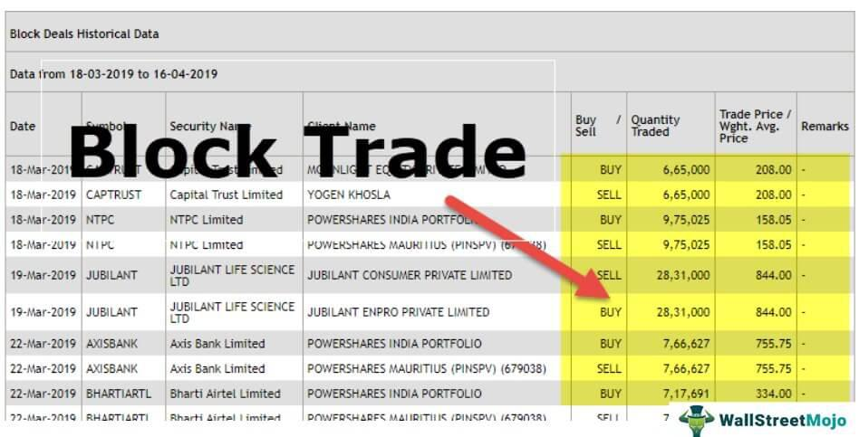

## Table of Contents

## What is a deal slip?

A deal slip is a document used in business to record the details of a transaction or agreement. It helps keep track of important information like the date, the people involved, what was bought or sold, and how much it cost. Think of it like a simple note that helps everyone remember what was agreed upon.

Using a deal slip can make things easier and clearer for everyone involved. It reduces the chance of misunderstandings or forgetting important details. Whether it's for buying office supplies or making a big sale, having a deal slip can help keep everything organized and smooth.

## What is the primary function of a deal slip?

The main job of a deal slip is to write down all the important details of a business deal. It helps everyone remember what was agreed upon, like who was involved, what was bought or sold, how much it cost, and when it happened. By having all this information in one place, it makes sure that everyone understands the deal the same way.

Using a deal slip helps prevent mix-ups and keeps things organized. It's like a quick note that everyone can look at to make sure they're on the same page. This is really helpful in business because it makes dealing with each other easier and keeps everything running smoothly.

## How does a deal slip differ from other financial documents?

A deal slip is different from other financial documents because it's simple and focuses on recording the basic details of a single transaction or agreement. Unlike a detailed invoice that lists all the items, quantities, and prices, a deal slip just captures the essentials like who was involved, what was agreed upon, and how much it cost. It's like a quick note to keep everyone on the same page about a deal.

On the other hand, documents like balance sheets or income statements give a broader view of a company's financial health. They show things like total assets, liabilities, and profits over time, not just one deal. A deal slip doesn't go into this level of detail; it's just about that one specific transaction. So, while other financial documents are used for big-picture financial analysis, a deal slip is all about the nitty-gritty of individual deals.

## Who typically uses deal slips?

Deal slips are commonly used by people in sales and business. They help salespeople keep track of what they've sold and to whom. When a salesperson makes a deal, they can quickly write down the details on a deal slip. This makes it easy for them to remember everything about the deal, like the customer's name, what was sold, and how much it cost. It's a simple way to keep things organized and clear.

Business owners and managers also use deal slips. They need to know what's happening with sales and transactions in their company. By looking at deal slips, they can see who is buying their products or services and how much money is coming in. This helps them make decisions about their business, like what to sell more of or how to improve their sales process. Deal slips make it easier for everyone in the business to stay on the same page.

## What information is usually included on a deal slip?

A deal slip usually includes the date when the deal was made. It also has the names of the people or companies involved in the deal. This helps everyone remember who made the agreement. The deal slip also writes down what was bought or sold. This could be a product, a service, or something else that was part of the deal.

Another important thing on a deal slip is the price. It shows how much money was paid for what was bought or sold. Sometimes, it might also include any special terms or conditions that were agreed upon. This makes sure everyone understands exactly what the deal is about. By having all this information in one place, a deal slip helps keep everything clear and organized.

## How is a deal slip processed in a financial institution?

When a deal slip comes into a financial institution, it starts with someone, like a bank teller or a customer service representative, looking at it. They check to make sure all the important details are there, like the date, the people involved, what was bought or sold, and the price. If everything looks good, they might enter the information into the bank's computer system. This helps keep track of the deal and makes sure it's recorded correctly.

After the deal slip is entered into the system, it goes to another part of the bank where people check it again. They make sure the deal fits with the bank's rules and that the money part of the deal is handled right. If everything is okay, the deal is finalized, and the money moves where it needs to go. If there's a problem, they might send the deal slip back to be fixed before it can be completed. This way, the bank keeps everything organized and makes sure the deal is done correctly.

## Can deal slips be used for both buying and selling transactions?

Yes, deal slips can be used for both buying and selling transactions. When you buy something, a deal slip helps you remember what you bought, how much you paid, and who you bought it from. It's a quick way to keep track of your purchase so you don't forget any important details.

When you're selling something, a deal slip works the same way. It records who bought your product or service, what they bought, and how much they paid. This helps you keep your sales organized and makes sure you and the buyer agree on everything. So, whether you're buying or selling, a deal slip is a useful tool to keep things clear and simple.

## What are the security features of a deal slip?

Deal slips usually have some security features to make sure they are safe and real. One common feature is special paper that is hard to copy. This paper might have watermarks or tiny fibers that you can see when you hold it up to the light. Another feature is a unique number or code on each deal slip. This helps keep track of each slip and makes it harder for someone to make a fake one.

Some deal slips also have special inks that change color or disappear if someone tries to change the writing on the slip. This helps stop people from changing the details of the deal after it's been made. These security features help make sure that the deal slip is trusted and that the information on it stays correct and safe.

## How have deal slips evolved with digital technology?

Deal slips have changed a lot because of digital technology. Before, they were just pieces of paper where people wrote down the details of a deal. Now, with computers and smartphones, deal slips can be made and sent digitally. This means you can fill out a deal slip on a computer or phone and send it to someone else right away. It's faster and easier than writing it by hand and mailing it. Plus, digital deal slips can be saved on a computer, so they're not easy to lose like paper ones.

Digital deal slips also have other cool features. They can be connected to other computer systems, like a company's sales or accounting software. This makes it easier to keep track of deals and see how much money is coming in and going out. Some digital deal slips even have special security features, like passwords or codes, to make sure only the right people can see or change them. This helps keep the information safe and makes the whole process of making and handling deals smoother and more secure.

## What are the common mistakes to avoid when filling out a deal slip?

When filling out a deal slip, one common mistake to avoid is leaving out important information. Make sure to include the date, the names of everyone involved, what was bought or sold, and the price. Missing any of these details can cause confusion later on. Another mistake is writing things down wrong. Double-check the numbers and names to make sure they are correct. If the information is wrong, it can lead to problems with the deal.

Another common error is not being clear about the terms of the deal. If there are special conditions or agreements, write them down clearly so everyone understands. Sometimes people also forget to sign the deal slip, which is important to show that everyone agrees to the deal. By avoiding these mistakes, you can make sure the deal slip is useful and helps keep everything organized and clear.

## How does the use of deal slips comply with financial regulations?

Deal slips help businesses follow financial rules by keeping a clear record of each deal. When a deal slip is filled out correctly, it shows all the important details like who was involved, what was bought or sold, how much it cost, and when it happened. This makes it easier for companies to follow laws about keeping good records. Financial regulators often check these records to make sure businesses are doing things the right way. By using deal slips, companies can show that they are following the rules and being honest about their deals.

Sometimes, deal slips need to meet specific rules set by financial authorities. For example, they might need to have certain security features to stop fraud, or they might need to be kept for a certain amount of time. Companies have to make sure their deal slips follow these rules so they don't get in trouble. Using deal slips the right way helps businesses stay on the good side of financial regulations and keeps their deals clear and trustworthy.

## What are the future trends for deal slips in the financial industry?

In the future, deal slips in the financial industry are likely to become even more digital. Instead of using paper, more and more businesses will use apps and computer programs to make and send deal slips. This will make things faster and easier because you can fill out a deal slip on your phone or computer and send it to someone else right away. Digital deal slips can also connect to other computer systems, like a company's sales or accounting software, which helps keep everything organized and up-to-date.

Another trend we might see is the use of new technology like blockchain to make deal slips more secure. Blockchain is a way to keep records that is very hard to change or fake. By using blockchain, deal slips can be even safer and more trusted. This could help stop fraud and make sure that the information on the deal slip stays correct. As technology keeps getting better, deal slips will probably keep changing to be more digital, secure, and easy to use.

## What is the importance of deal slips in algorithmic trading?

In algorithmic trading, deal slips serve as a fundamental component, offering a structured framework for analyzing transaction flows and understanding trading patterns. Their role in this context extends beyond mere record-keeping; they are vital for developing and refining advanced trading algorithms. By maintaining an accurate historical record of transactions, deal slips provide a rich dataset for back-testing strategies and enhancing predictive analytics. This historical data allows traders and algorithms to identify trends and make informed decisions based on past behaviors.

Predictive analytics, a cornerstone of algorithmic trading, benefits immensely from the detailed information contained within deal slips. For instance, by analyzing past transaction data, traders can model price movement patterns using statistical methods or [machine learning](/wiki/machine-learning) algorithms. These models can be expressed mathematically, perhaps by employing regression analysis or time series forecasting. Consider a simple linear regression model, which could be represented as:

$$

y = \beta_0 + \beta_1 x_1 + \beta_2 x_2 + \dots + \beta_n x_n + \epsilon 
$$

where $y$ represents the dependent variable, such as future price, while $x_1, x_2, \ldots, x_n$ represent independent variables derived from historical transaction data recorded on deal slips, such as volume or price changes.

Furthermore, the transition from paper-based to electronic deal slips significantly enhances the efficiency and speed of recording transactions, aligning with the fast-paced nature of algorithmic trading. The digitalization of these documents supports real-time data analysis and reduces the latency often associated with manual record-keeping. Automated systems can quickly generate, store, and retrieve electronic deal slips, facilitating quicker decision-making processes. This automation is crucial in high-frequency trading environments where the rapid execution and reconciliation of trades are essential for capitalizing on market opportunities.

Python, as a popular programming language for data analysis, offers various libraries like pandas for handling transaction data efficiently. A simple Python snippet for reading and analyzing transaction data from electronic deal slips might look like this:

```python
import pandas as pd

# Load transaction data from a CSV file (representing the digital deal slips)
transaction_data = pd.read_csv('deal_slips.csv')

# Perform basic analysis
transaction_summary = transaction_data.describe()

print(transaction_summary)
```

In this example, the digital format allows for efficient data manipulation and analysis, essential for developing robust trading algorithms. By incorporating deal slips into their framework, algorithmic trading systems can leverage comprehensive transaction data to optimize strategies and improve market predictions. Ultimately, as technology continues to evolve, the importance of deal slips in fostering transparency, precision, and strategic insights in algorithmic trading will only grow.

## References & Further Reading

[1]: ["Advances in Financial Machine Learning"](https://www.amazon.com/Advances-Financial-Machine-Learning-Marcos/dp/1119482089) by Marcos Lopez de Prado

[2]: ["Evidence-Based Technical Analysis: Applying the Scientific Method and Statistical Inference to Trading Signals"](https://www.amazon.com/Evidence-Based-Technical-Analysis-Scientific-Statistical/dp/0470008741) by David Aronson

[3]: ["Machine Learning for Algorithmic Trading"](https://github.com/stefan-jansen/machine-learning-for-trading) by Stefan Jansen

[4]: ["Quantitative Trading: How to Build Your Own Algorithmic Trading Business"](https://www.amazon.com/Quantitative-Trading-Build-Algorithmic-Business/dp/1119800064) by Ernest P. Chan

[5]: Hull, J. C. (2018). ["Options, Futures, and Other Derivatives."](https://www.semanticscholar.org/paper/Options%2C-Futures%2C-and-Other-Derivatives-Hull/89bdee500c8623864fc9eb7a471546aa713acc44) Pearson Education.

[6]: Narang, R. K. (2013). ["Inside the Black Box: A Simple Guide to Quantitative and High Frequency Trading."](https://onlinelibrary.wiley.com/doi/book/10.1002/9781118662717) Wiley Finance.

[7]: Aldridge, I. (2013). ["High-Frequency Trading: A Practical Guide to Algorithmic Strategies and Trading Systems."](https://www.tradebit.com/usr/ledsin/pub/9003/_excerpt_High-frequencyTrading.pdf) Wiley Trading.