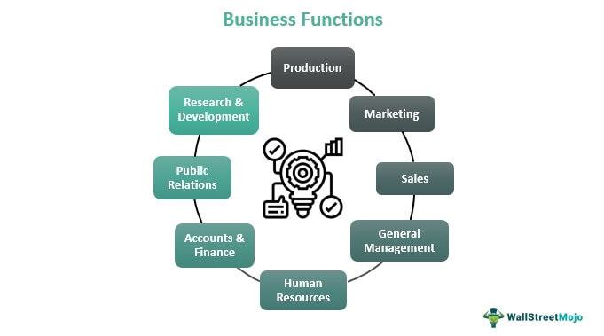

The financial market is a multifaceted ecosystem encompassing an array of documentation processes that ensure seamless and efficient trading activities. Central to this ecosystem is the deal ticket, alternatively known as a trading ticket, playing an essential role in the documentation of trades within the financial sector, including the rapidly evolving field of algorithmic trading.

Deal tickets serve as fundamental records that encapsulate the specifics of each financial transaction. They ensure that all pertinent details—from the execution of the trade to the price, volume, and parties involved—are accurately recorded. This meticulous documentation is pivotal for maintaining the integrity and transparency of financial activities. Deal tickets not only facilitate effective trade execution but also ensure accuracy in record-keeping, necessary for auditing and regulatory compliance.



In the context of algorithmic trading, where the speed and efficiency of trades are paramount, deal tickets assume even greater significance. They ensure that every algorithmically executed trade is systematically documented, allowing for swift retrieval and historical analysis. This automated documentation capability is crucial in adapting to the high-speed demands of modern financial markets.

In this article, we will explore the intricacies of deal tickets, examining their components, functionality, and impact on financial transactions. Understanding the role deal tickets play extends beyond mere record-keeping; they are integral to the smooth operation of trading activities and the broader financial market infrastructure.

## Table of Contents

## Understanding Deal Tickets

Deal tickets are essential components in financial trading, serving as comprehensive records that document the specifics of trade agreements. These records play a vital role in tracking and verifying financial transactions, enabling traders and financial institutions to maintain accurate and complete trading histories.

A deal ticket functions akin to a trading receipt, capturing critical information such as trade execution details, the price at which the financial instrument was traded, the volume or quantity of the instrument, and details regarding the parties involved. This documentation is crucial for accountability, audit trails, and financial analysis.

In the context of [algorithmic trading](/wiki/algorithmic-trading), deal tickets have evolved significantly. Unlike traditional manual generation, modern deal tickets are automatically produced by algorithmic systems. This automation ensures that each transaction is promptly recorded, allowing for rapid post-trade analysis and easy access to historical trade data. Such efficiency is necessary to keep up with the high-speed nature of algorithmic trading, where transactions occur in fractions of a second.

The basic structure of a deal ticket typically includes several fields that provide a detailed breakdown of the trade. Common fields within a deal ticket comprise:

1. **Transaction Type**: Indicates whether the transaction is a buy or sell.
2. **Security Name**: Identifies the financial instrument involved in the trade, such as stocks, bonds, or derivatives.
3. **Order Type**: Specifies the order's nature, such as market order, limit order, or stop order.
4. **Order Duration**: Describes the timeframe for which the order is active, e.g., Good Till Cancelled (GTC) or immediate.
5. **Quantity**: Denotes the number of units of the financial instrument involved in the trade.
6. **Price**: Shows the price at which the transaction was executed.
7. **Commission**: Details any fees or commissions associated with executing the trade.

These fields form the backbone of a deal ticket, providing the necessary details for traders to audit and verify trade execution accurately. As financial markets continue to grow in complexity, the precision and comprehensiveness of deal tickets remain indispensable for ensuring the integrity of trading activities.

## The Key Components of a Deal Ticket

A deal ticket serves as a comprehensive record of a financial transaction, encapsulating several key components that define the specifics of the trade. Each component plays an integral role in ensuring transparent and efficient trading processes, useful for traders, analysts, auditors, and regulatory bodies. Below are the essential elements of a deal ticket:

1. **Transaction Type**: This component specifies whether the transaction is a buy or sell order. It provides context for the trade and is crucial for understanding the intent and strategy behind it. For instance, buy orders may indicate an investment or a cover for a short position, while sell orders may suggest profit-taking or risk management.

2. **Security Name**: This refers to the specific financial instrument involved in the trade, such as stocks, bonds, or derivatives. Accurate identification of the security is essential for ensuring proper execution and settlement of the transaction. The security name is often accompanied by additional identifiers like ISIN (International Securities Identification Number) or CUSIP to avoid any ambiguity.

3. **Order Type**: The order type determines how the trade should be executed. Common types include market orders, limit orders, and stop orders. Market orders are executed immediately at the current market price, while limit orders specify a price limit for execution. Stop orders trigger a market or limit order once a specified price threshold is reached. Each type has implications for execution speed and price certainty.

4. **Order Duration**: This component indicates how long the order remains valid. Examples include day orders, which expire at the end of the trading day, and good-till-canceled (GTC) orders, which stay active until the trader cancels them or they are executed. The duration affects the order's exposure to market conditions and potential execution risks.

5. **Quantity**: This denotes the amount of the security to be traded, such as the number of shares or contracts. The quantity directly impacts the trade's market impact, potential profits, and risk exposure. Larger orders may require special handling to minimize market disruption and price slippage.

6. **Price**: The price component reflects the agreed-upon or market-based price for the security in the transaction. For limit orders, it represents the maximum or minimum acceptable price. Price is central to trade analysis and performance evaluation, influencing potential gains or losses.

7. **Commission**: This is the fee charged by brokers or trading platforms for executing the trade on behalf of the trader. Commissions can vary based on the security type, trading volume, and service level. They directly affect the overall cost and profitability of the trade.

Understanding these components is vital for reviewing and auditing trading activities. Properly structured deal tickets facilitate accurate record-keeping, compliance with financial regulations, and effective risk management. Furthermore, they provide valuable insights into trading behavior and strategy optimization, contributing to the overall efficiency and integrity of financial markets.

## Importance of Deal Tickets in Finance

Deal tickets serve as a cornerstone in the financial landscape, playing an indispensable role in trading operations. Their primary function is to maintain transparency and accountability in financial transactions, crucial for both individual traders and large financial institutions. By documenting the intricate details of each trade, deal tickets ensure that every transaction is traceable and verifiable, thus promoting integrity within financial markets.

The importance of deal tickets extends to internal recording processes, where they provide a detailed track record of all trading activities. This feature is essential for financial entities as it helps create an auditable database that can be referenced during performance evaluations or for historical analysis. Such comprehensive documentation aids significantly during audits, ensuring that all trades comply with established financial regulations and helping identify discrepancies or irregularities, which could indicate potential fraud or system errors.

Deal tickets also occupy a central role in complying with financial regulations. Regulatory bodies, such as the Securities and Exchange Commission (SEC) in the United States or the Financial Conduct Authority (FCA) in the United Kingdom, require that trades are documented and reported accurately. The meticulous record-keeping provided by deal tickets supports regulatory compliance by offering precise, detailed information about each trade, including transaction type, asset involved, parties to the trade, and the economic terms of the trade. This systematic documentation is crucial for meeting legal requirements and avoiding penalties or sanctions.

Moreover, deal tickets are pivotal tools for tax reporting purposes. They provide an indisputable record of trading activities, which is essential for calculating tax liabilities accurately. Traders and financial professionals rely on deal tickets to detail their financial transactions, ensuring that taxable gains and losses are reported correctly. This accuracy prevents disputes with tax authorities and aids in financial planning and budgeting.

Additionally, deal tickets facilitate the analysis of trade performance through integration with charting and quoting software. By providing detailed records of transactions, they enable traders and analysts to evaluate the success of their trading strategies. Modern software solutions can access the data contained in deal tickets to generate performance reports, analyze market trends, or forecast future trading opportunities, thereby enhancing decision-making processes.

In the broader context of risk management, deal tickets play a significant role. By offering a comprehensive record of transactions, they enable financial institutions to assess and manage their exposure to various financial risks. Accurate record-keeping allows for better tracking of market positions and assessment of potential financial exposure, which is critical in minimizing risks associated with trading activities.

In conclusion, deal tickets are a vital component of the financial trading infrastructure, facilitating transparency, compliance, risk management, and performance analysis. Their role in providing a detailed, reliable record of transactions underscores their importance in maintaining the stability and integrity of financial markets.

## Deal Tickets in Algorithmic Trading

Algorithmic trading has significantly transformed financial markets by enabling rapid and effective trade execution through computer-driven algorithms. A vital component within these systems is the deal ticket, which serves as an automated record-keeping mechanism for trades. Deal tickets are indispensable in algorithmic trading as they ensure each trade is documented meticulously and in real-time, supporting the fast-paced nature of modern financial markets.

The automated nature of algorithmic trading systems allows deal tickets to be generated instantly once a trade is executed. This automatic generation is crucial for high-frequency trading, where latency must be minimized to capitalize on fleeting market opportunities. By documenting trade details like execution time, price, [volume](/wiki/volume-trading-strategy), and parties involved, deal tickets maintain a comprehensive record, facilitating post-trade analysis and ensuring regulatory compliance.

In maintaining trade accuracy and consistency, deal tickets incorporate mechanisms to prevent discrepancies during data transfer between trading systems and back-office operations. Deal tickets are typically aligned with FIX (Financial Information eXchange) protocol standards, a widely recognized electronic communication protocol that aids in message consistency and standardization across trading platforms.

The integration of deal tickets into algorithmic frameworks enhances the overall effectiveness of trading systems by ensuring accurate trade validation and enabling efficient audit trails. These records are essential for monitoring system performance, analyzing trading patterns, and implementing risk management strategies.

Overall, deal tickets play a pivotal role in algorithmic trading systems by providing reliable and efficient trade documentation, thereby supporting the seamless functioning of such automated environments.

## Challenges and Future Trends

Deal tickets, while essential for efficient trade documentation, face challenges stemming from the complexity and dynamism of the financial markets. One principal issue is the integration of deal tickets across diverse trading platforms and systems, which can lead to inconsistencies and inefficiencies. As financial markets become more complex, maintaining uniformity and accuracy in deal ticket generation and processing becomes increasingly difficult. This complexity is compounded by the vast array of financial instruments and trading conditions that must be accounted for, necessitating sophisticated systems to handle the myriad details involved in each transaction.

Future trends in deal ticket management point towards the development of more robust integration capabilities. Enhanced interoperability between different trading systems and platforms is crucial. This interoperability will likely be supported by advancements in application programming interfaces (APIs) that facilitate seamless communication between disparate systems. Advanced analytics will play a pivotal role in the evolution of deal tickets, providing deeper insights into trading activities. By leveraging big data technologies and [machine learning](/wiki/machine-learning) algorithms, financial institutions could analyze vast datasets to extract meaningful patterns and trends, thus informing strategic decision-making and risk management.

Technological advancements, particularly in [artificial intelligence](/wiki/ai-artificial-intelligence) and blockchain, are anticipated to significantly influence the future landscape of deal tickets. AI can automate the verification and validation processes, ensuring higher accuracy and efficiency. Blockchain technology offers the potential for enhanced security and traceability of deal tickets, promoting greater trust and transparency. By using blockchain’s decentralized ledger, parties involved in a transaction can verify the details without relying on a central authority, reducing the possibility of errors or fraud.

To illustrate, consider the implementation of a machine learning model aimed at anomaly detection within deal ticket data. Such a model could be developed in Python as follows:

```python
from sklearn.ensemble import IsolationForest
import pandas as pd

# Assume 'data' is a DataFrame containing deal ticket information
data = pd.read_csv('deal_tickets.csv')

# Select relevant features for anomaly detection
features = data[['price', 'quantity', 'commission']]

# Initialize the Isolation Forest model
model = IsolationForest(contamination=0.01, random_state=42)

# Fit the model and predict anomalies
anomalies = model.fit_predict(features)

# Outputting the anomalous deal tickets
anomalous_tickets = data[anomalies == -1]
print(anomalous_tickets)
```

This code snippet demonstrates how financial institutions could leverage machine learning to identify potentially inaccurate or fraudulent deal tickets, thus enhancing overall data integrity.

In conclusion, while current challenges exist in managing and integrating deal tickets, ongoing technological advancements promise significant improvements. Enhanced integration capabilities, combined with advanced analytics and emerging technologies like AI and blockchain, will likely redefine deal ticket systems. As these technologies continue to evolve, they are expected to offer more effective solutions for trade documentation, driving greater efficiency and reliability across the financial sector.

## Conclusion

Deal tickets are essential components of trade documentation, providing meticulous records that maintain the integrity of financial transactions. These records play a pivotal role in ensuring compliance with financial regulations, facilitating audits, and supporting the efficient functioning of algorithmic trading systems. As the financial landscape continues to evolve with advancements in technology and trading strategies, the significance and functionality of deal tickets are set to expand.

The integration of deal tickets into algorithmic trading systems underscores their importance. These systems demand high levels of accuracy and consistency, and the automation provided by electronic deal tickets meets these demands by offering instantaneous documentation and easily accessible records. This seamless integration aids trading operations, allowing algorithmic strategies to be executed with precision and efficiency.

Beyond algorithmic trading, deal tickets also uphold transparency and accountability across the industry. They serve as foundational elements for risk management and tax reporting, while also offering insights through analytics for performance evaluation. The ability to maintain a comprehensive history of trades assists in identifying trends, assessing trading strategies, and ensuring that actions are compliant with internal policy and regulatory requirements.

Moving forward, deal tickets are likely to benefit from advancements in data analytics and artificial intelligence. Future trends might see deal tickets with enhanced integration capabilities, offering deeper insights into trading activities and optimizing trade execution. Such advancements are essential for managing the increasing complexity of financial markets and ensuring that deal tickets continue to support the evolving needs of modern trading systems.

This article has highlighted the essential aspects of deal tickets, underscoring their enduring value in the financial market. As technology continues to drive changes in the industry, deal tickets will remain a critical component, evolving alongside market dynamics, and providing the robust documentation necessary for the integrity and compliance of financial transactions.

## References & Further Reading

[1]: Markowitz, H. M. (1952). ["Portfolio Selection."](https://onlinelibrary.wiley.com/doi/abs/10.1111/j.1540-6261.1952.tb01525.x) The Journal of Finance, 7(1), 77-91.

[2]: Aldridge, I. (2013). ["High-Frequency Trading: A Practical Guide to Algorithmic Strategies and Trading Systems."](https://www.amazon.com/High-Frequency-Trading-Practical-Algorithmic-Strategies/dp/1118343506) Wiley.

[3]: Lewis, M. (2014). ["Flash Boys: A Wall Street Revolt."](https://en.wikipedia.org/wiki/Flash_Boys) W.W. Norton & Company.

[4]: Narang, R. K. (2009). ["Inside the Black Box: A Simple Guide to Quantitative and High-Frequency Trading."](https://onlinelibrary.wiley.com/doi/book/10.1002/9781118267738) Wiley.

[5]: Hull, J. C. (2018). ["Options, Futures, and Other Derivatives."](https://www.semanticscholar.org/paper/Options%2C-Futures%2C-and-Other-Derivatives-Hull/89bdee500c8623864fc9eb7a471546aa713acc44) Pearson.