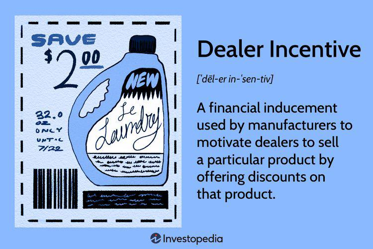

The automotive industry stands as a dynamic and ever-evolving sector where innovation and strategic planning are vital for achieving success. Sales and dealer incentives form the backbone of this industry's profitability and solidify its market position. These incentives are financial strategies employed to stimulate vehicle sales, either by offering rewards to dealers or direct incentives to consumers. By doing so, they not only boost sales volumes but also enhance customer engagement and retention.

Traditionally more prevalent in financial markets, algorithmic trading is increasingly finding applications within the automotive sector. This technology uses computer algorithms to execute orders based on predefined criteria and is now poised to revolutionize sales strategies for car manufacturers and dealers. By employing algorithmic tools, the automotive industry can analyze market trends, customer behavior, and inventory data at unprecedented speeds, thereby formulating more effective sales strategies.

This article investigates the convergence of sales incentives, dealer incentives, and algorithmic trading within the automotive sector. The primary focus is on how these components, when intelligently combined, can optimize sales performance, enhance relationships between manufacturers and dealers, and ensure sustained market success. By leveraging algorithmic trading, automotive firms can implement dynamic pricing strategies, offer tailored promotions, and manage inventories efficiently, perfectly aligning with the strategic objectives of sales and dealer incentives. The harmonization of these elements could potentially redefine market approaches, leading to improved financial outcomes and superior customer satisfaction.

## Table of Contents

## Understanding Sales and Dealer Incentives

Sales and dealer incentives play a crucial role in shaping the dynamics of the automotive industry. These incentives are essentially financial rewards designed to stimulate the sales of vehicles by either directly benefiting consumers or offering perks to dealerships.

Sales incentives directed at consumers often come in the form of cash rebates, low-interest financing, or lease deals. These offers are crafted to make vehicle purchases more attractive, thus driving increased consumer demand and accelerating inventory turnover. 

On the other hand, dealer incentives are specifically targeted at car dealerships. These incentives are structured to encourage dealers to sell particular vehicle models or achieve specified sales volumes. The methods used often include cash bonuses, volume-based discounts, or rebates. The underlying goal of dealer incentives is to motivate dealers to prioritize the sale of specific vehicles, whether to clear slower-moving inventory or to promote newly launched models. 

For example, a manufacturer might offer a dealer a $1,000 bonus for each unit sold of a specific model during a promotional period. This acts to align the dealership's sales efforts with the manufacturer's strategic objectives, ensuring certain vehicles receive increased attention and promotion at the dealership level.

These incentives are powerful tools for driving customer acquisition as they make vehicles more affordable or appealing to consumers, thus broadening the customer base. They also serve to enhance customer relationships by providing added value to the consumer, fostering loyalty, and encouraging repeat purchases. 

In a competitive market, gaining market share is a critical objective. Sales and dealer incentives are instrumental in achieving this by allowing manufacturers and dealers to outmaneuver competitors through strategic pricing and promotional tactics. In summary, if effectively deployed, these incentives not only bolster sales volumes but also strengthen the overall market position of both the manufacturer and the dealer.

## Algorithmic Trading and Its Role in the Automotive Industry

Algorithmic trading, a practice commonly associated with financial markets, is increasingly finding applications in the automotive industry. At its core, [algorithmic trading](/wiki/algorithmic-trading) involves using computer algorithms to automatically execute trades based on predefined parameters. These algorithms can operate at speeds significantly faster than human traders, enabling more efficient and precise decision-making.

In the context of the automotive industry, dealerships are beginning to harness the power of algorithms to optimize their sales strategies. By analyzing large sets of data—such as market trends, customer behavior, and inventory levels—algorithms can help dealerships make informed decisions that align with their overall sales goals. For example, dealerships can leverage data analytics to understand which models are selling well and which aren't, enabling them to offer targeted promotions or adjust inventory accordingly.

A crucial benefit of algorithmic trading in this sector is the ability to implement dynamic pricing strategies. Dynamic pricing involves setting flexible prices based on current market demands and supply chain considerations. Algorithms can continually adjust prices in real time to reflect changes in these variables, ensuring that pricing remains competitive and appealing to potential buyers. This is particularly beneficial in managing inventory, where algorithms can identify opportunities to discount slower-moving vehicles to enhance sales velocity without sacrificing profitability.

Moreover, algorithmic solutions facilitate personalized offers by analyzing individual customer data to tailor deals and incentives specific to each buyer’s preferences and history. This personalization can lead to improved customer satisfaction and conversion rates, as consumers are more likely to engage with deals that resonate with their interests.

Optimal inventory management is another area where algorithms contribute significantly. By forecasting demand and adjusting orders automatically, dealerships can maintain an ideal stock level, reducing holding costs and minimizing the risk of overstock or stockouts. This aligns with the broader sales incentives strategies, ensuring that promotional efforts are backed by adequate inventory to meet consumer interest.

In summary, by integrating algorithmic trading techniques, the automotive industry can enhance dealership performance through strategic pricing, personalized marketing, and efficient inventory control, helping to fulfill the broader objectives of sales incentives. As technology continues to advance, the potential for these algorithms to transform dealership operations and improve market competitiveness will likely grow.

## The Impact of Combined Strategies

The integration of dealer incentives with algorithmic tools presents a comprehensive approach for optimizing sales outcomes in the automotive industry. This combination allows dealerships to leverage advanced data analytics and algorithms to strategically deploy incentives, thereby maximizing their effectiveness. 

By utilizing algorithms, dealerships can effectively parse through extensive datasets to identify the optimal allocation of incentives. This often involves targeting specific customer segments that are more likely to respond positively to certain promotions. For instance, predictive analytic algorithms can assess historical consumer data and predict which demographic groups are most inclined to purchase particular vehicle models. Consequently, dealerships can offer tailored incentives, such as discounts or cash bonuses, directly appealing to these potential buyers, thus increasing the likelihood of conversion.

Furthermore, algorithmic tools facilitate the management of regional inventory disparities. Algorithms can analyze real-time inventory levels across different regions and suggest where incentives should be adjusted to address overstock situations. This dynamic adjustment helps in distributing stock more evenly, ensuring that vehicles are readily available where demand is greatest. 

The synergy between dealer incentives and algorithmic trading supports more accurate sales forecasting. Advanced algorithms can process real-time market data and update sales projections instantaneously, allowing dealerships to refine their strategies promptly. This leads to enhanced decision-making that is responsive to the latest market conditions, ultimately resulting in more efficient sales processes.

As a result, the integration of these strategies amplifies dealer performance by optimizing resource allocation and minimizing waste. Improved targeting of incentives typically translates into higher conversion rates, thereby driving sales [volume](/wiki/volume-trading-strategy) and enhancing overall efficiency. This strategy also boosts consumer satisfaction, as customers receive offers that are more aligned with their preferences and needs, fostering better customer relationships and loyalty.

In summary, the strategic deployment of dealer incentives through algorithmic tools yields significant improvements in both operational efficiency and market performance, contributing to a stronger market presence and competitive advantage in the automotive industry.

## Case Studies and Real-Life Applications

Toyota's application of dealer incentives to promote its hybrid models exemplifies a successful strategy in a competitive market. By offering financial incentives to dealers, Toyota encouraged the prioritization of hybrid vehicles, which not only improved sales of these environmentally friendly options but also strengthened the company's position in the growing hybrid market segment. This approach allowed Toyota to move slower-selling inventory and introduce new models effectively, thereby maintaining strong market visibility.

Ford implemented a program aimed at enhancing customer satisfaction through a combination of dealer incentives and targeted training. This initiative substantially increased customer loyalty and sales by ensuring that dealers were better equipped to understand and meet customer needs. By investing in dealer training, Ford improved its customer interaction, leading to higher satisfaction rates. The program highlighted the significance of non-monetary incentives and the role of dealer education in boosting sales performance.

BMW has taken a proactive approach by incorporating digital tool adoption into its incentive strategy. BMW's program encouraged dealers to integrate advanced digital technologies into their operations and customer interactions. This initiative not only improved operational efficiency but also enhanced customer service delivery. The incorporation of digital tools allowed dealers to streamline processes, optimize inventory management, and offer personalized customer experiences. As a result, BMW maintained a competitive edge by aligning operational improvement with customer-centric strategies.

These case studies underscore the effectiveness of integrating dealer incentives with broader strategic initiatives, such as training and technology adoption, to achieve desired outcomes in sales and customer satisfaction.

## Challenges and Considerations

Implementing dealer incentives and algorithmic tools in the automotive industry presents several challenges and considerations that businesses must address to achieve a balance between immediate sales objectives and enduring strategic goals. One of the primary challenges is managing costs, as deploying robust incentive programs and algorithmic tools can require substantial investment in technology and human resources. The cost of implementing sophisticated algorithms includes not only the initial outlay for software and hardware but also ongoing expenditures for system maintenance, upgrades, and staff training.

Additionally, regulatory compliance is a crucial [factor](/wiki/factor-investing) to consider. The automotive industry operates within a framework of complex regulations, which can vary significantly by region and market. Companies must ensure that their incentive schemes and the data they leverage for algorithmic tools comply with legal standards, such as those concerning consumer privacy, competition laws, and financial disclosures. Non-compliance could lead to legal penalties, financial losses, and damage to brand reputation.

Maintaining transparent dealer relationships is another significant consideration. Dealers must be clearly informed about the conditions and expectations of incentive programs and how algorithmic decisions may impact inventory management and customer interactions. This transparency is vital to fostering trust and collaboration, leading to more effective execution of sales strategies.

Furthermore, dealers must adapt to evolving technologies and shifting consumer expectations. The automotive market is highly competitive, with rapid advancements in digital technologies and changing customer preferences toward personalized, seamless experiences. Dealers need to remain agile, embracing new tools and methodologies that align with market trends while ensuring that customer service remains a top priority.

Balancing these elements requires strategic foresight and agility. Businesses must prioritize initiatives that align with both their short-term sales targets and their long-term vision, often requiring iterative testing and refinement of strategies. By leveraging real-time data and feedback loops, organizations can optimize their approaches to incentives and algorithmic trading, ensuring they remain competitive and responsive to market dynamics.

## Conclusion

Sales and dealer incentives, when strategically combined with algorithmic trading, confer substantial benefits to the automotive industry, transforming it into a more efficient and customer-focused sector. By leveraging these advanced techniques, automotive companies can stimulate market growth, which in turn enhances dealer performance and fosters stronger customer relationships. The inherent ability of algorithms to process large datasets allows for the creation of tailored strategies that optimize the outcomes of sales and dealer incentives. This dynamic methodology empowers automotive dealers to implement real-time pricing adjustments and personalized consumer offers, thereby heightening consumer satisfaction and loyalty.

As technology and market demands continue to evolve, the future success of these strategies will heavily depend on the industry's capacity to integrate emerging innovations and adjust to changing conditions. By doing so, automotive companies can maintain competitiveness and address challenges such as shifting consumer preferences and regulatory transformations. The ongoing development of predictive analytics and [machine learning](/wiki/machine-learning) presents opportunities for further refinement of sales strategies, ensuring they remain relevant and effective.

To maximize these benefits, continuous investment in technology infrastructure and data analytics capabilities is essential. This will support the ongoing adaptation of algorithms to new datasets and market conditions, allowing for the precise targeting of incentives and ensuring that dealer relationships are maintained at optimal levels. Consequently, the seamless integration of sales incentives, dealer incentives, and algorithmic trading stands as a significant step towards sustainable growth and innovation in the automotive industry.

## References & Further Reading

[1]: Nambiar, K. (2020). ["Automotive Marketing: An Overview of Industry Practices and Challenges."](https://www.researchgate.net/publication/347412294_The_future_of_the_automotive_industry_dangerous_challenges_or_new_life_for_a_saturated_market) Springer.

[2]: Shankar, V., & Zantedeschi, D. (2019). ["Algorithmic Price Discrimination: Implications for the Role of Data, Consumer Privacy, and Competition."](http://export.arxiv.org/list/cs/pastweek?skip=639&show=1299) Journal of Marketing Research.

[3]: Lopez de Prado, M. (2018). ["Advances in Financial Machine Learning."](https://www.amazon.com/Advances-Financial-Machine-Learning-Marcos/dp/1119482089) John Wiley & Sons.

[4]: Aronson, D. (2007). ["Evidence-Based Technical Analysis: Applying the Scientific Method and Statistical Inference to Trading Signals."](https://www.amazon.com/Evidence-Based-Technical-Analysis-Scientific-Statistical/dp/0470008741) John Wiley & Sons.

[5]: Jansen, S. (2020). ["Machine Learning for Algorithmic Trading: Predictive Models to Infer Alpha and Reduce Risk."](https://github.com/stefan-jansen/machine-learning-for-trading) Packt Publishing.